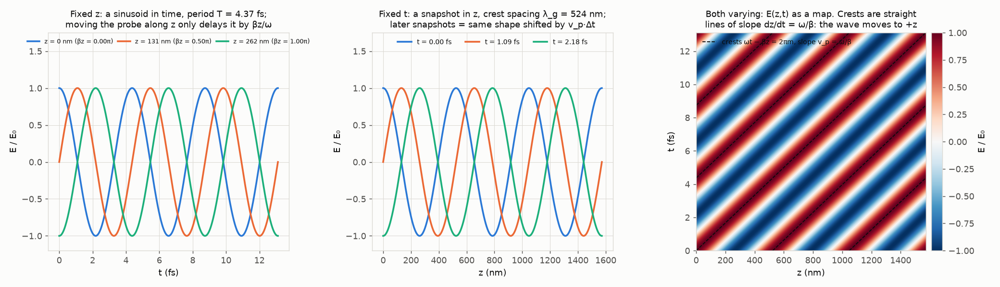
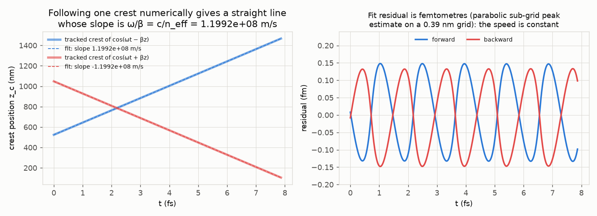
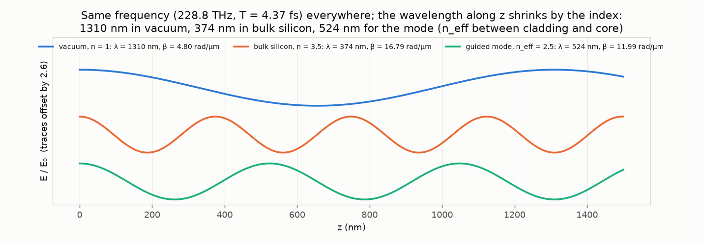
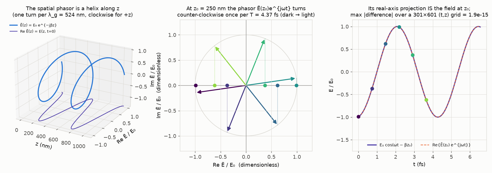
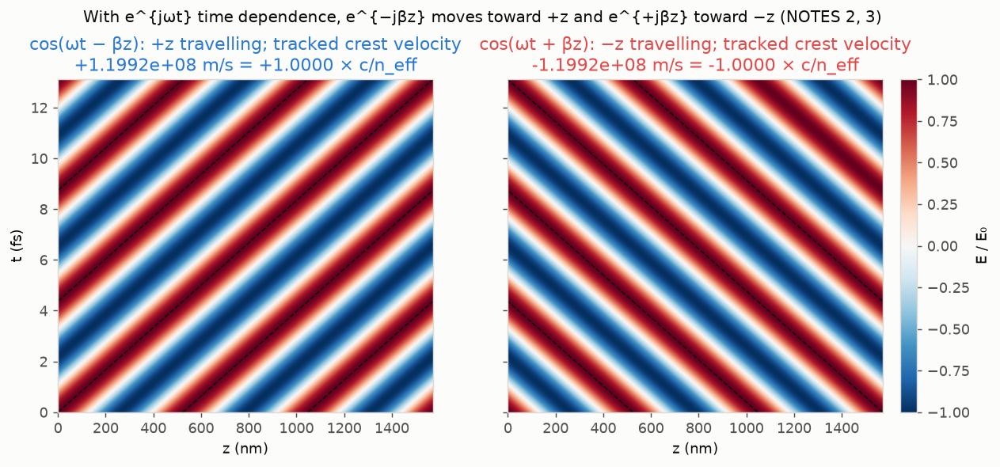
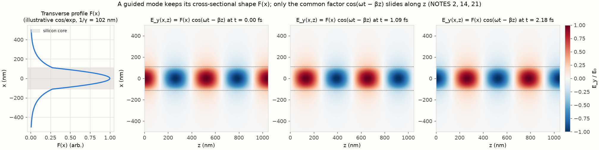
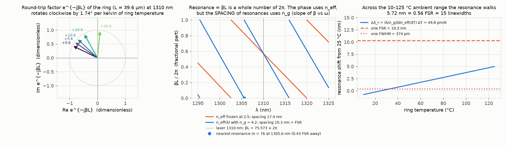
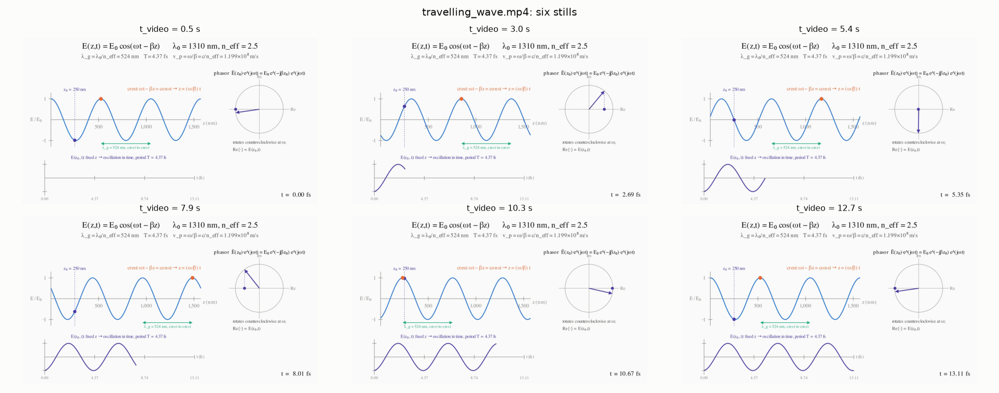
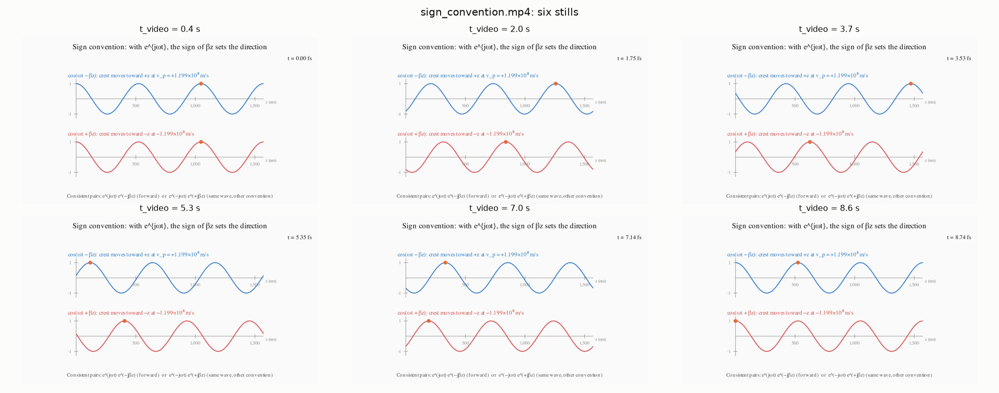

# 01. The travelling wave E(z,t) = E₀ cos(ωt − βz), three ways, and why phasors work

**Concept**
NOTES §2 (what a travelling wave means) and §3 (phasors: why time sometimes disappears), with the sign convention of §4/§15 and the round-trip factor of §28 as the capstone hook. The equations say that one formula, E₀ cos(ωt − βz), is at the same time a sinusoid in time at any fixed point, a sinusoid in space at any fixed instant, and a shape that slides toward +z at v_p = ω/β; and that the same field can be written as the real part of a complex phasor Ẽ(z) e^{jωt} with Ẽ(z) = E₀ e^{−jβz}. What the simulation adds is that you can *watch* all three views change together at the 1310 nm numbers (one period is 4.37 fs, one guided wavelength is 524 nm), watch the phasor arrow turn while its shadow on the real axis draws the field, measure v_p and λ_g from the pictures rather than reading them off the formula, flip the sign of βz and see the wave reverse, and see that one lap of the capstone ring is nothing but this same e^{−jβz} evaluated at z = L = 39.6 µm, turning by 1.74° per kelvin when the ring heats.

**Tools used**

### Manim Community (v0.21.0)
*What it is:* A programmatic animation engine (the 3Blue1Brown tool, community edition). Scenes are Python classes; objects are vector graphics rendered frame by frame with Cairo and encoded by ffmpeg. It is normally used for explanatory maths videos.
*What I used it for here:* Two videos in `scene.py`. `travelling_wave.mp4` (13.3 s): a live snapshot E(z) with one crest tracked by an orange dot moving at v_p, the phasor Ẽ(z₀)e^{jωt} at the probe point z₀ = 250 nm rotating counter-clockwise with its real-axis projection, and the time trace E(z₀,t) being drawn underneath, all driven by one `ValueTracker` for t. `sign_convention.mp4` (9.0 s): cos(ωt − βz) and cos(ωt + βz) side by side with their tracked crests moving in opposite directions. There is no LaTeX on this machine, so every label is `Text()` with Unicode and the axes use `label_constructor=Text`. The z window is exactly 3 λ_g = 1572 nm so that a crest leaving the right edge re-enters on a crest (the earlier attempt wrapped at 1500 nm and the dot fell off the crest after the wrap; fixed).
*Result:* In `out/travelling_wave.mp4` the crest dot advances exactly one guided wavelength (524 nm) per period (4.37 fs), i.e. v_p = 1.199×10⁸ m/s = c/2.5; the phasor turns once per 4.37 fs and its projection traces the violet time trace; the aqua λ_g bracket is an `always_redraw` anchored to the tracked crest, so its two ends sit on neighbouring crests at every instant (an earlier static bracket only did so at t = mT) and its label sits under the troughs, never on the curve. In `out/sign_convention.mp4` the blue crest moves +1.199×10⁸ m/s, the red one −1.199×10⁸ m/s.
*How to observe it:* `cd experiments/01_travelling_wave && ../../.venv/bin/python run.py` renders both videos into `out/` (roughly 15–80 s each at 720p30, depending on machine load) and writes six stills each to `out/travelling_wave_frames.png` and `out/sign_convention_frames.png`. Watch the orange crest dot, the violet arrow and the growing violet trace together. To re-render one scene alone: `../../.venv/bin/manim -qm --disable_caching scene.py TravellingWaveScene` (output under `media/videos/scene/720p30/`). Change `REF.neff` or `REF.lambda_nm` in `common/params.py`, or `z0_nm` / `Z_MAX_NM` in `scene.py`, and re-run.

### numpy (2.4.6)
*What it is:* The array library for numerical Python: vectorised arithmetic, complex numbers, linear least squares. Used wherever numbers are crunched.
*What I used it for here:* Everything in `twave.py`: evaluating E₀ cos(ωt − βz) on (z,t) grids, the complex phasor E₀ e^{−jβz} e^{jωt} and its real part, the crest-tracking loop (at each time step take the local maximum nearest the previous crest, refine the peak sub-grid with a parabola through three points), `np.polyfit` for the crest velocity, and the round-trip phase βL of the ring with first-order dispersion n_eff(λ) = n_eff − (λ − λ₀)(n_g − n_eff)/λ₀.
*Result:* Phasor identity max |Re{Ẽ(z)e^{jωt}} − E₀cos(ωt − βz)| = 1.9×10⁻¹⁵ over a 301×601 grid (machine precision). Tracked crest velocity 1.19917×10⁸ m/s vs ω/β = c/n_eff = 1.19917×10⁸ m/s (100.0000 %); backward wave −1.19917×10⁸ m/s. Round trip βL = 474.84 rad = 75.57 × 2π at 1310 nm; resonance spacing 10.33 nm with n_g vs REF FSR 10.3 nm (99.7 %); dλ_r/dT = 49.8 pm/K vs REF 50 (99.6 %).
*How to observe it:* All numbers are printed by `run.py` and saved in `out/results.json` and `out/run_log.txt`. Import `twave` in a REPL or the notebook and call `wave_numbers(lambda_nm, n)`, `track_crest(...)`, `round_trip_phase(...)` with other n, sign or wavelength.

### scipy (1.18.1)
*What it is:* Scientific algorithms on top of numpy (signal processing, optimisation, integration).
*What I used it for here:* `scipy.signal.find_peaks` to locate the crests of one snapshot E(z) at fixed t and measure the guided wavelength from their mean spacing, independently of the formula λ₀/n_eff.
*Result:* Crest spacing 524.00 nm vs λ₀/n_eff = 524.00 nm (100.000 %).
*How to observe it:* `out/results.json` key `lambda_g_measured_from_snapshot_nm`; the snapshot itself is the middle panel of `out/three_ways.png`. Change `REF.neff` and the spacing scales as λ₀/n_eff.

### matplotlib (3.11.2)
*What it is:* The standard Python plotting library (static figures, 3-D axes, image maps, animations through ffmpeg).
*What I used it for here:* All PNG figures: the three-ways panel (fixed z, fixed t, and the z–t map with crest lines), the crest-tracking fit and its residual, the three wavelengths at one frequency, the phasor helix / phasor clock / projection panel, the sign-convention z–t maps, the "mode keeps its shape" maps (with one shared colour bar for the three signed maps), the capstone round-trip panel, and the contact sheets built from video frames. Signed fields use `RdBu_r` centred on zero with a labelled colour bar; legends are placed in headroom above or below the curves so they never cover data.
*Result:* `out/three_ways.png`, `crest_tracking.png`, `three_wavelengths.png`, `phasor.png`, `sign_convention.png`, `mode_keeps_shape.png`, `capstone_round_trip.png`, `travelling_wave_frames.png`, `sign_convention_frames.png`.
*How to observe it:* Open the PNGs in `out/`. Each figure block in `run.py` has its parameter list at the top (e.g. the probe positions `[0, λ_g/4, λ_g/2]` or the snapshot times); edit and re-run.

### ffmpeg / ffprobe via imageio-ffmpeg (ffmpeg 9.0.1, imageio 2.37.4)
*What it is:* The standard command-line video encoder/decoder; Manim uses it to encode frames to H.264 and imageio wraps it to read frames back into numpy arrays.
*What I used it for here:* Encoding the Manim videos, measuring their durations with `ffprobe`, and reading six evenly spaced frames from each mp4 for the `*_frames.png` contact sheets.
*Result:* `travelling_wave.mp4` 13.3 s and `sign_convention.mp4` 9.0 s, both 1280×720 at 30 fps; two contact sheets.
*How to observe it:* `/opt/homebrew/bin/ffprobe out/travelling_wave.mp4`; the contact-sheet loop is at the end of the Manim section of `run.py` (change the number of `picks`).

### Jupyter: nbformat 5.11.1, nbclient 0.11.0, ipywidgets 8.1.9 (kernel `photonics-sims`)
*What it is:* The notebook file format and its headless executor; ipywidgets adds sliders that re-run a Python function whenever a value changes.
*What I used it for here:* `explore.ipynb` is generated by `make_notebook.py` with nbformat and executed headlessly by `jupyter nbconvert --execute --inplace` from `run.py` with a per-cell timeout of 60 s (every cell runs in well under 1 s; the low timeout caps the cost of the intermittent post-widget stall described under Checks) and an in-process nbclient fallback if nbconvert exits non-zero. Sliders: index n (1 to 3.5), propagation sign (+z / −z), time t (0 to 3T) and probe position z₀, driving one function that draws the snapshot, the phasor and the time trace. Static cells repeat the crest-tracking measurement of v_p, the phasor identity check for both signs, and the round-trip phasor before/after a chosen ΔT.
*Result:* `explore.ipynb` saved with outputs: a widget cell, four gallery figures (n = 1, 2.5, 3.5 and the backward wave), the tracked v_p = 1.19917×10⁸ m/s, the identity errors ≈ 2×10⁻¹⁵ for both signs, and the round-trip phasor rotated by 17.4° for ΔT = 10 K. The wall time of the execution is recorded in `results.json` (`notebook_execution_s`, plus a `notebook_execution_stalled` flag).
*How to observe it:* `cd experiments/01_travelling_wave && ../../.venv/bin/jupyter lab explore.ipynb`, Run All, then drag the sliders. Rebuild and re-execute headlessly with `run.py` or `../../.venv/bin/jupyter nbconvert --to notebook --execute --inplace explore.ipynb`.

**What the simulation does**

Symbols (SI internally, displayed in nm and fs): λ₀ = 1310 nm vacuum wavelength; f = c/λ₀ = 228.85 THz; ω = 2πf = 1.438×10¹⁵ rad/s; T = 1/f = 4.370 fs; k₀ = 2π/λ₀ = 4.796 rad/µm; n the index the wave sees (1 in vacuum, 3.5 in bulk silicon, n_eff = 2.5 for the textbook mode); β = n k₀ the propagation constant; λ = 2π/β = λ₀/n the wavelength along z (λ_g when n = n_eff); v_p = ω/β = c/n the phase velocity; z₀ the probe point; L = 39.6 µm the ring round trip.

1. **Numbers** (`twave.wave_numbers`): from REF, compute f, ω, T, k₀, and for n = 1, 3.5, 2.5 the values β, λ, v_p. These are the 1310 nm numbers of the brief: T = 4.37 fs, λ = 374 nm in bulk silicon, λ_g = 524 nm for n_eff = 2.5.
2. **Phasor identity** (NOTES §3): evaluate Re{E₀ e^{−jβz} e^{jωt}} and E₀ cos(ωt − βz) on a 301×601 (t, z) grid and report the maximum difference.
3. **Three ways** (NOTES §2, `out/three_ways.png`): (a) fixed z: E(z_i, t) for z_i = 0, λ_g/4, λ_g/2, showing that moving the probe only delays the sinusoid by βz/ω; (b) fixed t: snapshots at t = 0, T/4, T/2 showing the same shape shifted by v_p Δt; (c) both varying: the map E(z,t) with the crest lines ωt − βz = 2πm drawn as dashed lines of slope ω/β.
4. **Crest tracking** (`twave.track_crest`, `out/crest_tracking.png`): follow one crest of cos(ωt − βz) and one of cos(ωt + βz) numerically for 1.8 periods on a 0.39 nm grid; fit z_c(t) with a straight line; compare the slope with ±ω/β. This is the numerical form of "following a crest, ωt − βz = φ₀, so v_p = dz/dt = ω/β".
5. **λ_g from a snapshot**: `find_peaks` on E(z) at one instant; mean crest spacing vs λ₀/n_eff.
6. **Three wavelengths** (`out/three_wavelengths.png`): snapshots of the vacuum, bulk-silicon and mode waves at the same frequency, stacked with a vertical offset of 2.6 between traces (stated on the axis label; the y ticks are suppressed because only the shape matters), to see that the index only shortens the wavelength along z (NOTES §4: |k| = n k₀, λ = λ₀/n).
7. **Phasor picture** (`out/phasor.png`): the spatial phasor Ẽ(z) = E₀e^{−jβz} drawn as a helix in (z, Re Ẽ/E₀, Im Ẽ/E₀) with its real part as the t = 0 snapshot; at z₀ the time phasor Ẽ(z₀)e^{jωt} drawn for six instants (dark to light) with the projection dots in the dimensionless (Re Ẽ/E₀, Im Ẽ/E₀) plane; and the projection overlaid on E₀cos(ωt − βz₀).
8. **Sign convention** (`out/sign_convention.png`): z–t maps for e^{−jβz} and e^{+jβz} with tracked-crest velocities ±c/n_eff.
9. **A mode keeps its shape** (NOTES §2 last sentence, §14, §21; `out/mode_keeps_shape.png`): E_y(x,z,t) = F(x) cos(ωt − βz) at three instants with an illustrative F(x) (cos(hx) in the 220 nm core, e^{−γ(|x|−d)} outside, with h and γ from n_eff = 2.5, 1/γ = 102 nm). Only the common scalar changes; the transverse shape is fixed. This F is *not* the eigenfunction of the 220 nm slab (F′ is discontinuous at ±d for n_eff = 2.5); experiment 07 solves the real eigenproblem.
10. **Capstone** (`out/capstone_round_trip.png`): the round-trip factor e^{−jβL} (NOTES §28) at 1310 nm, and its rotation with temperature through dn_eff/dT = Γ dn_Si/dT + (1 − Γ) dn_SiO₂/dT = 1.596×10⁻⁴/K (Γ = 0.85), dφ/dT = k₀ L dn_eff/dT; the resonance condition βL = 2πm scanned over λ with n_eff frozen and with n_eff(λ) (group index), showing that the *spacing* of resonances is set by n_g, with the laser line and the nearest resonance of the dispersive model marked (closed form: n_eff(λ)L = mλ with n_eff(λ) = n_g − λ(n_g − n_eff)/λ₀ gives λ_m = n_g L/(m + L(n_g − n_eff)/λ₀); m = ⌈βL/2π⌉ = 76 is the blue-side neighbour and m = 75 the red-side one, both written to `results.json` and cross-checked against the numeric scan); and the resonance walk Δλ_r = (λ₀/n_g)(dn_eff/dT) ΔT across the 10–125 °C ambient range, computed from the code's own Γ-weighted dλ_r/dT (so it responds to `REF.confinement`) and compared with the REF-only product 115 K × 50 pm/K.
11. **Videos and notebook** as described under Tools.

**Results**

Videos: [out/travelling_wave.mp4](out/travelling_wave.mp4) and [out/sign_convention.mp4](out/sign_convention.mp4). Stills:

| Quantity | Simulated (out/results.json) | Expected (notes / brief / REF) | Agreement |
|---|---|---|---|
| Optical period T = λ₀/c | 4.3697 fs | 4.37 fs (brief) | 99.99 % |
| Frequency f | 228.85 THz | 228.85 THz (`freq_thz`) | 100 % |
| k₀ | 4.7963 rad/µm | 4.7963 rad/µm (`k0_per_um`) | 100 % |
| Wavelength in bulk silicon, n = 3.5 | 374.3 nm | 374 nm (brief) | 99.9 % |
| Guided wavelength λ_g = λ₀/n_eff, n_eff = 2.5 | 524.0 nm | 524 nm (brief) | 100 % |
| λ_g measured from crest spacing of a snapshot | 524.00 nm | 524.00 nm | 100.000 % |
| Phase velocity from crest tracking (forward) | 1.19917×10⁸ m/s | ω/β = c/n_eff = 1.19917×10⁸ m/s | 100.0000 % |
| Phase velocity from crest tracking (backward, e^{+jβz}) | −1.19917×10⁸ m/s | −ω/β | 100.0000 % |
| max \|Re{Ẽe^{jωt}} − E₀cos(ωt − βz)\| | 1.9×10⁻¹⁵ | 0 | machine precision |
| Round-trip phase βL at 1310 nm, L = 39.6 µm | 474.84 rad = 75.57 × 2π | n_eff L/λ₀ = 75.57 | exact |
| Resonance spacing with n_eff frozen (numeric scan) | 17.37 nm | λ₀²/(n_eff L) = 17.33 nm | 99.8 % (first-order formula) |
| Resonance spacing with n_eff(λ), n_g = 4.2 (numeric scan) | 10.33 nm | FSR = λ₀²/(n_g L) = 10.32 nm; REF 10.3 nm | 99.7 % vs REF |
| Nearest resonance of the dispersive model: order m and wavelength (closed form vs numeric scan) | m = 76 at 1305.60 nm (scan 1305.60 nm) | ⌈75.57⌉ = 76; λ_m = n_g L/(m + L(n_g − n_eff)/λ₀) | 100.00 % (scan vs closed form) |
| Offset of that resonance from the laser | 4.40 nm to the blue = 0.43 FSR; the missing phase at 1310 nm is 0.4275 turn | 76 − 75.5725 = 0.4275 turn; 0.4275 × 10.33 nm = 4.42 nm (first-order: the offset in nm is not exactly turn × FSR because βL is not linear in λ) | 99.5 % (nm from turn × FSR vs closed form) |
| Red-side neighbour m = 75 | 1315.93 nm, 0.5725 turn away | λ₇₅ from the same closed form | exact |
| Round-trip phase drift dφ/dT = k₀ L dn_eff/dT | 0.0303 rad/K = 1.74 °/K | — (derived here) | — |
| dλ_r/dT = (λ₀/n_g) dn_eff/dT | 49.8 pm/K (Si-only Γ-weighted: 49.3) | REF 50 pm/K | 99.6 % |
| Kelvin per FSR: 2π/(dφ/dT) | 207 K | FSR/(50 pm/K) = 206 K | 99.5 % |
| Resonance walk over 10–125 °C, 115 K × (λ₀/n_g)(dn_eff/dT) | 5.72 nm = 0.56 FSR = 15.3 FWHM | 115 K × REF 50 pm/K = 5.75 nm (REF × REF, not simulated) | 99.6 % |

Reading the table: the first block is the formula checked against itself in three independent ways (period, crest spacing, crest velocity), which is the point of §2; the 374/524 nm numbers show what "wavelength inside the material" means; the last block is the capstone hook, where the only physics beyond §2–3 is that n_eff depends on temperature and on wavelength. The 17.3 nm vs 10.3 nm row is the important honest one: the *phase* per lap uses n_eff, but how fast that phase changes with λ (hence the resonance spacing, the FSR) uses n_g. That is why the textbook's n_eff = 2.5 (versus the ~2.7 that mode solvers give, see experiment 08) does not disturb any FSR or thermal-shift number: those depend on n_g and Γ·dn/dT, not on n_eff. Only the mode order m = n_eff L/λ₀ (75.6 here, 81 with n_eff = 2.7) and the absolute phase change.

**Experiments to try**

1. `REF.neff` 2.5 → 2.7 (the solver value from experiment 08) in `common/params.py`, then `run.py`: λ_g drops to 485 nm, v_p to 1.11×10⁸ m/s, the crest dot in the video advances 485 nm per period, βL becomes 81.6 × 2π; the FSR and the pm/K numbers do not move at all (they use n_g). Put it back afterwards; the other experiments read the same file.
2. In the notebook, set n = 1.0 and watch the phasor at z₀ = 250 nm: its starting angle −βz₀ becomes −69° instead of −172°, because the phase accumulated over 250 nm is smaller in vacuum; the period does not change.
3. In the notebook, flip the sign to −z and drag t: the crests march left and the phasor still turns counter-clockwise (the e^{jωt} factor is the same); only the starting angle +βz₀ is mirrored. That is the whole content of "consistent pairs e^{jωt}e^{−jβz} or e^{−jωt}e^{+jβz}".
4. In `run.py` change the probe list in the fixed-z panel to `[0, λ_g/2, λ_g]`: the third trace lands exactly on the first (βz = 2π), which is what "λ_g is the distance over which the phase repeats" means.
5. In `common/params.py` set `REF.confinement` 0.85 → 0.7 (a wider, less confined mode) and re-run: dn_eff/dT (1.596×10⁻⁴ → 1.332×10⁻⁴ /K), the pm/K (49.8 → 41.5) and the phase drift per kelvin all drop by about 17 % (16.5 % with the SiO₂ term, 17.6 % Si-only); the ambient walk in the panel-3 title and in `results.json` (`ambient_range_shift_nm`) becomes 4.78 nm = 0.46 FSR, while the REF-only comparison key `ambient_range_shift_nm_from_ref_numbers` stays at 5.75 nm. This is the Γ that experiment 08 computes from the real mode. Put it back afterwards.

**Capstone connection**

The ring's through-port transfer function T(λ) = |(t − a e^{−jφ})/(1 − t a e^{−jφ})|² is written in exactly the phasor convention of §3: the field that comes back to the coupler after one lap is a e^{−jβL} times the field that left, with L = 2πR = 39.6 µm, a = 0.945 the retention per lap (NOTES §28) and φ = βL the phase accumulated by the travelling wave of this experiment. At 1310 nm that phase is 474.84 rad = 75.57 × 2π (`round_trip_phase_in_2pi_units_m`); a resonance needs an integer, so the laser is near but not on a resonance of this idealised ring: the nearest resonance is m = 76 at 1305.60 nm (`nearest_resonance_order_m`, `nearest_resonance_wavelength_nm`, confirmed by the numeric scan of the phase condition to 100.00 %), 0.4275 turn of phase (`fractional_turn_to_blue_resonance`) = 4.40 nm = 0.43 FSR to the blue (`nearest_resonance_offset_nm`, `nearest_resonance_offset_in_fsr`), marked in the middle panel of the capstone figure; the red-side neighbour m = 75 sits at 1315.93 nm. In the real device the heater trims the resonance onto the channel. Heating the ring raises n_eff by Γ dn_Si/dT ≈ 1.6×10⁻⁴ per kelvin, which turns the round-trip phasor clockwise by k₀ L dn_eff/dT = 0.030 rad = 1.74° per kelvin. Translated to wavelength through the group index, that is (λ₀/n_g) dn_eff/dT = 49.8 pm/K, the REF 50 pm/K; one full turn of the round-trip phasor (one FSR, 10.3 nm) takes 207 K, and the 10–125 °C ambient range alone walks the resonance 115 K × 49.8 pm/K = 5.72 nm (5.75 nm with the REF 50 pm/K), more than half an FSR and 15 linewidths (FWHM 374 pm). The lock in experiment 13 therefore has to hold a phasor whose angle wanders 200° across the operating range to within about 0.1 K × 1.74°/K = 0.17°, i.e. 5 pm, using the heater as its only actuator.

**Checks**

- The phasor identity Re{E₀e^{−jβz}e^{jωt}} = E₀cos(ωt − βz) holds to 1.9×10⁻¹⁵ on a 301×601 grid (and for e^{+jβz} in the notebook), so the two representations used throughout the suite are numerically identical.
- v_p was not taken from the formula: a crest was followed numerically (nearest local maximum per step, parabolic sub-grid refinement) and its position fitted by a straight line; slope = ω/β to 10⁻¹⁰ relative, residuals ~0.1 fm on a 0.39 nm grid. The backward wave gives −ω/β.
- λ_g was measured from crest spacing with `find_peaks` (524.00 nm) and agrees with λ₀/n_eff.
- Video crest wrap: the z window is exactly 3λ_g, so the tracked dot always sits on a crest (verified frame by frame in the contact sheets; the earlier 1500 nm window was wrong after the first wrap). The λ_g bracket is anchored to that same tracked crest (`bracket_ends()` in `scene.py` picks the neighbour crest that stays inside the window), so it spans crest to crest in every frame; its label was moved under the troughs after a review found the old two-line label sitting on the wave near z ≈ 1300 nm. The panel labels in `sign_convention.mp4` use a double space after "+z" / "−z" because Manim's `Text()` kerning otherwise swallows the single space.
- The ambient-range walk is computed from the code's own Γ-weighted dλ_r/dT (5.72 nm), not from REF × REF (5.75 nm, kept in `results.json` as `ambient_range_shift_nm_from_ref_numbers` for comparison), so it moves when `REF.confinement` is changed.
- The FSR obtained by scanning the phase condition βL = 2πm with first-order dispersion (10.33 nm) matches λ₀²/(n_g L) = 10.32 nm and REF 10.3 nm; with n_eff frozen the spacing is 17.4 nm, demonstrating which index sets which quantity. The nearest resonance to the laser (m = 76 at 1305.60 nm) is computed in closed form from the same first-order model and agrees with the crossing found by the numeric scan to 100.00 %.
- Figure contract: every axis carries a unit or is explicitly labelled dimensionless (the phasor planes are Re Ẽ/E₀ and Im Ẽ/E₀; the round-trip plane is Re/Im e^{−jβL}); the stacked three-wavelengths plot states its offset on the axis label; the capstone middle panel keeps its y-range to the physical [0, 1) fractional part and puts the legend below the axes; the +ΔT labels on the round-trip phasor extend radially outward so they do not cross neighbouring arrow shafts. No dual y-axes anywhere.
- Limitations: this is a scalar, lossless, monochromatic plane-wave description; there is no transverse structure except in the illustrative "mode keeps its shape" figure, whose F(x) uses the textbook n_eff = 2.5 and is therefore not a true eigenfunction of the 220 nm slab (F′ jumps at ±d; 1/γ = 102 nm here versus the ~80 nm the notes quote for the real slab mode). Mode solvers give n_eff ≈ 2.7 for the 500×220 nm strip (experiment 08); everything here that depends on n_eff (λ_g, v_p, βL, the mode order m) would change by that ratio, while the FSR, dλ/dT and the K-per-FSR numbers depend on n_g and Γ and would not. The thermal numbers use the Γ-weighted linear estimate of dn_eff/dT (0.85 × 1.86×10⁻⁴ + 0.15 × 1×10⁻⁵), not a perturbed mode solution.
- Runtime: between about 1 and 5 min for the full `run.py` on this laptop, depending on machine load and on whether the notebook stall below occurs (45–90 s on unloaded runs; 294 s on a loaded run that included a 180 s stall; the run that produced the current `out/` took 66 s with the notebook executing in 4 s and no stall, recorded in `out/results.json` as `runtime_s`, `videos.*.render_s` per scene (40 s and 17 s) and `notebook_execution_s`). The two Manim renders are the bulk (roughly 15–80 s each).
- Notebook stall (intermittent, seen twice): the headless executor sometimes sits idle for exactly one cell timeout right after the ipywidgets `interact` cell. The per-cell execution metadata shows the kernel replied within a second; the client only picked the reply up at the timeout, then executed the remaining cells normally and exited 0, so the nbclient fallback was not triggered and the saved notebook is complete and correct. Every cell of the notebook runs in well under 1 s (whole file ≈ 3 s when it does not stall), so `run.py` now sets `--ExecutePreprocessor.timeout=60` to cap the cost of a stall at 60 s instead of 180 s, records `notebook_execution_s` and a `notebook_execution_stalled` flag in `results.json`, and keeps the nbclient fallback for a genuine failure. If you see the stall, it is harmless; re-running `../../.venv/bin/jupyter nbconvert --to notebook --execute --inplace explore.ipynb` normally takes a few seconds.

**Files**

- `run.py` — headless entry point; regenerates everything in `out/`, renders both Manim scenes, builds and executes the notebook.
- `twave.py` — physics helpers: `wave_numbers`, `E_real`, `E_phasor`, `E_from_phasor`, `track_crest`, `fit_velocity`, `slab_profile_illustrative`, `neff_of_lambda`, `round_trip_phase`.
- `scene.py` — Manim scenes `TravellingWaveScene` and `SignConventionScene`.
- `make_notebook.py` — builds `explore.ipynb` with nbformat.
- `explore.ipynb` — interactive notebook (sliders for n, sign, t, z₀), executed with outputs saved.
- `README.md` — this file.
- `out/three_ways.png`, `out/crest_tracking.png`, `out/three_wavelengths.png`, `out/phasor.png`, `out/sign_convention.png`, `out/mode_keeps_shape.png`, `out/capstone_round_trip.png` — figures.
- `out/travelling_wave.mp4`, `out/travelling_wave_frames.png`, `out/sign_convention.mp4`, `out/sign_convention_frames.png` — videos and contact sheets.
- `out/results.json` — every headline number; `out/tools.json` — tool documentation; `out/run_log.txt` — printed log; `out/manim_*.log`, `out/nbconvert.log` — subprocess logs.
