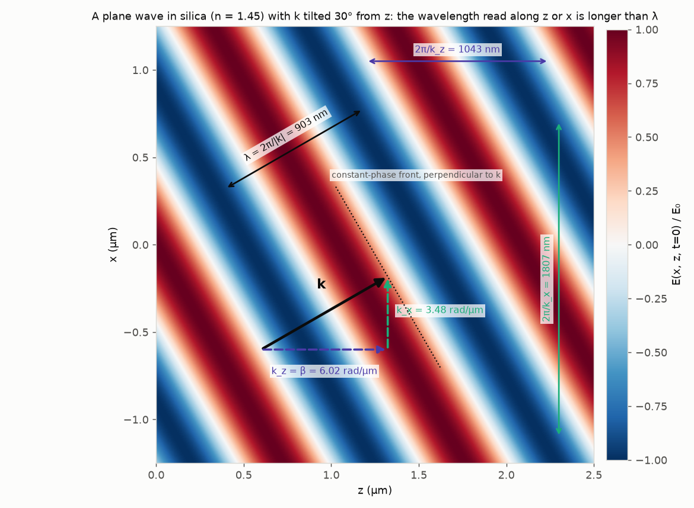
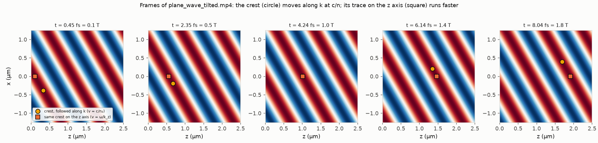
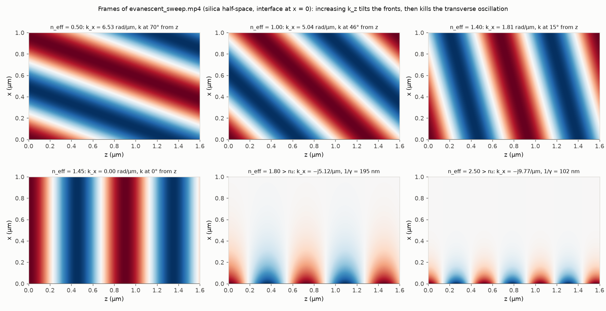
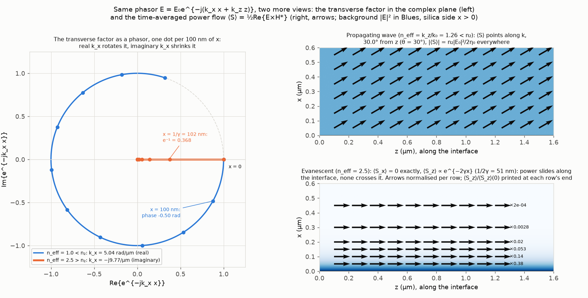
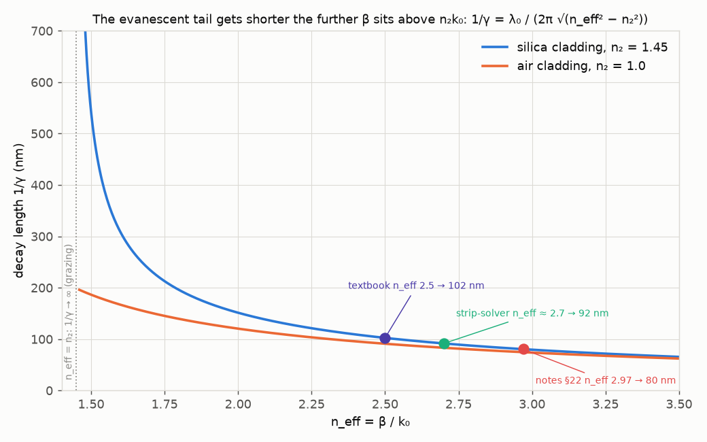
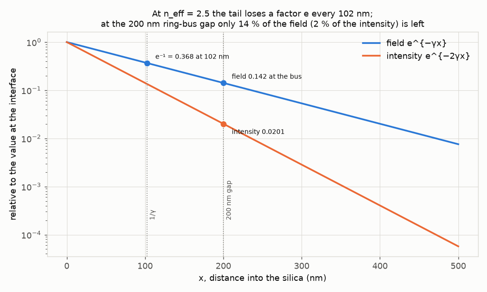
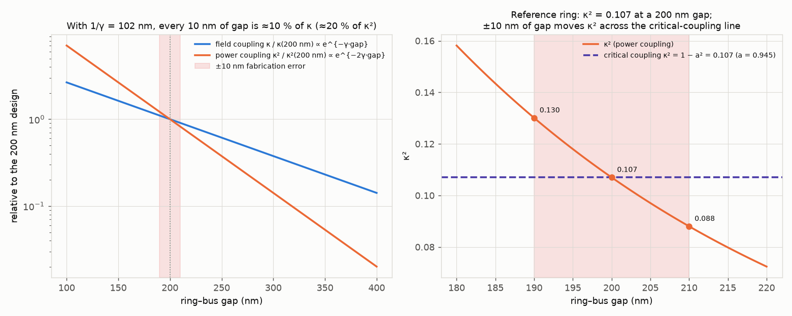

# 02. Wavevector components and the evanescent field: one formula, two characters

**Concept** (docs/NOTES.md sections 4 and 17; also 3 for the phasor, 18 and 25 for the Poynting vector, 24 for where the imposed k_z comes from)

The notes say that a plane wave is E = E₀ cos(ωt − k·r), that k splits into a longitudinal part k_z = β and a transverse part k_x with k_x² + k_z² = n²k₀², and that "in the cladding k_x can become imaginary: exponential decay rather than a travelling direction". Written down, the step from k_x real to k_x = −jγ looks like algebra. This experiment evaluates the single expression Re{e^{j(ωt − k_x x − k_z z)}} with numpy on a grid, first with a real k_x (a plane wave in silica tilted by 30°), then while sweeping k_z continuously past n₂k₀ so that k_x² goes negative. Nothing else is changed: same code path, same formula, and you watch the transverse oscillation stretch, stop, and turn into an exponential tail of decay length 1/γ = 102 nm for n_eff = 2.5 against silica. Three things the equations alone do not show: (1) a tilted wave has a *longer* wavelength along either axis than along k (2π/k_z = 1043 nm > 903 nm), which is why a guided mode with β < n₁k₀ is still a wave in silicon; (2) the transverse factor e^{−jk_x x} is a phasor that *rotates* on the unit circle when k_x is real and *walks straight into the origin* when k_x is imaginary; (3) the time-averaged power flow ⟨S⟩ computed from that phasor points along k for the propagating case and has *exactly zero* normal component in the evanescent case while still flowing along the interface. The last picture is what lets a ring couple to a bus without losing light to the cladding, and the 102 nm tail is why a 10 nm error in the ring–bus gap is a 10 % error in the coupling.

**Tools used**

### numpy 2.4.6
*What it is:* The array library underneath scientific Python: vectorised arithmetic on grids, complex numbers, FFTs and linear algebra. Every other tool here (scipy, matplotlib) operates on numpy arrays.
*What I used it for here:* Evaluating E = Re{exp(j(ωt − k_x x − k_z z))} on 420×420 and 320×320 grids with k_x either real or purely imaginary (k_x = −jγ); measuring the wavelengths along z, along x and along k from the zero crossings of the computed field; checking to machine precision that the complex-k_x branch of the formula is literally e^{−γx}cos(ωt − βz); drawing the transverse factor e^{−jk_x x} as a curve in the complex plane; building the E_y, H_x, H_z phasors from Faraday's law (notes 18) and evaluating ⟨S⟩ = ½Re{E×H*} component by component (notes 25).
*Result:* λ in silica 903.4 nm (analytic λ₀/n₂ = 903.4 nm, 100.000 %); at θ = 30° the measured 2π/k_z = 1043.2 nm vs 1043.2 nm analytic (100.000 %), 2π/k_x = 1806.9 nm vs 1806.9 nm (100.000 %); k_x² + k_z² = 2.1025 k₀² = n₂² exactly; identity check max |Re e^{j(ωt−k_x x−βz)} − e^{−γx}cos(ωt−βz)| = 1.1×10⁻¹⁶; ⟨S⟩ of the tilted wave at 30.00° from z (θ = 30°, 100.000 %) with |⟨S⟩| = 1.9245×10⁻³ W/m² for E₀ = 1 V/m = n₂/2η₀ (100.000 %); evanescent case ⟨S_x⟩/⟨S_z⟩ = 7×10⁻¹⁷ (expected 0) while the reactive (imaginary) normal part is γ/β = 0.815 (expected 0.815), and ⟨S_z⟩ at the interface = 3.318×10⁻³ W/m² = n_eff/2η₀ (100.000 %).
*How to observe it:* `cd experiments/02_wavevector_evanescent && ../../.venv/bin/python run.py`; the numbers print to the terminal and are written to `out/results.json` (keys `partA_*`, `dispersion_check_*`, `identity_check_*`, `partD_*`). Change `theta_deg` (Part A), `neff_ref` or `n2` (Part B) or `neff_path` (the sweep) at the top of the corresponding section of run.py and re-run.

### scipy 1.18.1
*What it is:* Scientific algorithms on top of numpy: optimisation, curve fitting, integration, signal processing, special functions, sparse linear algebra.
*What I used it for here:* `scipy.optimize.curve_fit` fits A·e^{−x/L} to the envelope of the computed evanescent field (maximum over one z period at each x) to recover the decay length from the field itself, independently of the closed form 1/γ.
*Result:* Fitted 1/γ = 102.38 nm vs analytic 102.38 nm (100.000 %). The brief and the textbook quote "102 nm" (100.4 % of the rounded value).
*How to observe it:* `out/results.json` keys `decay_length_fitted_from_field_nm`, `decay_length_nm_neff2p5_silica` and `decay_length_fit_agreement_pct`; the fitted envelope is the dashed orange curve in the lower-right panel of `out/evanescent_sweep.mp4` once n_eff > 1.45. Change `x_B` (the fit window) or `neff_ref` and re-run.

### matplotlib 3.11.2 (FuncAnimation + FFMpegWriter)
*What it is:* The standard Python plotting library. Its `animation` module redraws a figure frame by frame and pipes the frames to ffmpeg, which is how all videos in this suite are made.
*What I used it for here:* Signed-field colour maps (`RdBu_r` centred on zero) of the plane wave and of the evanescent field; the two videos `plane_wave_tilted.mp4` (time runs, one crest is tracked along k and along the z axis) and `evanescent_sweep.mp4` (k_z is swept through n₂k₀ while the dispersion parabola and the x-profile update in step); the five static figures including the phasor-plane plot and the quiver plot of ⟨S⟩; the two contact sheets.
*Result:* `out/plane_wave_tilted.png`, `.mp4`, `_frames.png`; `out/evanescent_sweep.mp4`, `_frames.png`; `out/transverse_phasor_and_power.png`; `out/decay_length_vs_neff.png`; `out/tail_log_scale.png`; `out/capstone_gap_sensitivity.png`.
*How to observe it:* Open the mp4s in QuickTime or VLC. In `plane_wave_tilted.mp4` watch the yellow circle (a crest followed along k at c/n₂) and the orange square (the same crest where it cuts the z axis): the square runs faster, at ω/k_z = 0.796 c > c/n₂ = 0.690 c. In `evanescent_sweep.mp4` watch the black dot on the parabola cross zero at n_eff = 1.45 at the same instant the field stops oscillating across x. Edit `neff_path` (sweep range and speed), `n_frames_A` or `periods_A` in run.py to change durations.

### ffmpeg 9.0.1 (/opt/homebrew/bin/ffmpeg)
*What it is:* The universal command-line video encoder/decoder; matplotlib's `FFMpegWriter` calls it to turn a sequence of rendered frames into an H.264 mp4.
*What I used it for here:* Encoding both animations at 30 fps with libx264 and `yuv420p` pixel format so the files play in any viewer (this pixel format needs even frame dimensions, which is why the figure sizes in run.py are chosen to give even pixel counts at 130 dpi).
*Result:* `out/plane_wave_tilted.mp4` (90 frames, 3.0 s, 1170×858) and `out/evanescent_sweep.mp4` (260 frames, 8.7 s, 1612×858). The version string in `out/tools.json` is read from `ffmpeg -version` at run time.
*How to observe it:* `/opt/homebrew/bin/ffprobe out/evanescent_sweep.mp4` prints duration, resolution and codec. To extract one frame as a PNG: `/opt/homebrew/bin/ffmpeg -ss 7.5 -i out/evanescent_sweep.mp4 -frames:v 1 frame.png`.

**What the simulation does**

Symbols, defined once. λ₀ = 1310 nm is the vacuum wavelength, k₀ = 2π/λ₀ = 4.796 rad/µm the vacuum wavenumber, ω = 2πc/λ₀ the angular frequency (period T = 4.37 fs). n₁ = 3.50 is silicon, n₂ = 1.45 is silica. The coordinate z runs along the interface (and along a waveguide), x runs perpendicular to it, into the silica for x > 0. k = (k_x, k_z) is the wavevector; k_z = β is the longitudinal propagation constant and n_eff = β/k₀ the effective index. γ is the transverse decay constant, 1/γ the decay length. All fields are TE in the sense of notes 13: E is along y, out of the (x, z) plane; the physical field is the real part of the phasor, engineering convention e^{jωt}, so a +z wave is e^{−jβz} (notes 3).

*Part A: a plane wave in silica with k tilted 30° from z* (notes 4). The dispersion relation |k| = n₂k₀ = 6.955 rad/µm gives λ = λ₀/n₂ = 903.4 nm. With θ = 30°, k_z = |k| cos θ = 6.023 rad/µm and k_x = |k| sin θ = 3.477 rad/µm. The code evaluates E(x, z, t) = Re{e^{j(ωt − k_x x − k_z z)}} on a 2.5 µm × 2.5 µm grid, draws the k arrow with its two components, one constant-phase front perpendicular to k, and the three wavelengths: 2π/|k| along k, 2π/k_z along z and 2π/k_x along x. It then measures each wavelength from the zero-crossing spacing of the computed field along that axis and compares to 2π/k. The video runs time for 2.3 periods and tracks one crest (ωt − k·r = 0) two ways: the yellow circle follows the crest along k at v_p = ω/|k| = c/n₂; the orange square marks where the same crest line cuts the z axis, which moves at ω/k_z > c/n₂ (the phase velocity *along an axis* exceeds the phase velocity along k; it is not an energy velocity). The wave's n_eff = k_z/k₀ = n₂ cos θ = 1.256 < n₂: a tilted plane wave in a uniform medium always has β < nk₀.

*Part B: sweep k_z through n₂k₀ in the silica half-space* (notes 4, 17, 24). Physically, k_z is not free in the silica: it is imposed along the interface by whatever wave exists on the silicon side (Snell's law is the statement that the tangential wavevector is shared; notes 24), so n_eff = n₁ sin θ_i where θ_i is the incidence angle in silicon. The code sweeps n_eff from 0.3 to 2.5 (θ_i from 4.9° to 45.6°, through the critical angle θ_c = asin(n₂/n₁) = 24.47° at n_eff = n₂ = 1.45) and for each value takes k_x from the dispersion relation k_x² = n₂²k₀² − k_z²: the real root k_x = +√(·) while k_z < n₂k₀ (wave travelling toward +x), and the branch k_x = −j√(−·) = −jγ once k_z > n₂k₀, which is the choice that makes e^{−jk_x x} = e^{−γx} finite for x → +∞ (notes 17; on the other side of an interface one would pick +jγ). The *same* function `field(X, Z, wt, kx, kz)` is evaluated with the complex k_x; numpy's complex exponential does the rest. The left panel of the video is the field in the silica; the upper-right panel is the parabola k_x² = n₂²k₀² − k_z² with the current point, crossing zero at n_eff = n₂; the lower-right panel is E(x) along a vertical cut through the current crest, a cosine while k_x is real and the exponential e^{−γx} once it is imaginary. At n_eff = 2.5 the code (i) checks that Re{e^{j(ωt − k_x x − βz)}} equals e^{−γx} cos(ωt − βz) to machine precision, (ii) checks k_x² + k_z² = n₂²k₀², (iii) fits an exponential to the envelope of the computed field to recover 1/γ, and (iv) evaluates γ = k₀√(n_eff² − n₂²) = 9.768 /µm, 1/γ = 102.4 nm. It also tabulates 1/γ at the other values of n_eff that appear in the notes and in experiment 08 (2.7 from the strip mode solvers, 2.97 from notes 22 whose 80 nm decay length in notes 23 is reproduced) and for an air cladding. The static figure `decay_length_vs_neff.png` is 1/γ = λ₀/(2π√(n_eff² − n₂²)) across the whole guided range n₂ < n_eff < n₁, and `tail_log_scale.png` shows e^{−γx} and e^{−2γx} (field and intensity) on a log axis with the 200 nm ring–bus gap marked.

*Part C: the capstone number.* The field of the ring mode at the bus, and therefore the field coupling coefficient κ, scales as e^{−γ·gap} to leading order (the coupler is a region where the ring's evanescent tail overlaps the bus mode; notes 27). So a gap change of Δg multiplies κ by e^{−γΔg}, i.e. changes it by γΔg to first order; with 1/γ = 102 nm and Δg = 10 nm that is 9.8 %. The power coupling κ² ∝ e^{−2γ·gap} changes twice as fast. `capstone_gap_sensitivity.png` plots both relative to the 200 nm design on a log axis, and zooms on the reference ring's κ² = 0.107 with the critical-coupling line κ² = 1 − a² for a = 0.945.

*Part D: the phasor and the power flow* (notes 3, 17, 18, 25). Left panel of `transverse_phasor_and_power.png`: the transverse factor e^{−jk_x x} drawn in the complex plane as x goes from 0 to 1 µm, one dot every 100 nm. For n_eff = 1.0 (k_x = 5.04 rad/µm real) the dots walk around the unit circle, 0.50 rad per 100 nm, magnitude exactly 1: pure phase rotation. For n_eff = 2.5 (k_x = −j9.77 /µm) the dots walk along the real axis toward the origin, reaching e⁻¹ at x = 102 nm, phase exactly 0: pure shrinkage. This is notes 17 in one picture: "an imaginary transverse wavenumber means the transverse exponential changes from phase rotation to magnitude change". Right panels: from E = ŷ E₀e^{−j(k_x x + k_z z)} Faraday's law gives H_x = −(k_z/ωμ₀)E_y and H_z = (k_x/ωμ₀)E_y (notes 18); the code forms ⟨S_x⟩ = ½Re{E_y H_z*} and ⟨S_z⟩ = −½Re{E_y H_x*} numerically on a grid of points and draws the arrows over |E|². For the propagating wave the arrows all point along k at 30.00° and have magnitude n₂|E₀|²/2η₀ everywhere. For the evanescent case ⟨S_x⟩ is zero to 10⁻¹⁷ (it is ½Re{(k_x*/ωμ₀)|E_y|²} and k_x* = +jγ is purely imaginary), the *imaginary* part ½Im{E_y H_z*}/⟨S_z⟩ = γ/β = 0.815 is the reactive normal flow that sloshes back and forth each cycle without net transport, and ⟨S_z⟩ = (β/2ωμ₀)|E₀|²e^{−2γx} is positive: the power slides along the interface with a decay length 1/(2γ) = 51 nm. Because 51 nm is so short, the evanescent panel packs its arrow rows near the interface (x = 50, 100, 150, 200, 300, 450 nm) and normalises each row's arrows to that row's own |⟨S⟩| so that the *direction* is readable everywhere; the true ratio ⟨S_z⟩(x)/⟨S_z⟩(0) = e^{−2γx} computed by the code is printed at the end of every row (0.38, 0.14, 0.053, 0.020, 0.0028, 0.00015; keys `partD_evanescent_Sz_ratio_rows*` in results.json) and the |E|² background, scaled 0 to 1, carries the decay visually. The propagating panel keeps one global arrow scale because |⟨S⟩| is uniform there. That is the single-interface half of notes 25, which experiment 06 contrasts with absorption and experiment 09 reproduces with FDTD.

**Results**

Part A. The tilted plane wave at t = 0 with the k arrow, its components, one phase front, and the three wavelengths. Video: [out/plane_wave_tilted.mp4](out/plane_wave_tilted.mp4); stills:

Part B. Six stills of the sweep (the full video is [out/evanescent_sweep.mp4](out/evanescent_sweep.mp4), 8.7 s, with the parabola and the x-profile updating alongside). Reading the top row left to right: at n_eff = 0.5 the fronts are nearly perpendicular to z (k at 70°); at 1.0 and 1.4 they steepen toward grazing; at 1.45 exactly they are vertical (k along z, k_x = 0, the wave in the silica grazes the interface: the critical angle). Bottom row: at 1.8 and 2.5 the fronts are still vertical, still travelling in z, but the colour now fades with x instead of alternating. Nothing in the code changed between the two rows except the sign of k_x².

Part D. Left: the transverse factor as a phasor. Right: time-averaged power flow, along k for the propagating wave and along the interface only for the evanescent field.

| Quantity | Simulated | Analytic expectation | Agreement |
|---|---|---|---|
| λ in silica, 2π/\|k\| (measured from zero crossings) | 903.4 nm | λ₀/n₂ = 903.4 nm | 100.000 % |
| 2π/k_z at θ = 30° (measured) | 1043.2 nm | λ/cos θ = 1043.2 nm | 100.000 % |
| 2π/k_x at θ = 30° (measured) | 1806.9 nm | λ/sin θ = 1806.9 nm | 100.000 % |
| λ_z / λ | 1.1547 | 1/cos 30° = 1.1547 | exact |
| Crest speed along z / c | 0.796 | 1/(n₂ cos θ) = 0.796 | exact |
| n_eff of the tilted wave | 1.256 | n₂ cos θ = 1.256 | exact |
| k_x² + k_z² at n_eff = 2.5 | 2.1025 k₀² | n₂² = 2.1025 | exact |
| max \|Re e^{j(ωt−k_x x−βz)} − e^{−γx}cos(ωt−βz)\| | 1.1×10⁻¹⁶ | 0 | machine precision |
| γ at n_eff = 2.5, silica | 9.768 /µm | k₀√(n_eff² − n₂²) | definition |
| 1/γ at n_eff = 2.5, silica | 102.38 nm | 102 nm (brief, textbook) | 100.4 % |
| 1/γ from exponential fit of the computed field | 102.38 nm | 102.38 nm | 100.000 % |
| 1/γ at n_eff = 2.97 | 80.4 nm | 80 nm (notes 23) | 100.5 % (`decay_length_neff2p97_agreement_with_notes23_pct`) |
| 1/γ at n_eff = 2.7 (solver value, exp. 08) | 91.5 nm | — | — |
| 1/γ at n_eff = 2.5, air cladding | 91.0 nm | — | — |
| Critical angle Si/SiO₂ | 24.47° | asin(n₂/n₁) | definition |
| Incidence angle in Si for n_eff = 2.5 | 45.58° | asin(n_eff/n₁) | definition |
| Field / intensity left at a 200 nm gap | 0.142 / 0.0201 | e^{−γ·0.2 µm} / e^{−2γ·0.2 µm} | exact |
| Phasor magnitude, real k_x (max deviation from 1) | 2.2×10⁻¹⁶ | 0 | machine precision |
| Phasor phase, k_x = −jγ (max) | 0 rad | 0 | exact |
| ⟨S⟩ direction, tilted wave | 30.00° | θ = 30° | 100.000 % |
| \|⟨S⟩\|, tilted wave, E₀ = 1 V/m | 1.9245×10⁻³ W/m² | n₂/2η₀ = 1.9245×10⁻³ | 100.000 % |
| ⟨S_x⟩/⟨S_z⟩, evanescent | 7×10⁻¹⁷ | 0 (notes 25) | machine precision |
| reactive ½Im{E_y H_z*}/⟨S_z⟩, evanescent | 0.815 | γ/β = 0.815 | 100.000 % |
| ⟨S_z⟩ at the interface, evanescent, E₀ = 1 V/m | 3.318×10⁻³ W/m² | n_eff/2η₀ | 100.000 % |
| Power decay length 1/(2γ) | 51.2 nm | half the field decay length | exact |
| ⟨S_z⟩(x)/⟨S_z⟩(0) at x = 100 / 200 nm (from the phasors) | 0.1418 / 0.0201 | e^{−2γx} = 0.1418 / 0.0201 | 100.000 % |
| κ change for a 10 nm gap error (linearised γΔg) | 9.8 % | "10 %" (brief) | 97.7 % |
| κ change, exact, gap 190 / 210 nm | +10.3 % / −9.3 % | e^{±γ·10nm} − 1 | exact |
| κ² at 190 / 200 / 210 nm | 0.130 / 0.107 / 0.088 | κ²₀e^{−2γΔg} | exact |
| t = √(1 − κ²) at 190 / 210 nm vs a | 0.933 / 0.955 vs 0.945 | — | — |
| Gap change that doubles κ | 71 nm | ln 2 / γ | exact |

All values are in `out/results.json`; run time about 50 to 70 s on a laptop.

**Experiments to try**

1. *Steeper tilt.* Set `theta_deg = 60.0` in Part A. Expect 2π/k_z = 903/cos 60° = 1807 nm and 2π/k_x = 1043 nm (the two axis wavelengths swap), and the orange square on the z axis should now run at ω/k_z = 2c/n₂ = 1.38 c: faster than light in vacuum, which is fine because it is the intersection point of a phase front with a line, not a signal.
2. *The solver's n_eff.* Set `neff_ref = 2.7` (experiment 08's value for the real 500 × 220 nm strip). Expect 1/γ = 91.5 nm, and the capstone sensitivity to become γ·10 nm = 10.9 % per 10 nm of gap instead of 9.8 %. The decay length depends on n_eff (through β), not on the group index n_g; this is one of the few capstone-relevant numbers that shifts when the textbook's 2.5 is replaced by the solver's 2.7. Everything follows the change: the sweep video now runs 0.3 → 2.7 and holds at 2.7, the last contact-sheet panel and the orange curve in Part D use 2.7, and the results.json keys are renamed `*_neff2p7_*` (the `decay_length_expected_nm = 102` entry and the `decay_length_vs_neff.png` markers are fixed reference points and stay as they are); the parabola panel's axis extends to n_eff = 2.9 so the swept dot stays inside it. Only the row `decay_length_nm_neff2p7_solver_silica` will then coincide with the reference value.
3. *Air cladding.* Set `n2 = 1.0` at the top (keeping n₁ = 3.5). The parabola's zero crossing moves from n_eff = 1.45 to 1.0, the critical angle drops from 24.5° to 16.6°, and 1/γ at n_eff = 2.5 drops from 102 nm to 91 nm. Notice that most of the video's "propagating" part disappears: with air cladding almost any k_z you can launch from silicon is already evanescent. The Part D "real k_x" example moves by itself from n_eff = 1.0 to 0.7·n₂ = 0.70 (`neff_prop = min(1.0, 0.7·n2)`), so the blue unit-circle walk still exists: k_x = k₀√(1 − 0.7²) = 3.43 rad/µm, 0.34 rad per 100 nm instead of 0.50 (keys `partD_propagating_example_*`). The contact-sheet panels at n₂ − 0.05 and n₂ follow n₂ too.
4. *Longer wavelength.* On the line `lam0_nm = REF.lambda_nm` at the top of run.py replace `REF.lambda_nm` with `1550.0` (k₀, ω, T and |k| are all derived from `lam0_nm` in the lines that follow, so the replacement has to be on that line; the video title reads the value too). Every length scales with λ₀: 1/γ becomes 102.4 × 1550/1310 = 121 nm and the same 10 nm gap error is only 8.3 % of κ. This is one of the reasons C-band couplers are more fabrication-tolerant than O-band ones.
5. *A tighter gap.* Set `gap_ref_nm = 150.0` in Part C with `kappa2_ref` unchanged. The zoom panel will show the same fractional sensitivity (it depends on γ only) but the plotted κ² curve is now centred on the new gap; to see the absolute effect of closing the gap from 200 to 150 nm compute κ²·e^{+2γ·0.05 µm} = 0.107 × 2.66 = 0.28, well past critical coupling and into the strongly over-coupled regime.

**Capstone connection**

The Lightmatter ring modulator is a 6.3 µm radius silicon ring side-coupled to a bus through a gap of about 200 nm, with power coupling κ² = 0.107 designed to match the round-trip field retention a = 0.945 (near-critical coupling, t ≈ a: exactly t = a would give T_min = 0, and the reference set's on-resonance floor T_min = 0.016, an 18 dB extinction, corresponds to a small residual t − a; that extinction is what the whole modulation scheme relies on). What lives in that gap is exactly the field of this experiment: the ring mode's evanescent tail, decaying as e^{−γx} with 1/γ = 102 nm for the textbook n_eff = 2.5 (92 nm for the solver's 2.7). Three consequences:

- *Fabrication sensitivity.* κ ∝ e^{−γ·gap}, so a 10 nm lithography error is a 10 % error in κ (9.8 % linearised, +10.3 %/−9.3 % exactly) and 20 % in κ². The zoom in `capstone_gap_sensitivity.png` shows κ² going from 0.130 (190 nm) through 0.107 (200 nm) to 0.088 (210 nm), i.e. from over-coupled (t = 0.933 < a) through critical (t = a = 0.945) to under-coupled (t = 0.955 > a). Critical coupling is a fabrication lottery, which is why the ring's extinction and slope, and therefore the photocurrent sensor gain the lock relies on, must be measured on each device rather than assumed. Experiment 11 turns this scaling into an actual coupling coefficient with FDTD and the supermode picture; experiment 12 puts κ² and a into the ring transfer function.
- *Where the heater may sit.* The tail carries no time-averaged power into the cladding (⟨S_x⟩ = 0 to 10⁻¹⁷ here) but it carries energy density there, decaying as e^{−2γx} with 1/(2γ) = 51 nm. A metal heater placed within a few decay lengths of the waveguide edge would absorb from that tail and add loss; placing it a micrometre away costs thermal efficiency (R_th = 8.8 K/mW, 0.44 nm/mW) but keeps a = 0.945. This is the trade the heater-only actuator design lives with.
- *What the thermal drift does not change.* The decay length depends on n_eff and n₂ only, so the 50 pm/K resonance shift over the 10 to 125 °C ambient range (5.75 nm, more than half an FSR of 10.3 nm) moves the resonance without noticeably changing the coupling: with dn_eff/dT = Γ·dn_Si/dT + (1 − Γ)·dn_SiO₂/dT = 1.60×10⁻⁴ /K (Γ = 0.85), dγ/γ = (n_eff dn_eff − n₂ dn₂)/(n_eff² − n₂²) = 0.0093 % per kelvin, 1.07 % over the whole ambient range (keys `capstone_dgamma_over_gamma_*` in results.json). Compared with the 10 % per 10 nm of gap, temperature is a negligible perturbation of κ. The lock therefore only has to track λ_r, not re-tune κ.

**Checks**

- Measured wavelengths along z, x and k agree with 2π/k_z, 2π/k_x and 2π/|k| to better than 10⁻⁵ % (zero-crossing measurement on the computed field, sub-sample interpolation).
- The identity Re{e^{j(ωt − k_x x − βz)}} = e^{−γx}cos(ωt − βz) with k_x = −jγ holds to 1.1×10⁻¹⁶ on the full grid, and k_x² + k_z² = n₂²k₀² is satisfied by the complex branch: the "evanescent field" is the same formula, not a new one.
- The decay length recovered by a least-squares exponential fit to the computed envelope matches k₀√(n_eff² − n₂²) to 100.000 %; the notes' 80 nm at n_eff = 2.97 (notes 23) is reproduced as 80.4 nm; the brief's 102 nm is 102.4 nm.
- ⟨S⟩ computed numerically from the E and H phasors (not from the closed forms) points along k at 30.00° for the tilted wave with |⟨S⟩| = n₂/2η₀ to 100.000 %, and has ⟨S_x⟩ = 0 to 10⁻¹⁷ and the reactive ratio γ/β = 0.815 for the evanescent field, which is the notes-25 calculation done by the machine.
- Video encoding verified with ffprobe (h264, 30 fps, even dimensions, 3.0 s and 8.7 s).
- The field panel of `evanescent_sweep.mp4` maps the computed rows x = 0 to 1 µm onto exactly that extent (the grey silicon block is drawn below x = 0 after widening the y limits), so the row at the drawn interface is x = 0 and the video agrees with `evanescent_sweep_frames.png`: a frame extracted at n_eff = 2.5 (`ffmpeg -ss 8.5 ...`) shows the full ±1 band at the interface fading over ~100 nm, and in the propagating frames the k arrow is perpendicular to the fronts.

Known limitations of the model:
- These are infinite plane waves, not modes. The evanescent field of a real waveguide is a single exponential only in the cladding of a *slab* (experiment 07); the 500 × 220 nm strip's tail is a 2-D pattern that decays with different rates laterally and vertically and is not separable near the corners (experiment 08 shows the field maps).
- In Part B the amplitude at the interface is normalised to E₀ = 1 for every n_eff: the Fresnel transmission coefficient, which sets how large the field in the silica is relative to the incident wave in silicon, is not applied. It changes the scale of E_y, not its shape or its decay length. Experiment 09 does the full two-medium problem with FDTD.
- The Poynting calculation assumes TE polarisation (E along y). For TM the same conclusions hold (⟨S_x⟩ = 0 in the evanescent region) but the field components and the interface conditions differ.
- κ ∝ e^{−γ·gap} is the leading-order statement. The actual coupling is an overlap integral of the ring mode over the bus mode along a curved interaction region of effective length about √(2πR/γ) ≈ 2 µm; the pre-factor and the exact exponent (the bus mode also has a tail, so the effective rate is not exactly γ) come from experiment 11. The *fractional* sensitivity to gap, which is the capstone point, is set by γ alone.
- n_eff = 2.5 is the textbook reference; the mode solvers in experiment 08 give about 2.7 for the real strip. The decay length is one of the quantities that depends on n_eff (102 nm vs 92 nm), unlike the FSR and all thermal-shift formulas, which depend on n_g.

**Files**

- `run.py`: the whole experiment (Parts A to D), writes everything under `out/`, deletes and recreates `out/` on every run; run with `cd experiments/02_wavevector_evanescent && ../../.venv/bin/python run.py` (about 50 to 70 s).
- `README.md`: this file.
- `out/plane_wave_tilted.png`: Part A static figure, the tilted plane wave with k, its components and the three wavelengths.
- `out/plane_wave_tilted.mp4`: Part A video (3 s), time running, one crest tracked along k and along z.
- `out/plane_wave_tilted_frames.png`: five stills of that video (from t = 0.1 T on, with the marker legend in the first panel).
- `out/evanescent_sweep.mp4`: Part B video (8.7 s), k_z swept through n₂k₀ with the dispersion parabola and the transverse profile.
- `out/evanescent_sweep_frames.png`: six stills of that sweep.
- `out/transverse_phasor_and_power.png`: Part D, the transverse factor in the complex plane and the ⟨S⟩ arrows for the propagating and evanescent cases.
- `out/decay_length_vs_neff.png`: 1/γ versus n_eff for silica and air cladding, with the 2.5 / 2.7 / 2.97 points marked.
- `out/tail_log_scale.png`: e^{−γx} and e^{−2γx} on a log axis with 1/γ and the 200 nm gap marked.
- `out/capstone_gap_sensitivity.png`: κ and κ² versus gap, and the κ² zoom against the critical-coupling line.
- `out/results.json`: every number quoted above, with the analytic expectation and the agreement where one exists.
- `out/tools.json`: the four tool entries (tool, version, what it is, used for, result, how to observe) for the top-level TOOLS.md.
