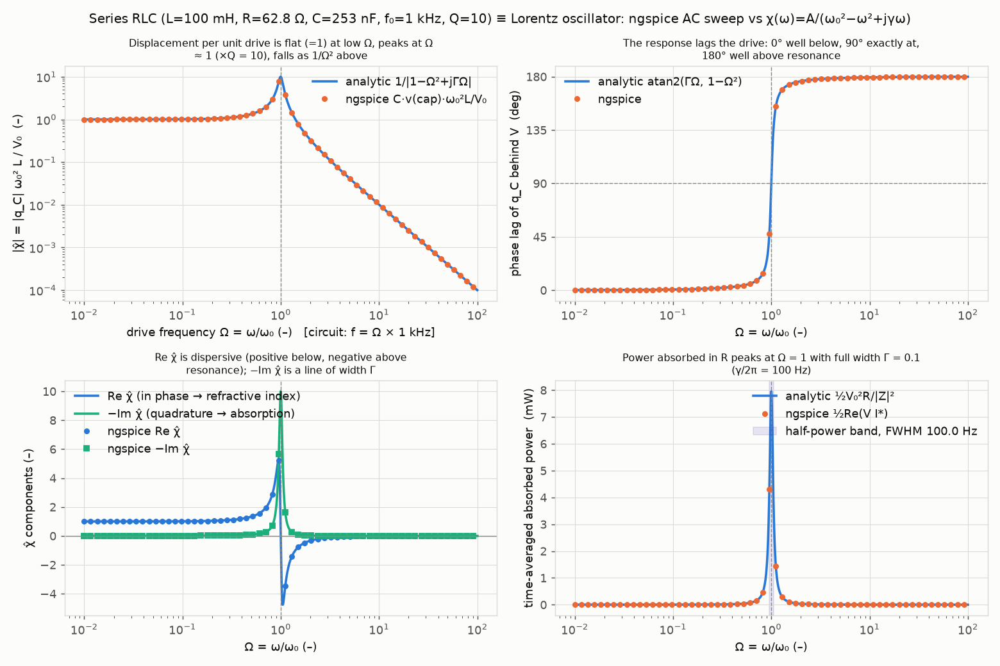
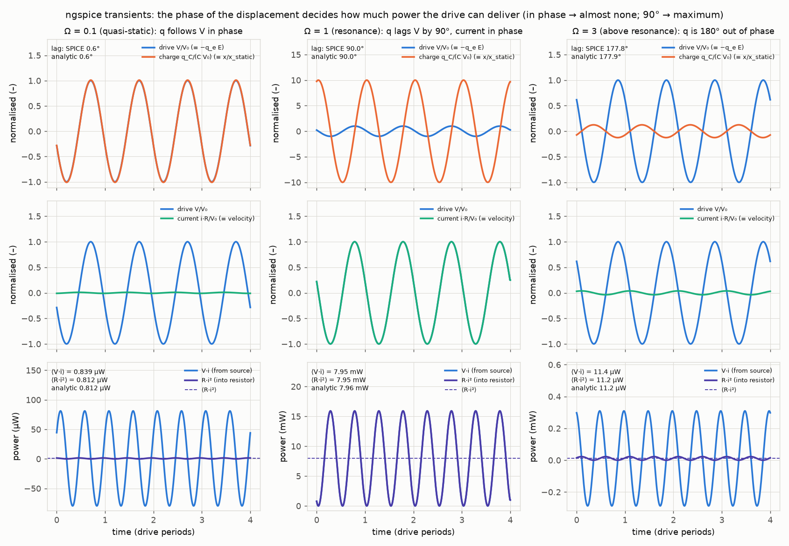
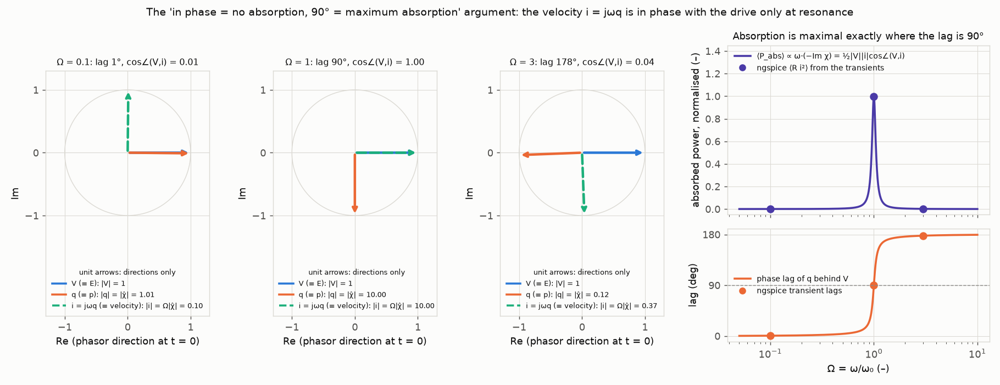
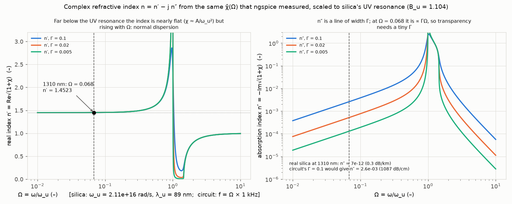
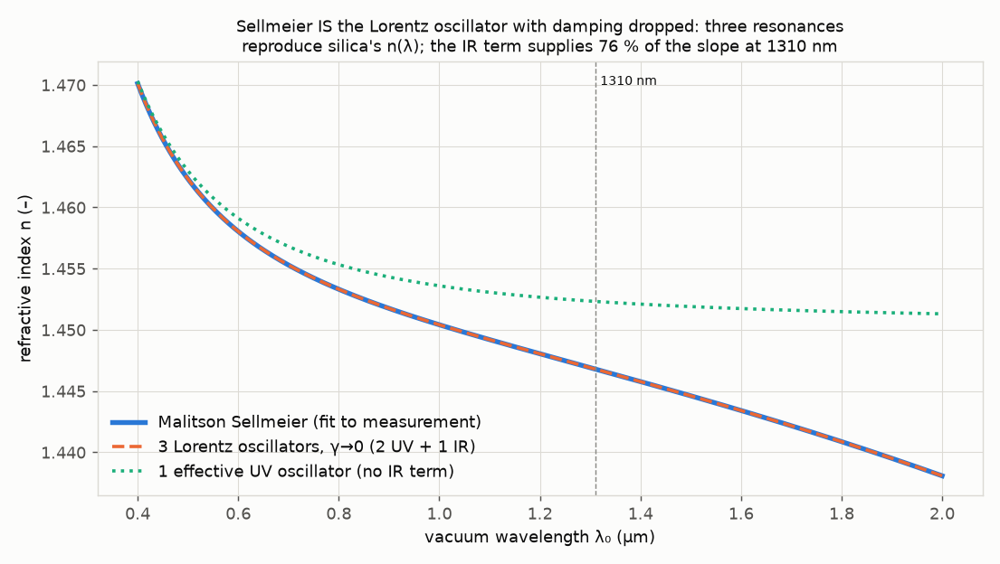
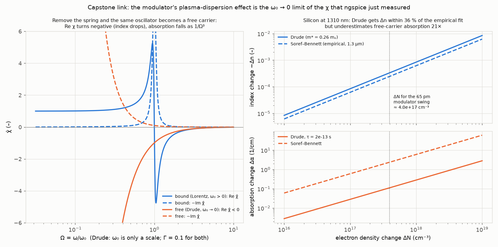
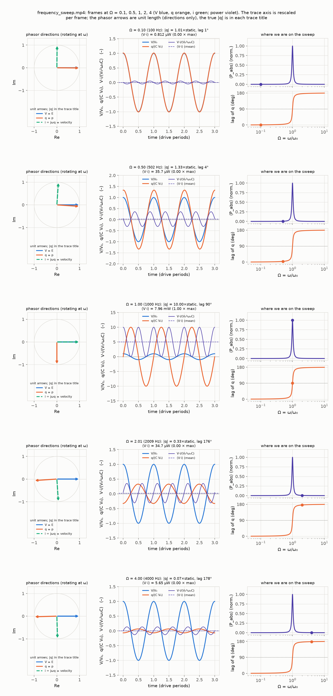

# 03. The driven electron is a series RLC: susceptibility, phase lag and absorption

**Concept** (docs/NOTES.md sections 7 and 8, with 6 for n = n′ − jn″ and 9–10 for the link to Sellmeier)

Section 7 of the notes says the refractive index of a material is a *transfer function*: apply a field E, get a polarisation P, and χ(ω) = P̃/(ε₀Ẽ) tells you how much, with what phase, at each frequency. Its derivation is a bound electron on a spring with damping, driven by −qE. That ODE, m ẍ + mγ ẋ + mω₀² x = −qE(t), is term-for-term the series RLC loop equation L q̈ + R q̇ + q/C = V(t). So instead of trusting the algebra, this experiment builds the circuit in ngspice and *measures* χ(ω): the AC sweep gives the magnitude and phase of the capacitor charge per volt, which is the shape of χ(ω) = A/(ω₀² − ω² + jγω); three transients at ω ≪ ω₀, ω = ω₀ and ω ≫ ω₀ show the displacement in phase, 90° behind, and 180° behind the drive; and the resistor's instantaneous power R·i² shows *why* the phase matters: power flows in only when the velocity (current) is in phase with the drive, which happens exactly at resonance. The same dimensionless curve χ̂(Ω) = 1/(1 − Ω² + jΓΩ), Ω = ω/ω₀, is then scaled to silica's ultraviolet resonance, so that 1310 nm light corresponds to a 68 Hz drive of the 1 kHz circuit, and turned into n′ and n″ via n = √(1+χ). What the equations alone do not give you is the *feel* for section 8: at Ω = 0.068 the electron is following the field quasi-statically, its response is only 0.46 % above the DC value, the phase lag would be 0.4° with the circuit's Γ = 0.1 (and 1.1×10⁻⁹ ° with the damping Γ = 2.8×10⁻¹⁰ that reproduces silica's real n″, see figure 4), and yet that tiny frequency dependence is the entire refractive-index dispersion of glass. The last figure removes the spring (ω₀ → 0) and the same oscillator becomes the free carrier of the silicon modulator: Re χ turns negative, the index drops, which is the plasma-dispersion effect the capstone's modulator uses.

**Tools used**

### ngspice 47

*What it is:* Open-source SPICE circuit simulator (Berkeley SPICE3 lineage) used for analogue circuit design: DC, AC small-signal, transient and noise analyses of a text netlist. Run headless with `ngspice -b file.cir`.

*What I used it for here:* Solving the series RLC (L = 100 mH, R = 62.83 Ω, C = 253.3 nF, f₀ = 1 kHz, Q = 10, so γ = R/L = 628.3 s⁻¹ and Γ = γ/ω₀ = 0.1) that is term-for-term the Lorentz bound-electron ODE. An AC sweep (10 Hz to 100 kHz, 4001 points) records the capacitor voltage phasor (charge q_C = C·v(cap), the displacement) and the loop current (the velocity); two more AC sweeps with the same L and f₀ but Q = 2 (R = 314.2 Ω) and Q = 50 (R = 12.57 Ω) check that the peak of |χ̂| scales as Q (these are the same three netlists the notebook overlays); three transients at 100 Hz, 1 kHz and 3 kHz (Ω = 0.1, 1, 3) record V(t), q(t), i(t), the instantaneous resistor power R·i² and the source power V·i, after a settling time of 16/γ = 25.5 ms.

*Result:* AC sweep: |χ̂| agrees with 1/|1 − Ω² + jΓΩ| to 0.00014 % and the phase to 0.0001° over the whole sweep; the displacement peak is at 997.49 Hz versus the analytic f₀√(1 − Γ²/2) = 997.50 Hz (0.000 %); the phase lag at f₀ is 90.000° (expected 90°); the absorbed-power half-power points are 951.24 / 1051.26 Hz versus 951.25 / 1051.25 Hz, FWHM 100.02 Hz versus γ/2π = 100.00 Hz (0.02 %). Peak |χ̂| = 2.0656 / 10.0124 / 49.9999 for Q = 2 / 10 / 50 versus the analytic 1/(Γ√(1 − Γ²/4)) = 2.0656 / 10.0125 / 50.0025 (+0.0001 % / −0.001 % / −0.005 %; max |χ̂| error over the sweep 0.00007 % / 0.00014 % / 0.0005 %). Transients: lags 0.579° / 90.018° / 177.848° versus analytic 0.579° / 90.000° / 177.852°; charge amplitudes 0.2558 / 2.5324 / 0.03164 µC versus 0.2558 / 2.5330 / 0.03164 µC (−0.02 % at resonance); mean resistor power 0.812 µW / 7.9505 mW / 11.18 µW versus ½V₀²R/|Z|² = 0.812 µW / 7.9577 mW / 11.17 µW (−0.09 % at resonance).

*How to observe it:* `cd experiments/03_driven_electron_rlc && ../../.venv/bin/python run.py` writes and runs `out/rlc_ac.cir`, `out/rlc_ac_Q2.cir`, `out/rlc_ac_Q50.cir` and `out/rlc_tran_{low,res,high}.cir`, leaving the raw tables `out/*.txt` and logs `out/*.log`; the figures are `out/ac_sweep.png`, `out/transients.png` and `out/phasor_power.png`. Run one netlist by hand with `/opt/homebrew/bin/ngspice -b out/rlc_ac.cir`. Change `Q_FACTOR`, `F0` or the `DRIVES` dictionary at the top of `run.py` to change the damping, the resonance or the three drive frequencies.

### scipy 1.18.1 / numpy 2.4.6

*What it is:* NumPy is the array library; SciPy adds scientific routines (signal processing, optimisation, special functions) on top of it.

*What I used it for here:* The analytic χ̂(Ω), the complex index n = √(1+χ) with the passive branch chosen (`lorentz.py`), least-squares sinusoid fits that extract amplitude and phase from the SPICE transients, parabolic-peak and interpolated half-power extraction from the AC sweep, the Sellmeier-to-Lorentz conversion for fused silica (B_i = A_i/ω_i², so A_i = B_i ω_i²) with the per-resonance split of dn/dλ, and the Drude (free-carrier) estimate for silicon.

*Result:* n(1310 nm) from the three-oscillator Lorentz sum with γ → 0 is 1.446804, identical to Malitson's Sellmeier value 1.446804 (max difference 2×10⁻¹⁶ over 0.4–2.0 µm) and to the textbook 1.4468 (0.000 %); a single effective UV oscillator (B_u = 1.104, λ_u = 89.1 nm, ω_u = 2.11×10¹⁶ rad/s) gives 1.4523 (+0.38 %, because it lacks the IR term). Ω₁₃₁₀ = ω/ω_u = 0.0680, i.e. 68.0 Hz in the 1 kHz circuit. dn/dλ at 1310 nm = −0.011325 /µm, of which the UV terms supply −0.00273 and the IR (9.9 µm) term −0.00860, i.e. 76 % of the slope; n_g = 1.4616. Drude Δn for 10¹⁷ cm⁻³ electrons at 1310 nm = −8.46×10⁻⁵ versus the empirical Soref–Bennett −6.20×10⁻⁵ (ratio 1.36); Drude Δα = 0.028 /cm versus Soref–Bennett 0.60 /cm (21× too small, see Checks).

*How to observe it:* `out/refractive_index.png`, `out/silica_n_lambda.png`, `out/bound_vs_free.png` and every number in `out/results.json`; the functions are in `lorentz.py` and are reused by `explore.ipynb`.

### matplotlib 3.11.2 (FuncAnimation + FFMpegWriter) with ffmpeg 9.0.1

*What it is:* The standard Python plotting library; its animation module writes frame sequences through ffmpeg to mp4.

*What I used it for here:* All figures, and a 12 s video (360 frames at 30 fps) sweeping the drive frequency from Ω = 0.1 to 4 while showing the V, q and i phasors as unit arrows (slowly co-rotating so they read as rotating phasors; the true |q| is in the trace title), the unclipped time traces of V/V₀, q/(C V₀) and the instantaneous power V·i/(V₀²ω₀C) on an axis rescaled every frame, and a marker on the stacked absorbed-power and phase-lag curves. The video figure uses explicit gridspec margins rather than `tight_layout` (the aspect-equal phasor panel is not compatible with it).

*Result:* `out/frequency_sweep.mp4` (rendered in ≈ 40 s, most of the run time) and the contact sheet `out/frequency_sweep_frames.png`, whose five stills are chosen explicitly at Ω = 0.1, 0.5, 1, 2, 4 (the nearest sweep frame to Ω = 1 is snapped onto exact resonance, a 0.07 % nudge): the q phasor rotates from in phase (V·i averages to ≈ 0: 0.81 µW at Ω = 0.1) through 90° behind at the resonance frame (V·i always ≥ 0, maximum absorption, |q| = 10.00× the static value, ⟨V·i⟩ = 7.96 mW = ½V₀²/R) to 180° behind (small and opposite, 5.7 µW at Ω = 4).

*How to observe it:* open `out/frequency_sweep.mp4`; edit `Om_path`, `N_FR`, `STILL_OMEGAS` or `GAMMA_HAT` in `run.py` to change the sweep range, length, still frames or damping.

### Jupyter notebook (nbformat 5.11.1 + nbconvert, ipywidgets 8.1.9, kernel photonics-sims)

*What it is:* Jupyter notebooks mix code, output and text; ipywidgets adds sliders that re-run a function; nbconvert executes a notebook headlessly and stores the outputs in the file.

*What I used it for here:* `explore.ipynb` (built from `build_notebook.py` with nbformat): sliders for the damping Γ, the drive frequency Ω and the oscillator strength B = A/ω₀² that redraw the phasor diagram, the time traces, χ̂(Ω) with the lag, and n′, n″; a cell that writes a netlist for any (f₀, Q) into a temporary directory and runs ngspice from the notebook, overlaying Q = 2, 10, 50; a wavelength slider for the silica mapping (Ω, circuit frequency, n from the oscillator sum, UV/IR split of dn/dλ); and a carrier-density slider for the capstone (Δn Drude vs Soref–Bennett, ring shift in pm and in kelvin-equivalents).

*Result:* Executed notebook with outputs saved at the default slider positions (SPICE peak |χ̂| = 2.07 / 10.00 / 50.00 for Q = 2 / 10 / 50, within 0.0006 % of the analytic curve); the interactive cells work in JupyterLab.

*How to observe it:* `cd experiments/03_driven_electron_rlc && ../../.venv/bin/jupyter lab explore.ipynb`, run all cells, drag the sliders. Re-execute headlessly with `../../.venv/bin/jupyter nbconvert --to notebook --execute --inplace explore.ipynb` (run.py does this as its last step). Rebuild from source with `../../.venv/bin/python build_notebook.py`.

**What the simulation does**

1. *Mapping* (notes 7). The bound-electron equation m ẍ + mγ ẋ + mω₀² x = −qE(t) and the series-RLC equation L q̈ + R q̇ + q/C = V(t) are the same second-order ODE with m ↔ L, mγ ↔ R (so γ = R/L), mω₀² ↔ 1/C (so ω₀² = 1/LC), −qE ↔ V and x ↔ q_C. Because the dipole is p = −q_e x, the capacitor charge plays the role of the dipole (and, times N, of the polarisation P), so the circuit transfer function q_C/V has exactly the shape of χ(ω) = A/(ω₀² − ω² + jγω). In dimensionless form, with Ω = ω/ω₀ and Γ = γ/ω₀ = 1/Q: χ̂(Ω) = χω₀²/A = 1/(1 − Ω² + jΓΩ), and for the circuit χ̂ = ω₀²L·C·v(cap)/V₀. Phase convention e^{jωt} (notes 3): the lag of q behind V is atan2(ΓΩ, 1 − Ω²), from 0° to 180°.

2. *Circuit values.* f₀ = 1 kHz and Q = 10 with L = 100 mH give C = 1/(ω₀²L) = 253.3 nF and R = γL = 62.83 Ω. ngspice runs `ac dec 1000 10 100k` (also for Q = 2 and Q = 50, i.e. R = 314.2 Ω and 12.57 Ω) and three `tran` analyses with 400 steps per drive period until 16/γ + 4 periods.

3. *AC sweep* (figure 1). The SPICE charge-per-volt is compared point by point with the analytic 1/(L(ω₀² − ω² + jγω)); the four panels show |χ̂|, the lag, Re χ̂ and −Im χ̂, and the time-averaged absorbed power ½Re(V I*) = ½V₀²R/|Z|². For the series RLC the half-power points satisfy |ωL − 1/ωC| = R, whose two positive roots ω± = ω₀(±Γ/2 + √(1 + Γ²/4)) differ by exactly R/L = γ, so the power FWHM is γ/2π = 100 Hz with no narrow-band approximation. The displacement amplitude peaks slightly below ω₀, at ω₀√(1 − Γ²/2) = 997.5 Hz.

4. *Transients* (figure 2). At each drive frequency the last four periods are resampled uniformly and fitted with a cos + sin + constant least-squares model to extract amplitude and phase of V, q and i. The instantaneous powers V·i (delivered) and R·i² (dissipated) are plotted and averaged. Their means agree with each other and with the analytic value once the start-up transient has decayed (e^{−γt/2} = e^{−8}).

5. *The power argument* (figure 3, notes 7 and 25). ⟨P⟩ = ½|V||i|cos∠(V, i) with i = jωq. Below resonance q is in phase with V, so i is 90° ahead and the average power is ≈ 0: the field displaces the charge and gets the energy back every half cycle (reactive, "no absorption"). At resonance q lags by 90°, i is in phase with V, and the power is maximal. Above resonance q is 180° behind (mass-like), i is 90° behind V, and the average power is again ≈ 0. This is why absorption is ∝ ω·(−Im χ): the quadrature part of the response, not the in-phase part.

6. *Silica mapping* (figures 4 and 5, notes 6, 8, 9, 10). Sellmeier's n² − 1 = Σ B_i λ²/(λ² − C_i) is the Lorentz sum with damping dropped, B_i = A_i λ_i²/(2πc)², C_i = λ_i². Inverting Malitson's coefficients gives three oscillators (λ_i = 68.4 nm, 116.2 nm, 9.896 µm). The two UV terms are collapsed into one effective oscillator with B_u = B₁ + B₂ = 1.104 and a strength-weighted λ_u² (λ_u = 89.1 nm, ω_u = 2.11×10¹⁶ rad/s) to map onto the circuit: Ω₁₃₁₀ = ω₁₃₁₀/ω_u = 0.068 ↔ 68 Hz. n′ and n″ are then computed from n = √(1 + B_u χ̂(Ω)) for Γ = 0.1, 0.02, 0.005, and the actual n″ of silica (0.3 dB/km → n″ = 7.2×10⁻¹²) is contrasted with what the circuit's Γ = 0.1 would imply (n″ = 2.6×10⁻³, 1087 dB/cm).

7. *Capstone* (figure 6). The Drude susceptibility χ_fc = −ω_p²/(ω² − jω/τ), ω_p² = Nq²/(ε₀m*), is the Lorentz oscillator with ω₀ = 0; Δn = χ_fc/(2n). It is evaluated for silicon (m* = 0.26 mₑ, τ = 2×10⁻¹³ s) at 1310 nm and compared with the empirical Soref–Bennett coefficients for electrons at 1.3 µm (Δn = −6.2×10⁻²² ΔN, Δα = 6.0×10⁻¹⁸ ΔN, ΔN in cm⁻³). The thermo-optic effect is written in the same language: with n² − 1 = A/ω₀² far from resonance, d(n²) = −2(n² − 1) dω₀/ω₀, so silicon's dn/dT = 1.86×10⁻⁴ /K corresponds to a fractional resonance shift of −5.8×10⁻⁵ /K.

**Results**

Video: [out/frequency_sweep.mp4](out/frequency_sweep.mp4) (12 s). Stills at Ω = 0.1, 0.5, 1, 2, 4 (the middle row is the resonance frame):

| Quantity | Simulated (ngspice / numpy) | Analytic expectation (notes) | Agreement |
|---|---|---|---|
| \|χ̂\| over 10 Hz–100 kHz | 4001-point AC sweep | 1/\|1 − Ω² + jΓΩ\| | max error 0.00014 % |
| phase of χ̂ | AC sweep | atan2(ΓΩ, 1 − Ω²) | max error 0.0001° |
| phase lag at f₀ | 90.000° | 90° | 0.000 % |
| displacement peak | 997.49 Hz | f₀√(1 − Γ²/2) = 997.50 Hz | 0.000 % |
| absorbed-power half-power points | 951.24 / 1051.26 Hz | ω₀(±Γ/2 + √(1+Γ²/4)) = 951.25 / 1051.25 Hz | 0.001 % |
| absorbed-power FWHM | 100.02 Hz | γ/2π = 100.00 Hz | 0.02 % |
| static response χ̂(Ω → 0) | 1.00010 at 10 Hz | 1.00010 (→ 1, notes 8) | 0.000 % |
| peak \|χ̂\| for Q = 2 / 10 / 50 | 2.0656 / 10.0124 / 49.9999 | 1/(Γ√(1 − Γ²/4)) = 2.0656 / 10.0125 / 50.0025 | 0.0001 % / 0.001 % / 0.005 % |
| transient lag, Ω = 0.1 | 0.579° | 0.579° | 0.004 % |
| transient lag, Ω = 1 | 90.018° | 90.000° | 0.02 % |
| transient lag, Ω = 3 | 177.848° | 177.852° | 0.003 % |
| \|q\| at Ω = 1 | 2.5324 µC | V₀/(ω₀R) = 2.5330 µC | −0.02 % |
| ⟨R·i²⟩ at Ω = 1 | 7.9505 mW | ½V₀²/R = 7.9577 mW | −0.09 % |
| ⟨R·i²⟩ at Ω = 0.1 / 3 | 0.812 µW / 11.18 µW | 0.812 µW / 11.17 µW | 0.06 % / 0.01 % |
| n(1310 nm), 3-oscillator Lorentz sum | 1.446804 | Sellmeier 1.446804; textbook 1.4468 | 0.000 % |
| n(1310 nm), single effective UV oscillator | 1.4523 | 1.4468 | +0.38 % (no IR term) |
| Ω at 1310 nm | 0.0680 (→ 68.0 Hz in the circuit) | ω/ω_u with ω_u = 2.11×10¹⁶ rad/s | by construction |
| χ(1310)/χ(0) for the UV term | 1.0046 | 1/(1 − Ω²) | quasi-static, notes 8 |
| dn/dλ at 1310 nm | −0.011325 /µm (UV −0.00273 + IR −0.00860) | n_g − n = 0.0148 → n_g = 1.4616 | IR share 76 % |
| n″ of silica at 1310 nm | 7.2×10⁻¹² (from 0.3 dB/km) | circuit's Γ = 0.1 would give 2.6×10⁻³ | shows how small Γ must be |
| phase lag of the UV oscillator at 1310 nm | 0.39° with Γ = 0.1; 1.1×10⁻⁹ ° with Γ = 2.8×10⁻¹⁰ (silica's n″) | atan2(ΓΩ, 1 − Ω²) | same formula, two dampings |
| Drude Δn, 10¹⁷ cm⁻³ electrons | −8.46×10⁻⁵ | Soref–Bennett −6.20×10⁻⁵ | ratio 1.36 |
| Drude Δα, 10¹⁷ cm⁻³ electrons | 0.028 /cm | Soref–Bennett 0.60 /cm (2.6 dB/cm) | 21× too small (see Checks) |
| ring shift for uniform 10¹⁷ cm⁻³ | −16.4 pm | λΓ_conf Δn/n_g | = −0.33 K of thermal drift |
| modulator swing 50 pm/V × 1.3 V | 65 pm → Δn_eff = 2.1×10⁻⁴ → ΔN ≈ 4.0×10¹⁷ cm⁻³ | | = 1.3 K of thermal drift |
| thermo-optic as resonance shift | dω₀/ω₀ = −5.8×10⁻⁵ /K | Varshni-type dE/E ≈ −7.9×10⁻⁵ /K for the 3.4 eV transition | same order (qualitative) |

Run time of `run.py`: 45–50 s on this laptop (`results.json` reports 44–50 s; the 360-frame video render is ≈ 40 s of it), including the notebook execution. `out/results.json` and `out/run_log.txt` are rewritten after every stage (AC sweep, transients, phasor figure, silica mapping, video, figures, notebook), so an interrupted run still leaves the numbers computed so far; the `stage_completed` key says how far it got.

**Experiments to try**

1. *Change the damping.* Set `Q_FACTOR = 50` in `run.py` (R drops to 12.6 Ω). The |χ̂| peak rises to ≈ 50, the absorbed-power FWHM shrinks to 20 Hz, the transition of the lag through 90° becomes a step, and in `refractive_index.png` the n″ curve at Ω = 0.068 drops by 5× (n″ ∝ ΓΩ far below resonance). Also note the settling time 16/γ grows 5×, so the transients run longer.
2. *Drive exactly at the half-power points.* Add `"hp": 951.25` and `"hp2": 1051.25` to `DRIVES`. The lag should be 45° and 135°, the current in phase to within ±45°, and ⟨R·i²⟩ = 3.98 mW, half the resonant value, at both.
3. *Move the operating point in the notebook.* In `explore.ipynb`, set Γ = 0.001 and sweep Ω from 0.02 to 0.5: watch n′ rise slowly (normal dispersion) while n″ stays negligible; then push Ω through 1 and see n′ collapse below 1 and n″ blow up. This is the notes' section 8 in one slider.
4. *Turn a UV resonance into an IR one.* In `lorentz.py`, temporarily set `MALITSON_LAM_UM = (0.0684043, 0.1162414, 3.0)` and rerun: with the IR resonance at 3 µm instead of 9.9 µm the n(λ) curve bends down much earlier and the IR share of dn/dλ at 1310 nm rises well above 76 %. (Restore the value afterwards; experiment 04 does this properly.)
5. *Free-carrier density.* In the last notebook cell slide log₁₀ΔN from 16 to 19: the ring shift goes from −1.6 pm (0.03 K) to −1.6 nm (33 K), while Δα (Soref–Bennett) goes from 0.06 to 60 /cm; that is why a modulator's doping is a compromise between tuning strength and the 125 dB/cm loss of the doped ring.

**Capstone connection**

The Lightmatter microring is locked to a fixed laser by keeping its resonance wavelength λ_r in place against thermal drift. Two things move λ_r, and both are changes of the very χ that ngspice measured here:

- *Plasma dispersion (the modulator).* The driver injects or depletes free carriers in the ring waveguide. A free carrier is the oscillator with the spring removed (ω₀ → 0, figure 6): Re χ is negative, so adding N lowers n. With Soref–Bennett at 1.3 µm, ΔN = 10¹⁷ cm⁻³ of electrons gives Δn = −6.2×10⁻⁵; if the whole confined mode (Γ_conf = 0.85) saw it uniformly, the ring would shift by Δλ = λΓ_conf Δn/n_g = −16 pm, 4.4 % of the 374 pm FWHM. The reference modulator's 50 pm/V × 1.3 V = 65 pm swing needs Δn_eff = 2.1×10⁻⁴, the equivalent of ≈ 4×10¹⁷ cm⁻³ uniformly (in reality a depletion region covering only part of the mode). The same Drude term has a lossy part, free-carrier absorption: the doped ring's 125 dB/cm (a = 0.945 per lap, REF) is this −Im χ, which is why ngspice's resistor is a fair picture of a doped waveguide.
- *Thermo-optic effect (the disturbance and the actuator).* Silicon's dn/dT = 1.86×10⁻⁴ /K, giving dλ_r/dT = 50 pm/K (REF), is a shift of the *resonance* (the band-gap-like transitions move with temperature, plus the density change), i.e. of ω₀ and A in the same χ. In Lorentz language it is dω₀/ω₀ ≈ −5.8×10⁻⁵ per kelvin, the same order as the measured temperature coefficient of silicon's 3.4 eV transition. The heater simply applies this deliberately. Stated qualitatively only; experiment 08 computes the 50 pm/K number from the mode solver.

The number that ties them together: the modulator's full 65 pm data swing equals only 1.3 K of thermal drift, and 10¹⁷ cm⁻³ of carriers equals 0.33 K. Over the 10 to 125 °C ambient range (115 K, 5.75 nm, more than half an FSR of 10.3 nm) the thermal term dwarfs the electrical one, which is why the ring needs a heater-based lock and the electrical drive cannot compensate temperature.

**Checks**

- *ngspice versus analytic χ(ω):* AC magnitude and phase within 1.4×10⁻⁴ % and 10⁻⁴ ° over four decades; the interpolated peak and half-power points reproduce ω₀√(1 − Γ²/2) and ω₀(±Γ/2 + √(1 + Γ²/4)) to 0.02 %. The exact power-FWHM identity ω₊ − ω₋ = R/L was derived independently and used as the expectation.
- *Transients:* lags within 0.02° and amplitudes within 0.02 % after a settling time of 16/γ. An earlier attempt with 8/γ (e⁻⁴ residual of the start-up ring-down) left the resonant amplitude 1 % low and the mean power 2 % low, which is why the settling time was doubled. The mean source power ⟨V·i⟩ and mean resistor power ⟨R·i²⟩ agree to 0.02 % at resonance; at Ω = 0.1 and 3 they differ by 2–3 % of their tiny values because the reactive part of V·i (±0.08 mW around a mean of 0.0008 mW) does not average to exactly zero over the resampled window; the resistor power, which has no reactive part, is the one quoted.
- *Sellmeier ≡ Lorentz sum:* n(λ) from the three oscillators with γ → 0 equals Malitson's Sellmeier formula to machine precision (2×10⁻¹⁶), confirming B_i = A_i/ω_i²; n(1310) = 1.4468 as in the textbook.
- *Where the textbook number and the model differ, and why:* (i) The brief quotes ω₀ ≈ 1.9×10¹⁶ rad/s (λ ≈ 99 nm) for silica's UV resonance; Malitson's fit has *two* UV terms at 68 and 116 nm, and the strength-weighted effective oscillator used here sits at 89 nm (2.11×10¹⁶ rad/s), so Ω₁₃₁₀ = 0.068 here versus 0.076 with the brief's value. Either is "far below resonance"; the qualitative conclusions do not depend on the choice, and n(1310) is only reproduced when all three terms are kept. (ii) A single UV oscillator gets n(1310) to 0.4 % but dn/dλ wrong by 4×: 76 % of the slope at 1310 nm comes from the 9.9 µm IR resonance (notes 10). The index depends mostly on the UV resonance; the group index and dispersion depend on both. (iii) The Drude model with a collision time from the DC mobility reproduces Soref–Bennett's Δn to 36 % (effective-mass and non-parabolicity details) but underestimates free-carrier *absorption* 21×, because FCA in silicon at 1.3 µm is dominated by phonon- and impurity-assisted intraband transitions that a single collision rate does not capture. The empirical coefficients are what designers use; the Drude form is kept because it shows the sign and the ω₀ → 0 structure.
- *Known limitations:* one oscillator species with a single damping; no local-field (Clausius–Mossotti) correction; the free-carrier and thermo-optic numbers are order-of-magnitude checks, not the capstone's design values (those come from REF and experiments 08, 12, 13). The notebook's ngspice cell is a plain function call rather than a slider because a subprocess launched from inside an ipywidgets callback deadlocks the headless nbconvert kernel.

**Files**

- `run.py` – headless entry point: writes the netlists, runs ngspice, makes all figures and the video, writes `out/results.json`, `out/tools.json`, `out/run_log.txt`, then executes `explore.ipynb` and rewrites `results.json` with the final runtime.
- `lorentz.py` – analytic helpers shared with the notebook: χ̂(Ω), phase lag, RLC transfer and power, n = √(1+χ), Lorentz sum, Malitson → oscillator conversion, per-resonance dn/dλ, Drude and Soref–Bennett for silicon.
- `build_notebook.py` – builds `explore.ipynb` with nbformat.
- `explore.ipynb` – interactive notebook (executed, outputs saved).
- `README.md` – this file.
- `out/rlc_ac.cir`, `out/rlc_ac_Q2.cir`, `out/rlc_ac_Q50.cir`, `out/rlc_tran_low.cir`, `out/rlc_tran_res.cir`, `out/rlc_tran_high.cir` – ngspice netlists (AC sweeps at Q = 10, 2, 50; transients at Ω = 0.1, 1, 3); `out/rlc_ac.txt`, `out/rlc_ac_Q2.txt`, `out/rlc_ac_Q50.txt`, `out/rlc_tran_{low,res,high}.txt` their raw output tables; the matching `out/*.log` files are the ngspice logs.
- `out/ac_sweep.png` – figure 1, AC sweep: |χ̂|, lag, Re/−Im χ̂, absorbed power.
- `out/transients.png` – figure 2, transients at Ω = 0.1, 1, 3: drive and charge, drive and current, instantaneous powers.
- `out/phasor_power.png` – figure 3, phasor diagrams and the "90° = maximum absorption" curve with the SPICE points.
- `out/refractive_index.png` – figure 4, n′ and n″ versus Ω for three dampings, 1310 nm marked.
- `out/silica_n_lambda.png` – figure 5, Sellmeier versus the Lorentz sum versus a single UV oscillator.
- `out/bound_vs_free.png` – figure 6, bound versus free electron χ̂, and silicon Δn, Δα versus ΔN.
- `out/frequency_sweep.mp4`, `out/frequency_sweep_frames.png` – the drive-frequency sweep video and its contact sheet.
- `out/results.json` – every headline number above (rewritten after each stage; `stage_completed` = `done` for a full run); `out/tools.json` – the tool descriptions; `out/run_log.txt` – console log; `out/nbconvert.log` – notebook execution log.
