# 04. Sellmeier dispersion: from a sum of resonances to group index, zero dispersion and the ring FSR

**Concept** (notes §9 Sellmeier form, §10 UV vs IR curvature, §11 group index and material dispersion; touches §8 and §12)

The notes derive that a transparent material's refractive index is a sum of resonance tails, n²(λ) − 1 = Σ B_i λ²/(λ² − C_i), that the *group* index is n_g = n − λ dn/dλ, and that material dispersion D = −(λ/c) d²n/dλ² is a statement about the *curvature* of n(λ), not its slope. Those three lines are easy to accept and hard to picture. This experiment lets you see them: sympy performs the derivation and checks it, then the very same symbolic expressions are evaluated for fused silica (Malitson) and crystalline silicon (Salzberg–Villa). You can watch a tangent slide along n(λ) and read n_g off the λ = 0 axis (the video), see the UV terms bend the curve up and the IR term bend it down until they cancel at 1273 nm (the zero-dispersion wavelength), see the three Sellmeier poles at 68 nm, 116 nm and 9.9 µm on a log axis with 1310 nm sitting in the gap between them, and see why a 53 Gbaud signal survives 2 km of fibre at 1310 nm (3 ps of delay spread) but smears by one and a half bit periods (28 ps) at 1550 nm. The capstone tie is direct: the ring's free spectral range is set by the group index (FSR = c/(n_g L) = 1.80 THz with n_g = 4.2), not by n_eff = 2.5 (which would wrongly give 3.03 THz), and the thermal shift dλ_r/dT also carries n_g in its denominator.

**Tools used**

### sympy 1.14.0
*What it is:* A Python computer-algebra system: symbolic differentiation, simplification, series expansion and pretty-printing of equations. Normally used to derive and check formulas before they are coded numerically.
*What I used it for here:* Deriving n_g = c dk/dω = n − λ dn/dλ and D = d(n_g/c)/dλ = −(λ/c) d²n/dλ² from k(ω) = n(λ(ω)) ω/c, the chain rule dn/dλ = S'/(2n), d²n/dλ² = S''/(2n) − S'²/(4n³) for n = √(1+S), the series of a single Sellmeier term for λ ≫ λ_u (UV) and λ ≪ λ_ir (IR) (notes §10), and then *lambdifying* the exact Sellmeier n(λ), dn/dλ, d²n/dλ² so that every number in this experiment is the evaluated symbolic derivation rather than a separately typed formula (`sellmeier.py`, class `Material`).
*Result:* `out/derivation.txt`: both identities are checked to simplify to 0 (assertions in `run.py`). Series: d²S_u/dλ² ≈ 6B_uλ_u²/λ⁴ > 0 (UV bends up), d²S_ir/dλ² ≈ −2B_ir/λ_ir² < 0 (IR bends down). Lambdified silica n(1310 nm) = 1.44680 vs Malitson 1.4468 (100.00 %). A finite-difference cross-check of the lambdified derivatives agrees to max|Δn_g| = 1.1e-9 and max|ΔD| = 4e-4 ps/(nm·km).
*How to observe it:* `cd experiments/04_sellmeier_dispersion && ../../.venv/bin/python run.py`; read `out/derivation.txt` (section 1 of the log) and `out/equations.png` (the equations rendered with matplotlib mathtext, since there is no LaTeX). To try another material, add a Sellmeier `n_expr` in `sellmeier.py` and wrap it in `Material(name, n_expr, valid_um)`; all derivatives are generated automatically.

### numpy 2.4.6 + scipy 1.18.1
*What it is:* numpy is the array library every scientific Python code is built on; scipy adds numerical algorithms (root finding, optimisation, integration). Used here for evaluating the lambdified expressions on wavelength grids and for the bracketing root finder `scipy.optimize.brentq`.
*What I used it for here:* Evaluating n, n_g, D on 0.6–2.0 µm (silica) and 1.2–2.0 µm (silicon), the finite-difference cross-checks, the `brentq` root of d²n/dλ² for the zero-dispersion wavelength, the term-by-term decomposition of d²n/dλ² at the ZDW, an independent frequency-domain route to D (β₂ = d²β/dω² by central differences in ω, D = −2πc β₂/λ², never differentiating n with respect to λ), the small-change rule, the ring FSR by index, the thermal-shift number and the 2 km delay spread.
*Result:* ZDW(silica) = 1272.8 nm (expected ≈ 1270, 99.78 %); D(1550) = 21.91 ps/(nm·km) (bulk silica 20–22; the fibre spec 17 includes waveguide dispersion); D(1310) = +3.582 ps/(nm·km) vs the independent ω-route +3.582 (100.00 %: 3.5818 vs 3.5819; the linear extrapolation from the ZDW, 3.72, is 4 % high because D(λ) is curved); n_g(1310, silica) = 1.4616 (tables 1.462, 99.98 %); small-change rule 174.69 GHz/nm at 1310 nm (174.7, 100.00 %); FSR = 1.803 THz / 10.32 nm with n_g = 4.2 (REF 1.8 / 10.3, 99.9 %); dλ_r/dT = 49.8 pm/K (REF 50, 99.6 %); 2 km delay spread across ±0.75 × baud: 3.3 ps at 1310 nm, 28.0 ps at 1550 nm (experiment 05's full pulse propagation: 3.27 / 27.99 ps; brief: ~27 ps).
*How to observe it:* `out/results.json` (every number), `out/results.txt` (the printed log), `out/silica_dispersion_table.csv` and `out/silicon_dispersion_table.csv` (λ, n, n_g, D, β₂ on the full grids). Change `L0`, `REF.ng` or the `brentq` bracket `(1.0, 1.6)` in `run.py` to explore.

### matplotlib 3.11.2 (+ ffmpeg 9.0.1)
*What it is:* The standard Python plotting library; `FuncAnimation` + `FFMpegWriter` drive the ffmpeg encoder to turn a sequence of frames into an mp4. Also used here to render equations with mathtext because there is no LaTeX on this machine.
*What I used it for here:* Eleven PNG files: ten figures (equations, n and n_g, two tangent-intercept constructions, D vs λ, term-by-term curvature, the Sellmeier poles on a log axis, the small-change rule, the ring-FSR-by-index bar chart, the 2 km spread vs λ) plus the contact sheet of the 8 s video `tangent_sliding.mp4`.
*Result:* `out/*.png` (11 files), `out/tangent_sliding.mp4` (240 frames at 30 fps, 8.0 s), `out/tangent_sliding_frames.png` (six stills with one shared legend). In the video the orange square (the λ = 0 intercept of the tangent) *is* n_g; it is lowest exactly where D crosses zero (1273 nm, frame 4 of the contact sheet).
*How to observe it:* open `out/tangent_sliding.mp4`; the figures are embedded below. Edit `lam_anim = np.linspace(0.65, 1.95, 240)` in `run.py` to change the sweep, or `FFMpegWriter(fps=30)` for the frame rate.

### Jupyter notebook + ipywidgets 8.1.9 (nbformat 5.11.1, kernel `photonics-sims`)
*What it is:* Jupyter notebooks mix code, output and text; ipywidgets adds sliders that re-run a Python function when moved. Used for interactive exploration where a script would need a re-run per parameter.
*What I used it for here:* `explore.ipynb` (built by `make_notebook.py`, executed and saved with outputs): sliders that (1) slide the tangent along n(λ) for silica or silicon and read n_g from the intercept, (2) move the IR Sellmeier pole (λ_ir, B_ir) and scale the UV strengths and watch the zero-dispersion wavelength move, (3) compute the ring FSR from n_g and L and draw the eight 200 GHz channels inside one FSR, (4) convert pm ↔ GHz with the small-change rule. The notebook's evaluation of the same `Material` objects is asserted equal to `out/results.json` to 1e-12.
*Result:* Executed outputs saved in the notebook for the default slider values. Moving λ_ir from 9.9 µm to 6 µm pulls the ZDW from 1273 nm to 978 nm (to 14 µm: 1523 nm); doubling B_ir to 1.4 pulls it to 1145 nm; scaling the UV strengths by 1.1 pushes it to 1302 nm. Increasing n_g from 3.7 (bulk Si) to 4.2 (strip) moves the FSR from 2.05 THz to 1.80 THz; the eight channels span 8.01 nm and fit inside the 10.32 nm FSR.
*How to observe it:* `cd experiments/04_sellmeier_dispersion && ../../.venv/bin/jupyter lab explore.ipynb` and drag the sliders. `run.py` rebuilds and re-executes the notebook headless at the end of every run (section 6: `make_notebook.py` then `jupyter nbconvert --execute --inplace --ExecutePreprocessor.kernel_name=photonics-sims`), so its saved outputs can never go stale relative to `out/results.json`. This step is *load-sensitive*: a kernel start plus ten cells takes ≈ 40 s on an idle laptop but many minutes when other solver runs (Meep, Tidy3D) are saturating the CPU, because the kernel and its ipywidgets figures compete for cores. Each cell of the notebook runs in seconds, so `run.py` executes it with a 60 s per-cell timeout. On this machine the kernel↔nbconvert messaging stalls intermittently (about one attempt in two with ipykernel 7.3.0 / ipywidgets 8.1.9 / jupyter_client 8.10: the kernel goes idle and never answers the next execute request, always shortly after one of the four `interact` slider cells; 0 stalls in 4 runs with those cells removed). `run.py` therefore makes up to three attempts: two with every cell, then one that skips the cells tagged `widgets` (the four `interact` calls) so the static figure cells and the `results.json` cross-check always execute; `notebook_status` and `notebook_widget_cells_executed` in `results.json` say which happened. `SKIP_NOTEBOOK=1 ../../.venv/bin/python run.py` skips the step (recorded as `notebook_status: skipped` in `results.json`) so the headless part alone stays at about a minute. To do the notebook by hand: `../../.venv/bin/python make_notebook.py && ../../.venv/bin/jupyter nbconvert --to notebook --execute --inplace explore.ipynb`.

**What the simulation does**

`run.py` (≈ 100 s on an idle laptop: ≈ 60 s for the figures, video and tables, then ≈ 40 s to rebuild and execute the notebook; the notebook step alone stretched to 11 minutes in one re-run while three Meep jobs from other sessions were saturating the CPU, so set `SKIP_NOTEBOOK=1` when the machine is busy) regenerates everything in `out/` from scratch (it deletes the previous outputs first) and then re-executes `explore.ipynb`.

1. **Symbolic derivation** (`run.py` section 1, `out/derivation.txt`). With n an unknown function of λ, sympy forms k(ω) = n(λ)·ω/c, λ = 2πc/ω, differentiates, and simplifies c·dk/dω to n − λ dn/dλ (notes §11). It then differentiates τ_g/L = n_g/c once more and shows the dn/dλ terms cancel, leaving D = −(λ/c) d²n/dλ². For n = √(1+S) it reproduces dn/dλ = S'/(2n) and d²n/dλ² = S''/(2n) − S'²/(4n³) (notes §10). Finally it expands one Sellmeier term S = Bλ²/(λ² − λ_r²) for λ ≫ λ_r (UV pole: S ≈ B + Bλ_r²/λ², S'' ≈ 6Bλ_r²/λ⁴ > 0) and λ ≪ λ_r (IR pole: S ≈ −Bλ²/λ_r², S'' ≈ −2B/λ_r² < 0).

2. **Materials** (`sellmeier.py`). Fused silica, Malitson 1965: B = (0.6961663, 0.4079426, 0.8974794), C = (0.0684043², 0.1162414², 9.896161²) µm². Crystalline silicon, Salzberg–Villa 1957: n² = 11.6858 + 0.939816/λ² + 0.00810461·1.1071²/(λ² − 1.1071²). The silicon fit has its pole at 1.107 µm (the band edge), so the silicon curves are plotted from 1.2 µm; silica from 0.6 to 2.0 µm as the brief asks. Both are wrapped in `Material`, which lambdifies n, dn/dλ, n_g, d²n/dλ² from the sympy expressions; `D_ps_nm_km()` converts −(λ/c) d²n/dλ² from s/m² to ps/(nm·km) (factor 1e6).

3. **Numbers** (section 2). n, dn/dλ, n_g, D, β₂ = −λ²D/(2πc) at 1310 and 1550 nm for both materials; the zero-dispersion wavelength as the `brentq` root of d²n/dλ² on the *full* n(λ) (the notes warn that the exact zero must be evaluated on n, not on S: the −S'²/(4n³) term contributes −0.00009 µm⁻² at the ZDW, about 1 % of the ±0.0070 µm⁻² UV/IR parts); the dispersion slope S₀ at the ZDW and its curvature S₀′; an *independent* frequency-domain evaluation of D(1310) and D(1550) that forms β(ω) = n(λ(ω))·ω/c, takes β₂ = d²β/dω² by central differences in ω (relative step 1e-3) and converts with D = −(2πc/λ²)β₂ (notes §12), so the headline D(1310) is checked against a route that never differentiates n with respect to λ; the linear and second-order Taylor extrapolations of D from the ZDW as cross-checks; the small-change rule |Δf| = (c/λ²)|Δλ| in GHz/nm at 1310 and 1550 nm with the exact 1 nm step for comparison; the capstone conversions (FSR, 50 pm/K, FWHM, δ_opt, channel spacing, 1 pm) through `common.units`; the ring FSR = c/(index·L) for four candidate indices; the thermal shift dλ_r/dT = (λ/n_g)(Γ dn_Si/dT + (1−Γ) dn_SiO₂/dT); and the 2 km chromatic delay spread |D|·L·Δλ for a 53.125 Gbaud NRZ signal with two spectral-width conventions: the two-sided ±0.75 × baud = 79.7 GHz signal band that experiment 05 and the brief use (headline), and the crude one-sided Δλ ↔ 53 GHz (both through the same small-change rule).

4. **Figures and video** (section 3–4), listed under Results.

5. **Tables and JSON** (section 5): `silica_dispersion_table.csv`, `silicon_dispersion_table.csv`, `results.json` (with a `headline` block holding value / expected / agreement / source for each headline number), `tools.json`.

6. **Notebook** (section 6): `run.py` calls `make_notebook.py` and then `jupyter nbconvert --to notebook --execute --inplace --ExecutePreprocessor.kernel_name=photonics-sims explore.ipynb` through `subprocess` with the same `.venv` interpreter, so the notebook's saved outputs and its 1e-12 assertion against `results.json` are regenerated on every run. `out/results.txt` is written *before* this step (and again after it), so the log exists even if nbconvert is slow or fails; the per-cell timeout is 60 s, a stalled attempt is retried once with every cell and a third attempt skips the four cells tagged `widgets` (see the Jupyter tool section); a third failure is caught, recorded as `notebook_status` in `results.json`, and makes `run.py` exit 1 after the headless outputs are complete. `SKIP_NOTEBOOK=1` skips the step. The notebook timing is appended to `results.json` (`notebook_status`, `notebook_seconds`, `runtime_seconds_total_with_notebook`); the headline numbers are unchanged by that rewrite.

**Results**

The equations, as implemented:

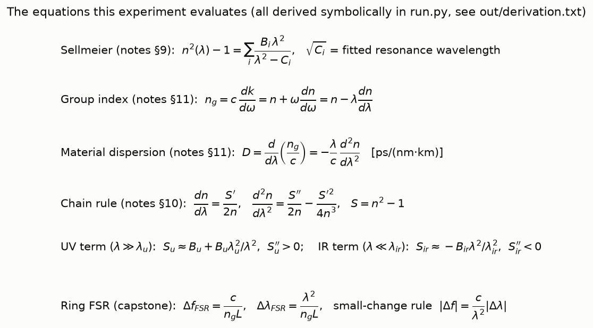

Phase index and group index. n_g sits above n (because dn/dλ < 0 everywhere in the window) and its minimum is the zero-dispersion wavelength. For silicon, the bulk n_g ≈ 3.68 is 0.18 above n but well below the strip's n_g = 4.2: the extra 0.52 is waveguide dispersion (the mode's n_eff changes with λ because the field redistributes between core and cladding), which experiment 08 computes. The silicon panel is drawn on a 3.4–4.45 axis so that n and n_g are readable; the textbook n_eff = 2.5 is noted as text and its (wrong) FSR is compared in the bar chart further down instead of as a line that would squash the curves.

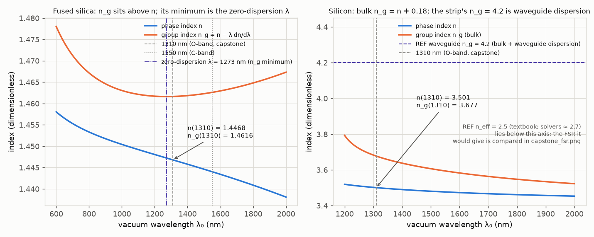

The tangent-intercept construction: n_g = n − λ dn/dλ is literally the λ = 0 intercept of the tangent to n(λ).

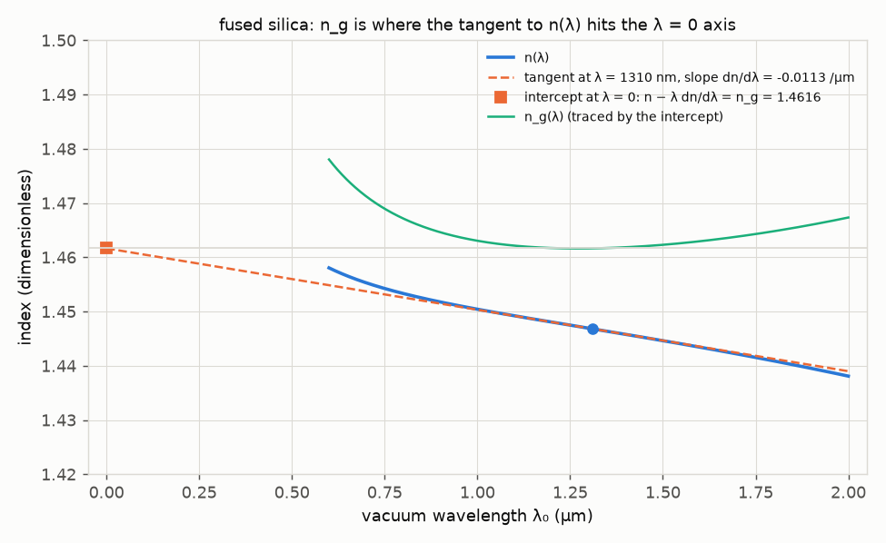
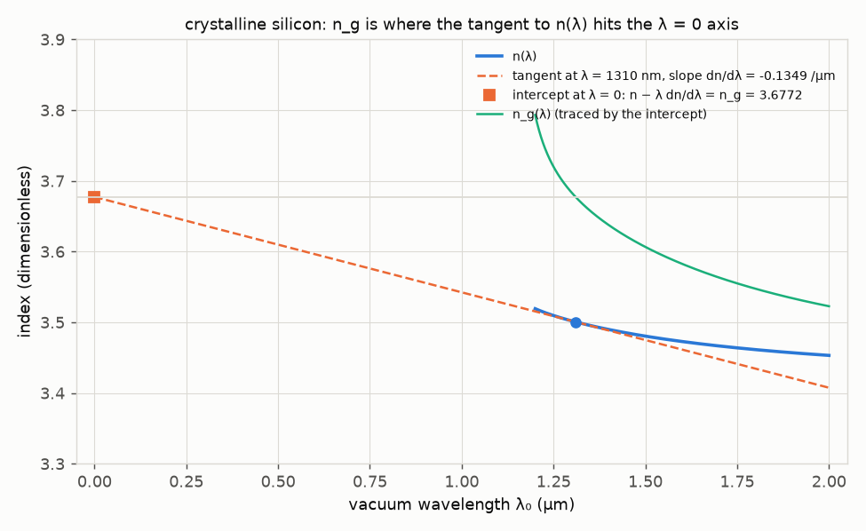

Video: [out/tangent_sliding.mp4](out/tangent_sliding.mp4) (8 s). The tangent slides from 650 to 1950 nm; the intercept (square) traces n_g(λ) in the middle panel and the slope of that trace is D in the right panel. Stills (shared legend at the bottom):

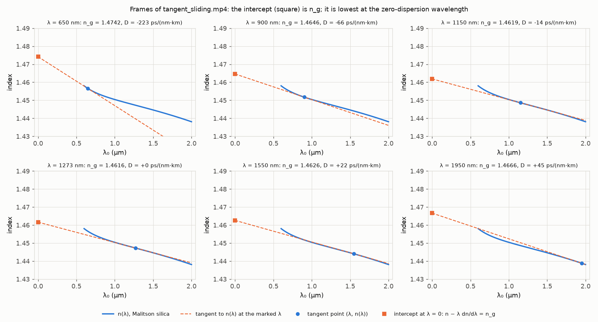

Material dispersion D vs λ. Silica crosses zero at 1272.8 nm; the O-band (1260–1360 nm) straddles the zero, the C-band sits at +22 ps/(nm·km). Silicon's D is two orders of magnitude larger and negative, which is irrelevant for a 40 µm ring but matters for long silicon waveguides.

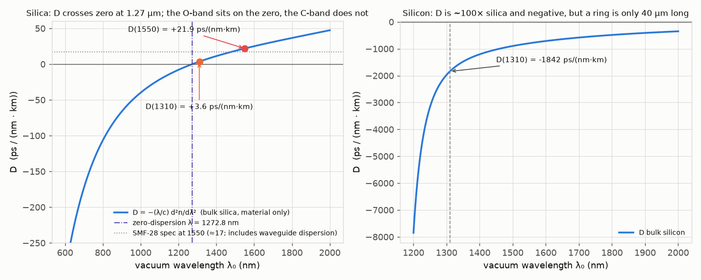

Why the ZDW exists (notes §10): the two UV terms contribute positive curvature falling as 1/λ⁴, the IR term a nearly constant negative curvature; d²n/dλ² = S''/(2n) − S'²/(4n³) crosses zero where they cancel.

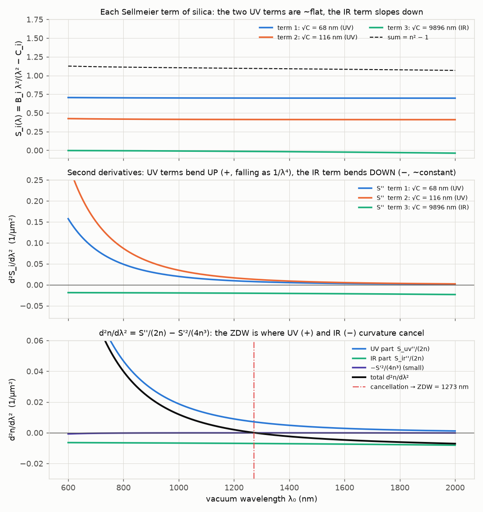

The same three terms on a log-wavelength axis (notes §8, §9): each is a pole at √C_i, and 1310 nm sits in the flat gap between the UV poles (68 nm, 116 nm) and the IR pole (9.9 µm). The tails of resonances far outside the window are the whole reason n ≠ 1 there.

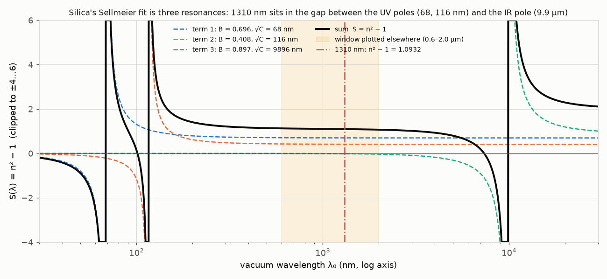

Small-change rule at 1310 nm: 1 nm ↔ 174.7 GHz, exact to 0.08 % at 1 nm and 1 % at ±13 nm; the boxed capstone conversions all come from this one number.

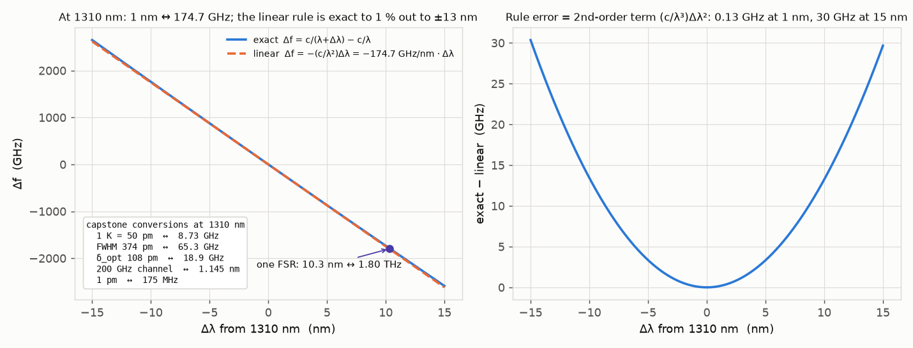

Ring FSR by index: only the waveguide group index reproduces the measured 1.8 THz (the index is in each tick label; the value labels sit clear of the dashed measured line).

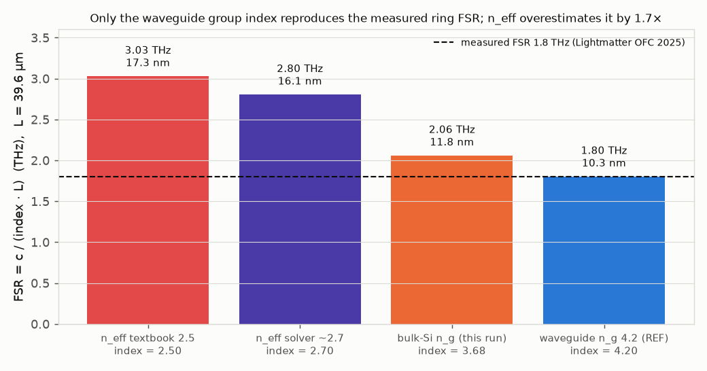

Why the O-band for a 2 km link: chromatic delay spread of a 53 Gbaud signal after 2 km of silica (material dispersion only; experiment 05 propagates the actual pulses). The solid curve uses the two-sided ±0.75 × baud = 79.7 GHz signal band that experiment 05 uses (3.3 ps at 1310 nm, 28.0 ps at 1550 nm); the dash-dot curve is the crude one-sided Δλ ↔ 53 GHz estimate (2.2 / 18.7 ps).

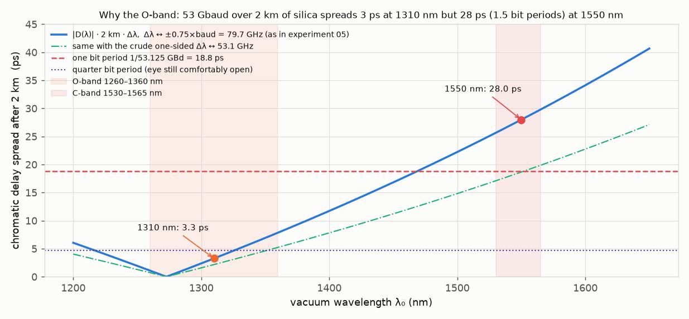

| Quantity | Computed (`out/results.json`) | Expectation (source) | Agreement |
|---|---|---|---|
| n(1310 nm), fused silica | 1.44680 | 1.4468 (Malitson, quoted in brief) | 100.00 % |
| n_g(1310 nm), fused silica | 1.46164 | 1.462 (bulk silica tables) | 99.98 % |
| dn/dλ(1310), silica | −0.01132 /µm | — | — |
| D(1310 nm), silica | +3.582 ps/(nm·km) | +3.582 ps/(nm·km) by the independent ω-route (β₂ = d²β/dω² by finite differences in ω, D = −2πc β₂/λ²; `D_silica_1310_omega_route_ps_nm_km`). Physics context: bulk silica's ≈ +3.5 ps/(nm·km) at 1310 nm is what standard fibre's waveguide dispersion (≈ −3.5) cancels to put the G.652 zero near 1310 nm | 100.00 % (3.5818 vs 3.5819) |
| D(1310) cross-check: Taylor extrapolation from the ZDW | linear S₀·(1310 − 1272.75 nm) = 0.100 × 37.25 = +3.72; second order with S₀′ = −2.15e-4 ps/(nm³·km): +3.57 ps/(nm·km) | the exact +3.58 | linear +4.0 % (the curvature of D(λ), not a discrepancy); second order −0.2 % |
| Zero-dispersion wavelength, silica | 1272.8 nm (FD root 1272.8 nm) | ≈ 1270 nm (brief, notes §10–11) | 99.78 % |
| Dispersion slope at ZDW | 0.100 ps/(nm²·km) | — | — |
| D(1550 nm), bulk silica | 21.91 ps/(nm·km) | 20–22 bulk (brief); fibre 17 includes waveguide dispersion | 95.7 % vs midpoint 21; inside the stated range |
| β₂(1310), β₂(1550), silica | −3.26, −27.9 ps²/km | β₂ = −λ²D/(2πc) | (used by experiment 05) |
| n(1310 nm), silicon | 3.5005 | 3.50 (REF.n_si) | 99.98 % |
| n_g(1310 nm), bulk silicon | 3.677 | ≈ 3.70 (Li 1980 tables) | 99.38 % |
| D(1310 nm), silicon | −1842 ps/(nm·km) | ~100× silica, negative | — |
| Small-change rule, 1310 nm | 174.69 GHz/nm (exact 1 nm step 174.56) | 174.7 GHz/nm | 100.00 % |
| FSR, n_g = 4.2, L = 39.6 µm | 1.803 THz / 10.32 nm | 1.8 THz / 10.3 nm (REF, Lightmatter) | 99.86 % / 99.82 % |
| FSR if n_eff = 2.5 were used | 3.03 THz / 17.3 nm | wrong by 1.68× | — |
| dλ_r/dT = (λ/n_g)(Γ dn_Si/dT + (1−Γ) dn_SiO₂/dT) | 49.8 pm/K | 50 pm/K (REF) | 99.56 % |
| Same with n_eff in the denominator | 83.6 pm/K | (wrong) | — |
| 2 km delay spread across ±0.75 × baud (79.7 GHz), 1310 / 1550 nm | 3.3 ps / 28.0 ps | ~27 ps at 1550 nm (brief); experiment 05's full pulse propagation 3.27 / 27.99 ps; bit period 18.8 ps | 96 % vs the brief's ~27; 99.9 % vs 05 |
| same, crude one-sided Δλ ↔ 53.1 GHz | 2.2 ps / 18.7 ps | order-of-magnitude only | see Checks (iii) |
| Capstone conversions | 50 pm/K ↔ 8.73 GHz/K; FWHM 374 pm ↔ 65.3 GHz; δ_opt 108 pm ↔ 18.9 GHz; 200 GHz ↔ 1.145 nm; 1 pm ↔ 175 MHz | `common.units` | identical formula |

**Experiments to try**

1. **Find the ZDW of silicon (there is none in the window).** In `run.py` change `lam_si = np.linspace(1.20, 2.00, 801)` to extend to 5 µm and try `brentq` on `silicon.d2n_dlam2` between 1.5 and 5 µm. It fails: silicon's fit has a *single* pole at 1.107 µm and no IR term, so its curvature never changes sign; D stays negative. Compare with the term-curvature figure to see that a ZDW needs both an up-bending and a down-bending term.
2. **Move the IR resonance** (notebook section 2). Set λ_ir = 6 µm: the ZDW drops to 978 nm; 14 µm: 1523 nm. Set B_ir = 1.4: ZDW 1145 nm. This is what dopants (GeO₂ in fibre cores) do in practice, and why dispersion-shifted fibre exists.
3. **Change the wavelength grid step of the finite-difference check**: set `h = 1e-2` instead of `1e-4` in `run.py`. The n_g check stays fine (~1e-5) but the D check degrades to 0.16 ps/(nm·km): second derivatives are where finite differences hurt and where a symbolic derivative earns its keep.
4. **Break the small-change rule.** In the notebook converter set Δλ = 10 300 pm (one FSR): the linear rule gives 1.799 THz, the exact difference 1.785 THz, a 0.8 % error. Set Δλ = 100 000 pm (out to 1410 nm): 7.6 % error. The rule is fine for everything the capstone uses (≤ one FSR).
5. **Ring length and channel count** (notebook section 3). Push L to 45 µm: the FSR shrinks to 1.59 THz = 9.1 nm and the eight channels (8.0 nm span) still fit; at L = 52 µm (7.9 nm) they no longer do and a ring would see two lasers. That is the design reason for the 6.3 µm radius.

**Capstone connection**

- **Why 1310 nm.** Lightmatter's links are ~2 km of standard fibre at 53.125 Gbaud. Bulk silica's zero-dispersion wavelength is 1273 nm, so at 1310 nm D = +3.6 ps/(nm·km) and the ±40 GHz signal band spreads only 3.3 ps over 2 km (17 % of the 18.8 ps bit period); at 1550 nm (D = +22) the same band spreads 28 ps, one and a half bit periods. The O-band is not a choice about the ring; it is a choice about the fibre, and the ring design (silicon at 1310 nm, n = 3.50, n_g(bulk) = 3.68) follows from it.
- **The FSR is a group-index quantity.** Resonance m sits at m·λ_m = n_eff(λ_m)·L, a *phase* condition, but the spacing between adjacent resonances is Δf = c/(n_g L), because n_eff itself changes with λ and n_g = n_eff − λ dn_eff/dλ absorbs that. With L = 39.6 µm and n_g = 4.2 the FSR is 1.803 THz = 10.32 nm, matching the measured 1.8 THz / 10.3 nm; using n_eff = 2.5 gives 3.03 THz, and even the solver's n_eff ≈ 2.7 (experiment 08) gives 2.80 THz. The eight 200 GHz channels (1.145 nm each, 8.0 nm span) fit inside one FSR only because n_g, not n_eff, sets it.
- **The thermal shift is a group-index quantity too.** dλ_r/dT = (λ/n_g)·dn_eff/dT with the Γ-weighted dn_eff/dT = 0.85·1.86e-4 + 0.15·1e-5 = 1.60e-4 /K gives 49.8 pm/K (REF 50). With n_eff in the denominator it would be 83.6 pm/K, 67 % too high; a controller designed to that gain would be wrong by the same factor. The same n_g enters the heater efficiency (0.44 nm/mW) and one FSR of tuning = 10.3 nm / 50 pm/K = 206 K.
- **pm ↔ GHz bookkeeping.** Every number in the locking loop can be quoted either way through 174.7 GHz/nm: 1 K = 50 pm = 8.7 GHz; the 374 pm FWHM is 65 GHz (consistent with Q = f/Δf = 229 THz / 65 GHz = 3500); the δ_opt = 108 pm bias is 19 GHz; the 200 GHz grid is 1.145 nm; the 0.1 K resolution question is 5 pm = 0.9 GHz.
- **Silicon's own material dispersion is irrelevant here.** D_Si(1310) = −1842 ps/(nm·km) sounds huge, but over one 39.6 µm lap it is 7e-5 ps/nm: the ring's spectral behaviour is entirely interference (experiment 12), not material dispersion. Material dispersion enters the capstone only through n_g.

**Checks**

- Symbolic identities: `sp.simplify(c·dk/dω − (n − λ dn/dλ)) == 0` and `sp.simplify(d(n_g/c)/dλ + (λ/c) d²n/dλ²) == 0` are asserted; the chain-rule form S''/(2n) − S'²/(4n³) is asserted after substituting S = n² − 1.
- Numeric derivatives: central finite differences with h = 1e-4 µm reproduce the lambdified n_g to 1.1e-9 and D to 4e-4 ps/(nm·km) over the whole silica grid; the ZDW from the finite-difference curvature is 1272.76 nm vs 1272.75 nm symbolic.
- Term decomposition: UV part + IR part + (−S'²/4n³) is asserted equal to the lambdified d²n/dλ² to 1e-9 on the whole grid; at the ZDW the three pieces are +0.00707, −0.00699 and −0.00009 µm⁻².
- Unit conversion of D: 1 s/m² = 1e6 ps/(nm·km) is applied once in `D_ps_nm_km`; D(1550) = 21.9 lands in the literature range for bulk silica, and β₂(1550) = −27.9 ps²/km is the textbook fibre-order value (the usual −21 ps²/km fibre figure again includes waveguide dispersion).
- The notebook re-evaluates the same `Material` objects and asserts equality with `results.json` to 1e-12. Because `run.py` rebuilds and re-executes the notebook at the end of every run, this assertion is exercised on every run (a stale notebook after a parameter change in `run.py` or `sellmeier.py` is not possible unless the notebook step is skipped by hand); the executed notebook has 11 code cells (the `interact(convert, …)` slider is its own tagged cell), 0 error outputs when all cells execute.
- D(1310) against an independent route: the headline expectation is the frequency-domain evaluation β₂ = d²β/dω² (central differences in ω, relative step 1e-3, on β = n·ω/c) converted with D = −2πc β₂/λ²; it shares only the Sellmeier table with the λ-route and agrees to 100.00 % (3.5818 vs 3.5819; D(1550) 21.9118 both ways). The linear extrapolation S₀·(λ − ZDW) = 3.72 ps/(nm·km) is kept only as a cross-check: its 4 % excess over the exact 3.58 is the curvature of D(λ) (concave over 1273–1310 nm, S₀′ = −2.15e-4 ps/(nm³·km)), and the second-order Taylor value 3.57 recovers all but 0.2 % of it.
- Known limitations. (i) Sellmeier fits are real and lossless: nothing here says anything about absorption (notes §6, §9); silicon's fit has its pole at the band edge and is only used above 1.2 µm (Salzberg–Villa was fitted 1.36–11 µm, so the 1.2–1.36 µm stretch is a mild extrapolation; n(1310) = 3.5005 still matches Li's tables to 0.1 %). This is a deliberate departure from the brief's 0.6–2.0 µm range for silicon: below the 1.107 µm pole the fit is meaningless and real silicon absorbs (band gap 1.12 eV ↔ 1.1 µm), so only silica is plotted over the full 0.6–2.0 µm. (ii) Everything is *bulk material* dispersion; the SOI strip's n_eff, n_g = 4.2 and Γ come from mode solvers (08), and the fibre's 17 ps/(nm·km) includes waveguide dispersion, so the bulk D(1550) = 21.9 is expected to be higher than the fibre spec. (iii) The 2 km delay-spread numbers are |D|·L·Δλ with Δλ from the small-change rule, not a pulse propagation. The headline uses the two-sided ±0.75 × baud = 79.7 GHz signal band (the ±f_3dB of the electro-optic filters in experiment 05) and reproduces 05's full-propagation 3.27 / 27.99 ps to 0.1 % and the brief's ~27 ps; the crude one-sided Δλ ↔ baud estimate (2.2 / 18.7 ps) is shown alongside as the dash-dot curve so the dependence on the spectral-width convention is visible. Either way, the message is unchanged: 1310 nm keeps the eye open and 1550 nm does not. (iv) The thermal-shift formula uses REF's Γ = 0.85 weighting, which is the textbook estimate; experiment 08 recomputes dn_eff/dT with a solver. (v) The reference n_eff = 2.5 is the textbook value; solvers give ≈ 2.7 (08). Nothing in this experiment depends on n_eff except the "what if you used n_eff" bars, which are there to show the error. (vi) Runtime: the headless part (figures, video, tables, JSON) takes about a minute; the notebook re-execution is load-sensitive and can take many minutes on a busy machine (11 minutes were observed with three concurrent Meep runs, and the intermittent widget-cell messaging stall described under the Jupyter tool is bounded by the 60 s per-cell timeout, one retry and the widget-free third attempt: worst case about 4 minutes), so `SKIP_NOTEBOOK=1` exists to keep a re-run inside the budget when needed; the notebook's saved outputs then lag `results.json` until the next full run.

**Files**

- `run.py`: headless entry point; regenerates `out/` and then rebuilds and executes `explore.ipynb` (≈ 100 s in total on an idle laptop; `SKIP_NOTEBOOK=1` skips the load-sensitive notebook step). Run with `cd experiments/04_sellmeier_dispersion && ../../.venv/bin/python run.py`.
- `sellmeier.py`: Sellmeier coefficient tables, the sympy model, `Material` (lambdified n, dn/dλ, n_g, d²n/dλ², D, β₂), term-by-term helper, small-change rule.
- `make_notebook.py`: builds `explore.ipynb` with nbformat.
- `explore.ipynb`: interactive notebook (kernel `photonics-sims`), executed with outputs saved; regenerated by `run.py` on every run.
- `README.md`: this file.
- `out/derivation.txt`: the sympy derivation log (section 1).
- `out/results.txt`: the full printed log of a run, including the headline table (written before the notebook step and again after it).
- `out/results.json`: every computed number, the `headline` block (value / expected / agreement / source), versions, runtime (`runtime_seconds` for figures/video/tables, `notebook_status`, `notebook_seconds`, `runtime_seconds_total_with_notebook`).
- `out/tools.json`: the tool descriptions above in machine-readable form.
- `out/equations.png`: the equations implemented, rendered with mathtext.
- `out/n_and_ng.png`: n and n_g vs λ for silica and silicon with the 1310 / 1550 nm markers, the ZDW and the REF n_g = 4.2 line (all in the legend; n_eff = 2.5 is noted as text so the silicon axis can stay at 3.4–4.45).
- `out/tangent_intercept_silica.png`, `out/tangent_intercept_silicon.png`: the tangent-intercept construction of n_g at 1310 nm.
- `out/tangent_sliding.mp4`, `out/tangent_sliding_frames.png`: the 8 s video and its contact sheet (six stills, shared legend).
- `out/dispersion_D.png`: D vs λ for both materials.
- `out/term_curvature.png`: each Sellmeier term, its second derivative, and the UV/IR decomposition of d²n/dλ².
- `out/sellmeier_resonances.png`: the three poles on a log-wavelength axis.
- `out/small_change_rule.png`: exact vs linear Δf(Δλ) at 1310 nm with the capstone conversions.
- `out/capstone_fsr.png`: FSR from four candidate indices (index in the tick labels) vs the measured 1.8 THz.
- `out/oband_spread_2km.png`: chromatic delay spread after 2 km vs wavelength for 53 Gbaud (±0.75 × baud band as in 05, plus the crude one-sided estimate).
- `out/silica_dispersion_table.csv`, `out/silicon_dispersion_table.csv`: λ (nm), n, n_g, D (ps/(nm·km)), β₂ (ps²/km).
