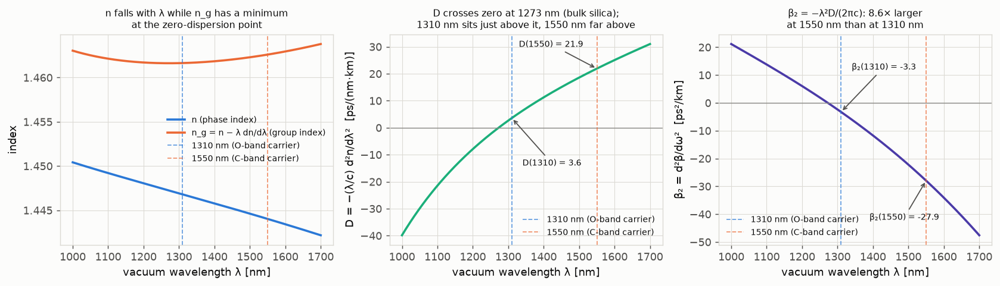
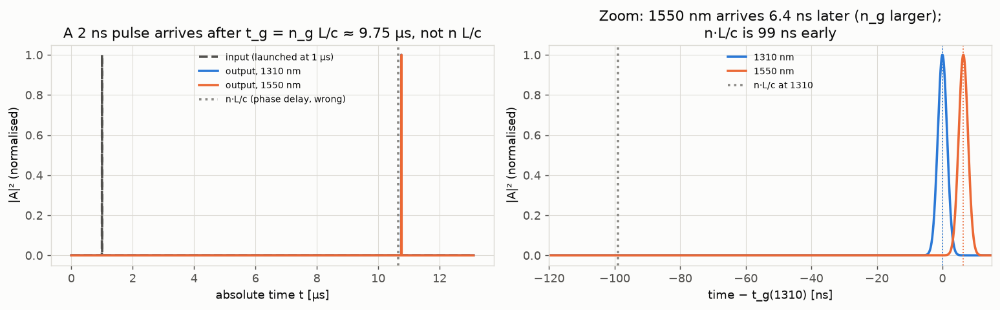
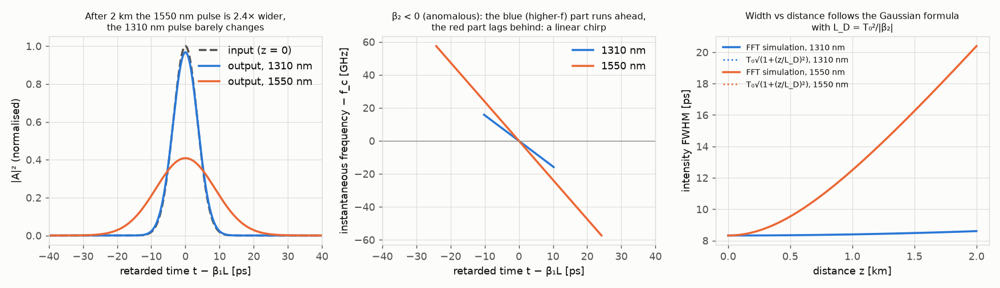
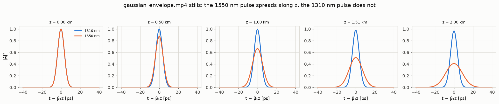
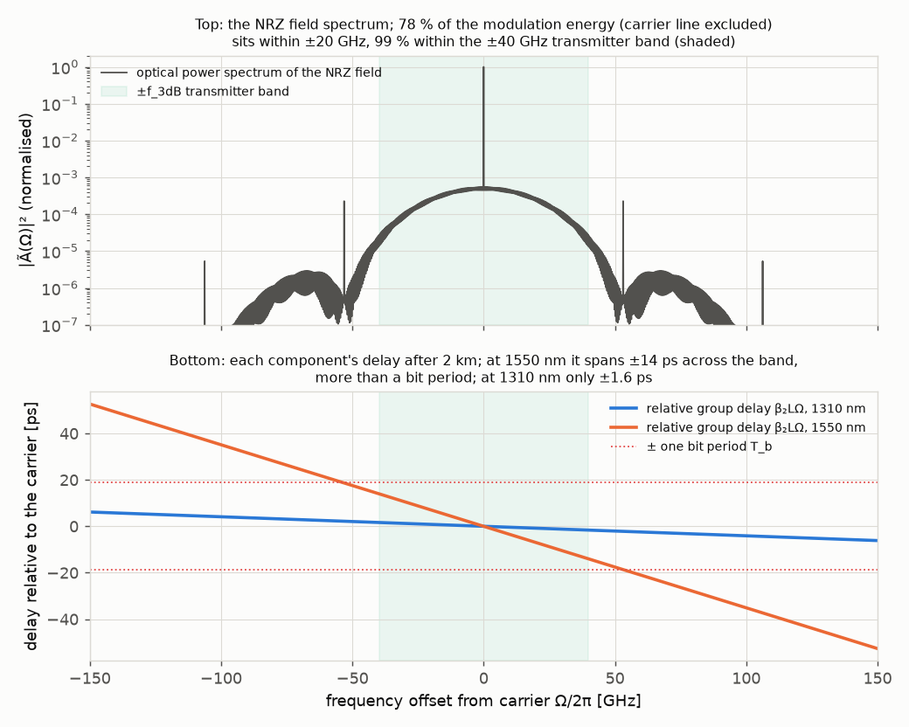
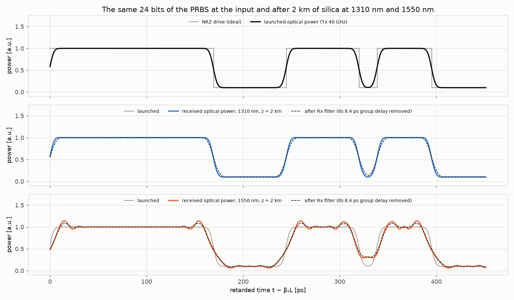
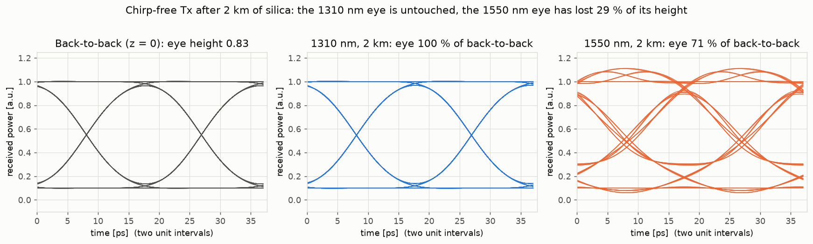
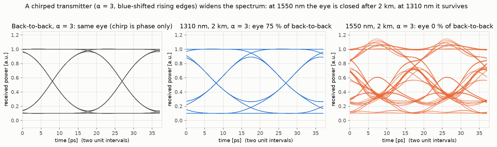
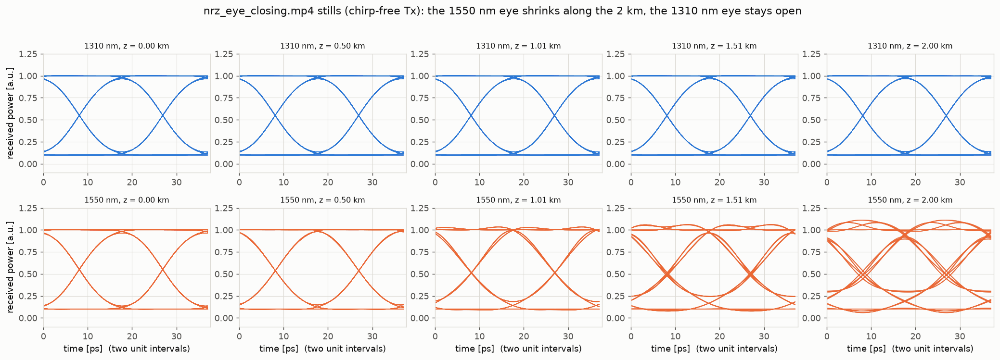
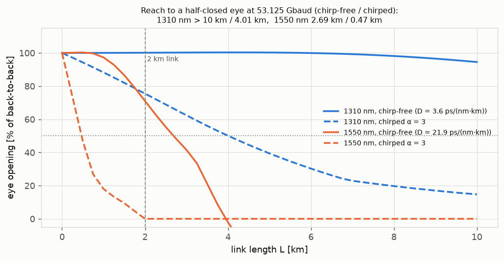

# 05. Pulse dispersion: how a pulse is delayed and distorted

**Concept** (docs/NOTES.md section 12, built on sections 9 to 11)

Section 12 of the notes says that a pulse is a sum of frequencies, that after a length L each frequency
picks up its own phase e^{−jβ(ω)L}, and that when β(ω) is expanded around the carrier the constant term
rotates the carrier, the linear term β₁L is a pure delay, and the quadratic term ½β₂Ω²L is a
frequency-dependent delay that reshapes the pulse. That is a statement about an integral. This experiment
*does* the integral numerically with the FFT, using the exact Sellmeier β(ω) of fused silica (no Taylor
truncation), and lets you watch what the equations only assert: a 2 ns pulse arriving after n_g L/c and
not n L/c (99 ns apart over 2 km); a 5 ps Gaussian keeping its shape at 1310 nm and spreading to 2.4× its
width at 1550 nm with a visible linear chirp across it; and a 53.125 Gbaud NRZ data stream whose eye
diagram is untouched after 2 km at 1310 nm and degraded at 1550 nm. Every simulated number is compared
with the closed-form result from the notes (β₁ = n_g/c, β₂ = −λ²D/(2πc), Gaussian width
T₀√(1+(L/L_D)²)). Only *material* dispersion of bulk silica is modelled; the waveguide contribution of a
real fibre is stated but not included.

**Tools used**

### numpy (FFT) 2.4.6

*What it is:* The array library of scientific Python; `numpy.fft` is its fast Fourier transform, used
everywhere a signal is moved between the time domain and the frequency domain.

*What I used it for here:* The split-into-frequencies propagation of notes section 12: FFT the input
field A(t), multiply each frequency component Ω by exp(−j[β(ω_c+Ω) − β₀ − β₁Ω]L) with the exact Sellmeier
β(ω) (retarded frame), or by exp(−jβ(ω)L) (absolute frame, to see the delay itself), inverse FFT. Also the
NRZ transmitter/receiver filtering (all in the frequency domain) and the eye-diagram folding.

*Result:* Gaussian intensity FWHM after 2 km at 1550 nm: 20.39 ps from the FFT vs 20.39 ps from
T₀√(1+(L/L_D)²) (99.9995 % agreement); at 1310 nm 8.60 ps vs 8.60 ps (99.9996 %). Group delay at 1310 nm
measured 9.75101 µs vs β₁L = n_g L/c = 9.75101 µs (100.0000 %). Chirp-free NRZ eye opening after 2 km:
100 % of back-to-back at 1310 nm, 71 % at 1550 nm; with a chirped transmitter (α = 3): 75 % at 1310 nm,
closed (0 %) at 1550 nm.

*How to observe it:* `cd experiments/05_pulse_dispersion && ../../.venv/bin/python run.py` (about 1 to
1.5 minutes depending on machine load; the measured time is written to `runtime_s` in `out/results.json`).
Look at `out/gaussian_broadening.png`, `out/group_delay.png`, `out/eye_diagrams.png`,
`out/eye_diagrams_chirped.png`, `out/eye_vs_length.png`. Change `L_LINK`, `T0_GAUSS`, `TX_F3DB`,
`ALPHA_CHIRP` or `BAUD` at the top of `run.py` and re-run; `propagate_retarded()` is the ten-line core.

### sympy 1.14.0

*What it is:* A symbolic mathematics library: exact algebra, differentiation and integration on
expressions, with `lambdify` to turn a symbolic result into a fast numpy function.

*What I used it for here:* Differentiating the Sellmeier n(λ) exactly (in `silica.py`) to obtain
n_g = n − λ dn/dλ, D = −(λ/c) d²n/dλ² and β₁, β₂, β₃ = dᵏβ/dωᵏ of β(ω) = n(ω)ω/c, so that no
finite-difference error enters the propagator and the notes' formulas can be checked against each other.

*Result:* n(1310) = 1.4468 (notes: 1.4468, 100.00 %), n_g(1310) = 1.4616, n_g(1550) = 1.4626,
D(1310) = 3.58 ps/(nm·km), D(1550) = 21.91 ps/(nm·km) (bulk expectation 20 to 22: inside the range),
β₂(1550) = −27.95 ps²/km, equal to −λ²D/(2πc) to 100.0000 %; β₃ = 0.08 and 0.15 ps³/km (shown to be
negligible over 2 km); zero-dispersion wavelength of bulk silica 1272.8 nm (expected about 1270 nm, 99.8 %).

*How to observe it:* `out/silica_dispersion.png` and the first block of `out/results.txt`;
`../../.venv/bin/python -c "import silica; print(silica.symbolic_summary())"` prints the derivative chain.
Edit `B_SELL` / `C_SELL_UM2` in `silica.py` to try another glass.

### scipy (signal + optimize) 1.18.1

*What it is:* SciPy's signal-processing module gives filter design (Bessel, Butterworth), frequency
responses and test sequences such as maximal-length PRBS; `scipy.optimize` holds the root finders.

*What I used it for here:* `signal.max_len_seq(9)` for the 511-bit PRBS, `signal.bessel(4, ...)` +
`signal.freqs()` for the receiver's 4th-order Bessel low-pass (0.75 × baud) evaluated on the FFT grid (the
same response gives the filter's DC group delay, which the waveform figure removes so it is not mistaken for a
dispersion delay), `optimize.brentq` for the zero-dispersion wavelength of the Sellmeier fit and for the exact length at which
the eye opening crosses 50 % (the 250 m sweep grid only brackets the crossing; brentq then solves the
eye-opening function itself to 1 m, so the quoted reach is not limited by the grid).

*Result:* Back-to-back eye height 0.830 (of P₁ = 1); Rx Bessel DC group delay 8.44 ps = 0.45 UI. Length at
which the eye is half closed (brentq, 1 m
tolerance): 1310 nm > 10 km chirp-free / 4.01 km chirped; 1550 nm 2.69 km chirp-free / 0.47 km chirped.
Zero-dispersion wavelength 1272.8 nm.

*How to observe it:* `out/nrz_waveforms.png`, `out/nrz_spectrum_delay.png`, `out/eye_diagrams.png`,
`out/eye_vs_length.png`. Change `RX_F3DB`, `EXT_RATIO_DB` or `PRBS_ORDER` in `run.py` and re-run.

### matplotlib 3.11.2 (+ FFMpegWriter / ffmpeg 9.0.1)

*What it is:* The standard Python plotting library; its `animation` module drives ffmpeg to encode a
sequence of redrawn frames into an mp4.

*What I used it for here:* All figures, the eye diagrams (a `LineCollection` of folded traces), and two
videos: the Gaussian envelope and its chirp evolving along z, and the NRZ waveform plus eye diagram
evolving along z.

*Result:* `out/gaussian_envelope.mp4` (8 s, 240 frames) and `out/nrz_eye_closing.mp4` (6.7 s, 200 frames)
with contact sheets `out/gaussian_envelope_frames.png` and `out/nrz_eye_closing_frames.png`; 10 PNG
figures in total (the count in `out/tools.json` is taken from the `out/` folder at the end of the run).

*How to observe it:* Open `out/gaussian_envelope.mp4`: watch the orange (1550 nm) pulse widen while the
blue (1310 nm) pulse keeps its shape, and the lower panel show the linear chirp growing. Open
`out/nrz_eye_closing.mp4`: the right-column eye at 1550 nm shrinks along the 2 km while the 1310 nm eye
does not move. `N_FR` / `N_FR2` set the frame counts, `FPS` the frame rate.

**What the simulation does**

Symbols: λ vacuum wavelength, ω = 2πc/λ, ω_c the carrier, Ω = ω − ω_c the offset from the carrier,
β(ω) = n(ω)ω/c the propagation constant of bulk silica (rad/m), β₁ = dβ/dω (s/m), β₂ = d²β/dω² (s²/m),
n_g = cβ₁ the group index, D = −(λ/c) d²n/dλ² the dispersion parameter (ps/(nm·km)), L the length,
A(t) the complex envelope of the field so that E(t) = Re{A(t) e^{jω_c t}} and the optical power is |A|².

1. **Material (silica.py, notes 9 to 11).** n²(λ) − 1 = Σ B_i λ²/(λ² − C_i) with Malitson's fused-silica
   coefficients B = (0.6961663, 0.4079426, 0.8974794), √C = (0.0684043, 0.1162414, 9.896161) µm. sympy
   differentiates this exactly to give n_g, D, β₁, β₂, β₃. The code checks the notes' identities
   β₁ = n_g/c and β₂ = −λ²D/(2πc) numerically.
2. **Propagator (notes 12).** A_out(t) = IFFT{ FFT{A_in(t)} · exp(−j[β(ω_c+Ω) − β₀ − β₁Ω] L) }. This is
   the notes' frequency integral with the *exact* β(ω) and with the carrier phase β₀L and the pure delay
   β₁LΩ subtracted, i.e. the result is shown in the retarded time t' = t − β₁L. A second propagator keeps
   only ½β₂Ω²L (the notes' truncation) so the two can be compared, and a third keeps everything including
   β₁ so the delay itself can be seen.
3. **Gaussian pulse.** A_in = exp(−t²/(2T₀²)) with T₀ = 5 ps (intensity FWHM 2√(ln 2) T₀ = 8.33 ps),
   propagated to L = 2000 m at 1310 nm and 1550 nm on a 0.05 ps grid of 16384 points. Measured: FWHM and
   peak of |A_out|² against the textbook Gaussian result FWHM_out = FWHM_in √(1 + (L/L_D)²) with
   L_D = T₀²/|β₂|, peak 1/√(1 + (L/L_D)²); the instantaneous frequency (1/2π) d arg A/dt to show the chirp;
   width versus z on 81 steps; and max |P_exact − P_β₂-only| to show β₃ is negligible.
4. **Group delay.** A 2 ns Gaussian launched at t = 1 µs on a 13.1 µs window is propagated in the absolute
   frame; its arrival centroid is compared with β₁L = n_g L/c and with the *phase* delay nL/c that a naive
   "light travels at c/n" argument would give.
5. **NRZ link.** A PRBS-9 (511 bits, periodic so the FFT needs no windowing) at 53.125 Gbaud
   (T_b = 18.82 ps), extinction ratio 10 dB, 32 samples per bit. Transmitter: the ideal NRZ power waveform
   through a Gaussian low-pass with 3 dB point at 0.75 × baud = 39.8 GHz (an electro-optic bandwidth), then
   the launched field is √P (chirp-free, which is what a well-biased external or ring modulator approximates).
   Receiver: |A_out|² through a 4th-order Bessel low-pass at 39.8 GHz. Being causal, that filter delays
   everything by its DC group delay τ_rx = −d(arg H_rx)/dω|₀ = 8.44 ps (0.45 UI, `nrz.rx_filter_dc_group_delay_ps`);
   the eye metric absorbs it through the best sampling phase, and `nrz_waveforms.png` removes it from the
   "after Rx filter" trace (a roll of the periodic waveform) so that trace is not mistaken for a dispersion
   delay. The eye is folded over two unit
   intervals; the eye height is the best-sampling-phase value of (lowest "1" sample − highest "0" sample),
   quoted as a fraction of the back-to-back height. The delay spread across the signal band is
   |β₂| L · 2π · (2 f_3dB), the same number as D L Δλ with Δλ = 2 f_3dB λ²/c. A sweep of L from 0 to 10 km
   in 250 m steps brackets the length at which the eye is half closed; `scipy.optimize.brentq` on the
   eye-opening function then pins that length to 1 m.
6. **Chirped transmitter (secondary scenario).** The same power waveform from a directly modulated laser
   with linewidth-enhancement factor α = 3 is modelled as A = √P exp(j(α/2) ln P), whose instantaneous
   frequency shift is (α/4π) d ln P/dt: rising edges are blue-shifted, falling edges red-shifted. The power
   waveform, and therefore the back-to-back eye, is identical; only the optical spectrum is wider.
7. **Capstone numbers.** Ring photon lifetime Q λ/(2πc), ring FWHM in GHz, the signal's optical bandwidth
   in pm, and D, the delay spread and the channel-to-channel skew across the 8-channel, 200 GHz O-band grid.
8. **Numbers for "Checks" and "Experiments to try".** So that nothing quoted below is a hand calculation,
   the script also computes: the fraction of the NRZ field's spectral energy inside ±20, ±27 and ±40 GHz
   (with and without the DC carrier line); the classic dispersion-limited reach B²|β₂|L = 0.25; the
   chirp-free eye at 10, 20, 23, 30 and 40 km at 1310 nm; the 1 ps Gaussian after 2 km; the α = −3 eye at
   1550 nm for 0.5 to 4 km; the 2 km eye and delay spread with the transmitter and receiver both widened to
   1.5 × baud (with their own back-to-back reference); and the Gaussian and eye at the zero-dispersion
   wavelength. They are in the
   `checks` and `experiments_to_try` blocks of `out/results.json` and in section 4b of `out/results.txt`.

**Results**

Bulk silica: n falls with wavelength, n_g has its minimum where D = 0 (1273 nm for bulk glass), and β₂ is
8.6× larger in magnitude at 1550 nm than at 1310 nm. That single ratio is the whole story of the O-band.

A 2 ns pulse arrives after t_g = n_g L/c = 9.751 µs, not after nL/c = 9.652 µs: over 2 km the two differ
by 99 ns, fifty pulse widths. The 1550 nm pulse arrives 6.4 ns later than the 1310 nm one because its n_g
is larger, even though its phase index n is smaller.

Left: after 2 km the 5 ps pulse is 2.4× wider at 1550 nm (peak down to 0.41) and 3 % wider at 1310 nm.
Middle: the output carries a linear chirp; with β₂ < 0 (anomalous dispersion, above the zero-dispersion
wavelength) the higher-frequency part runs ahead. Right: the FFT width tracks the textbook formula along
the whole 2 km (the dotted and solid lines coincide).

[gaussian_envelope.mp4](out/gaussian_envelope.mp4) and its stills:

Why the eye is affected. Top panel: the optical power spectrum of the NRZ field, a carrier line plus a
sinc-shaped modulation lobe; 78 % of the modulation energy (carrier line excluded) sits within ±20 GHz and
99 % within the ±40 GHz transmitter band (shaded). Bottom panel, same frequency axis: each spectral
component gets its own relative delay β₂LΩ. Across the ±40 GHz band the 1550 nm delay runs from +14 ps to
−14 ps, i.e. it spans more than the 18.8 ps bit period (dotted red lines); at 1310 nm it spans 3.3 ps.

The same 24 bits before and after 2 km, in the retarded frame (the pure delay β₁L is taken out, so a
component that arrives on time sits on top of the grey launched trace). At 1310 nm the received power
(blue) is the launched waveform with slightly softened edges; at 1550 nm (orange) the edges spread by
tens of ps and overshoot, and an isolated 0 between two 1s only dips to 0.3. The dashed "after Rx filter"
trace is shown with the Bessel filter's own 8.4 ps group delay removed, so the only shifts visible in the
figure are dispersion.

[nrz_eye_closing.mp4](out/nrz_eye_closing.mp4) and its stills:

| Quantity | Simulated (code) | Analytic expectation (notes / brief) | Agreement |
|---|---|---|---|
| n(1310 nm), silica | 1.44680 | 1.4468 (experiment 04, Malitson) | 100.00 % |
| n_g(1310 nm), n_g(1550 nm) | 1.46164, 1.46260 | n − λ dn/dλ (notes 11) | identical by construction (same symbolic derivative) |
| β₁(1310 nm) | 4875.506 ps/m | n_g/c = 4875.506 ps/m | 100.0000 % |
| D(1310 nm) | +3.58 ps/(nm·km) | small positive just above the bulk ZDW | as expected |
| D(1550 nm) | +21.91 ps/(nm·km) | 20 to 22 ps/(nm·km) bulk silica (brief) | inside the range (fibre: 17, see Checks) |
| β₂(1310 nm), β₂(1550 nm) | −3.263, −27.947 ps²/km | −λ²D/(2πc) (notes 11 to 12) | 100.0000 % |
| zero-dispersion wavelength, bulk | 1272.8 nm | about 1270 nm (brief, experiment 04) | 99.8 % |
| Gaussian FWHM out, 1310 nm | 8.605 ps | 8.605 ps = 8.326 √(1 + (2000/7661)²) | 99.9996 % |
| Gaussian FWHM out, 1550 nm | 20.391 ps | 20.391 ps = 8.326 √(1 + (2000/895)²) | 99.9995 % |
| Gaussian peak out, 1550 nm | 0.4083 | 0.4083 = 1/√(1 + (L/L_D)²) | 99.99999 % |
| energy after 2 km | 1.000000 × input | 1 (lossless, |H| = 1) | 100 % |
| max |P_exact − P_β₂-only|, 1550 nm | 7.6e−5 (of peak 1) | small: β₃ negligible | confirms the notes' truncation |
| group delay t_g, 1310 nm | 9.75101 µs | β₁L = n_g L/c = 9.75101 µs | 100.0000 % |
| phase delay nL/c, 1310 nm | 9.65204 µs | 99 ns *earlier* than the pulse | shows n_g, not n, sets the delay |
| arrival difference 1550 − 1310 | 6.381 ns | (n_g,1550 − n_g,1310) L/c = 6.381 ns | 100.00 % |
| NRZ delay spread across ±40 GHz, 1550 nm | 27.99 ps | about 27 ps (brief) vs T_b = 18.82 ps | 96.3 % |
| NRZ delay spread across ±40 GHz, 1310 nm | 3.27 ps | 17 % of a bit | as expected |
| eye opening after 2 km, chirp-free, 1310 nm | 100.1 % of back-to-back | "eye stays open" (brief) | agrees |
| eye opening after 2 km, chirp-free, 1550 nm | 71.0 % of back-to-back | "closes it" (brief) | **disagrees: degraded, not closed, see Checks** |
| eye opening after 2 km, chirped α = 3, 1550 nm | −5.8 % (closed) | closed | agrees |
| eye opening after 2 km, chirped α = 3, 1310 nm | 75.5 % | open | agrees |
| half-eye reach, chirp-free (brentq, 1 m) | 1310: > 10 km; 1550: 2.69 km | 1550 close to 2 km | consistent |
| half-eye reach, chirped α = 3 (brentq, 1 m) | 1310: 4.01 km; 1550: 0.47 km | | |
| B²\|β₂\|L = 0.25 reach (engineering rule of thumb) | 1310: 27.2 km; 1550: 3.17 km | chirp-free half-eye reach: > 10 km / 2.69 km | same order: the rule is a factor-of-order-one estimate |
| NRZ spectral energy within ±20 / ±27 / ±40 GHz, carrier line excluded | 77.6 / 90.3 / 98.6 % | most energy well inside the ±40 GHz band | explains why the eye is degraded, not closed |
| 8-channel O-band grid (1306 to 1314 nm) | D 3.21 to 3.95 ps/(nm·km); worst delay spread 3.6 ps (19 % of a bit); edge-to-edge skew 57 ps | | |

All of these are in `out/results.json` (and, in prose, `out/results.txt`).

**Experiments to try**

The expected outcomes below are not guesses: `run.py` computes each of them on every run and writes them to
the `experiments_to_try` block of `out/results.json` (key names in brackets), so you can check your
modified run against the stock numbers.

1. `L_LINK = 10000.0`: at 10 km the chirp-free 1550 nm eye is fully closed (0 %) while 1310 nm is still
   95 % open (`exp1_eye_opening_10km_chirp_free_*`, also visible in `eye_vs_length.png`). Extend the sweep
   (`L_sweep = np.linspace(0, 40e3, 41)`) to see the chirp-free 1310 nm eye at 60 % at 20 km, half closed
   at 23 km, 21 % at 30 km and gone (0 %) by 40 km (`exp1_eye_opening_1310_chirp_free_vs_km`): material
   dispersion alone is what separates the 2 km, 10 km and 40 km reach classes of 1310 nm optics.
2. `T0_GAUSS = 1e-12`: a 1 ps pulse has a 25× shorter L_D (L_D ∝ T₀²: 306 m at 1310 nm, 36 m at 1550 nm,
   `exp2_L_D_m_*`); after 2 km the 1.67 ps pulse is 11.0 ps wide at 1310 nm and 93.1 ps at 1550 nm
   (`exp2_fwhm_out_2km_ps_*`), so the "1310 is safe" conclusion depends on the pulse being long. Shorter
   pulse = wider spectrum = more spread; the *delay* t_g does not change.
3. `ALPHA_CHIRP = -3.0`: flipping the sign of the chirp makes the edges *sharpen* first: the 1550 nm eye
   opens to 108 % of back-to-back at 0.5 and 1 km, is still 107 % at 2 km, then collapses to 52 % at 3 km
   and 4 % at 4 km (`exp3_eye_opening_1550_vs_km`). This is the classic "chirp with the right sign
   pre-compensates dispersion" trick; real DMLs have the wrong sign for 1550 nm standard fibre.
4. `TX_F3DB = 1.5 * BAUD` and `RX_F3DB = 1.5 * BAUD`: doubling both filter bandwidths to 79.7 GHz gives
   sharper edges and a taller back-to-back eye (0.900 instead of 0.830, `exp4_eye_height_b2b`), and the
   ±f_3dB delay spread at 1550 nm doubles to 56.0 ps (`exp4_delay_spread_2km_ps_1550`), three bit
   periods. Yet the 1550 nm eye at 2 km is 71.2 % of its own back-to-back (`exp4_eye_opening_2km_1550`),
   the same as the 71.0 % of the stock run, and 1310 nm stays at 100 %. The reason is in
   `nrz_spectrum_delay.png`: the modulation energy is set by the PRBS's sinc lobe, not by the filter edge
   (rms optical bandwidth 9.7 GHz vs 6.8 GHz, `exp4_rms_optical_bandwidth_GHz`), so the energy-weighted
   spread barely moves. This is the cleanest demonstration that the "delay spread across ±f_3dB" rule of
   thumb is a bound, not a prediction: widen the filters and it gets *less* accurate, not more.
5. `LAMS = {"1273 nm": 1272.8e-9, "1550 nm": 1550e-9}`: at the zero-dispersion wavelength β₂ = 0
   (−5e−6 ps²/km at 1272.8 nm) and the only remaining broadening is β₃ = 0.074 ps³/km; the Gaussian stays
   8.3256 ps wide at 2 km and 8.3257 ps at 10 km, and the chirp-free eye is 100.0 % at 10 km
   (`exp5_*`). Compare `beta3_effect_max_dP` in `results.json` before and after.

**Capstone connection**

The Lightmatter transmitter is an 8-channel, 200 GHz-spaced microring WDM link at 1310 nm driving 2 km of
single-mode fibre at 53.125 Gbaud. This experiment is the reason the whole system lives in the O-band:

- Bulk silica has D = 3.6 ps/(nm·km) at 1310 nm and 21.9 at 1550 nm (β₂ ratio 8.6). Over 2 km the
  simulated chirp-free NRZ eye is untouched at 1310 nm (100 % of back-to-back) and loses 29 % of its
  height at 1550 nm; with a chirped source the 1550 nm eye is closed at 2 km while 1310 nm survives.
  A real fibre's waveguide dispersion moves the zero-dispersion point from 1273 nm to about 1310 nm, so
  the real O-band numbers are *better* than this bulk-glass model, and the C-band ones slightly better
  too (17 instead of 22 ps/(nm·km)); the qualitative conclusion does not move.
- Across the 8-channel grid (1306 to 1314 nm) D only varies from 3.2 to 4.0 ps/(nm·km), so every
  channel sees essentially the same, negligible, penalty (worst-channel delay spread 3.6 ps = 19 % of the
  18.8 ps bit). The channels arrive 57 ps apart edge to edge, which is irrelevant because each channel has
  its own receiver.
- The modulated signal occupies 456 pm (double-sided, ±40 GHz) of optical bandwidth at 1310 nm. The ring
  resonance is 374 pm wide (FWHM, 65 GHz) and the laser is parked δ_opt = 108 pm off resonance, so the
  signal band is comparable to the ring's own linewidth; the ring's photon lifetime Q/ω = 2.4 ps is the same
  order as the whole 2 km's delay spread at 1310 nm (3.3 ps). Dispersion is *not* the bandwidth limit of
  this link; the ring's linewidth and the thermal drift of 50 pm/K (the whole 374 pm FWHM is only 7.5 K of
  untracked drift) are. That is why the capstone is a wavelength-locking problem and not a
  dispersion-compensation problem.
- The group index is what fixes the delay: the pulse arrives after n_g L/c, not nL/c (99 ns apart over
  2 km). The same n_g (4.2 for the SOI strip, experiment 08) is what sets the ring's FSR = c/(n_g L) and
  every dλ/dT formula in the textbook; n_eff only sets the phase.

**Checks**

- **Identities from the notes.** β₁ = n_g/c and β₂ = −λ²D/(2πc) were computed on two independent symbolic
  routes (derivatives in ω of β, and derivatives in λ of n) and agree to 12 significant digits.
- **Gaussian benchmark.** The FFT result with the *exact* β(ω) matches the textbook Gaussian broadening
  formula (which assumes only β₂) to better than 0.001 % in width and peak at both wavelengths, and the
  difference between the exact and β₂-only propagators is at most 4.0e−4 of the peak (4.0e−4 at 1310 nm,
  7.6e−5 at 1550 nm, `gaussian.beta3_effect_max_dP_*`): β₃ and higher orders are negligible for an 8 ps
  pulse over 2 km. Energy is conserved to 1e−15 (the propagator is a pure phase).
- **Delay benchmark.** The absolute-frame propagator recovers t_g = β₁L to 1e−10 relative, and clearly
  distinguishes it from nL/c.
- **Disagreement with the brief's rule of thumb.** The brief expects the 1550 nm eye to be *closed* by a
  27 ps delay spread against an 18.8 ps bit. The simulation reproduces the spread (28.0 ps, 96 %) but finds
  the chirp-free eye 71 % open. The rule of thumb takes the delay difference across the full ±f_3dB
  transmitter band, but most of the modulation energy of a Gaussian-filtered NRZ field sits well inside it:
  77.6 % within ±20 GHz, 90.3 % within ±27 GHz and 98.6 % within ±40 GHz, counting only the modulation
  sidebands, i.e. *excluding* the DC carrier line (which holds 83 % of the total field energy, carries no
  data and is delayed by exactly β₁L; including it the fractions read 96.2 / 98.4 / 99.8 %). These are the
  `checks.spectral_energy_fraction_*` entries of `results.json`, computed from the same FFT as the top
  panel of `nrz_spectrum_delay.png`. So the *effective* spread is roughly half a bit and the penalty is a
  29 % height loss, not closure. The half-eye reach of 2.69 km is consistent with the classic engineering
  limit B²|β₂|L ≲ 0.25, which the code evaluates to 3.17 km at 1550 nm and 27.2 km at 1310 nm
  (`checks.B2_beta2_L_quarter_reach_km_*`). What actually closes 1550 nm links at 2 km in practice is
  transmitter chirp, which the secondary scenario shows: with α = 3 the spectrum is 3× wider (rms
  6.8 → 21.6 GHz) and the 1550 nm eye is closed (−6 %) at 2 km, half closed already at 0.47 km. Both
  statements are reported as computed.
- **Reach precision.** The length sweep has a 250 m step, which by itself would only justify one decimal.
  Every quoted reach is therefore refined with `scipy.optimize.brentq` on the eye-opening function between
  the two bracketing sweep points, to a 1 m tolerance (`reach_root_tolerance_m` in `results.json`): 2687 m,
  4008 m and 468 m for the three finite cases.
- **Receiver filter delay.** The 4th-order Bessel receiver filter is causal and delays the detected
  waveform by its DC group delay, 8.44 ps = 0.45 UI (computed from the same `signal.freqs()` response as
  the filter itself, `nrz.rx_filter_dc_group_delay_ps`). This is not a dispersion effect: it is identical
  at both wavelengths and at z = 0. The eye metric is insensitive to it (best sampling phase), and
  `nrz_waveforms.png` removes it from the dashed trace so the figure shows dispersion only.
- **Eye height slightly above 100 %** (100.1 % at 1310 nm, chirp-free) is real, not an error: the tiny
  β₂ at 1310 nm marginally sharpens the edges for one sampling phase; the effect is inside the 1/32-UI
  sampling-phase resolution of the eye metric.
- **Limitations.** Material dispersion of bulk silica only: no waveguide dispersion (moves the ZDW to
  about 1310 nm in G.652 fibre and D(1550) to 17), no loss, no polarization-mode dispersion, no
  nonlinearity, no noise (eye height is deterministic ISI only, so "reach" here means dispersion-limited
  reach, not a BER). The transmitter and receiver filters are idealised (Gaussian and Bessel); the
  extinction ratio (10 dB) and bandwidths (0.75 × baud) are assumptions, not Lightmatter numbers. The
  chirp model A = √P exp(j(α/2) ln P) is the standard adiabatic+transient DML approximation and α = 3
  is a typical value, not a measurement. The PRBS is periodic (511 bits) so the FFT is exact; the eye
  metric uses the known bit pattern.

**Files**

- `run.py`: headless entry point; wipes `out/` and regenerates everything (about 1 to 1.5 minutes).
- `silica.py`: Malitson Sellmeier fit for fused silica with exact sympy derivatives (n, n_g, D, β, β₁, β₂,
  β₃) and the zero-dispersion root finder.
- `README.md`: this file.
- `out/silica_dispersion.png`: n, n_g, D and β₂ versus wavelength with 1310 and 1550 nm marked and annotated
  on every panel.
- `out/gaussian_broadening.png`: input/output envelopes, chirp, and width versus z against the analytic formula.
- `out/gaussian_envelope.mp4`, `out/gaussian_envelope_frames.png`: the Gaussian envelope and chirp along z.
- `out/group_delay.png`: the 2 ns pulse arriving at n_g L/c, with nL/c shown for contrast.
- `out/nrz_waveforms.png`: 24 bits of the PRBS at the input and after 2 km at both wavelengths, with the
  Rx-filtered trace shown with the filter's own group delay removed.
- `out/nrz_spectrum_delay.png`: the NRZ optical spectrum (top) and the relative group delay β₂LΩ of each
  component at both wavelengths (bottom), on a shared frequency axis.
- `out/eye_diagrams.png`: back-to-back, 1310 nm and 1550 nm eyes after 2 km (chirp-free transmitter).
- `out/eye_diagrams_chirped.png`: the same with the α = 3 chirped transmitter.
- `out/nrz_eye_closing.mp4`, `out/nrz_eye_closing_frames.png`: waveform and eye versus z at both wavelengths.
- `out/eye_vs_length.png`: eye opening versus link length, chirp-free and chirped, both wavelengths.
- `out/results.json`, `out/results.txt`: every number above (machine-readable and as the run log).
- `out/tools.json`: the tool descriptions above, for the top-level TOOLS.md.
- `__pycache__/`: Python bytecode cache created when `run.py` imports `silica.py` (safe to delete).
