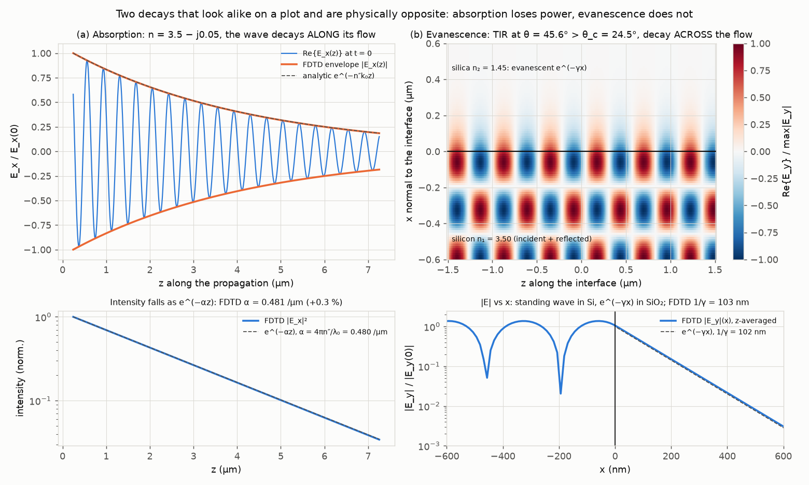
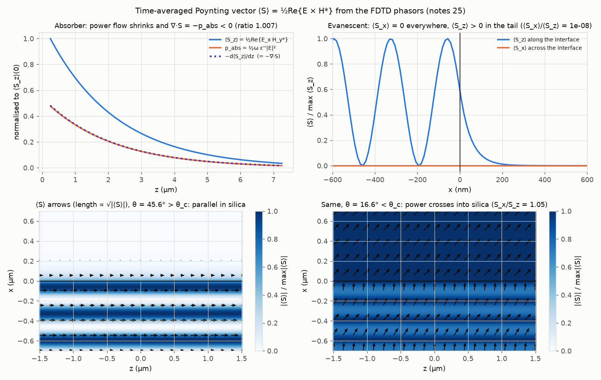
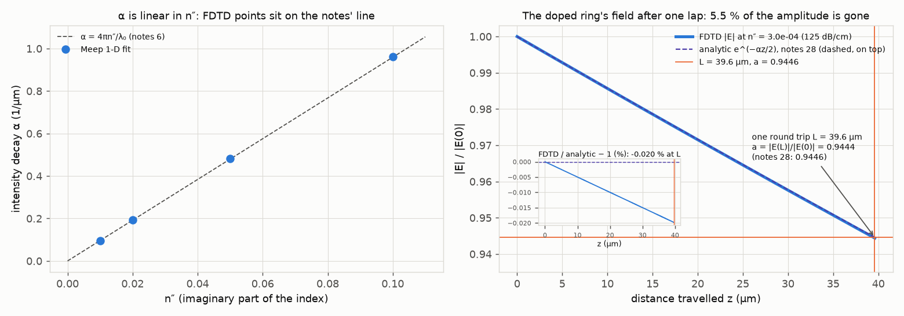
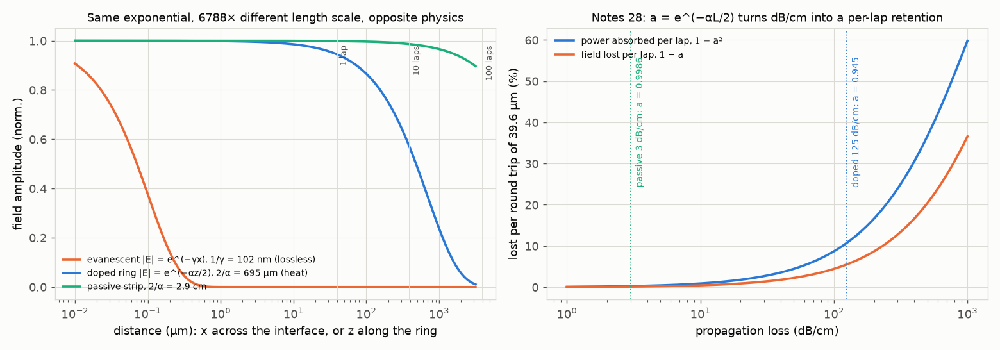
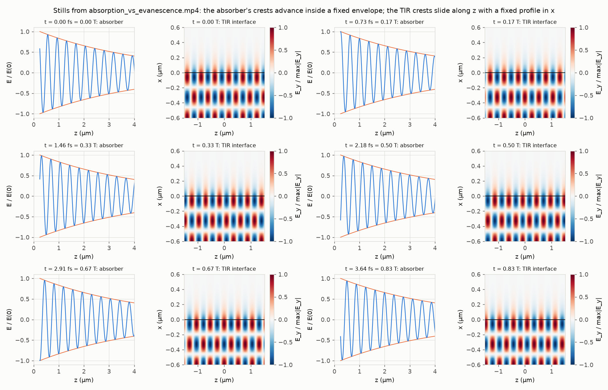

# 06. Absorption versus evanescence

**Concept** (docs/NOTES.md §6 complex index and α = 4πn″/λ₀; §24 total internal reflection; §25 Poynting vector and the evanescent-field statement, including the "evanescent confinement versus material absorption" table; §28 round-trip retention a = e^(−αL/2); the axis notation of §1.)

A guided field decays exponentially in two completely different places. Along the guide, in a lossy (doped) ring, the field goes as e^(−αz/2): the material has ε″ > 0 and the lost energy becomes heat. Across the guide, in the silica cladding, the field goes as e^(−γx): nothing is lost, the energy stays electromagnetic and keeps moving along z. On a log plot of |E| against distance both are straight lines, so the equations alone make them look like the same thing with different slopes. This experiment lets you see that they are not. Meep computes the actual E and H fields for both situations, and from those the time-averaged Poynting vector ⟨S⟩ = ½Re{E × H*}. In the absorber ⟨S_z⟩ shrinks along z and its negative gradient equals the local heating p_abs = ½ωε″|E|² point by point (∇·S = −p_abs). At the Si/SiO₂ interface beyond the critical angle, ⟨S_x⟩ across the interface is zero to one part in 10⁸ while ⟨S_z⟩ along it is positive everywhere in the tail, and H_z sits exactly 90° out of phase with E_y, which is *why* it is zero (that phase is the one result the periodic cell does not impose, see Checks). The animation shows the physical field Re{Ẽe^{jωt}}: the absorber's crests advance inside an envelope that shrinks and never moves; the evanescent crests slide along the interface inside a profile across x that is frozen. The numbers are the capstone's: 125 dB/cm turns into n″ = 3.0 × 10⁻⁴, a per-lap field retention a = 0.9446 (measured by FDTD over exactly one 39.6 µm round trip: 0.9444), and a 102 nm evanescent tail that is 6800 times shorter than the 695 µm over which the doped ring's field dies.

**Tools used**

### Meep (pymeep, FDTD) 1.34.0

*What it is:* Meep is MIT's open-source FDTD electromagnetic solver. It steps Maxwell's curl equations forward in time on a Yee grid, with materials described by ε (including conductivity and dispersion), PML absorbing boundaries and Bloch-periodic boundaries, and it can Fourier-transform the running fields to get single-frequency phasors. It is the standard free tool for simulating photonic components (waveguides, rings, couplers, scattering, absorption) with no approximation beyond the grid.

*What I used it for here:* two deliberately tiny problems whose answers are known exactly, so the solver's fields can be trusted for the Poynting-vector demonstration. (1) A 1-D cell (only z) filled with n = n′ − jn″. Meep writes loss as a conductivity, ε(ω) = ε_∞(1 + iσ_D/ω) in its e^{−iωt} convention, so `sims.meep_lossy_medium` sets ε_∞ = n′² − n″² and σ_D = ω·2n′n″/ε_∞. A narrow Gaussian pulse (fwidth 5 %) at f = 1/1.31 µm⁻¹ and a DFT monitor give the steady-state phasors E_x(z), H_y(z), for a visual case n″ = 0.05 (7.0 µm of monitor, from 0.25 to 7.25 µm past the source plane, resolution 100 px/µm), for a sweep n″ = 0.01, 0.02, 0.05, 0.10, and for the doped ring's own n″ = 3.0 × 10⁻⁴ over a monitor exactly 39.6 µm long (one round trip). (2) A 2-D cell (Meep x-y; the notes' z runs along the interface and the notes' x across it, see the axis bridge in `sims.py`), silicon in the lower half, silica in the upper, Bloch-periodic along the interface with k_z = n_eff·k₀. A line source in the silicon with amplitude e^{jβz} launches a plane wave at θ = asin(n_eff/n₁). With n_eff = 2.5 (θ = 45.6°) and 2.7 (θ = 50.5°, the 08 solver's value) this is beyond the critical angle 24.5° and the silica sees only the evanescent tail; with n_eff = 1.0 (θ = 16.6°) the wave refracts and power crosses. Resolution 80 px/µm, PML 1 µm on the two faces normal to the interface, 3 µm of interface. The DFT phasors E_y, H_x, H_z are conjugated to move from Meep's e^{−iωt} to the notes' e^{+jωt}, then ⟨S⟩ = ½Re{E × H*} is formed component by component.

*Result:* Absorber, n″ = 0.05: intensity decay α = 0.4813 /µm from FDTD versus 4πn″/λ₀ = 0.4796 /µm (+0.35 %); field decay 0.2406 /µm versus n″k₀ = 0.2398 (+0.35 %, exactly half of α); phase constant 16.806 rad/µm versus n′k₀ = 16.787 (+0.12 %, FDTD numerical dispersion, the same cause as the 0.35 %); ⟨−dS_z/dz⟩/⟨p_abs⟩ = 1.007. The sweep gives α_FDTD/α_analytic = 1.0035 at all four n″. One round trip at 125 dB/cm: |E(39.6 µm)|/|E(0)| = 0.9444 versus a = 0.9446 (−0.02 %); the fitted loss is 125.4 dB/cm. Interface, n_eff = 2.5: decay length 1/γ = 102.6 nm from FDTD versus λ₀/(2π√(n_eff² − n₂²)) = 102.4 nm (+0.20 %); cladding ⟨S_x⟩/⟨S_z⟩ = 1 × 10⁻⁸; ⟨S_z⟩/|E_y|² = 1.2524 versus β/(2ωμ) = 1.2500 (+0.19 %); H_z/E_y has phase −90.000° and magnitude 2.030 versus γ/ω = 2.037; the standing-wave nodes in the silicon (the dips of |E_y|(x) at x = −193, −458, −727, −993, −1259 nm) are spaced 266.5 nm versus λ₀/(2n₁cos θ) = 267.4 nm (−0.33 %). Solver-consistency rows (imposed by `k_point`, not physics results): max|∇·S| normalised to γ·max|S_z| is 9 × 10⁻⁸ (with every DFT quantity z-independent, dS_z/dz = 0 by construction and dS_x/dx = 0 restates ⟨S_x⟩ = 0; the sub-critical run gives 7 × 10⁻⁷ by the same measure although power crosses there), |E| varies along z by at most 1 × 10⁻¹⁰ and the unwrapped phase slope along z gives β = 11.990811655 rad/µm against the imposed n_eff·k₀ = 11.990811655 rad/µm (+1.6 × 10⁻¹³ %), with a negative slope, i.e. e^{−jβz}. n_eff = 2.7: 91.8 nm versus 91.5 nm (+0.23 %), node spacing 293.5 nm versus 294.1 nm (−0.19 %). Sub-critical n_eff = 1.0: ⟨S_x⟩/⟨S_z⟩ = 1.050 in the silica versus k_x/k_z = √(n₂² − n_eff²)/n_eff = 1.050, and H_z/E_y phase 0°: power crosses.

*How to observe it:* `cd experiments/06_absorption_vs_evanescence && ../../.meep/bin/python run.py` (about 100 s on this laptop, 75 to 130 s depending on load; prints every number, also saved to `out/results.txt` and `out/results.json`). Look at `out/fig1_absorption_vs_evanescence.png` (left column the absorber, right column the interface; the bottom row is the log plot where both decays are straight lines with the analytic slope dashed), `out/fig2_poynting.png` (top left: ⟨S_z⟩, p_abs and −d⟨S_z⟩/dz lying on top of each other; top right: ⟨S_x⟩ flat at zero while ⟨S_z⟩ has the e^(−2γx) tail; bottom: ⟨S⟩ arrows with length ∝ √|⟨S⟩|, drawn only where |⟨S⟩| exceeds 1 % of its maximum, parallel to the interface above the critical angle and crossing it below; every signed field map and |⟨S⟩| map carries a colorbar), `out/fig3_alpha_and_one_lap.png`, and the video `out/absorption_vs_evanescence.mp4`. To change a parameter edit `run.py`: `N_IM_VIS` (the visual n″), the `(label, n_eff)` tuples in section 3 (try 1.45 exactly at the critical angle, or 3.4 for a very short tail), `RES_1D`/`RES_2D` (the +0.35 % and +0.12 % shrink as resolution rises), `sweep_nim`; in `sims.py` `run_tir_interface(..., half_x_um, len_z_um)` sets the monitored window. Everything in `out/` is deleted and regenerated on each run.

### NumPy (analytic layer and fits) 2.5.3

*What it is:* NumPy is the array library underneath every Python simulation. Here it is also the "pen and paper" half of the experiment: the notes' closed-form expressions evaluated numerically, and the least-squares fits that turn FDTD field arrays into decay constants.

*What I used it for here:* α = (dB/cm)/4.343 (via `common.units.db_per_cm_to_alpha_per_um`), n″ = αλ₀/(4π) (§6), a = e^(−αL/2) (§28), γ = k₀√(n_eff² − n₂²) (§24), the critical angle, the self-heating bound for the capstone, and `np.polyfit` slopes of ln|E|² versus z (α), ln|E| versus x (γ), and unwrapped phase versus z (β, for the 1-D absorber and, as a solver consistency check, for the 2-D Bloch cell); the local minima of the z-averaged |E_y|(x) in the silicon with a parabolic sub-grid refinement (the standing-wave node spacing); `np.gradient` for ∇·S.

*Result:* 125 dB/cm → α = 28.78 /cm = 2.878 × 10⁻³ /µm, n″ = 3.000 × 10⁻⁴, a = 0.9446 versus the reference 0.945 (−0.04 %), power lost per lap 1 − a² = 10.8 %, field 1/e length 2/α = 695 µm = 17.5 laps. Passive 3 dB/cm → n″ = 7.2 × 10⁻⁶, a = 0.99863, 0.27 % per lap. 1/γ = 102.4 nm for n_eff 2.5 (matches the 102 nm quoted in the brief for experiment 02) and 91.5 nm for n_eff 2.7. Ratio of the two decay lengths: 6788. Standing-wave node spacing in the silicon at θ = 45.6°: λ₀/(2n₁cos θ) = 267.4 nm. Absorbed power at the operating point: 2.512 mW × 0.738 = 1.853 mW.

*How to observe it:* section 1 of `run.py` prints these under `== 1. Analytic numbers ==`; they are in `out/results.json` under `analytic`. Change `REF.loss_db_cm_doped` at the call to `db_per_cm_to_alpha_per_um` or the `2.7` in the `gamma_solver` line and re-run.

### matplotlib (figures + FuncAnimation/FFMpegWriter) 3.11.2

*What it is:* the standard Python plotting library. Its `animation` module renders a figure frame by frame and pipes the frames to ffmpeg to write a video.

*What I used it for here:* four figures (signed field maps in `RdBu_r` centred on zero with a colorbar in units of max|E_y|, |⟨S⟩| in `Blues` with a colorbar, `quiver` for the Poynting arrows with length ∝ √|⟨S⟩|, `SERIES` colours from `common.style`), a 6 s two-panel animation of the physical field Re{Ẽe^{jωt}} over three optical periods (T = 4.37 fs at 1310 nm) for the absorber and the TIR interface, and a 3 × 4 contact sheet of six stills.

*Result:* `out/fig1_absorption_vs_evanescence.png`, `out/fig2_poynting.png`, `out/fig3_alpha_and_one_lap.png`, `out/fig4_length_scales_and_ring_budget.png`, `out/absorption_vs_evanescence.mp4` (180 frames, 30 fps, 6.0 s, 1560 × 572, H.264), `out/absorption_vs_evanescence_frames.png`.

*How to observe it:* open the mp4. Left: the crests move to the right (+z, e^{−jβz} with e^{+jωt}) inside an orange envelope that does not move. Right: the crests slide along the interface at the same rate, while the colour intensity across x (bright in the silicon standing wave, fading over ~100 nm into the silica) is frozen. Change `N_PERIODS`, `N_FRAMES` or `FPS` in section 5 of `run.py`.

### ffmpeg / ffprobe 9.0.1

*What it is:* the universal command-line video encoder and its metadata reader; matplotlib does not encode video itself but pipes PNG frames into ffmpeg.

*What I used it for here:* encoding the mp4 and reading back its duration so the README figure is produced by the code.

*Result:* `out/absorption_vs_evanescence.mp4`, 6.000 s.

*How to observe it:* `/opt/homebrew/bin/ffprobe out/absorption_vs_evanescence.mp4`.

**What the simulation does**

Symbols (all defined once, SI internally, Meep units in the solver): λ₀ = 1310 nm vacuum wavelength; k₀ = 2π/λ₀ = 4.796 rad/µm; ω = 2πc/λ₀; ñ = n′ − jn″ the complex index (§6, engineering e^{jωt} convention, n″ > 0 is loss); α the intensity attenuation (1/m); a the field retention per round trip; L = 39.6 µm the ring round trip; n₁ = 3.50 silicon, n₂ = 1.45 silica; n_eff = β/k₀ the effective index of the guided wave; β = n_eff k₀ the propagation constant along z; γ the transverse decay constant in the cladding; θ the incidence angle inside the silicon; ⟨S⟩ the time-averaged Poynting vector; p_abs the absorbed power density.

1. *Analytic layer (§6, §24, §28).* α = 4πn″/λ₀ inverted to n″ = αλ₀/(4π), with α from 125 dB/cm: α[1/cm] = 125/(10 log₁₀e) = 125/4.343. Field retention a = e^(−αL/2) and power retention a². γ = k₀√(n_eff² − n₂²) from k_x² + β² = n₂²k₀² with β > n₂k₀ (§24). The capstone self-heating bound uses the all-pass through transmission T(δ) = 1 − (1 − T_min)/(1 + (2δ/FWHM)²), the fact that in an all-pass ring whatever does not reach the through port was absorbed inside the ring, and R_th = 8.8 K/mW.

2. *Meep 1-D absorber (§6, §25).* Cell of length 10 µm (or 42.6 µm for the one-lap run) along z, PML 1 µm at both ends, uniform material ñ = 3.5 − jn″, an E_x point source at z = −L/2 + 1.5 µm, DFT monitor from 0.25 µm past the source to 0.25 µm before the far PML. The run stops when E_x at the far end has decayed by 10⁻⁷. The conjugated phasors obey E_x(z) = E₀e^{−jn′k₀z}e^{−n″k₀z}, the §6 field. From them: intensity |E_x|² ∝ e^{−αz}; ⟨S_z⟩ = ½Re{E_x H_y*}; p_abs = ½ωε″|E|² with ε″ = 2n′n″; and the check −d⟨S_z⟩/dz = p_abs, which is Poynting's theorem ∇·⟨S⟩ = −p_abs in one dimension. Also visible in fig 2: p_abs/⟨S_z⟩ = α at every z (0.48 at the first point), because p_abs = α·(power flux) is another way to say "the flux decays as e^{−αz}".

3. *Meep 2-D interface (§24, §25).* Cell 3 µm along the interface × 7 µm across (1 µm PML + 0.5 µm margin + 3 µm monitor + 0.5 µm margin + 1 µm PML). Bloch boundary along z with k = β so the steady state is exactly f(x)e^{−jβz}: the z-dependence is imposed, any x-dependence is physics. Because it is imposed, the code re-measures it only as a consistency check of the solver and of the sign convention (z-variation of |E| and the unwrapped phase slope along z, written to `results.json` as `bloch_check_*`); the statement "no power leaves the tail" rests on ⟨S_x⟩ = 0 and the −90° phase of H_z/E_y, not on this check (and not on ∇·⟨S⟩ = 0 either, which the same boundary condition makes vanish by construction, see Checks). Source: a line of E_y (Meep E_z) in the silicon margin with amplitude e^{jβz}. In the silicon the incident and reflected waves form a standing wave in x (the two dips in fig 1 bottom right and fig 2 top right are its nodes, spaced λ₀/(2n₁cos θ) = 267.4 nm; the code locates five of them in the 1.5 µm of monitored silicon and measures 266.5 nm, −0.33 %). In the silica, for β > n₂k₀, k_x = ±jγ and the field is E_a e^{−γx}e^{−jβz} with H_x = −(β/ωμ)E_y and H_z = −(jγ/ωμ)E_y (§25). The code checks each of these: H_x/E_y = −β/ω (Meep has μ = 1), H_z/E_y = −jγ/ω (phase −90°, magnitude γ/ω), ⟨S_x⟩ = ½Re{E_y H_z*} = 0, ⟨S_z⟩ = −½Re{E_y H_x*} = (β/2ωμ)|E_y|²; it also evaluates ∇·⟨S⟩, but only as a consistency row, because in this cell it vanishes by construction. The sub-critical run (n_eff = 1.0 < n₂) is the control: the same code, and now H_z/E_y is real, ⟨S_x⟩/⟨S_z⟩ = k_x/k_z and the arrows cross the interface.

4. *Figures, animation, JSON.* Fig 1 is the two-panel picture the brief asks for, plus the log-scale row. Fig 2 is the Poynting analysis. Fig 3 is the n″ sweep and the one-lap doped-ring run. Fig 4 puts the three exponentials (evanescent, doped, passive) on one log-distance axis and plots a(dB/cm). The animation multiplies the phasors by e^{jωt} for 180 phases.

**Results**

Video: [out/absorption_vs_evanescence.mp4](out/absorption_vs_evanescence.mp4) (6 s). Stills:

| Quantity | Simulated / computed | Expectation (notes) | Agreement |
|---|---|---|---|
| α for 125 dB/cm | 28.78 /cm = 2.878 × 10⁻³ /µm | 125/4.343 /cm | exact (definition) |
| n″ of the doped ring | 3.000 × 10⁻⁴ | αλ₀/(4π), §6 | exact (definition) |
| a = e^(−αL/2), L = 39.6 µm | 0.9446 | REF 0.945 | −0.04 % |
| a from FDTD, one lap at n″ = 3.0 × 10⁻⁴ | 0.9444 | 0.9446 | −0.02 % |
| loss re-fitted from that FDTD run | 125.4 dB/cm | 125 dB/cm | +0.3 % |
| power lost per lap, doped / passive | 10.8 % / 0.27 % | 1 − a² | — |
| α, FDTD, n″ = 0.05 | 0.4813 /µm | 4πn″/λ₀ = 0.4796 /µm | +0.35 % |
| field decay, FDTD, n″ = 0.05 | 0.2406 /µm | n″k₀ = 0.2398 /µm | +0.35 % (= α/2) |
| β, FDTD, n′ = 3.5 | 16.806 rad/µm | n′k₀ = 16.787 rad/µm | +0.12 % |
| ⟨−dS_z/dz⟩ / ⟨p_abs⟩ (absorber) | 1.007 | 1 (Poynting's theorem) | +0.7 % |
| α_FDTD/α_analytic over n″ = 0.01…0.10 | 1.0035, 1.0035, 1.0035, 1.0035 | 1 | +0.35 % |
| 1/γ, n_eff = 2.5 | 102.6 nm (FDTD) | 102.4 nm | +0.20 % |
| 1/γ, n_eff = 2.7 | 91.8 nm (FDTD) | 91.5 nm | +0.23 % |
| standing-wave node spacing in Si, n_eff = 2.5 (dips of \|E_y\|(x)) | 266.5 nm | λ₀/(2n₁cos θ) = 267.4 nm | −0.33 % |
| standing-wave node spacing in Si, n_eff = 2.7 | 293.5 nm | 294.1 nm | −0.19 % |
| Bloch condition satisfied, TIR (solver consistency, imposed by `k_point`): variation of \|E\| along z | 1 × 10⁻¹⁰ | 0 | — |
| Bloch condition satisfied, TIR: β from the phase slope along z | 11.990811655 rad/µm (negative slope, e^{−jβz}) | imposed n_eff k₀ = 11.990811655 rad/µm | +1.6 × 10⁻¹³ % |
| ⟨S_x⟩/⟨S_z⟩ in the silica, TIR | 1 × 10⁻⁸ | 0 | — |
| ⟨S_z⟩/\|E_y\|² in the silica, n_eff 2.5 | 1.2524 (Meep units) | β/(2ωμ) = 1.25 | +0.19 % |
| phase of H_z/E_y in the silica, TIR | −90.000° | −90° (H_z = −jγE_y/ωμ) | exact |
| \|H_z/E_y\| in the silica, TIR | 2.030 | γ/ω = 2.037 | −0.3 % |
| max\|∇·⟨S⟩\|/(γ max\|S_z\|), TIR (solver consistency: dS_z/dz = 0 is imposed by `k_point`, dS_x/dx = 0 restates ⟨S_x⟩ = 0; sub-critical gives 7 × 10⁻⁷) | 9 × 10⁻⁸ | 0 | — |
| ⟨S_x⟩/⟨S_z⟩ in the silica, sub-critical n_eff 1.0 | 1.050 | k_x/k_z = 1.050 | +0.03 % |
| critical angle, θ for n_eff 2.5 | 24.5°, 45.6° | asin(n₂/n₁), asin(n_eff/n₁) | exact |
| decay-length ratio, absorptive (2/α) / evanescent (1/γ) | 6788 | — | — |
| capstone self-heating bound at δ_opt = 108 pm | 2.512 mW × 0.738 = 1.853 mW absorbed → 16.3 K → 816 pm | see Capstone connection | upper bound |

**Experiments to try**

1. Put the interface exactly at the critical angle: change the tuple `("tir_ref", REF.neff)` to `("critical", 1.45)`. γ → 0, so the field in the silica should stop decaying (a uniform sheet, 1/γ → ∞) and ⟨S_x⟩ stays zero: the wave skims the interface. Then try 1.5: the tail should be 1/γ = 540 nm long.
2. Make the tail as short as a real strip's: n_eff = 3.4 gives 1/γ = 68 nm. Watch the fitted value track λ₀/(2π√(n_eff² − n₂²)) and note that the arrows in the silica still run exactly parallel: the decay length changes, the zero of ⟨S_x⟩ does not.
3. Raise `N_IM_VIS` to 0.5 (a metal-like absorber). α should scale linearly (4.8 /µm, the field is gone in 2 µm) but β also starts to move because n″ is no longer ≪ n′: ε′ = n′² − n″² changes. Compare the FDTD β with n′k₀ and see the assumption "n″ small" of §6 being violated.
4. Change the round-trip length in the one-lap run (`L_rt + 3.0`, and the `i1` target) to 2L or 5L: a should go as a^N, i.e. 0.9446² = 0.892 and 0.9446⁵ = 0.752. That is the geometric series the ring transfer function of experiment 12 sums.
5. Lower `RES_1D` to 30 and `RES_2D` to 40: the +0.35 % on α and the +0.12 % on β grow (numerical dispersion is second order in the grid spacing), while the ⟨S_x⟩ = 0 and −90° results stay exact, because they follow from the symmetry of the discrete equations, not from resolution.

**Capstone connection**

The modulator ring is doped so the junction can move its resonance, and the price is 125 dB/cm of equivalent propagation loss instead of 3 dB/cm for an undoped strip. This experiment turns that number into the quantities the locking loop cares about. With n″ = 3.0 × 10⁻⁴ the field keeps a = 0.9446 of its amplitude per lap (REF 0.945, and the FDTD one-lap run gives 0.9444), so 10.8 % of the circulating power is absorbed every 39.6 µm round trip; a passive ring would lose 0.27 %. That absorption sets the intrinsic Q of the ring; together with the coupler (t = 0.945, which at critical coupling contributes exactly as much to the loaded linewidth as the round-trip loss does) it gives the loaded Q = 3500 and 374 pm FWHM of experiment 12. It is also heat deposited *inside* the ring, next to the junction: the self-heating of Chapter 9 of the textbook. Using the reference link numbers (4 dBm = 2.51 mW at the ring, T_min = 0.016, δ_opt = 108 pm) the all-pass ring absorbs 73.8 % of the input at the operating point, 1.85 mW. If every absorbed milliwatt heated the ring the way a heater milliwatt does (R_th = 8.8 K/mW) that would be 16.3 K and an 816 pm red shift, more than two linewidths. This is an upper bound and is stated as one: the absorbed power is spread around the whole ring rather than concentrated under the heater, part of the doped-ring loss is scattering rather than heat, and R_th for optically deposited heat is not the heater's R_th. But even a fifth of it is a 3 K, 160 pm shift that depends on the laser power and on the detuning itself (the heating grows as the laser slides towards resonance), which makes the plant nonlinear and is why the lock must be engaged from the blue side and why the operating point at δ = +108 pm (red side) is thermally stable only with the loop closed.

The other decay is the one the loop must not disturb. Of the mode's power, 1 − Γ = 15 % lives in the silica as an evanescent tail with 1/γ ≈ 100 nm (102 nm at n_eff 2.5, 92 nm at the solver's 2.7). This experiment shows that this 15 % carries ⟨S_z⟩ > 0 along the guide and ⟨S_x⟩ = 0 out of it: it is guided power, not lost power, and it is lossless because ε″ = 0 in the cladding. It is also the part of the field that reaches the bus (κ² = 10.7 % through a 200 nm gap, so a 10 nm gap error is 10 % in κ) and that would be absorbed if a metal heater were placed within a few decay lengths of the core. The heater-only actuator therefore sits above the ring at a distance of several 1/γ, and the temperature reaches the mode through the thermo-optic coefficient of the silicon (Γ·dn_Si/dT = 0.85 × 1.86 × 10⁻⁴ per K → 50 pm/K), not through any change in the evanescent decay. Absorbed power heats; confined power couples. The 6788 : 1 ratio of the two length scales (695 µm versus 102 nm) is the reason a 6.3 µm ring can hold light for 17 laps while still being a 100 nm-scale coupling problem.

**Checks**

- *Conductivity convention.* Meep's `D_conductivity` was checked empirically before being trusted: the fitted α equals 4πn″/λ₀ to +0.35 % at four values of n″ spanning a decade, and the residual is the same +0.35 % at all four (fig 3 left), so it is numerical dispersion, not a factor-2π mistake in σ_D. The phase constant carries the same signature (+0.12 %).
- *Phasor convention.* Meep integrates with e^{−iωt}; all DFT phasors are conjugated so that a +z wave is e^{−jβz}. The 1-D fitted β is positive (+16.806 rad/µm). In the 2-D run the unwrapped phase slope along z gives β = 11.990811655 rad/µm, the imposed n_eff·k₀ to +1.6 × 10⁻¹³ % (`results.json` → `meep_2d_interface.tir_ref.bloch_check_beta_fdtd_per_um`); that value is fixed by the Bloch boundary, so it tests only the sign of the conjugation bridge (a +β slope would mean e^{+jβz}). The independent test of the convention is the H_z/E_y phase of −90.000°, which would read +90° without the conjugation.
- *What the Bloch cell cannot test.* With `k_point` = β the steady state is forced to be f(x)e^{−jβz}, so "|E| is constant along z" is a property of the boundary condition, not evidence of lossless propagation: the sub-critical (refracting) run gives 6 × 10⁻¹⁵ by the same measure. The table therefore lists it as a solver-consistency row, and the same applies to max|∇·⟨S⟩| = 0: with every DFT quantity z-independent, dS_z/dz vanishes by construction, and dS_x/dx = 0 only restates ⟨S_x⟩ = 0, so the sub-critical control run gives the same 10⁻⁷ although power does cross there. The physics that shows no power leaves the tail is ⟨S_x⟩/⟨S_z⟩ = 10⁻⁸ and the reason for it, the −90° phase of H_z/E_y, neither of which the boundary condition imposes (the control run gives 1.05 and 0°). The non-imposed test, a finite Gaussian beam undergoing TIR with no periodicity along the interface, is experiment 09.
- *Poynting theorem in the absorber.* −d⟨S_z⟩/dz = p_abs with ratio 1.007 (fig 2 top left). The 0.7 % is the finite-difference gradient at 100 px/µm plus the numerical dispersion.
- *The §25 relations in the tail.* H_x/E_y = −β/ω (measured −2.505 versus −2.500), H_z/E_y = −jγ/ω (phase −90.000°, magnitude 2.030 versus 2.037), ⟨S_z⟩/|E_y|² = β/2ω (1.2524 versus 1.25), ⟨S_x⟩/⟨S_z⟩ = 10⁻⁸. The sub-critical control run flips all of them the way it should (real H_z/E_y, ⟨S_x⟩/⟨S_z⟩ = k_x/k_z).
- *Source placement.* The earlier, interrupted attempt placed the 2-D source at −half_x − 0.1 µm, which is inside the PML for the default sizes. `run_tir_interface` now has an explicit margin layer between PML and monitor and the source sits in it; the layout is documented in the docstring.
- *Standing wave in the silicon.* The node spacing measured from the dips of |E_y|(x) is 266.5 nm (n_eff 2.5) and 293.5 nm (2.7) against λ₀/(2n₁cos θ) = 267.4 and 294.1 nm (−0.33 % and −0.19 %); the nodes sit on a 12.5 nm grid, refined by fitting a parabola through the three points around each dip, and the residual is the same numerical dispersion as in the 1-D run.
- *Grid coordinates.* Monitor coordinates come from `sim.get_array_metadata(dft_cell=...)`, not from `np.linspace` over the nominal size (Meep's DFT arrays include one extra Yee point, and a linspace over the nominal size would bias every fitted slope by ~0.5 %).
- *Limitations.* (i) The absorber is a bulk plane wave, not the ring mode: 125 dB/cm is treated as an equivalent bulk n″ in n′ = 3.5; the per-lap retention a depends only on α, so it is unaffected, but the n″ quoted is an "equivalent" number, not a material property of the doped silicon. (ii) The interface is a single flat boundary illuminated by an infinite plane wave (the Bloch cell), which is the §24 textbook problem; the real strip has two boundaries and a 2-D cross-section (experiments 07, 08). (iii) The 2-D run is TE (E out of plane, the notes' E_y); TM has the same ⟨S_x⟩ = 0 but a different Fresnel phase and was not run. (iv) FDTD numerical dispersion at 100 and 80 px/µm gives the +0.1 to +0.35 % systematic offsets; they shrink quadratically with resolution. (v) The self-heating number is a bound built from reference numbers, not a thermal simulation. (vi) Meep resolutions were kept modest (1-D 100 px/µm, 2-D 80 px/µm, cells of a few µm) so the whole script runs in one to two minutes; nothing had to be reduced for time. (vii) `run.py` sets `sys.dont_write_bytecode` so importing `sims.py` leaves no `__pycache__` in the folder; the Files list below is complete.

**Files**

- `run.py`: the headless entry point; regenerates everything in `out/` (run with `../../.meep/bin/python`).
- `sims.py`: the two Meep problems (`meep_lossy_medium`, `run_lossy_plane_wave`, `run_tir_interface`) with the convention and axis bridges documented in the module docstring.
- `.uses_meep`: marker that `run.py` needs the Meep interpreter.
- `README.md`: this file.
- `out/fig1_absorption_vs_evanescence.png`: the two decays, field snapshots on top, log-scale |E| with analytic slopes below.
- `out/fig2_poynting.png`: ⟨S_z⟩, p_abs and −d⟨S_z⟩/dz in the absorber; ⟨S_x⟩ and ⟨S_z⟩ profiles across the interface; ⟨S⟩ arrows (length ∝ √|⟨S⟩|) over |⟨S⟩| above and below the critical angle.
- `out/fig3_alpha_and_one_lap.png`: α versus n″ (FDTD points on the §6 line); |E| over one 39.6 µm round trip at the doped n″ with an inset of the FDTD/analytic residual in percent (the two curves coincide at full scale).
- `out/fig4_length_scales_and_ring_budget.png`: the three exponentials on a log-distance axis; per-lap loss versus dB/cm with the doped and passive rings marked.
- `out/absorption_vs_evanescence.mp4`: 6 s animation of Re{Ẽe^{jωt}} for both cases.
- `out/absorption_vs_evanescence_frames.png`: six stills from the video.
- `out/results.json`: every headline number (analytic including `absorbed_mw_at_delta_opt` and `si_node_spacing_nm`, 1-D absorber, 2-D interface including the measured `node_spacing_fdtd_nm` and the `bloch_check_*` / `consistency_check_divS_normalised` consistency entries, runtime).
- `out/results.txt`: the console log of the run.
- `out/tools.json`: the tool descriptions in the four-field format.
