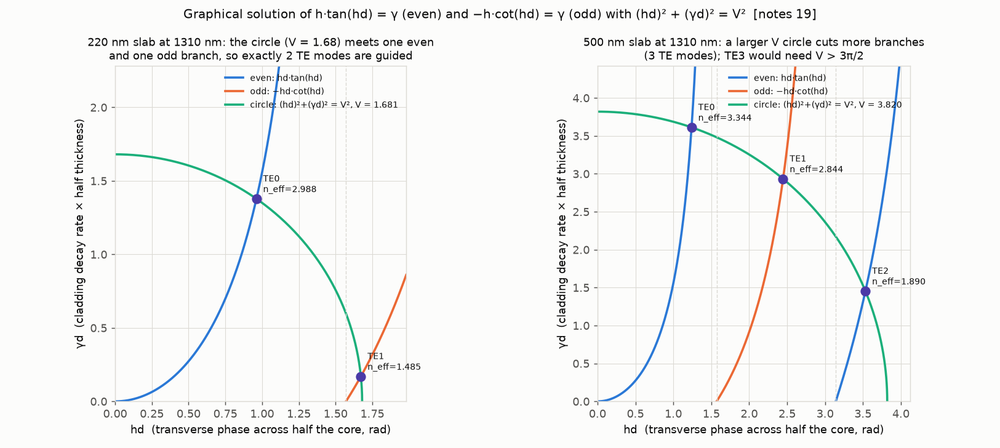
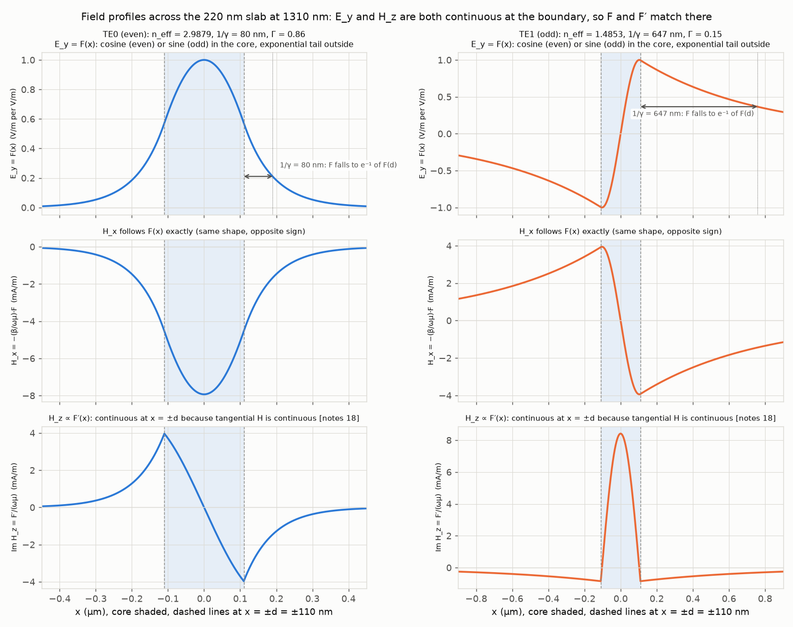
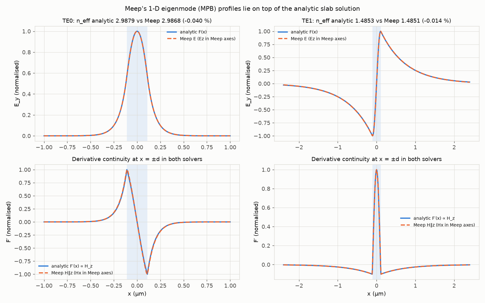
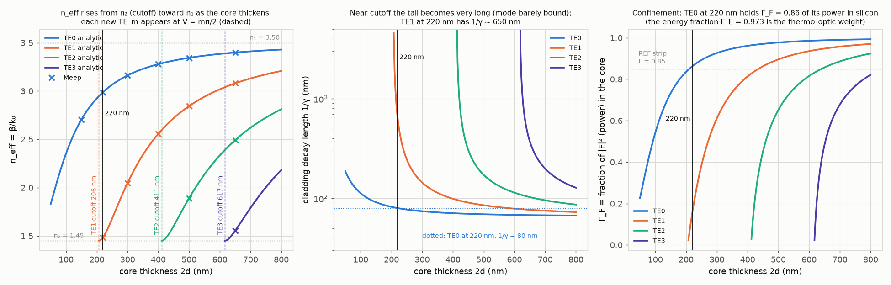
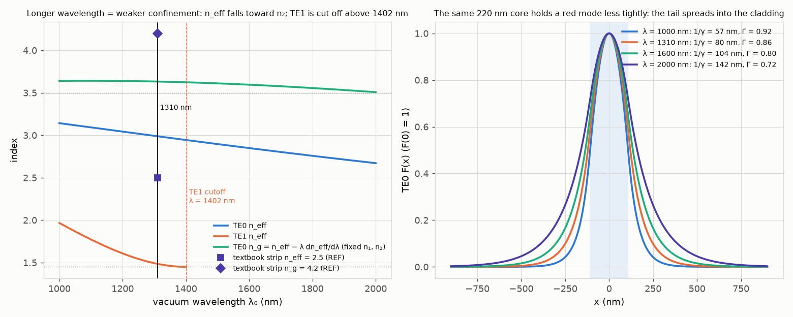
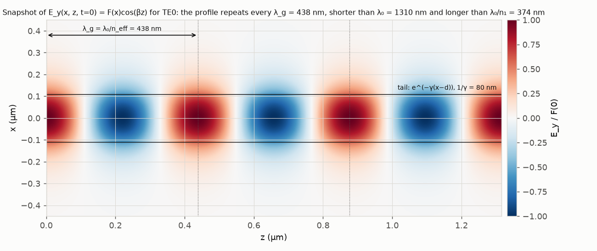
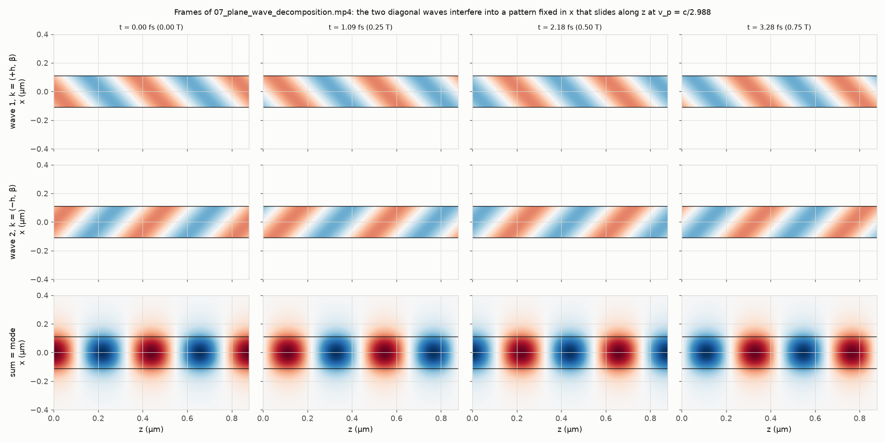

# 07. Slab TE modes: the graphical solution, checked against Meep

**Concept** (docs/NOTES.md sections 14–19, 21–23; also 1, 4, 13, 18 for the geometry, wavevector and boundary conditions)

The notes derive that a symmetric slab (silicon core n₁ = 3.50, silica cladding n₂ = 1.45, thickness 2d = 220 nm, λ₀ = 1310 nm) only guides light at particular values of the propagation constant β: the roots of h·tan(hd) = γ (even modes) and −h·cot(hd) = γ (odd modes), where h = √(n₁²k₀² − β²) is the transverse wavenumber in the core and γ = √(β² − n₂²k₀²) the decay rate in the cladding. What the equations alone do not show is *how many* roots there are and *why*: both h and γ depend on β, and because h² + γ² = k₀²(n₁² − n₂²) is fixed by the geometry, the pair (hd, γd) is constrained to a circle of radius V = k₀d√(n₁² − n₂²). Plotting the tan/cot branches and the circle on the same axes turns the eigenvalue problem into a picture: every crossing is one guided mode, a new branch enters each time V crosses mπ/2, and moving the thickness or wavelength just changes the circle's radius. This experiment draws that construction, marks the roots, plots the field profiles F(x), H_x(x) and H_z(x) (∝ F′) so you can see the two continuity conditions of notes 18 being satisfied at x = ±d, sweeps thickness and wavelength to find the cutoff of the second mode, shows the fundamental mode as the interference of two plane waves at ±58.6° (notes 21), and validates every β against Meep's MPB eigenmode solver. A final block perturbs n₁ by the silicon thermo-optic coefficient and shows which mode quantity actually sets the capstone's 50 pm/K: the fraction Γ_E of the electric energy in silicon, with n_eff and n_g cancelling out.

**Tools used**

### numpy + scipy.optimize.brentq (in `slab_te.py`)
*What it is:* NumPy is the array library every Python simulation is built on; SciPy adds numerical routines, here `brentq`, a bracketed root finder (Brent's method) that is guaranteed to converge when the function changes sign on the bracket.
*What I used it for here:* solving the two transcendental TE eigenvalue equations on the circle (hd)² + (γd)² = V² (notes 19), one root per branch m in the interval hd ∈ (mπ/2, (m+1)π/2); building F(x), F′(x), H_x and H_z from notes 18; the closed-form confinement Γ_F = ∫core F² / ∫ F² (the |F|², i.e. power, fraction; written plain Γ in the figures and the what-if list) and the electric-energy fraction Γ_E = ∫core n²F² / ∫ n²F² (both also checked by trapezoid integration of the profile); n_g from a centred finite difference of n_eff(λ) (notes 22); the thickness and wavelength sweeps; and the thermo-optic derivatives ∂n_eff/∂n₁, ∂n_eff/∂n₂ by centred differences of the exact root.
*Result:* V = 1.681 → 2 guided TE modes. TE0: n_eff = 2.9879, β = 14.331 rad/µm, 1/γ = 79.8 nm (notes 23 says 80 nm: 99.8 % agreement), λ_g = 438.4 nm (notes 22's example with n_eff = 2.97 gives 441 nm: 99.4 %), θ = 58.6° from the normal, Γ_F = 0.862, Γ_E = 0.973. TE1: n_eff = 1.4853, 1/γ = 647 nm (barely guided). TE1 cutoff thickness at 1310 nm = 205.6 nm, cutoff wavelength at 220 nm = 1401.6 nm. ∂n_eff/∂n₁ = 1.0101 by finite difference, equal to both (n_g/n₁)·Γ_E and (n₁/n_eff)·Γ_F to 1e-9 (the two forms of the exact first-order perturbation identity), so dn_eff/dT = 1.886e-4 /K and dλ_r/dT = 68.0 pm/K = λ₀[Γ_E·(dn₁/dT)/n₁ + (1 − Γ_E)·(dn₂/dT)/n₂] = 67.8 + 0.2 pm/K, a form in which n_g has cancelled; the 50 pm/K reference would need Γ_E = 0.68.
*How to observe it:* `cd experiments/07_slab_modes_graphical && ../../.meep/bin/python run.py` (the analytic part imports only numpy/scipy, but the file also needs Meep). Look at `out/07_graphical_construction.png` (dots = roots), `out/07_mode_profiles.png`, `out/07_sweep_thickness.png`, `out/07_sweep_wavelength.png`; numbers in `out/results.json` (`modes_analytic`, `cutoff`, `thermo_optic` with the Γ_F/Γ_E identities, `headline`). To change the case, edit `LAM`, `THICK`, `N1`, `N2` near the top of `run.py`, or call `slab_te.solve_te_modes(d_um, lam_um, n1, n2)` in any Python session.

### Meep (pymeep) `get_eigenmode`, i.e. the MPB eigenmode solver
*What it is:* Meep is the open-source FDTD electromagnetic simulator. Its `get_eigenmode` routine calls MPB, a plane-wave frequency-domain eigensolver, on a cross-section of the FDTD cell to find guided modes and their propagation constants. It is normally used to build eigenmode sources and to decompose FDTD fields into modal amplitudes.
*What I used it for here:* an independent numerical check of β and of the profiles. The 2-D cell holds the slab with its thickness along Meep's y and propagation along Meep's x (invariant in z), so the notes' (x, y, z) are Meep's (y, z, x) and the notes' E_y is Meep's E_z (parity `ODD_Z`). `get_eigenmode` is called on the 1-D line across the slab with `EVEN_Y` for TE0 and `ODD_Y` for TE1 at 100 px/µm, then repeated at six thicknesses (150–650 nm, up to TE3) and at four resolutions (25–200 px/µm) for a convergence table.
*Result:* TE0 n_eff = 2.98675 vs analytic 2.98795 (99.96 % agreement, −0.040 %); TE1 n_eff = 1.48512 vs 1.48532 (99.99 %); Meep's n_g(TE0) = 3.6306 vs the finite-difference 3.6323 (99.95 %). Over the thickness sweep (14 mode/thickness pairs) the largest |Δn_eff| is 0.073 %. The residual is discretisation: it falls from −0.31 % at 25 px/µm to −0.010 % at 200 px/µm. The Meep E and H profiles lie on top of the analytic F and F′ (`out/07_meep_validation.png`).
*How to observe it:* the same `run.py` (this is why the folder carries the `.uses_meep` marker). Open `out/07_meep_validation.png` and read the `meep` block of `out/results.json` (`modes`, `te0_resolution_convergence`, `thickness_sweep_points`). Change `res=100` in the `meep_modes(...)` calls to see the error shrink or grow; change `kpoint` if you solve a very different index contrast (it is only the eigensolver's starting guess).

### matplotlib + FFMpegWriter (ffmpeg)
*What it is:* matplotlib is the standard Python plotting library; its `animation` module renders a `FuncAnimation` frame by frame and pipes the frames to ffmpeg, which encodes the mp4.
*What I used it for here:* all seven figures, and the video of the two-plane-wave decomposition of TE0 (notes 21): three stacked panels show wave 1 = ½cos(ωt − βz − hx), whose k·r = hx + βz means k = (+h, β), and wave 2 = ½cos(ωt − βz + hx) with k = (−h, β), inside the core, and their sum F(x)cos(ωt − βz) with its evanescent tails, animated over two optical periods (T = 4.37 fs). The sign convention is the notes' cos(ωt − k·r): the crest of a wave with k_x > 0 moves toward +x. The ffmpeg version in `out/tools.json` is read live from `ffmpeg -version` at run time.
*Result:* `out/07_plane_wave_decomposition.mp4` (4 s, 120 frames at 30 fps) and the contact sheet `out/07_plane_wave_decomposition_frames.png`. The two k-vectors are tilted ±58.6° from the boundary normal, beyond the 24.5° critical angle, and √(h² + β²)/(n₁k₀) = 1.000000 (notes 4: the two components are genuine plane waves in silicon). A crest-tracking check in `run.py` (an assertion, `results.json` → `plane_wave_decomposition`) finds the wave-1 crest at fixed z drifting +33 nm in 0.2 fs (toward +x, so k_x = +h as labelled) and the wave-2 crest −33 nm (k_x = −h).
*How to observe it:* open `out/07_plane_wave_decomposition.mp4`: the top two panels slide diagonally in opposite transverse directions (wave 1 toward +x, wave 2 toward −x, both toward +z) while the bottom panel keeps a fixed shape in x and slides along z at v_p = c/2.988. Stills in the contact sheet. `N_FR` and the time span are set just above `FuncAnimation` in `run.py`.

### Jupyter notebook (nbformat / nbconvert, ipywidgets)
*What it is:* Jupyter notebooks mix code, outputs and text; ipywidgets adds sliders that re-run a function; nbformat builds a notebook from a script and nbconvert executes it headlessly and stores the outputs.
*What I used it for here:* `explore.ipynb` (generated by `build_notebook.py`): sliders for thickness (50–800 nm), wavelength (1000–2000 nm), n₁ and n₂ that redraw the graphical construction, F(x) and F′(x) and print the mode table; a cutoff map N_TE(2d, λ₀); and an n_eff-versus-n_g cell that recomputes the ring FSR with the slab n_g and with REF n_g = 4.2. Uses `slab_te.py` only, no Meep.
*Result:* executed with the default (220 nm, 1310 nm) values so the saved outputs match `run.py`: 2 TE modes, TE0 n_eff 2.988, slab n_g 3.63, FSR 11.9 nm with the slab n_g versus 10.3 nm with n_g = 4.2 (REF).
*How to observe it:* `cd experiments/07_slab_modes_graphical && ../../.venv/bin/jupyter lab explore.ipynb`, then drag the sliders (kernel `photonics-sims`). Rebuild with `../../.venv/bin/python build_notebook.py`; re-execute headlessly with `../../.venv/bin/jupyter nbconvert --to notebook --execute --inplace explore.ipynb`.

**What the simulation does**

Geometry and symbols (notes 1, 14): core n₁ = 3.50 for −d < x < d with d = 110 nm, cladding n₂ = 1.45, propagation along z, TE field E = ŷ F(x) e^{−jβz} with the e^{jωt} convention. k₀ = 2π/λ₀ = 4.796 rad/µm. All numbers use `REF` from `common/params.py`.

1. **Eigenvalue equations (notes 15, 16, 19).** In the core F″ + h²F = 0 with h = √(n₁²k₀² − β²); in the cladding F″ − γ²F = 0 with γ = √(β² − n₂²k₀²) > 0 (bound mode needs n₂k₀ < β < n₁k₀). Matching E_y and H_z at x = ±d (notes 18: H_z = (j/ωμ)F′, so F and F′ are continuous) gives h·tan(hd) = γ for even modes and −h·cot(hd) = γ for odd modes. Eliminating β: (hd)² + (γd)² = V², V = k₀d√(n₁² − n₂²) = 1.681 here. `slab_te.solve_te_modes` finds, for each branch m with mπ/2 < V, the root of u·tan(u) − √(V² − u²) (m even) or −u·cot(u) − √(V² − u²) (m odd) on u = hd ∈ (mπ/2, (m+1)π/2) with `brentq`, then β = √(n₁²k₀² − h²), n_eff = β/k₀, 1/γ, λ_g = 2π/β, θ = asin(n_eff/n₁), and the two core fractions in closed form: Γ_F = ∫core F²/∫F² (power) and Γ_E = n₁²Γ_F / (n₁²Γ_F + n₂²(1 − Γ_F)) (electric energy).
2. **Graphical construction** (`07_graphical_construction.png`): both branches and the circle, roots marked, for the 220 nm slab and for a 500 nm slab (V = 3.82, three modes) to show a larger circle cutting more branches.
3. **Profiles** (`07_mode_profiles.png`): F(x), H_x = −(β/ωμ)F and Im H_z = F′/(ωμ) for TE0 and TE1 with E₀ = 1 V/m, so H is in mA/m (notes 18). The decay length 1/γ is drawn on the right tail as a double arrow from x = d to x = d + 1/γ at the height F(d)/e; the TE0 column uses a ±0.45 µm axis so its 80 nm arrow is readable, the TE1 column ±0.9 µm for its 647 nm tail.
4. **Meep validation** (`07_meep_validation.png`): `get_eigenmode` n_eff and profiles versus the analytic ones, plus the resolution convergence table and six extra thicknesses.
5. **Thickness sweep** (`07_sweep_thickness.png`): n_eff, 1/γ and Γ of TE0–TE3 for 2d = 50–800 nm at 1310 nm, with cutoffs 2d_c = mλ₀/(2√(n₁² − n₂²)) marked and Meep crosses overlaid.
6. **Wavelength sweep** (`07_sweep_wavelength.png`): n_eff of TE0 and TE1 and n_g of TE0 for 1000–2000 nm at 220 nm (material indices fixed, so this is waveguide dispersion only), and F(x) at four wavelengths.
7. **Two-plane-wave decomposition** (`07_plane_wave_decomposition.mp4`, `_frames.png`; notes 21): cos(hx)e^{−jβz} = ½e^{−j(hx + βz)} + ½e^{−j(−hx + βz)}. With the phasor e^{−jk·r}, the first term has k·r = hx + βz, i.e. k = (+h, β) (wave 1, real field ½cos(ωt − βz − hx)), and the second has k = (−h, β) (wave 2, ½cos(ωt − βz + hx)); both have |k| = n₁k₀ and sit at θ = asin(β/(n₁k₀)) = 58.6° from the boundary normal. `run.py` checks the sign labels numerically by tracking the crest of each wave at fixed z (it must drift toward +x for k_x = +h).
8. **Field snapshot** (`07_field_snapshot.png`): E_y(x, z, 0) = F(x)cos(βz) over three guided wavelengths, with λ_g and the tail labelled.
9. **Thermo-optic bridge (capstone):** ∂n_eff/∂n₁ and ∂n_eff/∂n₂ by centred differences of the exact root, dn_eff/dT = ∂n_eff/∂n₁·1.86e-4 + ∂n_eff/∂n₂·1.0e-5, and dλ_r/dT = (λ₀/n_g)·dn_eff/dT (differentiate the resonance condition βL = 2πm; the λ-dependence of β brings in n_g, not n_eff). First-order perturbation theory for the slab gives the exact identities ∂n_eff/∂n₁ = (n_g/n₁)·Γ_E = (n₁/n_eff)·Γ_F and ∂n_eff/∂n₂ = (n_g/n₂)·(1 − Γ_E); the two forms agree because n_eff·n_g = n₁²Γ_F + n₂²(1 − Γ_F) (the F²-weighted mean of n², 10.853 here; `run.py` asserts all three identities against the finite differences). Substituting the n_g form into dλ_r/dT cancels n_g: dλ_r/dT = λ₀[Γ_E·(dn₁/dT)/n₁ + (1 − Γ_E)·(dn₂/dT)/n₂]. The thermal drift of a resonance therefore depends on one mode quantity only, the silicon energy fraction Γ_E, and not on n_eff or n_g. `run.py` evaluates both routes (they agree to 1e-10) and also solves this closed form for the Γ_E a waveguide would need to sit at the REF 50 pm/K.

**Results**

Video: [out/07_plane_wave_decomposition.mp4](out/07_plane_wave_decomposition.mp4) (4 s).

| Quantity (220 nm slab, 1310 nm, TE) | Simulated | Expectation | Agreement |
|---|---|---|---|
| V number | 1.681 | k₀d√(n₁² − n₂²) = 1.681 | exact (same formula) |
| Number of guided TE modes | 2 | ⌊2V/π⌋ + 1 = 2 | exact |
| TE0 n_eff | 2.9879 | notes 22 example 2.97 | 100.6 % (the notes' figure is a rounded illustration) |
| TE0 n_eff, Meep MPB (100 px/µm) | 2.98675 | analytic 2.98795 | 99.96 % |
| TE0 β | 14.331 rad/µm | Meep 14.325 rad/µm | 99.96 % |
| TE0 decay length 1/γ | 79.8 nm | notes 23: 80 nm | 99.8 % |
| TE0 λ_g = λ₀/n_eff | 438.4 nm | notes 22: 441 nm (with n_eff 2.97) | 99.4 % |
| TE0 ray angle θ = asin(n_eff/n₁) | 58.6° | must exceed θ_c = asin(n₂/n₁) = 24.5° | yes (TIR) |
| TE0 confinement Γ_F (F², i.e. power, fraction in Si) | 0.862 | REF strip Γ = 0.85 (2-D, experiment 08) | 101.5 % |
| TE0 energy fraction Γ_E (n²F² fraction in Si) | 0.973 | closed form n₁²Γ_F/(n₁²Γ_F + n₂²(1 − Γ_F)); trapezoid integral 0.9733 | 100.00 % |
| TE0 n_g (waveguide dispersion only) | 3.632 | Meep MPB group velocity 3.631 | 99.95 % |
| TE1 n_eff | 1.4853 | Meep 1.4851 | 99.99 % |
| TE1 decay length | 647 nm | just above cutoff, so ≫ 80 nm | consistent |
| TE1 cutoff thickness at 1310 nm | 205.6 nm | λ₀/(2√(n₁² − n₂²)) = 205.6 nm | exact |
| TE1 cutoff wavelength at 220 nm | 1401.6 nm | 4d√(n₁² − n₂²) = 1401.6 nm | exact |
| Meep vs analytic, 14 modes at 6 thicknesses | max Δn_eff 0.073 % | 0 | discretisation, shrinks with resolution |
| ∂n_eff/∂n₁ (finite difference of the exact root) | 1.01013 | (n_g/n₁)·Γ_E = (n₁/n_eff)·Γ_F = 1.01013 | 100.00 % (to 1e-9) |
| ∂n_eff/∂n₂ (finite difference) | 0.06680 | (n_g/n₂)·(1 − Γ_E) = 0.06680 | 100.00 % |
| dn_eff/dT (slab) | 1.886e-4 /K | textbook Γ·dn_Si/dT with Γ = 0.85: 1.58e-4 /K | 119 % (see below) |
| dλ_r/dT (slab), via (λ₀/n_g)·dn_eff/dT | 68.0 pm/K | closed form λ₀[Γ_E dn₁/dT/n₁ + (1 − Γ_E) dn₂/dT/n₂] = 67.8 + 0.2 = 68.0 pm/K | 100.00 % (n_g cancels) |
| dλ_r/dT (slab) vs the strip reference | 68.0 pm/K | REF 50 pm/K (textbook route 0.85·1.86e-4·1310/4.2 = 49.3 pm/K) | 136 % |
| Γ_E a waveguide needs for 50 pm/K | 0.676 (0.718 if the silica term is dropped) | to be checked by the 2-D solvers of experiment 08 | open |

Reading the thermo-optic rows honestly: the slab is not the strip, and its 68 pm/K is 36 % above the 50 pm/K reference. The identities in the table say exactly which quantity is responsible. Writing dλ_r/dT = (λ₀/n_g)·dn_eff/dT and then dn_eff/dT = (n_g/n₁)·Γ_E·dn₁/dT + (n_g/n₂)·(1 − Γ_E)·dn₂/dT, the n_g cancels and dλ_r/dT = λ₀[Γ_E·(dn₁/dT)/n₁ + (1 − Γ_E)·(dn₂/dT)/n₂]: the drift depends on the silicon energy fraction Γ_E and the two material coefficients, and on nothing else about the mode. In particular it does *not* depend on n_g, so it is meaningless to combine the slab's dn_eff/dT with the strip's n_g = 4.2 (that dn_eff/dT already contains the slab's own n_g through the identity above), and the n₁/n_eff factor of the other form of the identity is not an independent ingredient either: (n₁/n_eff)·Γ_F and (n_g/n₁)·Γ_E are the same number. Two things follow. (i) The textbook shortcut dn_eff/dT ≈ Γ·dn_Si/dT with Γ = 0.85 and dλ_r/dT = (λ₀/n_g)·dn_eff/dT with n_g = 4.2 gives 49.3 pm/K, but it does so by using the power fraction Γ_F where perturbation theory wants the energy fraction Γ_E, and an n_g that is not tied to that Γ; for the slab the same shortcut gives 1.62e-4 /K instead of the exact 1.89e-4 /K (Γ_F = 0.86 versus (n_g/n₁)·Γ_E = 1.01). (ii) For the strip to sit at 50 pm/K it must hold Γ_E = 0.676 of its electric energy in silicon (0.718 if the small silica term is ignored), against the slab's 0.973. That is plausible for a 500 × 220 nm strip, whose lateral tails put a good part of the energy in the silica and whose E_x component is discontinuous at the sidewalls, but the slab cannot decide it: the 2-D energy fraction has to be solved, not assumed, and that is what the full-vector solvers of experiment 08 are for. The 50 pm/K itself is a *strip* number, and it is entirely possible that the strip lands somewhere between 50 and 68 pm/K. What the slab does establish is that Γ_E is the only knob.

Also note the n_eff discrepancy the brief asks to be stated: the reference table uses n_eff = 2.5 for the strip, the slab TE0 has 2.99, and 2-D solvers give ≈ 2.7 for the strip (experiment 08). n_eff enters the resonance order m = n_eff·L/λ₀ and the phase; n_g enters the FSR = λ₀²/(n_g L) and every shift formula. The notebook's last cell computes both: with the slab's n_g the FSR would be 11.9 nm, with n_g = 4.2 it is 10.3 nm (REF).

**Experiments to try**

Every number quoted below is computed by `run.py` and written to the `what_if` block of `out/results.json`, so you can check your own run against it.

1. **Cut off the second mode.** Set `THICK = 0.20` in `run.py` (or drag the thickness slider to 200 nm in the notebook). V drops to 1.528 < π/2 = 1.571, the odd branch no longer meets the circle and the mode list shrinks to TE0 alone (n_eff 2.924, 1/γ 82 nm). The slab becomes single-mode below 205.6 nm.
2. **Add a third mode.** Set `THICK = 0.45`: V = 3.44 > π, the second even branch enters and TE2 appears with one more node (n_eff 1.603, 1/γ = 305 nm, Γ = 0.45: barely bound); watch its tail shorten as you thicken further, while TE0 tightens to 1/γ = 70 nm and Γ = 0.97.
3. **Change the wavelength instead of the thickness.** In the notebook slide λ₀ to 1450 nm at 220 nm: TE1 disappears above 1401.6 nm because V ∝ 1/λ₀ (V = 1.518, one mode). Slide to 1000 nm (V = 2.20) and see TE0's tail shrink from 80 nm to 57 nm (Γ from 0.86 to 0.92): shorter wavelengths are held more tightly.
4. **Change the index contrast, both ways.** Set `N1 = 2.0` (silicon-nitride-like core): V collapses to 0.727, only TE0 survives, its n_eff falls to 1.645, 1/γ grows to 268 nm and Γ drops to 0.52; this is why nitride rings need larger radii than silicon rings. Then set `N2 = 1.0` instead (air cladding): V rises to 1.770, the TE0 tail shortens to 75 nm (Γ 0.88), and the ray angle θ = 57.9° sits far past the now 16.6° critical angle; compare with `theta_deg` and `critical_angle_deg` in `results.json`.
5. **Meep resolution.** Change `res=100` to 40 in the first `meep_modes` call and watch `neff_diff_pct` in `results.json` change sign and grow; the convergence table (`te0_resolution_convergence`) shows why 100 px/µm was chosen (0.04 %).

**Capstone connection**

The ring in the Lightmatter capstone is a 500 × 220 nm silicon strip; the 220 nm slab solved here is its vertical cross-section with the lateral confinement removed. Three of the capstone's reference numbers come straight out of the quantities in this experiment. (1) The decay length 1/γ ≈ 80 nm is the scale of the evanescent tail that couples ring to bus (κ² = 0.107 for the reference coupler) and that the heater must not overlap: a 10 nm change in gap is a ~10 % change in κ (experiments 02, 11). (2) The fraction of the mode's electric energy in silicon, Γ_E (0.97 for the slab), is the weight of the silicon thermo-optic coefficient in the resonance drift dλ_r/dT = λ₀[Γ_E·(dn₁/dT)/n₁ + (1 − Γ_E)·(dn₂/dT)/n₂], the 50 pm/K that the lock must cancel over the 10–125 °C ambient range; the power fraction Γ_F = 0.86 (slab) ≈ 0.85 (REF strip) is the related but different number the textbook shortcut uses. (3) The distinction between n_eff (β/k₀, 2.99 here, 2.5 in the reference table, ~2.7 from 2-D solvers) and n_g (3.63 here, 4.2 for the strip) decides which formulas the capstone may use: FSR = c/(n_g L) = 1.8 THz and dλ_r/dT = (λ₀/n_g)·dn_eff/dT both carry n_g, so they are insensitive to the n_eff disagreement, whereas the resonance order m = n_eff L/λ₀ and the round-trip phase e^{−jβL} carry n_eff. The thermal drift, however, is *not* one of the n_g-dependent formulas even though it is usually written with (λ₀/n_g): n_g cancels against the n_g inside ∂n_eff/∂n₁, and only Γ_E remains. The slab's own thermo-optic estimate (68 pm/K, Γ_E = 0.97) overshoots the 50 pm/K reference, which needs Γ_E = 0.68; whether the 500 nm wide strip really pushes that much of the energy out of the silicon is left open here and is the motivation for the full-vector solvers of experiment 08. Finally, the TE1 cutoff at 205.6 nm says the *slab* at 220 nm is two-moded, with the vertical odd mode's n_eff = 1.4853 only 0.035 above the cladding index 1.45. In the strip the lateral confinement is expected to push that vertical odd mode below cutoff; whether the 500 nm width supports a *lateral* higher-order mode at 1310 nm is a separate question that experiment 08 checks. Either way the lateral dimension is not optional in the capstone geometry.

**Checks**

- **Root finding:** every root is bracketed on (mπ/2, (m+1)π/2) where the branch function changes sign, so `brentq` cannot miss or duplicate a mode; the mode count equals ⌊2V/π⌋ + 1 at every point of the sweeps.
- **Meep MPB agreement:** n_eff within 0.04 % (TE0) and 0.014 % (TE1) at 100 px/µm; 14 mode/thickness pairs within 0.073 %; the error shrinks monotonically in magnitude beyond 50 px/µm (−0.31 %, +0.08 %, −0.04 %, −0.01 %), so the residual is grid discretisation of the 220 nm step, not a physics disagreement. Meep's own group velocity gives n_g within 0.05 % of the finite-difference value.
- **Profiles:** the Meep E and H fields overlay the analytic F and F′ after a single complex normalisation; F′ is continuous at x = ±d in both (notes 18).
- **Plane-wave identity:** √(h² + β²) = n₁k₀ to 1e-6 and θ = 58.6° > θ_c = 24.5°.
- **k-vector sign labels in the video:** `run.py` tracks the crest of each component wave at fixed z between t = 0 and 0.2 fs and asserts that wave 1 (labelled k = (+h, β)) drifts toward +x (+33 nm) and wave 2 (k = (−h, β)) toward −x (−33 nm), so the titles, arrows and contact-sheet row labels match the fields drawn.
- **"Experiments to try" numbers:** the six what-if cases (200 nm, 450 nm, 1450 nm, 1000 nm, n₁ = 2.0, n₂ = 1.0) are solved by `run.py` and stored in `results.json` → `what_if`; nothing in that list is a hand estimate.
- **Perturbation identities:** the finite-difference ∂n_eff/∂n₁ equals (n_g/n₁)·Γ_E and (n₁/n_eff)·Γ_F to 1e-9, ∂n_eff/∂n₂ equals (n_g/n₂)·(1 − Γ_E) to 1e-9, and n_eff·n_g equals n₁²Γ_F + n₂²(1 − Γ_F) to 1e-10 (`run.py` asserts all of them); the closed-form Γ_F and Γ_E agree with trapezoid integrals of the profile to 2e-5. The two routes to dλ_r/dT, (λ₀/n_g)·dn_eff/dT and the n_g-free closed form, agree to 1e-10, which is the numerical proof that n_g cancels.
- **Notes' quoted numbers:** 80 nm decay length (99.8 %), 441 nm λ_g from a rounded n_eff = 2.97 (99.4 %): the notes' example value is illustrative and rounds the solved 2.988.
- **Limitations:** 1-D slab, TE only (TM modes are not solved: they satisfy the same construction with an (n₁/n₂)² factor in γ); material indices fixed at their 1310 nm values, so n_g here contains waveguide dispersion only (material dispersion is experiment 04; the strip's n_g = 4.2 includes both plus lateral confinement); lossless, so β is real and there is no absorption (experiment 06); the thermo-optic figure ignores strain and the temperature dependence of the cladding geometry. Runtime about 20–35 s depending on machine load (19–30 s over several runs on this machine; the Meep eigenmode calls dominate).

**Files**

- `run.py` — entry point (Meep interpreter): analytic solution, Meep validation, all figures, video, `out/results.json`, `out/results.txt`, `out/tools.json`.
- `slab_te.py` — analytic symmetric-slab TE solver (numpy/scipy only): `solve_te_modes` (each mode carries `confinement` = Γ_F and `energy_fraction` = Γ_E), `profile`, `fields`, `group_index`, cutoff helpers.
- `build_notebook.py` — writes `explore.ipynb` with nbformat.
- `explore.ipynb` — executed interactive notebook (sliders, cutoff map, n_eff vs n_g and why the thermal drift depends on neither).
- `.uses_meep` — marker: run with `../../.meep/bin/python`.
- `out/07_graphical_construction.png` — tan/cot branches, V circle, roots for 220 nm and 500 nm.
- `out/07_mode_profiles.png` — E_y, H_x, H_z across the slab for TE0 and TE1.
- `out/07_meep_validation.png` — Meep MPB profiles over the analytic ones with n_eff comparison.
- `out/07_sweep_thickness.png` — n_eff, 1/γ, Γ vs thickness with cutoffs and Meep points.
- `out/07_sweep_wavelength.png` — n_eff, n_g vs λ₀ and F(x) at four wavelengths.
- `out/07_field_snapshot.png` — E_y(x, z) snapshot with λ_g and the tail.
- `out/07_plane_wave_decomposition.mp4`, `out/07_plane_wave_decomposition_frames.png` — two-plane-wave video and contact sheet.
- `out/results.json` — every number above (`headline` block for the table, `thermo_optic` for Γ_F, Γ_E, the perturbation identities, the two routes to dλ_r/dT and the Γ_E needed for 50 pm/K, `what_if` for the Experiments-to-try cases, `plane_wave_decomposition` for the k_x sign check, `ffmpeg` for the live-read encoder version), `out/results.txt` — short summary, `out/tools.json` — tool documentation.
