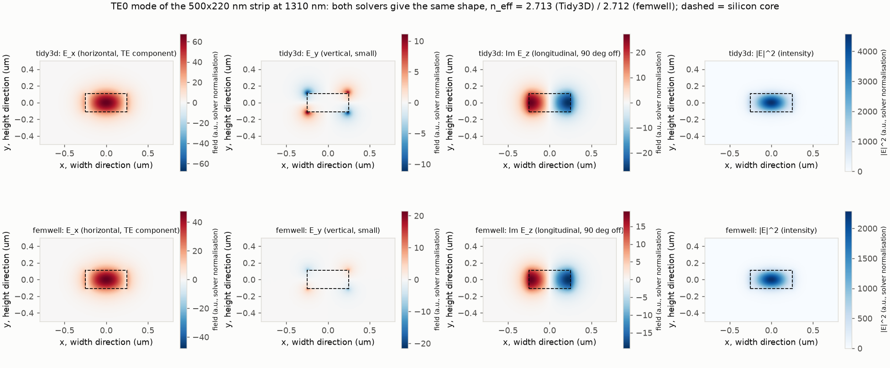
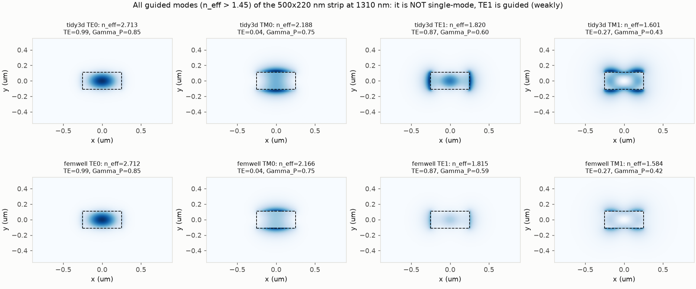
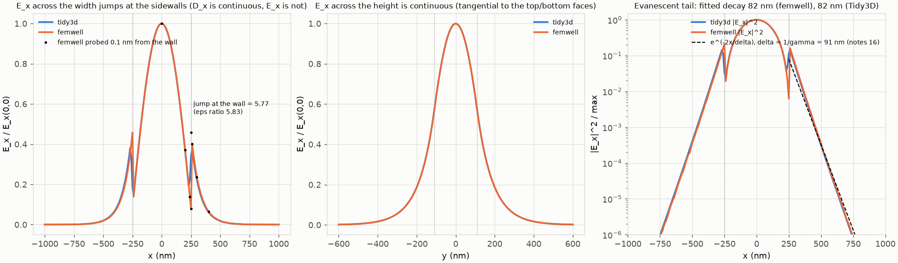
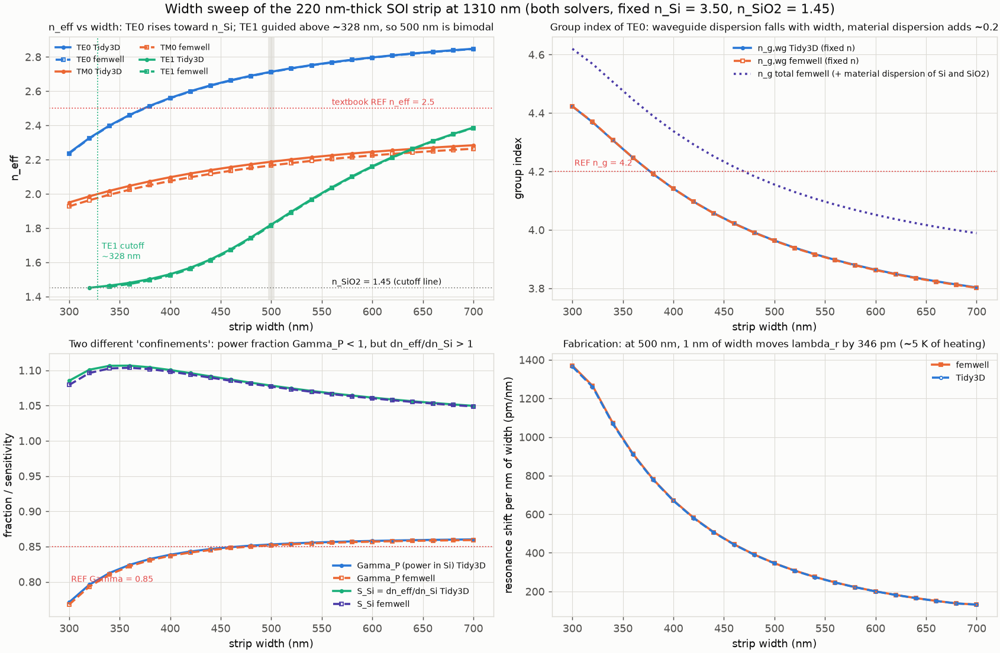
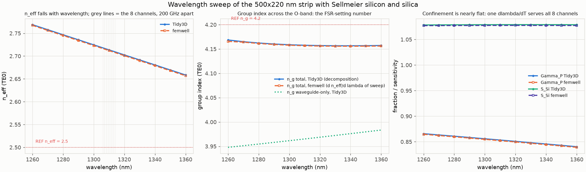
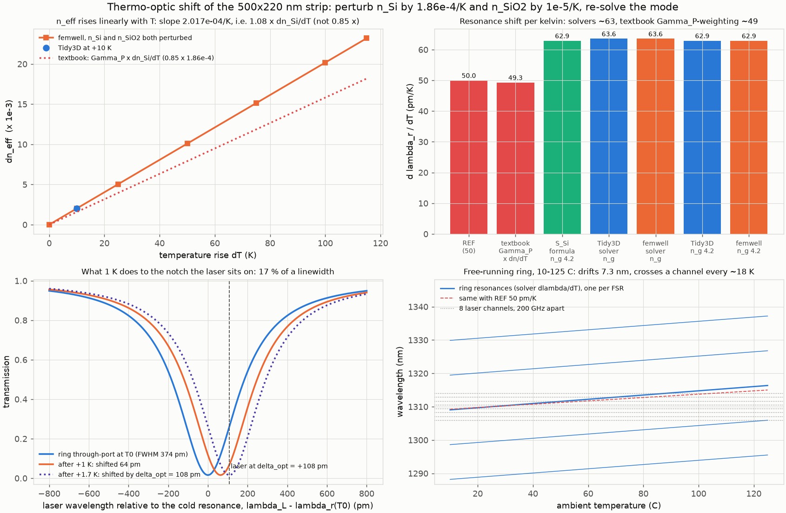
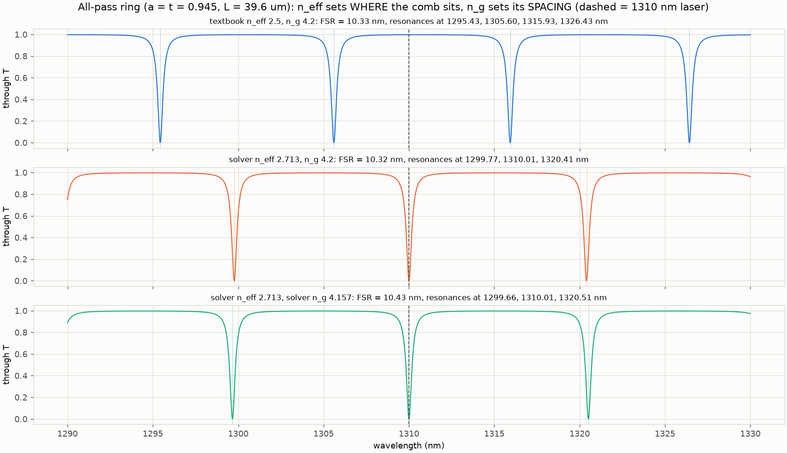
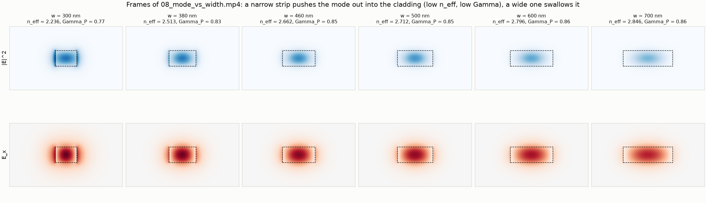

# 08. The real SOI strip: two full-vector mode solvers, and the thermo-optic number

**Concept** (notes §22 effective index and group index, §23 the 220 nm slab and why a rectangular guide needs a numerical solution, §16 and §25 evanescent decay and energy density, §18 boundary matching, plus the capstone's dλ_r/dT). Experiment 07 solved the 1-D slab by hand; the actual Lightmatter waveguide is a 500 nm × 220 nm silicon strip buried in silica, and no closed-form eigenvalue equation exists for it. Here two independent numerical solvers (Tidy3D's finite-difference mode solver and femwell's finite-element solver) find the allowed (e(x,y), β) pairs of that strip at 1310 nm. What the equations alone do not show, and the pictures do: the TE0 mode is a single lobe whose *horizontal* field E_x jumps by a factor ≈ 5.8 at the sidewalls (the normal component of E is discontinuous, D is not), its tail dies off in about 80–90 nm, the "500 nm" strip is actually bimodal in TE at 1310 nm, and the effective index is 2.71, not the textbook's 2.5. The last section perturbs the silicon index by dn/dT·ΔT and re-solves, which turns the mode picture directly into the capstone's pm/K: the solvers give ≈ 64 pm/K, 27 % above the 50 pm/K the textbook assumes, and the README explains which "confinement factor" is responsible.

**Tools used**

### Tidy3D local mode solver (`tidy3d.plugins.mode.ModeSolver`, tidy3d 2.12.0)
*What it is:* Tidy3D is Flexcompute's FDTD package. Its `ModeSolver` plugin is a finite-difference frequency-domain (FDFD) eigenmode solver on a Yee grid that runs locally without an account; it is normally used to define mode sources and monitors for FDTD simulations and to get n_eff, n_g and mode profiles of waveguide cross-sections.
*What I used it for here:* full-vector modes of the 500×220 nm strip on a uniform 10 nm Yee grid over a 2.61 × 2.01 µm plane (sized so every core edge lands mid-cell, see Checks): n_eff, its built-in finite-difference group index, TE fraction, Poynting/energy confinement integrated from its field arrays, the width sweep (300–700 nm), the wavelength sweep (1260–1360 nm with Sellmeier materials) and the thermo-optic perturbation (re-solve with n_Si + 1.86e-4 K⁻¹ × 10 K and n_SiO2 + 1e-5 K⁻¹ × 10 K).
*Result:* TE0 n_eff = 2.7134 (femwell 2.7119, spread 0.06 %; the textbook's 2.5 is 7.8 % low), TE fraction 0.993, Γ_P = 0.853 (REF 0.85, +0.4 %), n_g,wg = 3.964 (fixed materials), n_g total = 4.158 (REF 4.2, −1.0 %), dn_eff/dT = 2.017e-4 /K, dλ_r/dT = 63.6 pm/K (REF 50, +27 %). TM0 n_eff = 2.188 differs from femwell's 2.166 by 1 % (staircasing of the component normal to the top/bottom faces, see Checks).
*How to observe it:* `cd experiments/08_soi_strip_mode_solvers && ../../.venv/bin/python run.py` (about 5–7 min; the last run took 279 s, `runtime_s` in `out/results.json`). Top row of `out/08_mode_fields.png` and `out/08_mode_gallery.png`, the "Tidy3D" series in `out/08_width_sweep.png`, `out/08_wavelength_sweep.png`, `out/08_thermo_optic.png`; numbers in `out/results.json` (keys `reference_modes.tidy3d`, `group_index`, `thermo_optic.per_solver.tidy3d`). Change `TD_DL` (grid pitch) or `TD_BOX` at the top of `run.py` (keep the box an odd multiple of the pitch), or call `solve_tidy3d(width, height, lam, n_core, n_clad, ...)` from `solvers.py` in a Python session.

### femwell FEM Maxwell mode solver (femwell 0.1.12 on scikit-fem 12.0.2, gmsh 4.15.2, shapely 2.1.2, meshio 5.3.5)
*What it is:* femwell is an open-source finite-element photonics package built on scikit-fem. It meshes a 2-D cross-section with gmsh (triangles that conform exactly to the material boundaries) and solves the vector Maxwell eigenproblem with Nédélec elements for the transverse field and Lagrange elements for the longitudinal one. Used for waveguide modes, coupling coefficients, thermal and electro-optic overlap integrals.
*What I used it for here:* the same strip on a boundary-conforming mesh (5674 triangles, 10 nm elements in the core, 2nd-order elements): n_eff, TE fraction, the exact Poynting power fraction in silicon (`calculate_power` restricted to the core elements), the exact perturbation sensitivity ∂n_eff/∂n_Si (its `calculate_confinement_factor`), group index by central finite difference in wavelength (±5 nm), the width sweep (which also supplies the frames of the video), a 0–115 K linearity check of n_eff(T), the E_x probe 0.1 nm on either side of the sidewall, and the thermo-optic re-solve.
*Result:* TE0 n_eff = 2.7119 (converged to 1e-5 between 20 nm and 5 nm meshes; 1st→2nd order elements move it by 1e-3), TE fraction 0.993, Γ_P = 0.852 (REF 0.85, +0.2 %), Γ_E = 0.951, S_Si = ∂n_eff/∂n_Si = 1.077 (direct re-solve 1.077), S_SiO2 = 0.134, n_g,wg = 3.963, n_g total = 4.157 (REF 4.2, −1.0 %), dλ_r/dT = 63.6 pm/K (REF 50, +27 %), TE1 cutoff width ≈ 328 nm, E_x jump at the wall 5.77 (ε ratio 5.83, −1.0 %).
*How to observe it:* same command. Bottom rows of `out/08_mode_fields.png` and `out/08_mode_gallery.png`, `out/08_profile_cuts.png` (black dots are the wall probe), `out/08_mode_vs_width.mp4` and `out/08_mode_vs_width_frames.png`. Change `FEM_RES_REF` / `FEM_RES_SWEEP` in `run.py`, or the `box`/`resolution` arguments of `femwell_mesh` in `solvers.py`; gmsh rebuilds the mesh each run.

### numpy / scipy / matplotlib (numpy 2.4.6, scipy 1.18.1, matplotlib 3.11.2)
*What it is:* the scientific Python stack: arrays and linear algebra (scipy's ARPACK shift-invert eigensolver is what femwell calls), plotting and `FuncAnimation` video.
*What I used it for here:* Sellmeier evaluation of n_Si(λ) (Salzberg–Villa) and n_SiO2(λ) (Malitson) and their bulk group indices in `materials.py`; finite-difference group indices; the least-squares fit of the evanescent tail; the all-pass ring transfer function of notes §28 for the "n_eff vs n_g" comb figure; every figure and the mp4.
*Result:* bulk n_g,Si = 3.677 and n_g,SiO2 = 1.462 at 1310 nm, which add +0.192 to the waveguide group index (S_Si·(n_g,Si − n_Si) + S_SiO2·(n_g,SiO2 − n_SiO2)); the predicted total 4.155 matches the brute-force 4.157 to 0.05 %. Ring comb: FSR = 10.33 nm with n_eff = 2.5 and 10.32 nm with n_eff = 2.713, both at n_g = 4.2 — n_eff moves the comb, n_g sets its spacing.
*How to observe it:* `out/08_neff_vs_ng_comb.png`, `out/08_profile_cuts.png`; `../../.venv/bin/python materials.py` prints the bulk indices at 1260/1310/1360/1550 nm.

### ffmpeg (9.0.1)
*What it is:* command-line video encoder; matplotlib's `FFMpegWriter` pipes rendered frames into it.
*What I used it for here:* encoding `out/08_mode_vs_width.mp4` (H.264, 30 fps, 9.8 s).
*Result:* 294 frames built from 21 femwell solutions between 300 and 700 nm width, each held 14 frames.
*How to observe it:* open `out/08_mode_vs_width.mp4`; stills in `out/08_mode_vs_width_frames.png`; change `HOLD` or the `widths` array in `run.py`.

**What the simulation does**

Geometry and inputs (all from `common/params.py`): a silicon core of width w = 0.50 µm and height h = 0.22 µm (n_Si = 3.50) centred in silica (n_SiO2 = 1.45), vacuum wavelength λ₀ = 1.310 µm, k₀ = 2π/λ₀ = 4.796 rad/µm. Coordinates follow the notes: x across the width, y across the height, z along the guide. Both solvers look for fields of the form Ẽ = e(x,y) e^{−jβz} (notes §15, §20) and return n_eff = β/k₀ (§22). Neither has a closed form: Tidy3D discretises Maxwell's curl equations on a Yee grid and solves the resulting sparse eigenproblem for β; femwell does the same with finite elements on a triangle mesh that follows the core boundary.

1. **Reference strip (section A of `run.py`).** Both solvers, 4 modes, fields on a common 10 nm grid. For each mode: n_eff; TE fraction ∫|E_x|²/∫(|E_x|²+|E_y|²); three "confinements" that are different numbers: Γ_P = ∫_core ½Re(E×H*)·ẑ / ∫_all (the power fraction, the textbook's 0.85), Γ_E = ∫_core ε|E|² / ∫_all ε|E|² (the electric-energy fraction, notes §25), and S_Si = ∂n_eff/∂n_Si (the first-order sensitivity, femwell's "confinement factor"). Perturbation theory ties them together: with the mode's energy velocity v_g = P/(½ε₀∫ε_r|E|²) (§25 energy density, §22 group index) one gets **S_Si = Γ_E · n_g,wg / n_Si**, which the run checks against a direct re-solve. The evanescent tail along x is fitted to e^{−2x/δ} and compared with δ = 1/γ = 1/(k₀√(n_eff² − n_SiO2²)) (§16); the E_x discontinuity at the sidewall is probed 0.1 nm on each side and compared with (n_Si/n_SiO2)² (§18: tangential E and H continuous, hence normal D continuous).
2. **Group index (B).** n_g = n_eff − λ₀ dn_eff/dλ₀ (§22) is evaluated two ways: at fixed material indices (Tidy3D's built-in step, femwell ±5 nm) giving the *waveguide-dispersion* n_g,wg, and with the Sellmeier indices moving with λ (brute-force ±5 nm), giving the total. The decomposition n_g = n_g,wg + S_Si (n_g,Si − n_Si) + S_SiO2 (n_g,SiO2 − n_SiO2) is checked. FSR = λ²/(n_g L) with L = 39.6 µm.
3. **Width sweep (C).** 300–700 nm in 20 nm steps, fixed REF indices, both solvers, 3 modes each: n_eff of TE0/TM0/TE1, n_g,wg, Γ_P, S_Si; the TE1 cutoff width (where its n_eff falls to n_SiO2); dn_eff/dw at 500 nm and the resonance shift per nm of width, λ (dn_eff/dw)/n_g.
4. **Wavelength sweep (D).** 1260–1360 nm in 10 nm steps with Sellmeier n_Si(λ), n_SiO2(λ): n_eff, n_g total (Tidy3D by the decomposition, femwell by differentiating its own sweep), Γ_P, with the 8 laser channels (200 GHz apart around 1310 nm) marked.
5. **Thermo-optic (E), the capstone number.** Δn_Si = 1.86e-4 × 10 K, Δn_SiO2 = 1e-5 × 10 K; re-solve; dn_eff/dT = Δn_eff/10 K; also Si-only and SiO2-only perturbations to get the sensitivities directly, and femwell at ΔT = 0, 10, 25, 50, 75, 100, 115 K for linearity. Resonance condition m λ_r = n_eff(λ_r, T) L differentiated at fixed m gives **dλ_r/dT = λ (∂n_eff/∂T) / n_g** with the *total* group index in the denominator. Compared with REF 50 pm/K and with the textbook's Γ-weighted estimate (λ/n_g)·Γ_P·dn_Si/dT = 49.3 pm/K. If the ring's length also expands, L(T) = L(1 + α_L ΔT), the same differentiation gives dλ_r/dT = (λ/n_g)(∂n_eff/∂T + n_eff α_L); the run evaluates the second term with α_L = 2.6e-6 /K for silicon (`thermo_optic.thermal_expansion`) and reports both the index-only and the total shift.
6. **n_eff versus n_g (F).** The all-pass ring T(λ) = |(t − a e^{−jφ})/(1 − t a e^{−jφ})|², φ = 2π n(λ) L/λ, n(λ) = n_eff − (λ−λ₀)(n_g − n_eff)/λ₀, a = t = 0.945, for (n_eff, n_g) = (2.5, 4.2), (2.713, 4.2), (2.713, 4.157).
7. **Video (G).** The femwell TE0 |E|² and E_x as the width grows from 300 to 700 nm.

**Results**

TE0 from both solvers: E_x is one lobe (TE fraction 0.993), E_y is a small four-lobed correction at the corners, E_z is 90° out of phase with E_x (the quasi-TE mode of §13 has a longitudinal component; its peak is 40 % of E_x's, `te0.ez_over_ex_peak_femwell` = 0.405, Tidy3D 0.405), and |E|² is concentrated in the core with a faint halo. The colour scales differ only because the two solvers normalise power differently.

All four guided modes. TE0 (2.712), TM0 (2.17–2.19; its |E|² peaks sit just outside the top and bottom faces, where E_y is the normal component and jumps by the ε ratio, although Γ_P is still 0.75), TE1 (1.815–1.820, one vertical node, weakly guided) and TM1 (1.58–1.60). The 500 nm strip at 1310 nm is therefore not single-mode in TE; it is single-mode only below the TE1 cutoff of ≈ 328 nm width for these indices.

Left: E_x across the width. Inside the core it is a cosine-like bump; at each sidewall it jumps by 5.77 (the ε ratio is 5.83) because E_x is the *normal* component there and D_x must be continuous; the field just outside the wall is larger than just inside. Middle: across the height E_x is tangential and continuous. Right: the |E_x|² tail on a log axis falls with a fitted decay length of 82 nm; the 1-D formula 1/γ = 91 nm (§16) is slightly longer because a 2-D field also spreads vertically and therefore falls faster along the mid-line (∂²/∂x² + ∂²/∂y² = γ²F, so the x-decay rate exceeds γ wherever the profile has vertical curvature).

Top left: n_eff of TE0 climbs from 2.24 (300 nm) to 2.85 (700 nm), crossing the textbook's 2.5 at 375 nm (`width_sweep.neff_2p5_crossing_width_nm`); TE1 becomes guided at ≈ 328 nm. Top right: the waveguide-only group index *falls* with width (from 4.42 to 3.80) while the material term adds ≈ 0.19; the total crosses 4.2 at 470 nm (`width_sweep.ng_4p2_crossing_width_nm`). Bottom left: Γ_P saturates at 0.85–0.86 whereas S_Si = ∂n_eff/∂n_Si stays *above 1* (1.05–1.11) — the mode's phase index responds more than one-for-one to the core index. Bottom right: at 500 nm one nanometre of width moves the resonance by 346 pm, i.e. a 10 nm lithography error is 3.5 nm = a third of an FSR, or about 55 K of heater range.

Across 1260–1360 nm n_eff falls from 2.769 to 2.658 (waveguide plus material dispersion), the total n_g is nearly flat at 4.17–4.16, and Γ_P drifts from 0.866 to 0.840; S_Si stays at 1.08. The 8 channels (grey) span only 8 nm, so one set of ring numbers serves all of them.

Top left: n_eff(T) is linear to 1.3e-6 over 115 K with slope 2.017e-4 /K = 1.08 × dn_Si/dT, versus the textbook's 0.85 × (dotted). Top right: the resulting dλ_r/dT (index term only; thermal expansion adds a further 2.2 pm/K, see the table). Bottom left: what one kelvin (64 pm) does to the 374 pm-wide notch the laser sits on at δ_opt = +108 pm — 1.7 K of drift walks the resonance onto the laser. The x axis is measured from the *cold* resonance λ_r(T0), so the heated notches appear shifted to the right, toward the laser. Bottom right: a free-running ring over the 10–125 °C ambient range drifts 7.3 nm (0.70 FSR) and meets a neighbouring 200 GHz channel every ≈ 18 K.

Same ring, three (n_eff, n_g) pairs. Changing n_eff from 2.5 to 2.713 slides the comb (the mode order m = n_eff L/λ goes from 75.6 to 82.0) but leaves the FSR at 10.3 nm; changing n_g from 4.2 to 4.157 changes the FSR by 1 % and barely moves the resonance nearest 1310 nm.

Stills from [out/08_mode_vs_width.mp4](out/08_mode_vs_width.mp4): the narrow strip pushes the mode into the cladding (bright sidewall lobes, Γ_P = 0.77, n_eff = 2.24), the wide strip swallows it (Γ_P = 0.86, n_eff = 2.85).

| quantity (TE0, 500×220 nm, 1310 nm) | Tidy3D | femwell | expectation | agreement |
|---|---|---|---|---|
| n_eff | 2.7134 | 2.7119 | textbook REF 2.5; slab (exp. 07) 2.988 | solvers agree to 0.06 %; REF is 7.8 % low; the strip sits between slab and cladding as it must |
| λ_g = λ/n_eff | 482.9 nm | — | 524 nm at n_eff 2.5; 441 nm at the notes' 2.97 (§22) | — (depends on n_eff, see below) |
| TE fraction | 0.993 | 0.993 | "quasi-TE" (§13) | — |
| Γ_P, power in Si | 0.853 | 0.852 | REF 0.85 | +0.3 % |
| Γ_E, electric energy in Si | 0.952 | 0.951 | — | — |
| S_Si = ∂n_eff/∂n_Si | 1.077 (direct) | 1.077 (direct) | Γ_E n_g,wg/n_Si = 0.951 × 3.963/3.50 = 1.077 | < 0.1 % |
| S_SiO2 = ∂n_eff/∂n_SiO2 | 0.133 | 0.134 | — | — |
| tail decay length | 82.5 nm | 82.2 nm | 1/γ = 90.9 nm (§16, 1-D formula) | −9 % (2-D field, see text) |
| E_x jump at sidewall | (grid-limited) | 5.77 | (n_Si/n_SiO2)² = 5.83 (§18) | −1.0 % |
| n_g, fixed materials | 3.964 | 3.963 | — | 0.02 % |
| n_g, total (Sellmeier) | 4.158 | 4.157 | REF 4.2; decomposition 4.156/4.155 | −1.0 % vs REF; 0.05 % vs decomposition |
| FSR = λ²/(n_g L) | 10.42 nm / 1.821 THz | 10.42 nm | REF 10.3 nm / 1.8 THz | +1.2 % |
| TE1 cutoff width | 323 nm | 328 nm | — | 1.5 % |
| dλ_r/dw at 500 nm | 346 pm/nm | 346 pm/nm | — | — |
| dn_eff/dT | 2.017e-4 /K | 2.017e-4 /K | textbook Γ_P·dn_Si/dT = 1.58e-4 | solvers +28 % over the textbook rule |
| dλ_r/dT (solver n_g) | 63.6 pm/K | 63.6 pm/K | REF 50 pm/K; textbook estimate 49.3 | **+27 %** (see Checks) |
| dλ_r/dT (n_g = 4.2) | 62.9 pm/K | 62.9 pm/K | 50 pm/K | +26 % |
| thermal-expansion term λ n_eff α_L / n_g (α_L = 2.6e-6 /K) | 2.2 pm/K | 2.2 pm/K | n_eff α_L = 7.05e-06 /K = 3.5 % of ∂n_eff/∂T | — |
| dλ_r/dT incl. expansion | 65.8 pm/K | 65.8 pm/K | REF 50 pm/K | **+32 %** |
| 1 K in units of FWHM | 17 % | 17 % | REF 13 % | — |
| 10–125 °C drift | 7.31 nm = 0.70 FSR | — | REF 5.75 nm = 0.56 FSR | — |

**Which numbers depend on n_eff and which on n_g.** n_eff enters only through the phase: the mode order m = n_eff L/λ (82 instead of 75.6), the guided wavelength λ_g, the round-trip phase φ = 2π n_eff L/λ, and therefore *where* the resonances land (which no design controls to better than a few nm anyway — a 10 nm width error moves them 3.5 nm). n_g enters every derivative: FSR = λ²/(n_g L), the resonance shift per index change dλ_r = λ Δn_eff/n_g, hence dλ_r/dT, the heater efficiency, the modulator's pm/V, and the FWHM at a given loss. Since the solver's n_g is 4.16 (1 % from 4.2) all the capstone numbers that were derived with n_g = 4.2 stand. The textbook's n_eff = 2.5 is a placeholder that only affects the mode order; nothing in the locking problem changes when it is replaced by 2.71.

**Experiments to try**

1. **Thickness.** Change `H` (REF `wg_height_um`) to 0.30 µm in `run.py`: TE0 n_eff rises toward 2.9, TM0 approaches TE0 (thicker guides are less birefringent), Γ_P rises, and dλ_r/dT rises a few pm/K because S_Si grows.
2. **Single-mode design.** Set the width sweep to 250–400 nm in 10 nm steps and read off the TE1 cutoff more precisely (the current 20 nm steps give ≈ 325 nm). Then run the reference at w = 0.35 µm: n_eff drops to ≈ 2.45, Γ_P to 0.82, and dλ_r/dw doubles to ≈ 700 pm/nm — narrower single-mode guides are more fabrication-sensitive, which is why 500 nm is used even though it is bimodal (TE1 is not excited by a straight, symmetric launch).
3. **Wavelength.** Change `LAM` to 1.55 µm (and the sweep range to 1500–1600 nm): n_eff falls to ≈ 2.4, Γ_P to ≈ 0.78, n_g rises to ≈ 4.3, and dλ_r/dT (∝ λ S_Si/n_g) comes out near 70 pm/K — the O-band ring drifts less per kelvin than a C-band one.
4. **Air cladding.** Set `NSIO2 = 1.0` for the top half only by adding a second `clad_top` polygon in `femwell_mesh` (or simply `NSIO2 = 1.0` everywhere for a rough test): the mode is pushed into the core, S_SiO2 becomes negligible, dλ_r/dT changes by a few percent, and the E_x sidewall jump becomes 12.
5. **The Γ question in one line.** In a Python session run `solve_femwell(femwell_mesh(0.5,0.22,0.01), 1.31, 3.50+1e-3, 1.45)[0].n_eff` minus the unperturbed value, divided by 1e-3: you get 1.077, not 0.85. Then multiply Γ_E (0.951) by n_g,wg/n_Si (3.963/3.50) to reproduce it.

**Capstone connection**

The whole ring-locking problem is a fight against dλ_r/dT. The textbook takes 50 pm/K (from the Lightmatter heater efficiency 0.44 nm/mW and R_th = 8.8 K/mW, which are mutually consistent with 50 pm/K) and justifies it with Γ·dn_Si/dT = 0.85 × 1.86e-4 → 49 pm/K. The mode solvers, given the same geometry and the same material coefficients, say 63.6 pm/K from the index alone (65.8 pm/K once the ring's thermal expansion, +2.2 pm/K, is added), because the correct weight on dn_Si/dT is not the power fraction Γ_P = 0.85 but the sensitivity S_Si = Γ_E n_g,wg/n_Si = 1.08: a mode with 95 % of its electric energy in a high-index core responds more than one-for-one to that core's index. Consequences for the capstone, if the higher figure is right: 1 K = 64 pm = 17 % of the 374 pm FWHM (not 13 %), the laser's optimum bias δ_opt = 108 pm is only 1.7 K of drift away, 0.1 K resolution means 6.4 pm, the 115 K ambient range is 7.3 nm = 0.70 FSR (the controller must be able to re-acquire a resonance one FSR over, 164 K of equivalent heating), and a free-running ring crosses a neighbouring 200 GHz channel every 18 K. The heater and R_th numbers are measurements, so if 64 pm/K is right then either R_th is closer to 7 K/mW or the heater delivers 0.56 nm/mW; the loop gain in experiment 13 should be checked for a ±30 % uncertainty in the plant gain. The width-sensitivity result (346 pm per nm of width) is the reason each ring needs a heater in the first place: lithography scatters the resonances over a third of an FSR, so the heater must first *find* the channel (up to ~5 nm ≈ 80 K of tuning) and only then hold it. Finally, the 82 nm evanescent decay length is what the ring–bus gap (200 nm ≈ 2.4 decay lengths) and the heater placement must respect (experiments 09 and 11).

**Checks**

- **Solver-vs-solver.** Tidy3D and femwell agree on TE0 n_eff to 0.06 %, on ∂n_eff/∂n_Si to 0.04 %, on n_g,wg to 0.02 %, on the total n_g to 0.02 %, on Γ_P to 0.1 %, and on the TE1 cutoff to 5 nm. TM0 and TM1 differ by 1 %: their dominant component E_y is normal to the large top/bottom faces, where Tidy3D's local solver has no subpixel averaging, so the staircased permittivity is felt more. femwell (boundary-conforming mesh) is the more trustworthy of the two for TM.
- **Tidy3D grid alignment (found the hard way).** With the plane sized 2.6 × 2.0 µm at 10 nm pitch the core edges fall exactly on grid lines; the local solver then assigns edge cells to silicon or silica by a rounding rule that flips between geometries, giving ±0.005 jitter in n_eff (a kink at 560–580 nm in the first width sweep) and a +0.37 % bias at 500 nm. Sizing the plane 2.61 × 2.01 µm puts every edge mid-cell; the bias drops to +0.05 % at every width, and a 5 nm grid gives the same value. The mode-plane boundary (PEC) does not matter for TE0 (2.0 to 3.5 µm boxes agree to 1e-5) but does for near-cutoff TE1, which is why the cutoff is quoted at n_eff = n_SiO2 + 0.003 and to ±5 nm only.
- **femwell convergence.** n_eff changes by < 1e-5 between core mesh sizes of 20, 10 and 5 nm and between 1.5 and 2.0 µm boxes; 1st→2nd order elements change it by 1e-3, so 2nd order is used. Its `calculate_confinement_factor` equals the directly re-solved ∂n_eff/∂n_Si to four digits, confirming that it is the perturbation sensitivity, not a power fraction.
- **Group index consistency.** Brute-force Sellmeier n_g (4.1575 / 4.1567) equals the decomposition n_g,wg + S_Si Δn_g,Si + S_SiO2 Δn_g,SiO2 (4.1561 / 4.1551) to 0.05 %, and femwell's differentiated wavelength sweep gives the same 4.1567 at 1310 nm.
- **Boundary conditions.** E_x jumps by 5.77 at the sidewall (ε ratio 5.83, 1 % off because the two probes sit 0.1 nm apart on a field with finite slope); E_x across the top face is continuous. E_z is exactly 90° out of phase with E_x, as ∇·(εE) = 0 requires for a lossless mode.
- **Linearity.** n_eff(T) is linear to 1.3e-6 over 0–115 K, so one slope serves the whole ambient range.
- **Limitations.** (i) Materials are lossless and isotropic; the real doped ring has 125 dB/cm of loss (experiments 06, 12), which perturbs n_eff by ~1e-5 only. (ii) dn_Si/dT = 1.86e-4 is a room-temperature O-band value and itself rises with temperature (by roughly 10 % over 100 K), which would raise dλ_r/dT further at the hot end; the silica coefficient 1e-5 barely matters (S_SiO2 = 0.13). (iii) The cladding is uniform silica; a real SOI stack has a buried oxide below and an oxide or air top cladding, which changes Γ and dλ_r/dT by a few percent. (iv) Straight waveguide: bending at R = 6.3 µm pushes the mode outward and raises n_g slightly; the FSR numbers in the capstone remain within a few percent. (v) The thermal expansion of silicon (α_L = 2.6e-6 /K, which lengthens L) enters as n_eff α_L = 7.05e-06 /K next to ∂n_eff/∂T = 2.02e-4 /K, i.e. +3.5 % or +2.2 pm/K (total 65.8 pm/K, `thermo_optic.thermal_expansion` in results.json). It is reported separately rather than folded into the 63.6 pm/K headline because the ring is bonded to a substrate whose expansion, not the ring's own, sets the strain; the widening of the cross-section with T changes n_eff by only 0.7 % of ∂n_eff/∂T and is ignored. (vi) The 50 vs 64 pm/K disagreement is real for the stated inputs; it is not a numerical artefact (two solvers, converged, agree to 0.1 %).

**Files**

- `run.py` — regenerates everything in `out/` (deletes stale outputs first); sections A–H as described above.
- `solvers.py` — `solve_tidy3d(...)`, `femwell_mesh(...)`, `solve_femwell(...)`, common `Mode` record, common output grid `XS`, `YS`, and the grid-alignment note.
- `materials.py` — Sellmeier n_Si(λ), n_SiO2(λ), bulk group indices (`python materials.py` prints them).
- `out/08_mode_fields.png` — TE0 E_x, E_y, Im E_z, |E|² from both solvers.
- `out/08_mode_gallery.png` — |E|² of TE0, TM0, TE1, TM1 from both solvers with n_eff, TE fraction, Γ_P.
- `out/08_profile_cuts.png` — E_x cuts across width and height, wall probe, log-scale tail with the 1/γ line.
- `out/08_width_sweep.png` — n_eff, n_g, Γ_P/S_Si and dλ_r/dw versus width, 300–700 nm.
- `out/08_wavelength_sweep.png` — n_eff, n_g, Γ_P/S_Si versus wavelength, 1260–1360 nm, channels marked.
- `out/08_thermo_optic.png` — n_eff(T), the dλ_r/dT estimates, the shifted notch, the ambient drift versus channels.
- `out/08_neff_vs_ng_comb.png` — all-pass ring combs for the three (n_eff, n_g) pairs.
- `out/08_mode_vs_width.mp4`, `out/08_mode_vs_width_frames.png` — TE0 mode morphing with width (9.8 s) and six stills.
- `out/results.json` — every number quoted above (inputs, reference modes, group index, sweeps, thermo-optic, ring comb, runtime).
- `out/tools.json` — the four tool entries with the same four fields as the subsections above.
- `out/results.txt` — the run log (all printed lines).
