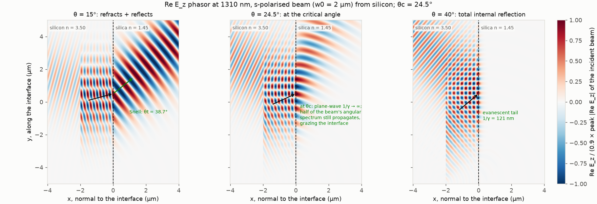
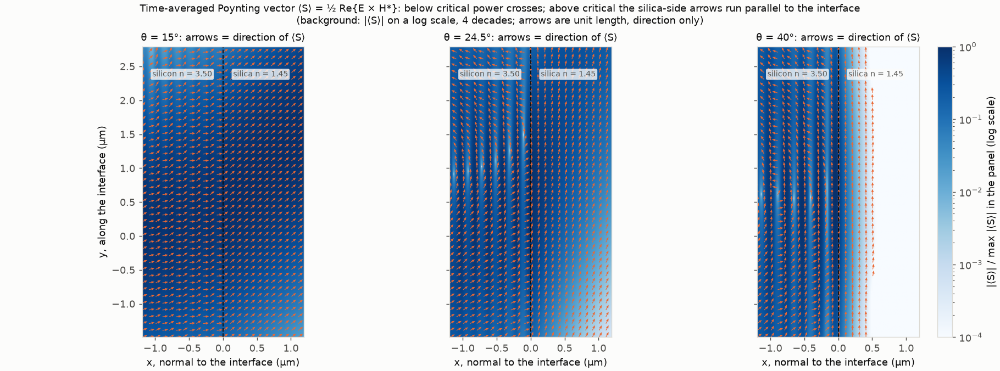
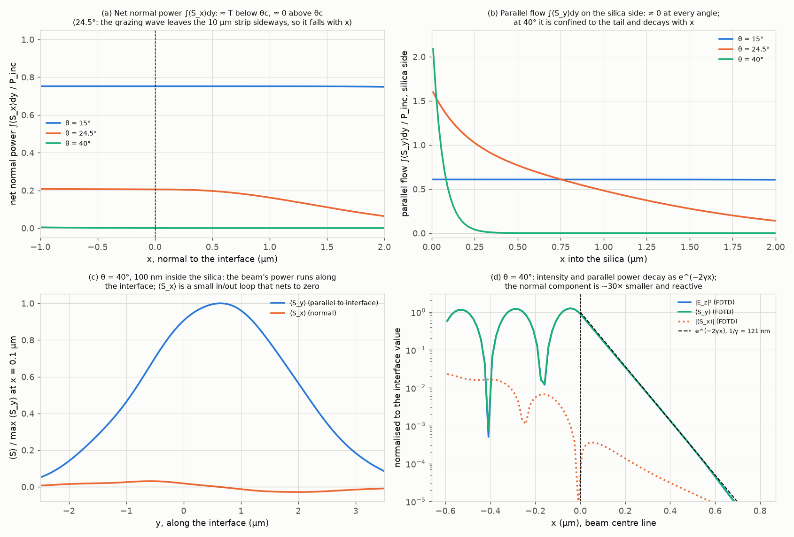
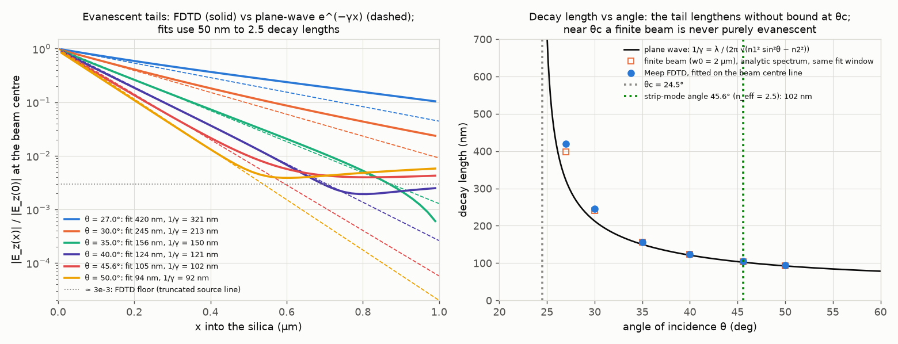
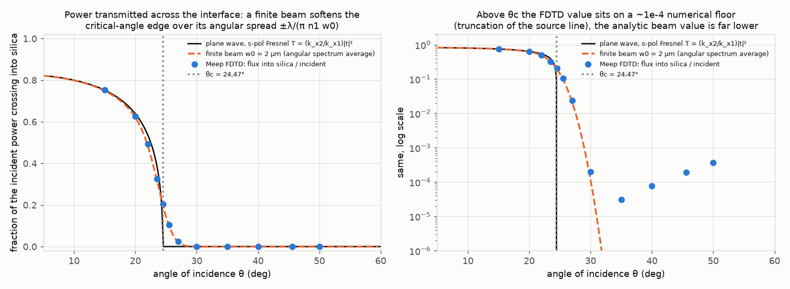
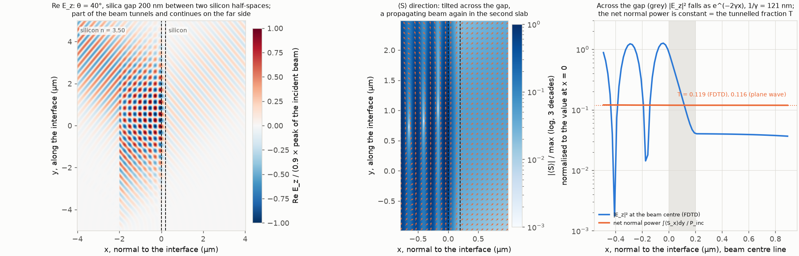
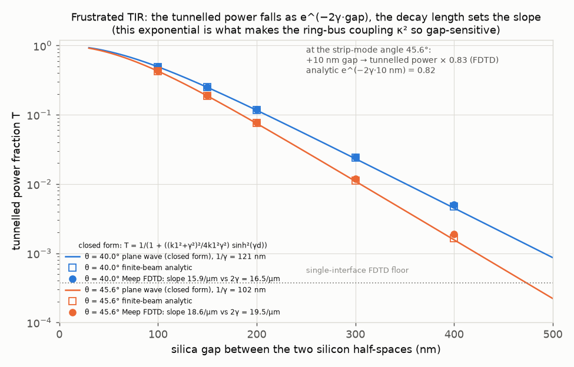

# 09. Total internal reflection and the evanescent field, watched in FDTD

**Concept** (docs/NOTES.md sections 4, 17, 24, 25, and 27 for the frustrated-TIR variant). The notes derive what happens when a plane wave in silicon meets silica beyond the critical angle: the tangential wavevector β = n1 k0 sin θ is shared across the boundary, k_x² = n2² k0² − β² turns negative, k_x = −jγ, and the field in the silica becomes e^{−γx} e^{−jβz}: a tail that decays away from the interface but still advances in phase along it, and whose time-averaged Poynting vector has ⟨S_x⟩ = 0 (no power leaves) but ⟨S_z⟩ > 0 (power flows along the boundary). Those are statements about a phasor; you cannot see them. This experiment launches a real 2-D Gaussian beam (1310 nm, waist 2 µm, s-polarised so E is the out-of-plane E_z, which is the notes' E_y) from the silicon onto a flat Si/SiO₂ interface in Meep and simply watches: at 15° the beam refracts and reflects, at the critical angle 24.5° it skims, at 40° it reflects totally and only a 121 nm tail enters the silica. From the simulated E_z, H_x, H_y phasors it computes ⟨S⟩ = ½ Re{E × H*} everywhere and draws it as arrows, so the notes' "normal component averages to zero, parallel component does not" becomes a picture; it fits the tail's decay length and compares it with 1/γ = λ/(2π√(n1² sin²θ − n2²)) at six angles; and it brings a second silicon slab to within 100–400 nm of the first to show the tail being intercepted (frustrated TIR): the power that tunnels falls as e^{−2γ·gap}, which is exactly the gap sensitivity of the ring–bus coupler in the capstone. Because the beam is finite, it also shows something the plane-wave notes cannot: near the critical angle a beam is never purely evanescent, because its angular spectrum straddles θc.

**Tools used**

### Meep (pymeep) 2-D FDTD with GaussianBeamSource, DFT field monitors and flux monitors
*What it is:* MIT's open-source finite-difference time-domain solver (version 1.34.0 here). It steps Maxwell's curl equations on a Yee grid in time, so any geometry and any source can be simulated without assuming a mode or a plane wave; it is the standard tool for photonic-crystal, waveguide and resonator design.
*What I used it for here:* a 2-D cell 10 × 12 µm (PML 1 µm) with silicon at x < 0 and silica at x > 0; a `GaussianBeamSource` line 2 µm inside the silicon launching an s-polarised (E_z) beam of waist w0 = 2 µm focused on the interface at angle θ; a narrow-band Gaussian pulse plus `add_dft_fields` (E_z, H_x, H_y) and `add_flux` monitors to get the steady-state phasors and the power crossing into the silica at exactly 1310 nm (a uniform-silicon run of the same source gives the incident power); a continuous-wave run sampled every 0.83 fs for the videos; a second silicon block at x > gap for the frustrated-TIR runs. 55 phasor runs (7 showcase, 24 angle-sweep, 12 flux-only resolution checks, 12 frustrated-TIR) and 6 continuous-wave runs, 61 Meep runs in total (resolution 60 px/µm for the showcase fields, 50 for the angle and gap sweeps, 30/40/80 for the resolution checks, 40 for the videos), run six at a time in a process pool.
*Result:* at 15° the power crossing into the silica is 0.7516 of the incident vs 0.7484 from the beam-averaged Fresnel formula (+0.4 %) and the transmitted Poynting direction is 38.97° vs Snell's 38.66° (+0.8 %); at the critical angle 0.2029 vs 0.1982 (+2.4 % at 60 px/µm; the flux-only resolution check gives +6.7 / +4.2 / +3.0 / +2.4 / +1.8 % at 30 / 40 / 50 / 60 / 80 px/µm, so the excess is grid convergence, not physics); at 40° the crossing power is 7.6e-5 (a numerical floor, see Checks) and the fitted tail decay length is 123.5 nm vs 1/γ = 121.2 nm (+1.9 %; +0.1 % against the finite-beam prediction 123.3 nm); the net normal Poynting flow in the silica at 40° is 2.0e-4 of the parallel flow; the frustrated-TIR tunnelling slope at the strip-mode angle 45.6° is 18.6 /µm vs 2γ = 19.5 /µm (−4.8 %; −3.9 % against the closed form evaluated over the same gaps, 19.35 /µm); the FTIR T at 45.6° with a 200 nm gap is 0.0776 vs the beam average 0.0756 (+2.7 % at 50 px/µm), converging as +6.6 / +3.9 / +2.7 / +1.3 % at 30 / 40 / 50 / 80 px/µm.
*How to observe it:* `cd experiments/09_tir_evanescent_fdtd && ../../.meep/bin/python run.py` (about 5 min on this laptop, 270 s in the last run; the log, kept in `out/run_log.txt`, shows each stage). Fields: `out/fields_three_angles.png`, `out/poynting_three_angles.png`, `out/ftir_field.png`; videos `out/tir_beams.mp4`, `out/ftir.mp4`. Every number is in `out/results.json`. Change `SHOW_ANGLES`, `SWEEP_ANGLES`, `FTIR_GAPS`, `RES_SHOW`, `RES_CHECK`, `LAM_NM` or `N2` in run.py, or `W0`, `SRC_X`, `SX`, `SY` in fdtd.py, and re-run.

### numpy + scipy (analytic angular-spectrum model, Fresnel/FTIR formulas, fits)
*What it is:* the array and scientific-computing libraries of Python (numpy 2.5.3, scipy 1.18.1); used here for the closed-form physics that the FDTD is compared with, not for the simulation itself.
*What I used it for here:* `analytic.py`: s-polarisation Fresnel coefficients r, t and the power fraction T = (k_x2/k_x1)|t|² for a single interface; the transfer formula through a silica gap (t = t12 t23 e^{−jk_x2 d}/(1 + r12 r23 e^{−2jk_x2 d}), which turns into the tunnelling factor e^{−γd} when k_x2 = −jγ) and the textbook closed form T = 1/(1 + ((k1² + γ²)²/4k1²γ²) sinh²(γd)); the decay constant γ = k0√(n1² sin²θ − n2²); a 2-D Gaussian-beam angular spectrum (`GaussianBeamSpectrum`: the beam is a Gaussian in β centred on n1 k0 sin θ, each component carrying its own k_x, r, t and γ, so the finite beam's transmission and its tail can be predicted rather than only the plane wave's); the time-averaged Poynting vector from the phasors (S_x = −½ Re{E_z H_y*}, S_y = ½ Re{E_z H_x*}); log-linear least-squares fits of decay lengths and tunnelling slopes; a Gaussian fit of the launched beam's footprint to check Meep's waist definition.
*Result:* θc = 24.47°; 1/γ at 40° = 121.2 nm and the finite-beam prediction over the same fit window 123.3 nm; beam-averaged T at the critical angle = 0.198 (plane wave: 0) vs FDTD 0.203; the launched waist fitted in the uniform-silicon runs is 2.00 µm at all three angles (Meep's `beam_w0` is the field 1/e radius, as assumed); the field-derived ½ Re ∫ E × H* dy at x = 0.3 µm is exactly 0.5000 × Meep's flux monitor (Meep's monitor omits the ½), agreement 1e-4 %.
*How to observe it:* `out/results.json` keys `showcase`, `angle_sweep`, `ftir`, `beam_waist_check`, `capstone`. `analytic.py` is pure numpy and importable on its own: `../../.venv/bin/python -c "import analytic as an, numpy as np; s = an.GaussianBeamSpectrum(3.5, 1.45, 2*np.pi/1.31, 30, 2.0); print(s.transmission_beam())"`.

### matplotlib (imshow, quiver, FuncAnimation + FFMpegWriter)
*What it is:* the standard Python plotting library (3.11.2); its animation module redraws a figure frame by frame and pipes the frames to ffmpeg.
*What I used it for here:* signed-field maps (`RdBu_r` centred on zero, each panel normalised to the peak of its own incident beam, with a shared colorbar), |⟨S⟩| maps on a four-decade log scale (`LogNorm`, colorbar labelled in decades) with unit-length direction arrows (`quiver`), the decay, transmission and tunnelling plots, and the two three-panel videos with contact sheets (same normalised E_z scale and colorbar).
*Result:* `out/fields_three_angles.png`, `out/poynting_three_angles.png`, `out/poynting_profiles.png`, `out/evanescent_decay.png`, `out/transmission_vs_angle.png`, `out/ftir_field.png`, `out/ftir_vs_gap.png`, `out/tir_beams.mp4` + `out/tir_beams_frames.png`, `out/ftir.mp4` + `out/ftir_frames.png`.
*How to observe it:* open the PNGs; play the mp4s in QuickTime or VLC. In `poynting_three_angles.png` look only at the orange arrows on the silica side: tilted at Snell's angle for 15°, grazing for 24.5°, vertical (parallel to the interface) for 40°.

### ffmpeg
*What it is:* the universal command-line video encoder (9.0.1, `/opt/homebrew/bin/ffmpeg`); matplotlib calls it to turn frame sequences into H.264 mp4 files.
*What I used it for here:* encoding the two videos at 30 fps (180 frames each, 6 s, 0.25 Meep time units = 0.83 fs between frames, i.e. about five frames per optical period of 4.37 fs).
*Result:* `out/tir_beams.mp4` and `out/ftir.mp4`, 1664 × 702 px, 6.0 s each.
*How to observe it:* `/opt/homebrew/bin/ffprobe out/tir_beams.mp4` prints the duration and frame size.

**What the simulation does**

Coordinates follow the notes: x is normal to the interface (silicon n1 = 3.50 at x < 0, silica n2 = 1.45 at x > 0), the direction along the interface is the notes' z (Meep calls it y, and every figure axis says "y, along the interface"), and the TE electric field points along the notes' y, which is Meep's out-of-plane z. So Meep's E_z, H_x, H_y are the notes' E_y, H_x, H_z. Meep's DFT phasors are conjugated to the notes' e^{jωt} convention (fdtd.py docstring); the Poynting vector is the same in both.

1. **Critical angle** (notes 24): sin θc = n2/n1 gives θc = 24.47°. The plane-wave angle that corresponds to the strip mode of the capstone, n_eff = n1 sin θ with n_eff = 2.5 (notes 21–22), is θ_ref = 45.58°; it is included in every sweep because its tail (1/γ = 102 nm) is the capstone's coupling tail.
2. **Beam launch.** A `GaussianBeamSource` on the line x = −2 µm, |y| ≤ 5 µm, with waist w0 = 2 µm (field 1/e radius, verified by fitting the footprint in a uniform-silicon run: 2.00 µm), focus on the interface at (0, 0.5 µm), propagation direction (cos θ, sin θ). The angular spectrum of the beam is a Gaussian in β of 1/e half-width 2 cos θ/w0, i.e. ±3.4° in angle inside the silicon; this is what softens the critical-angle edge.
3. **Phasors.** A Gaussian pulse (fwidth = 0.2 f) and DFT monitors at f = 1/1.31 µm⁻¹ over the whole interior (showcase) or over −0.25 < x < 1.25 µm (sweeps); run until 60 time units after the source has stopped. Flux monitors on the lines x = −0.3 µm (net +x power in the silicon: incident minus reflected) and x = +0.3 µm (power that crossed into the silica). A run with the same source in uniform silicon gives the incident power P_inc, so T = flux(+0.3)/P_inc and R = 1 − flux(−0.3)/P_inc.
4. **Poynting vector** (notes 25): from the phasors, ⟨S_x⟩ = −½ Re{E_z H_y*} (normal), ⟨S_y⟩ = ½ Re{E_z H_x*} (along the interface). Drawn as direction arrows on a log |⟨S⟩| background; integrated along lines x = const to get the net normal power (which must be x-independent in a lossless medium) and the parallel flow.
5. **Decay length** (notes 16–17, 24): |E_z(x)| on the beam-centre line in the silica is fitted with e^{−x/L} from x = 50 nm to 2.5 plane-wave decay lengths (capped at 500 nm) and compared with 1/γ = λ/(2π√(n1² sin²θ − n2²)) and with the same fit applied to the analytic finite-beam field Σ_β A(β) t(β) e^{−jk_x2(β)x} e^{−jβz}.
6. **Tangential wavevector** (notes 4, 24): the phase of E_z along the interface at x = 0.1 µm in the silica is fitted with a straight line; its slope must be the shared β = n1 k0 sin θ.
7. **Angle sweep**: 12 angles from 15° to 50° (T, R + T, and for θ ≥ 27° the decay length). **Resolution check** (flux only, no fields): the two FDTD-vs-analytic gaps that exceed 2 % (T at the critical angle 24.5°, and the frustrated-TIR T at θ_ref with a 200 nm gap) are re-run at 30, 40 and 80 px/µm (`RES_CHECK`) with the same normalisation run at each resolution, and the values at 50 (sweep) and 60 (showcase) px/µm are placed alongside, so the trend with grid spacing is visible (`results.json` key `resolution_check`).
8. **Frustrated TIR** (notes 27): a second silicon half-space at x > gap for gaps 100, 150, 200, 300, 400 nm at θ = 40° and θ_ref = 45.58°; the flux 0.3 µm inside the second slab is the tunnelled power. Compared with the closed form and with the beam average. The log-slope over gaps 200–400 nm is compared with 2γ.
9. **Videos**: continuous-wave runs (smooth 3-unit turn-on) sampled every 0.25 time units for 45 units (150 fs): the three showcase angles side by side, and the 40° beam with no second slab / gap 150 nm / gap 300 nm side by side.

**Results**

Re E_z of the steady-state phasor. Left: at 15° the transmitted wavefronts in the silica are longer (λ0/n2 = 903 nm vs 374 nm in silicon) and bend to Snell's 38.7°; the interference of incident and reflected beams makes the checkerboard in the silicon. Middle: at the critical angle the transmitted wave runs along the interface. Right: at 40° nothing propagates in the silica; the faint fringe hugging the interface is the 121 nm tail.

The notes' section 25, as a picture: arrows are the direction of ⟨S⟩. At 15° they cross the interface. At 40° every silica-side arrow is vertical: power flows along the interface, none across it. The 24.5° panel shows the transition: the arrows on the silica side lean over towards the interface direction.

Left: the net normal power ∫⟨S_x⟩dy is independent of x on both sides for 15° (0.75) and 40° (1e-4), as energy conservation in a lossless medium demands; for 24.5° it is 0.205 just inside the silica (equal to T) and then falls with x because the grazing transmitted wave leaves the 10 µm monitored strip through its end before reaching x = 2 µm (not absorption, just power leaving sideways). The parallel flow in the silica is large at 40° close to the interface and decays with x. Middle: 100 nm inside the silica at 40°, ⟨S_y⟩ is a Gaussian with the beam's footprint, while ⟨S_x⟩ is a small (3 % of the peak) loop, positive on the entry side and negative on the exit side, whose integral is 2e-4 of the parallel flow: the beam pushes a little energy into the silica on one side and takes it back on the other (the Goos–Hänchen picture). A single plane wave has ⟨S_x⟩ = 0 identically; a beam has ⟨S_x⟩ = 0 on average. Right: on the beam-centre line |E_z|² and ⟨S_y⟩ follow e^{−2γx} with 1/γ = 121 nm over five decades; |⟨S_x⟩| is 30× smaller and falls faster.

Left: tails at six angles, FDTD solid, plane-wave e^{−γx} dashed. Right: the decay length vs angle. At 35° and above, FDTD, finite-beam prediction and plane wave agree within 5 % (FDTD vs plane wave +1.7 to +4.2 %, FDTD vs finite beam +0.3 to +1.6 %). At 27° and 30° the FDTD tail is longer than 1/γ (by 31 % and 15 %) but agrees with the finite-beam prediction (5.6 % and 2.0 %): part of the beam's angular spectrum is below the critical angle and those components do not decay at all, so close to θc the notion of a single decay length breaks down for any real beam.

The power crossing into the silica vs angle. The plane-wave Fresnel curve drops to zero abruptly at θc; the finite beam (dashed) rounds the corner over its ±3.4° angular spread, and the FDTD points follow the beam curve, not the plane-wave one. Right, log scale: from 30° up the FDTD sits on a floor of 3e-05 to 4e-04 that is numerical (see Checks); the true value is astronomically small.

Frustrated TIR: at 40° with a 200 nm silica gap, part of the beam continues in the second slab (offset but parallel to the incident beam, as it must be: β is shared by all three media). Middle: inside the gap the Poynting arrows tilt across; in the second slab they point at 40° again. Right: across the gap |E_z|² falls as e^{−2γx}, the net normal power is constant at T = 0.119 (FDTD) vs 0.116 (plane-wave closed form) and 0.117 (beam average).

Tunnelled power vs gap at 40° and at the strip-mode angle 45.6°. It is exponential with slope 2γ once γ·gap ≳ 1, and the steeper line is the shorter decay length. This exponential is the ring–bus coupler's gap sensitivity.

Videos: [out/tir_beams.mp4](out/tir_beams.mp4) (three angles side by side, 150 fs; the beam arrives at about 60 fs, then the standing pattern builds on the silicon side while the silica side either fills with a refracted beam or stays dark) and [out/ftir.mp4](out/ftir.mp4) (40°: no second slab, gap 150 nm, gap 300 nm; watch the beam reappear on the far side, strong for 150 nm, weak for 300 nm). Stills: `out/tir_beams_frames.png`, `out/ftir_frames.png`.

| Quantity | Simulated (Meep) | Expected (notes / analytic) | Agreement |
|---|---|---|---|
| Critical angle | (input) | sin θc = 1.45/3.50 → 24.47° | — |
| T into silica, 15° | 0.7516 | 0.7484 beam average (0.7518 plane wave) | +0.4 % (0.0 %) |
| Transmitted power direction, 15° | 38.97° | Snell: 38.66° | +0.8 % |
| R + T, 15° | 1.0000 | 1 | 0.00 % |
| T into silica, 24.5° (= θc) | 0.2029 (60 px/µm) | 0.1982 beam average (plane wave: 0) | +2.4 % (grid convergence, see next row) |
| Same, resolution check: 30 / 40 / 50 / 60 / 80 px/µm | 0.2115 / 0.2064 / 0.2042 / 0.2029 / 0.2017 | 0.1982 | +6.7 / +4.2 / +3.0 / +2.4 / +1.8 % (monotone towards the analytic value) |
| T into silica, 40° | 7.6e-5 | 1e-24 beam average (plane wave: 0) | numerical floor, see Checks |
| Shared β along the interface, 15° / 24.5° / 40° | 4.354 / 6.917 / 10.718 rad/µm | n1 k0 sin θ = 4.345 / 6.962 / 10.791 | +0.2 % / −0.6 % / −0.7 % |
| Decay length 1/γ, 40° | 123.5 nm | 121.2 nm plane wave; 123.3 nm finite beam | +1.9 %; +0.1 % |
| Decay length, 45.58° (strip-mode angle) | 105.0 nm | 102.4 nm; 103.4 nm finite beam | +2.6 %; +1.6 % |
| Decay length, 50° | 94.0 nm | 92.4 nm; 93.1 nm finite beam | +1.7 %; +1.0 % |
| Decay length, 35° | 156.4 nm | 150.2 nm; 155.6 nm finite beam | +4.2 %; +0.5 % |
| Decay length, 30° | 245 nm | 213 nm; 240 nm finite beam | +15 %; +2.0 % |
| Decay length, 27° | 420 nm | 321 nm; 398 nm finite beam | +31 %; +5.6 % |
| Net ⟨S_x⟩ / net ⟨S_y⟩ at x = 0.1 µm, 40° | 2.0e-4 | 0 (notes 25) | — (local loop peaks at 3 %) |
| Net normal power in silica / P_inc, 40° | 1e-4 | 0 | — |
| Field-derived ½Re∫E×H*dy vs Meep flux monitor, 15° | ratio 0.5000 | 0.5 (Meep's monitor omits the ½) | 1e-4 % |
| Launched beam waist (uniform Si run) | 2.00 µm (all angles) | w0 = 2.0 µm | < 0.2 % |
| FTIR T at 40°, gap 100 / 150 / 200 / 300 / 400 nm | 0.497 / 0.251 / 0.119 / 0.0246 / 0.0050 | closed form 0.493 / 0.249 / 0.116 / 0.0232 / 0.0045; beam 0.493 / 0.250 / 0.117 / 0.0238 / 0.0048 | +0.9 / +0.8 / +2 / +3 / +5 % vs beam |
| FTIR T at 45.58°, gap 100 / 150 / 200 / 300 / 400 nm | 0.431 / 0.190 / 0.0776 / 0.0119 / 0.0019 | closed form 0.427 / 0.187 / 0.0749 / 0.0110 / 0.0016; beam 0.427 / 0.188 / 0.0756 / 0.0113 / 0.0017 | +1 / +1 / +3 / +5 / +14 % vs beam |
| FTIR T at 45.58°, gap 200 nm, resolution check: 30 / 40 / 50 / 80 px/µm | 0.0806 / 0.0786 / 0.0776 / 0.0766 | 0.0756 beam average | +6.6 / +3.9 / +2.7 / +1.3 % (monotone towards the analytic value) |
| FTIR log-slope 200–400 nm, 40° | 15.86 /µm | 2γ = 16.50 /µm (closed form over the same gaps: 16.27) | −3.9 % (−2.5 %) |
| FTIR log-slope 200–400 nm, 45.58° | 18.59 /µm | 2γ = 19.54 /µm (same gaps: 19.35) | −4.8 % (−3.9 %) |
| Tunnelled power change per +10 nm gap, 45.58° | ×0.83 (−17.0 %) | e^{−2γ·10 nm} = ×0.82 (−17.7 %) | 0.8 percentage points (1 % of the factor) |

All values are written by run.py to `out/results.json` (270 s total runtime in the last run, about 5 min; `runtime_s` in the file). The 40° decay-length row is the 60 px/µm showcase run; the other decay-length rows are the 50 px/µm sweep.

**Experiments to try**

1. **Walk the angle through θc.** Set `SHOW_ANGLES = [22.0, 24.47, 27.0]` in run.py. The 22° panel still has a refracted beam at a grazing 64.7° (Snell: asin(3.50 sin 22°/1.45); `experiments_to_try.item1_snell_angle_at_22deg` in results.json); at exactly θc the transmitted wavefronts are perpendicular to the interface; at 27° the tail is 321 nm long (`item1_decay_length_nm_at_27deg`) and clearly visible. Watch `showcase.<angle>_deg.net_Sx_over_net_Sy_at_x0p1um` in results.json (also collected under `experiments_to_try.item1_net_Sx_over_net_Sy_at_x0p1um_by_showcase_angle`) drop by orders of magnitude as the angle crosses θc: in the current run it is 1.24 at 15°, 0.15 at 24.5° and 2.0e-04 at 40°. Keep three angles (the field figure and the video have three panels); 40° is always run as well because `poynting_profiles.png` and the FTIR showcase use it (`TIR_SHOW`).
2. **Make the beam wider (or narrower).** Set `W0 = 4.0` (or 1.0) in fdtd.py. The angular spread halves (doubles), the rounded corner in `transmission_vs_angle.png` sharpens (softens), and the 27°/30° decay lengths move towards (away from) the plane-wave 1/γ. This is the cleanest demonstration that "a beam is a bundle of plane waves".
3. **Change the cladding index.** Set `N2 = 1.0` (air) or `N2 = 2.0` in run.py. θc becomes 16.6° (34.8°) and at 40° the decay length becomes 103 nm (202 nm) instead of 121 nm (`experiments_to_try.item3_cladding` in results.json): the tail is set by n1² sin²θ − n2², so a lower cladding index shortens it and a higher one lengthens it. This is the "oxide vs air cladding" lever for coupler gaps. With `N2 = 2.0` drop 27° and 30° from `DECAY_ANGLES` (they are below the new θc = 34.8°, so there is no tail to fit); the media labels in the figures follow `N2`.
4. **Push the second slab closer or further.** Set `FTIR_GAPS = [0.05, 0.075, 0.1, 0.125, 0.15]`. At small gaps the tunnelled power saturates towards the Fresnel value (sinh² → (γd)², the curve bends over) and the simple e^{−2γd} rule fails: a coupler with a very small gap is no longer "weakly coupled". None of these gaps reaches γ·gap = 1.5 (γ·150 nm = 1.24 at 40°, `experiments_to_try.item4_gamma_gap_at_40deg_for_150nm`), so run.py's tunnelling-slope fit falls back to the two largest gaps and records `slope_fit_in_asymptotic_region: false` under `ftir` in results.json; the fitted slope then comes out below 2γ, which is the point: sinh²(γd) has not yet become a pure exponential.
5. **Wavelength.** Set `LAM_NM = 1550.0` in run.py (line 37; it replaces `REF.lambda_nm` and is the one wavelength: K0, every analytic curve and the `lam=` argument of every Meep run follow it, and the figure titles quote it; keep the indices). `fdtd.py` keeps its own `LAM` only as the default of its standalone benchmark, and run.py logs a note when the two differ instead of stopping. γ scales with k0, so all decay lengths grow by 1550/1310 = 1.18 (at the strip-mode angle 102 → 121 nm, `experiments_to_try.item5_decay_length_nm_at_theta_ref_1550nm`) and the tunnelled power at a fixed 200 nm gap rises by ×1.78 (`item5_ftir_T_200nm_theta_ref_1550_over_1310_closed_form`). This is why the same coupler gap gives a different κ² per channel across a wide band.

**Capstone connection**

The reference ring (R = 6.3 µm, 500 × 220 nm strip, n_eff 2.5 textbook / 2.7 solver) couples to its bus through exactly the mechanism in `ftir_vs_gap.png`: the strip mode is, in the ray picture, the plane wave at θ_ref = asin(n_eff/n1) = 45.6°, its tail into the oxide is 1/γ = 102 nm (92 nm at the solver's n_eff 2.7), and a bus placed 200 nm away intercepts the tail like the second slab here. The power coupling κ² of the point coupler therefore scales like the tunnelled power, e^{−2γ·gap}. From this experiment: a +10 nm gap multiplies the tunnelled power by 0.83 (FDTD at 45.6°) vs e^{−2γ·10 nm} = 0.82 analytic, i.e. −17 to −18 % in κ² per 10 nm (−20 % with the solver's n_eff, the number REF/experiment 11 use). The reference κ² = 0.107 is set by a 200 nm lithographic gap, and critical coupling t = a = 0.945 requires κ² to land within a few percent of 1 − a² = 0.107: a 10 nm fabrication error moves the ring from critically coupled to noticeably under- or over-coupled, which changes the notch depth T_min = 0.016 and the slope the lock sits on at δ_opt = 108 pm. The second half of the capstone message is what the tail must not touch: anything with a different index inside a few decay lengths of the core (a heater metal, a via, a doped contact) loads the mode, so the heater sits ≥ 1 µm above the ring in oxide, which is why its thermal path is R_th = 8.8 K/mW with τ = 10 µs rather than something faster. Finally, the 0 vs ≠ 0 contrast in `poynting_three_angles.png` is the difference between confinement (experiment 06) and coupling: the tail carries no power outward at a single interface, and it carries power outward the moment a second guide is within reach.

**Checks**

- **Energy conservation.** R + T = 1.0000 at 15°, 0.9970 at 24.5°, 0.9991 at 40°. The deficits at the two higher angles are power leaving through the top end (y = +5 µm) of the strip between the two flux lines: at and above θc the transmitted/evanescent field runs along the interface and part of it reaches the PML in y before crossing x = +0.3 µm. The field-derived net normal power ∫⟨S_x⟩dy is x-independent to within 1e-3 on both sides at 15° and 40°; at 24.5° it falls from 0.205 at x = 0.1 µm to 0.064 at x = 2 µm (`net_normal_power_in_silica_over_incident_at_x2um`; at 15° it stays put: 0.752 at x = 0.1 µm, 0.749 at x = 2 µm) for the same sideways-exit reason (`poynting_profiles.png`, left).
- **Poynting vector against Meep's own monitor.** ½ Re ∫ E_z H_y* dy at x = 0.3 µm from the DFT arrays is 0.5000 × the flux monitor on the same line at 15° (0.5004 at 24.5°): Meep's `get_fluxes` returns Re ∫ E × H* without the ½. All ratios in this experiment (T, R, decay slopes) are monitor/monitor or field/field, so the factor cancels; where a field-derived power is normalised to the incident power, P_inc/2 is used (`P_inc_S` in run.py).
- **Beam definition.** The launched footprint on x = 0 in uniform silicon fits exp(−(y cos θ/w)²) with w = 2.00 µm at 15°, 24.5° and 40° (centre 0.507 µm vs the requested 0.5): Meep's `beam_w0` is the field 1/e radius and the analytic angular spectrum uses the same definition. The 2-D beam is what Meep launches (a 2-D Gaussian beam, not a 3-D one), and analytic.py uses the 2-D spectrum.
- **Numerical floor above θc.** The single-interface T of 3e-5 to 4e-4 at 30–50° is not physical (the beam-averaged value is < 1e-10 above 35°). Tests: moving the source line closer to the interface (−1.6 µm) or shrinking the waist to 1.5 µm lowers the floor by 4–10×, so it comes from the hard truncation of the beam at the ends of the 10 µm source line, which launches weak wide-angle components, some of them below θc. The same floor is visible as the 3e-3 amplitude shelf at x > 0.6 µm in `evanescent_decay.png`; the decay fits stop at 2.5 decay lengths for that reason. The FTIR points at 400 nm (T ≈ 2–5e-3) are only 5–13× above the floor, and their +5 % to +14 % excess over the analytic value is the floor adding in (the 100–200 nm points, 209–1336× above the floor, agree to 1–3 %).
- **Resolution.** Showcase fields at 60 px/µm (16.7 nm pixels: 7 pixels per 121 nm decay length), sweeps at 50 px/µm (20 nm), videos at 40 px/µm. The decay lengths at ≥ 35° are all 1–4 % long relative to the plane wave and within 0.1–1.6 % of the finite-beam prediction, so what is left is dominated by the beam physics, not the grid. The two transmission numbers that disagree with the beam-averaged analytic value by more than 2 % were re-run as flux-only checks at 30, 40 and 80 px/µm (`RES_CHECK`, 12 extra runs, `results.json` key `resolution_check`): T at the critical angle is +6.7 / +4.2 / +3.0 / +2.4 / +1.8 % above the analytic 0.1982 at 30 / 40 / 50 / 60 / 80 px/µm, and the FTIR T at 45.58° with a 200 nm gap is +6.6 / +3.9 / +2.7 / +1.3 % above 0.0756 at 30 / 40 / 50 / 80 px/µm. Both converge monotonically towards the analytic value as the grid is refined: the excess falls as resolution^−1.4 (critical angle) and resolution^−1.6 (FTIR point), between first- and second-order convergence, and extrapolating to infinite resolution assuming first-order (linear in 1/resolution) or second-order (linear in 1/resolution²) convergence brackets the limit at -1.5 % / +1.0 % for the critical angle and -2.1 % / +0.5 % for the FTIR point (`excess_vs_resolution_power_law_exponent`, `extrapolated_excess_pct_first_order`, `extrapolated_excess_pct_second_order` in `resolution_check`). So the +2.4 % and +2.7 % in the table are grid error converging to within about ±1 % of the analytic value, not a physics disagreement. The full sweeps were not moved to 80 px/µm because that would roughly triple the runtime; 50–60 px/µm keeps the total near 5 minutes.
- **Convention.** The DFT phasors are conjugated (Meep's e^{−iωt} → the notes' e^{+jωt}); the fitted phase slope along the interface is then −β with β > 0 (the notes' e^{−jβz}), and its magnitude matches n1 k0 sin θ to 0.7 %.
- **Limitations.** 2-D (an infinitely wide beam and interface along the third axis); s-polarisation only (p-polarisation has the same γ and θc but different Fresnel amplitudes and a Brewster angle at 22.5°); non-dispersive, lossless indices 3.50/1.45; the frustrated-TIR geometry is two half-spaces, not two waveguides, so the tunnelled power is a single-pass number without the phase-matched build-up that experiment 11 adds (the exponential gap dependence is the same).

**Files**

- `run.py`: orchestrates the 61 Meep runs (55 phasor + 6 continuous-wave, process pool), analysis, figures, videos, `out/results.json`, `out/tools.json`.
- `fdtd.py`: the Meep geometry, beam source, phasor (pulse + DFT + flux) and continuous-wave runs; picklable task wrappers for the pool.
- `analytic.py`: Fresnel, frustrated-TIR transfer and closed form, γ, the Gaussian-beam angular spectrum, Poynting from phasors, decay fits (pure numpy, works under either interpreter).
- `.uses_meep`: marker; run with `../../.meep/bin/python`.
- `out/fields_three_angles.png`, `out/poynting_three_angles.png`, `out/poynting_profiles.png`, `out/evanescent_decay.png`, `out/transmission_vs_angle.png`, `out/ftir_field.png`, `out/ftir_vs_gap.png`: figures.
- `out/tir_beams.mp4`, `out/tir_beams_frames.png`, `out/ftir.mp4`, `out/ftir_frames.png`: videos and contact sheets.
- `out/results.json`: every number quoted above; `out/tools.json`: the tool documentation.
- `out/run_log.txt`: console log of the last run (stage timings and the per-angle numbers; the bare "Elapsed run time" lines are printed by Meep when each worker process exits).
