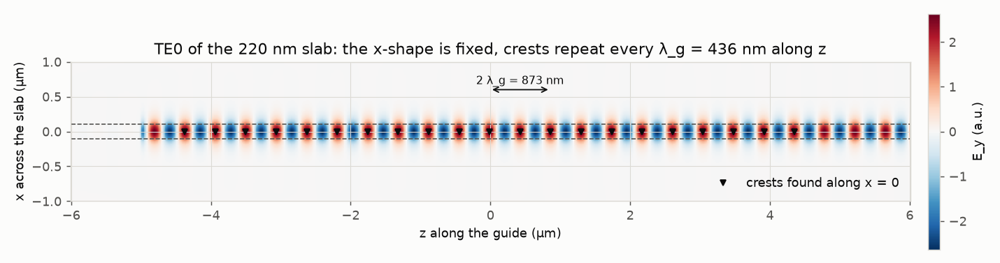
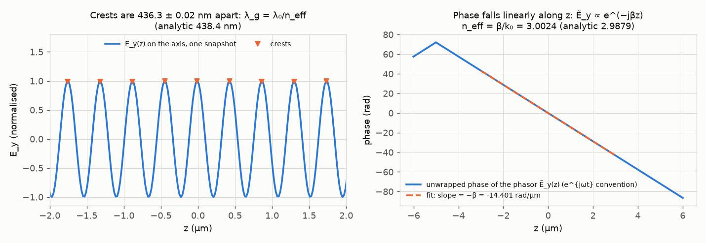
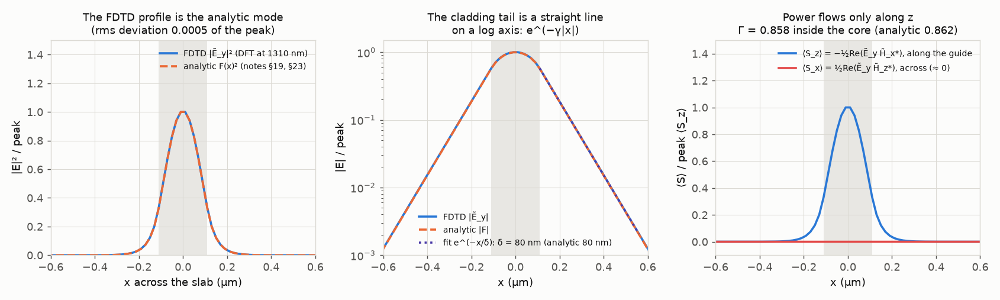
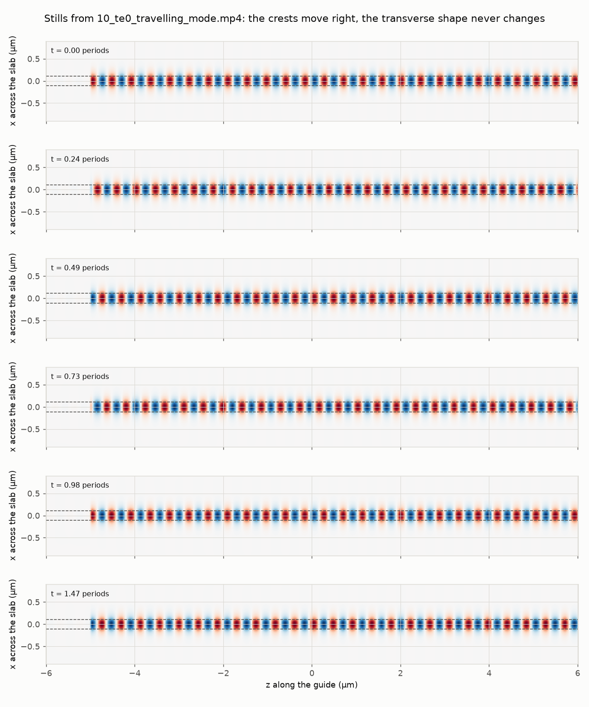
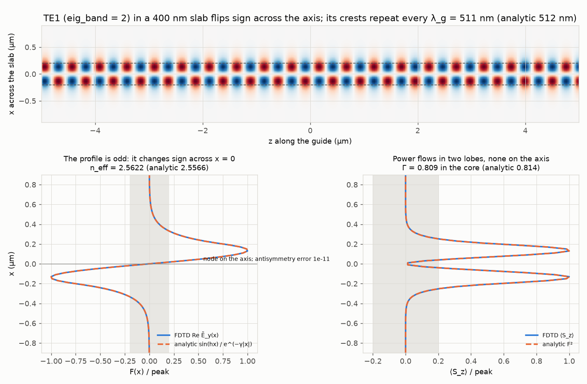
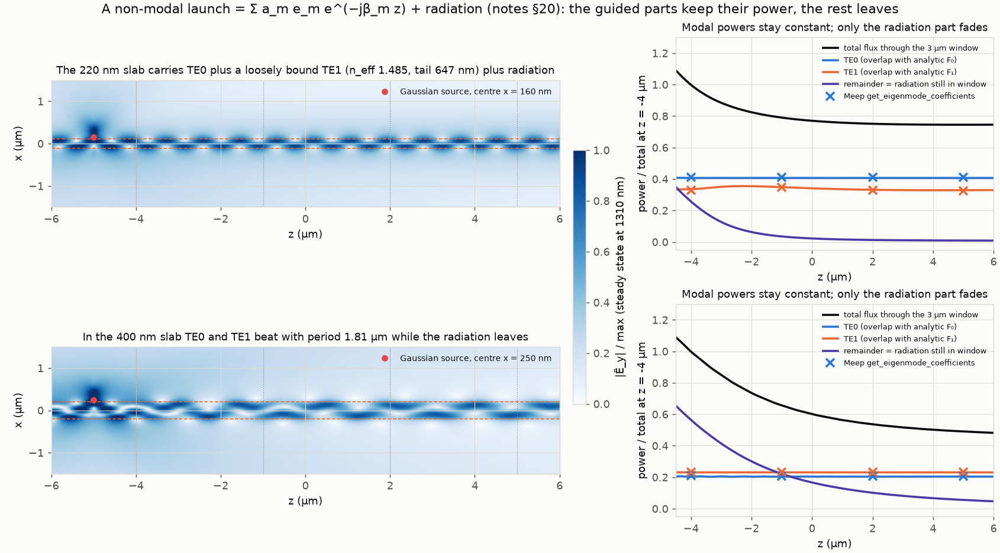
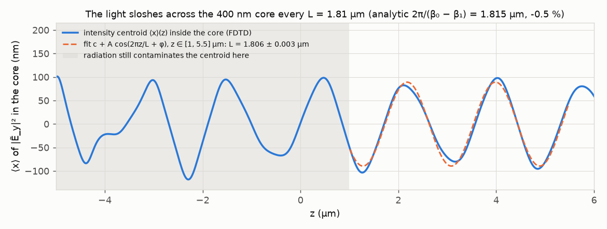
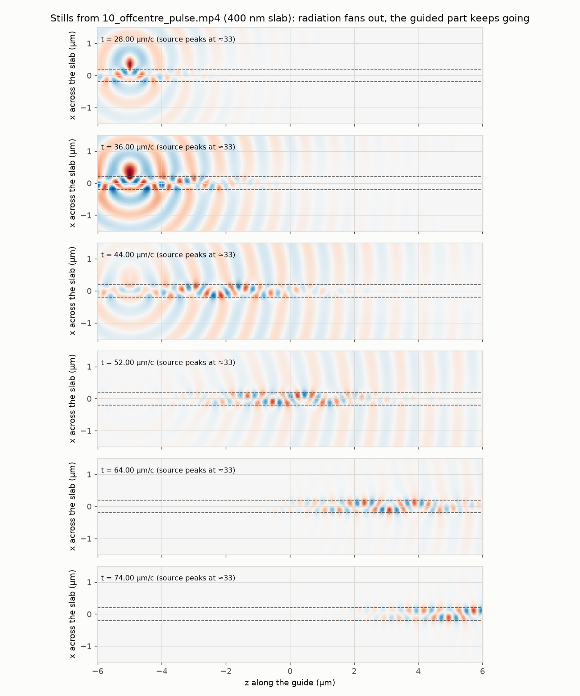
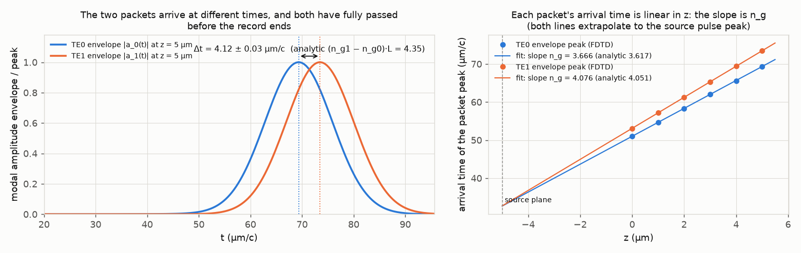

# 10. Slab mode in FDTD: watching a mode propagate, and what happens to a field that is not a mode

**Concept** (docs/NOTES.md sections 20 and 21, with 14 to 19, 22, 23 and 25 as background)

Experiment 07 *solved* for the slab modes: it found the (F(x), β) pairs that satisfy h tan(hd) = γ. This experiment does not assume modes exist at all. It hands Maxwell's equations to a time-domain solver (Meep, FDTD) with the 220 nm silicon slab in silica, injects the fundamental TE field at one end, and simply steps E and H forward in time. What you then *see* is section 21 word for word: across the slab the field is a standing shape F(x) that only scales and flips sign, while along the guide the crests march forward every λ_g = λ₀/n_eff. The solver also gives you the two things the eigenvalue equation cannot show directly: the time-averaged power flow ⟨S⟩ (it points purely along z, with a fraction Γ inside the core, and its transverse component is zero to one part in 10⁵, section 25), and what happens when the launched field is *not* a mode (section 20). A Gaussian spot placed off-centre on the slab breaks up, within a few micrometres, into TE0 plus TE1 plus a radiation field that leaves; the two guided parts keep exactly constant power along z while the total flux through the window falls, which is the numerical meaning of "an arbitrary launched field decomposes as Σ a_m e_m e^(−jβ_m z) + radiation fields". Every number the solver produces is compared with the analytic slab of 07.

Symbols (all defined once here): n₁ = 3.50 (silicon core), n₂ = 1.45 (silica cladding), 2d = 220 nm (slab thickness, d = 110 nm), λ₀ = 1310 nm, k₀ = 2π/λ₀, β the propagation constant along z, n_eff = β/k₀, λ_g = 2π/β the guided (phase) wavelength, h = √(n₁²k₀² − β²) the transverse wavenumber in the core, γ = √(β² − n₂²k₀²) the decay constant in the cladding, δ = 1/γ the decay length, F(x) the transverse profile of E_y, Γ the fraction of the longitudinal Poynting flux inside the core, ⟨S⟩ = ½ Re{Ẽ × H̃*} the time-averaged Poynting vector, a_m the modal amplitude of mode m. The notes' axes are used everywhere in the figures: z along the guide, x across the slab. (Meep's 2-D cell lives in its own x-y plane; the mapping is notes z = Meep x, notes x = Meep y, notes E_y = Meep Ez, notes H_x = Meep Hy, notes H_z = Meep Hx. It is written at the top of run.py.)

**Tools used**

### Meep (pymeep) 2-D FDTD with EigenModeSource, add_dft_fields, add_flux and get_eigenmode_coefficients
*What it is:* Meep is the open-source finite-difference time-domain (FDTD) Maxwell solver from MIT. It stores E and H on a staggered (Yee) grid and steps them in time with the curl equations, so it makes no assumption about modes, phasors or steady state; whatever Maxwell's equations allow is what appears. It is the standard tool for photonic-device simulation (couplers, rings, gratings) and it embeds the MPB eigenmode solver, which it uses to build mode-shaped sources and to project fields onto modes.
*What I used it for here:* a 2-D slab (n 3.50 core in n 1.45 cladding, 220 nm thick, and a 400 nm variant), 14 × 5 µm cell, 1 µm PML on all sides, 50 px/µm (20 nm pixels; the 80 nm tail is 4 px, λ_g is 22 px). (A) A continuous-wave `EigenModeSource` (eig_band = 1, parity EVEN_Y + ODD_Z) launches TE0; after 80 time units (61 optical periods) the complex phasors Ẽ_y, H̃_x, H̃_z at exactly 1310 nm are accumulated with `add_dft_fields` for 30 more periods, and 120 real-time snapshots of E_y(x, z, t), 8 time steps = 0.08 µm/c = 0.061 period apart (the nearest whole number of 0.01 µm/c steps to 1/16 period), are recorded for the video. Meep's DFT phasors are in its e^{−iωt} convention; run.py conjugates them once so that all phasors below follow the notes' e^{jωt} convention. (B) The same with eig_band = 2 in the 400 nm slab, which gives TE1. (C) A pulsed (Gaussian in time, fwidth 20 %) Ez line source with a Gaussian transverse profile of 250 nm waist centred 50 nm *outside* the core edge, run until the fields have decayed; the DFT then gives the exact steady-state response at 1310 nm; flux monitors at z = −4, −1, 2, 5 µm with `get_eigenmode_coefficients` give Meep's own TE0/TE1 powers at each plane, normalised by Meep's own flux monitor at z = −4 µm so that this check shares nothing with the overlap code. 190 real-time frames 0.4 µm/c apart (to t = 96 µm/c, long after both packets have passed z = 5 µm) give each mode's packet arrival time at z = 0, 1, …, 5 µm, whose slope is that mode's n_g. Resolution checks at 30, 50 and 80 px/µm repeat (A) without the video and repeat the 400 nm launch of (C) recording only those six columns.
*Result:* TE0 in the 220 nm slab: n_eff from the phase slope of the phasor = 3.0024 vs analytic 2.9879 (+0.48 %; 30 px/µm gives +0.88 %, 80 px/µm gives +0.11 %, so this is FDTD grid dispersion converging to the analytic value); crest spacing λ_g = 436.3 ± 0.02 nm over 21 crests vs λ₀/n_eff = 438.4 nm (−0.48 %, the same grid error) and vs the notes' rounded 441 nm (−1.1 %); confinement Γ = 0.8584 vs analytic 0.8623 (−0.46 %); cladding decay length 79.9 nm vs 79.8 nm (+0.08 %); the normalised |E|² profile deviates from F(x)² by 0.0005 rms; max |⟨S_x⟩| / max ⟨S_z⟩ = 8.8 × 10⁻⁶. TE1 in the 400 nm slab: n_eff 2.5622 vs 2.5566 (+0.22 %), λ_g 511.3 vs 512.4 nm, Γ 0.809 vs 0.814, the profile is antisymmetric to max|F(x) + F(−x)|/max|F| = 1 × 10⁻¹¹ and deviates from the analytic sin(hx)/e^{−γ|x|} by 0.0012 rms. Off-centre launch, 400 nm slab, at z = 5 µm: TE0 carries 0.204 and TE1 0.231 of the forward power that crossed z = −4 µm (Meep's own coefficients over Meep's own flux monitor: 0.207 / 0.233), the remaining 0.056 is radiation still inside the 3 µm window; the TE0/TE1 beat length from a cosine fit to the core intensity centroid over z = 1 to 5.5 µm is 1.806 ± 0.003 µm vs 2π/(β₀ − β₁) = 1.815 µm (−0.5 %); the arrival-time slopes give n_g0 = 3.666 vs 3.617 (+1.4 %) and n_g1 = 4.076 vs 4.051 (+0.6 %), converging with resolution (+3.6/+1.8 % at 30 px/µm, +0.6/+0.2 % at 80 px/µm); the TE1 packet arrives 4.12 ± 0.03 time units after the TE0 packet at z = 5 µm vs (n_g1 − n_g0)·L = 4.35 (−5.3 %, the difference of two n_g that are each about 1 % high). Off-centre launch, 220 nm slab: TE0 0.407 (Meep 0.413), TE1 0.329 (Meep 0.325), radiation 0.009 at z = 5 µm.
*How to observe it:* `cd experiments/10_slab_mode_fdtd && ../../.meep/bin/python run.py` (about 1.5 to 2.5 min on this laptop depending on what else is using the CPU; the exact time of the last run is `runtime_s` in `out/results.json`; needs the `.meep` interpreter, hence the `.uses_meep` marker). Watch `out/10_te0_travelling_mode.mp4` (top: E_y(x, z, t); bottom-left: the crest moving along z; bottom-right: the shape across x scaling and flipping sign inside the dashed analytic envelope) and `out/10_offcentre_pulse.mp4` (the pulse breaking into a guided part and radiation; in the 400 nm slab the TE0 and TE1 packets also separate in time because their group velocities differ). Stills: `out/10_te0_field_snapshot.png`, `out/10_te1_mode.png`, `out/10_offcentre_decomposition.png`, `out/10_offcentre_beat.png`, `out/10_offcentre_arrival.png`. Numbers: `out/results.json`. To change something edit the constants at the top of run.py: `RES` (30 to 80), `THICK` (0.15 to 0.30; below the 205.6 nm TE1 cutoff the slab is single-mode and run.py writes `null` for the TE1 entries), `THICK2` (must stay two-moded, run.py stops with a message otherwise), `LAM`, `STEADY_T`/`DFT_T`, or the `waist`/`offset` arguments of `run_offcentre()`, then re-run.

### numpy + scipy (analytic slab solver, overlap integrals, peak finding, least-squares fits)
*What it is:* numpy is the array library all scientific Python is built on; scipy adds numerical routines such as root finding (`brentq`), signal processing (`find_peaks`) and optimisation.
*What I used it for here:* `slab_analytic.py` solves the even/odd eigenvalue equations h tan(hd) = γ and −h cot(hd) = γ on the circle (hd)² + (γd)² = V² with `brentq` (the same roots as 07), builds F(x), and integrates F² in closed form for Γ. In run.py: crests of a real snapshot are located with `find_peaks` and refined to sub-pixel accuracy with a parabola through three points; β comes from a straight-line fit to the unwrapped phase of the phasor along z; the decay length from a fit to log|Ẽ_y| in the cladding (x from d + 40 nm to d + 320 nm); Γ from ⟨S_z⟩(x) interpolated onto a 20 000-point grid and integrated exactly to ±d (integrating on the 20 nm Meep grid loses the half-pixel at the core edge and underestimates Γ by several percent for TE1); and the modal decomposition a_m(z) = ∫Ẽ_y(x, z) F_m(x) dx / ∫F_m² dx uses the orthogonality of the TE slab modes, with modal power P_m = (β_m / 2ωμ) |a_m|² ∫F_m² dx (section 25/26); both integrals run over the same 3 µm analysis window, so P_m is the part of mode m's power that flows inside the window, consistent with the total flux through that window (for the loosely bound TE1 of the 220 nm slab 1.1 % of the mode's power lies outside it, `mode_power_fraction_inside_window` in results.json); the same projection applied to the real-time video frames at z = 0, 1, …, 5 µm, with `scipy.signal.hilbert` for the envelope and a parabola through the three samples around its peak, gives the arrival time of each mode's packet at each plane, and `numpy.polyfit` of arrival time against z gives n_g as the slope; the TE0/TE1 beat length comes from `scipy.optimize.curve_fit` of c + A cos(Kz + φ) to the core intensity centroid ⟨x⟩(z) over z ∈ [1, 5.5] µm (a coarse scan of K with a linear least-squares fit of the amplitudes seeds the nonlinear fit), with the 1σ uncertainty from the fit covariance.
*Result:* analytic TE0 at 220 nm: n_eff 2.9879, λ_g 438.4 nm, δ 79.8 nm, Γ 0.8623, F(d)/F(0) = 0.572 (the notes' rounded values are 2.97, 441 nm and 80 nm, sections 22 and 23); the 400 nm slab: TE0 n_eff 3.2783 (n_g 3.617), TE1 2.5566 (n_g 4.051), beat length 1.815 µm. The group indices come from a central finite difference of n_eff(λ) (`group_index` in run.py, section 22). The overlap decomposition and Meep's `get_eigenmode_coefficients` agree to within 0.006 (absolute, in units of the launched forward power; the maximum over both modes and all eight monitored planes, `overlap_vs_meep_coeff_max_abs_difference` in results.json).
*How to observe it:* `../../.meep/bin/python slab_analytic.py` prints the mode tables for 220 and 400 nm. The fits live in the functions `neff_from_phase`, `lambda_g_from_peaks`, `core_fraction` and `decompose` in run.py; their outputs are the `te0_220nm`, `te1_400nm` and `offcentre_*` blocks of `out/results.json`.

### matplotlib (figures, FuncAnimation + FFMpegWriter videos)
*What it is:* the standard Python plotting library; its animation module renders a frame sequence and pipes it to ffmpeg.
*What I used it for here:* all PNG figures in the shared style (signed fields in RdBu_r centred on zero, |E| in Blues), the two MP4 videos (30 fps, 120 and 190 frames) and their contact sheets.
*Result:* `out/10_te0_field_snapshot.png`, `10_lambda_g_measurement.png`, `10_te0_profile.png`, `10_te1_mode.png`, `10_offcentre_decomposition.png`, `10_offcentre_beat.png`, `10_offcentre_arrival.png`, `10_te0_travelling_mode.mp4` (+ `_frames.png`), `10_offcentre_pulse.mp4` (+ `_frames.png`).
*How to observe it:* open the files in `out/`. Frame spacing is an exact whole number of Meep time steps (dt = 0.5/RES = 0.01 µm/c): `FRAME_STEPS` = 8 steps = 0.08 µm/c = 0.061 period for the mode video (the nearest whole number of steps to PERIOD/16; asking Meep for a non-multiple of dt rounds up by a step) and `PULSE_STEPS` = 40 steps = 0.40 µm/c for the pulse video; `n_frames` in `run_cw_mode(...)` and `PULSE_FRAMES` set the clip lengths.

### ffmpeg
*What it is:* the command-line video encoder that matplotlib's FFMpegWriter drives.
*What I used it for here:* encoding the two H.264 MP4 videos.
*Result:* `out/10_te0_travelling_mode.mp4` (4.0 s, 1430 × 832) and `out/10_offcentre_pulse.mp4` (6.3 s, 1430 × 806).
*How to observe it:* `/opt/homebrew/bin/ffprobe out/10_te0_travelling_mode.mp4` lists the stream; `FFMpegWriter(fps=30, bitrate=2500)` in run.py sets the encoding.

**What the simulation does**

Geometry (all parts): a 2-D cell 14 µm along z by 5 µm across x, 1 µm PML on every side, silicon slab n₁ = 3.50 of thickness 2d centred on x = 0, silica n₂ = 1.45 everywhere else, 50 px/µm. The analysis window is the 12 × 3 µm region outside the PML. Meep units: lengths in µm, frequency 1/λ = 0.7634, time in µm/c so one optical period is 1.31 time units. Fields are Meep's Ez, Hx, Hy which are the notes' E_y, H_z, H_x (section 13: TE has E_z = 0, E along y, H in the x-z plane; in Meep's plane the roles of the labels swap, nothing else).

Part A, the TE0 mode (sections 20, 21, 22, 25).
1. An eigenmode source at z = −5 µm injects the fundamental TE field, computed by MPB on the same grid, as a continuous wave with a 10-time-unit turn-on. The field is E_y(x, z, t) = F(x) cos(ωt − βz) (section 14), and the solver propagates it to the right.
2. After 80 time units the solution is a steady state. A DFT monitor then accumulates the phasors Ẽ_y(x, z), H̃_x, H̃_z at 1310 nm for 30 periods (section 3: dropping e^{jωt} is legal for a single-frequency field).
3. λ_g two ways: the mean spacing of the crests along the axis of a real snapshot (section 22, λ_g = 2π/β = λ₀/n_eff), and the slope of the unwrapped phase of Ẽ_y along z, which is −β (the phasor of the forward mode is e^{−jβz} times a real F(x), section 15, so its phase *falls* with z). One convention detail: Meep's DFT fields use the physicists' e^{−iωt}, under which the same forward wave reads e^{+iβz}; run.py conjugates the three DFT arrays once (in `phasors()`) so that every phasor in this experiment is in the notes' e^{jωt} convention, and the phase plot then has the negative slope the notes predict. Real parts of Ẽ × H̃* (the Poynting vector) and all |a_m|² are unchanged by conjugation, so nothing else depends on this.
4. The profile: |Ẽ_y|² averaged over z ∈ [−3, 3] µm against F(x)² = cos²(hx) inside, cos²(hd) e^{−2γ(|x|−d)} outside (section 19); a fit of log|Ẽ_y| in the cladding gives δ = 1/γ (section 16).
5. Power flow: ⟨S_z⟩ = −½ Re(Ẽ_y H̃_x*) and ⟨S_x⟩ = ½ Re(Ẽ_y H̃_z*) (section 25). Γ = ∫_core ⟨S_z⟩ dx / ∫ ⟨S_z⟩ dx. For a lossless TE slab mode ⟨S_z⟩ = (β/2ωμ)|F|² and ⟨S_x⟩ = 0 exactly, so the two curves are a test of the solver, not of the theory.
6. Video: 120 snapshots 0.061 period (8 time steps) apart; the three panels are the three readings of E(z, t) from section 2, plus the standing shape of section 21.
7. The same launch at 30 and 80 px/µm to show how the n_eff error shrinks with resolution.

Part B, the second-order mode (section 19: "next odd with one node"). The 220 nm slab guides TE1 only barely (n_eff 1.485, tail 647 nm, cutoff thickness 205.6 nm from 07), so the slab is thickened to 400 nm where TE1 has n_eff 2.557 and a 99 nm tail. The source uses eig_band = 2 with only ODD_Z parity (band 1 = TE0, band 2 = TE1). The snapshot shows the sign flip across x = 0; the profile is compared with sin(hx) inside and ±sin(hd) e^{−γ(|x|−d)} outside.

Part C, a launch that is not a mode (section 20). A Gaussian spot of 250 nm waist centred at x = d + 50 nm (on the upper edge, partly outside the core) is driven with a short pulse; the run continues until the fields have left, so the DFT at 1310 nm is the exact steady-state response. At every z column the phasor is projected onto the analytic F₀ and F₁: a_m(z) = ∫Ẽ_y F_m dx / ∫F_m² dx, both integrals over the 3 µm window. |a_m|² times (β_m/2ωμ)∫F_m² is the modal power inside the window; the total ∫⟨S_z⟩ dx over the same window minus the modal powers is what is still radiating inside the window. If the thin slab is single-mode (item 2 or 5 of the experiments below) only F₀ is used and the TE1 entries are `null`. Meep's `get_eigenmode_coefficients` at four planes, divided by Meep's own flux monitor at z = −4 µm, is the independent check (it shares nothing with the overlap code; Meep's flux omits the ½ of the time average, so the monitor reads 1.99 × the DFT-window integral, which cancels in every ratio). In the 400 nm slab the two modes have different β, so their sum sloshes between the top and bottom of the core with period 2π/(β₀ − β₁) (the same beating that makes a directional coupler work, section 27). With only two modes present the intensity centroid inside the core is exactly ⟨x⟩(z) = c + A cos((β₀ − β₁)z + φ) (the cross term of |a₀F₀ + a₁F₁e^{−jΔβz}|² is the only odd-in-x part, and ∫F₀F₁dx = 0 keeps the denominator constant), so the beat length is the K of a cosine fitted to ⟨x⟩(z) over z ∈ [1, 5.5] µm, where the field is modal; closer to the source the radiation still distorts the centroid (`10_offcentre_beat.png` shows both regions). The group index of each mode comes from the real-time frames: the packet of mode m is projected out of every frame at z = 0, 1, …, 5 µm, the peak time of its Hilbert envelope is linear in z, and the slope dt/dz is n_g,m (t in µm/c). The same launch is repeated on the 220 nm slab, and (for the group indices only) at 30 and 80 px/µm.

**Results**

Video: [out/10_te0_travelling_mode.mp4](out/10_te0_travelling_mode.mp4). Look at the bottom-right panel: the orange curve is E_y(x) at z = 0; it grows, shrinks, passes through zero and comes back inverted, but it never leaves the dashed ±F(x) envelope and never changes shape. That is the whole content of "a mode preserves its transverse shape while propagating".

Video: [out/10_offcentre_pulse.mp4](out/10_offcentre_pulse.mp4). In the 400 nm row, by t ≈ 55 µm/c the guided packet has visibly split into two: TE0 (n_g = 3.62, faster) ahead and TE1 (n_g = 4.05) behind, while the circular wavefronts are the radiation part leaving the slab. Projecting each video frame onto F₀ and F₁ gives the two modal amplitude envelopes in time at any plane; the left panel shows them at z = 5 µm, the right panel the arrival time of each packet's peak against z:

Each packet's arrival time is a straight line in z whose slope is that mode's group index: n_g0 = 3.666 (analytic 3.617, +1.4 %) and n_g1 = 4.076 (analytic 4.051, +0.6 %), and both lines extrapolate back to t = 32.7 µm/c at the source plane, the peak of the source pulse. The two n_g are slightly high for the same reason n_eff is (grid dispersion: at 30 / 50 / 80 px/µm the errors are +3.6 / +1.4 / +0.6 % for TE0 and +1.8 / +0.6 / +0.2 % for TE1). At z = 5 µm TE1 arrives 4.12 ± 0.03 µm/c after TE0, against (n_g1 − n_g0) × 10 µm = 4.35 µm/c; that −5.3 % looks worse than either n_g because the delay is the *difference* of two numbers that are each about 1 % high (at 80 px/µm it is −2.8 %). This is the one place in the experiment where n_g, not n_eff, is what you measure (section 22: v_g ≈ c/n_eff only if n_eff did not depend on frequency, and here it does), and the packet spectra confirm that nothing else is going on: the |a_m(f)|²-weighted analytic n_g of each packet (`packet_spectrum_weighted_ng_analytic`, centre wavelengths 1309 and 1310 nm) equals n_g at 1310 nm to four digits, so the 20 % pulse bandwidth does not bias the comparison.

| Quantity | FDTD (this experiment) | Expectation (analytic, 07 / notes) | Agreement |
|---|---|---|---|
| TE0 n_eff, 220 nm slab, 50 px/µm | 3.0024 | 2.9879 (07 MPB on the same grid: 2.9903) | +0.48 % (grid dispersion; +0.88 % at 30 px/µm, +0.11 % at 80 px/µm) |
| TE0 λ_g from crest spacing | 436.3 ± 0.02 nm (21 crests) | λ₀/n_eff = 438.4 nm; notes §22 rounded 441 nm | −0.48 % / −1.1 % |
| TE0 λ_g from phase slope | 436.3 nm | 438.4 nm | −0.48 % |
| TE0 confinement Γ | 0.8584 | 0.8623 (strip textbook value 0.85) | −0.46 % |
| TE0 cladding decay length δ = 1/γ | 79.9 nm | 79.8 nm; notes §23 "80 nm" | +0.08 % |
| TE0 F(d)/F(0) | 0.577 | 0.572 | +0.8 % |
| rms deviation of normalised |E|² from F² | 0.0005 | 0 | – |
| max |⟨S_x⟩| / max ⟨S_z⟩ | 8.8 × 10⁻⁶ | 0 (§25) | – |
| TE1 n_eff, 400 nm slab | 2.5622 | 2.5566 | +0.22 % |
| TE1 λ_g | 511.3 nm | 512.4 nm | −0.2 % |
| TE1 Γ | 0.809 | 0.814 | −0.6 % |
| TE1 antisymmetry max|F(x) + F(−x)|/max|F| | 1 × 10⁻¹¹ | 0 (odd mode; the node at x = 0 follows) | – |
| TE1 rms deviation of Re Ẽ_y(x)/peak from sin(hx)/e^{−γ|x|} | 0.0012 | 0 | – |
| 400 nm off-centre launch: P_TE0 at z = 5 µm | 0.204 (Meep coeff. 0.207) | constant along z (std 0.0003 over z ∈ [0, 5]) | 1.5 % between the two methods |
| 400 nm off-centre launch: P_TE1 at z = 5 µm | 0.231 (Meep coeff. 0.233) | constant along z (std < 0.0001) | 0.9 % |
| 400 nm off-centre launch: radiation left in window at z = 5 µm | 0.056 (was 0.566 at z = −4 µm) | → 0 as z → ∞ | – |
| TE0/TE1 beat length, 400 nm (cosine fit to ⟨x⟩(z), z ∈ [1, 5.5] µm) | 1.806 ± 0.003 µm | 2π/(β₀ − β₁) = 1.815 µm | −0.5 % (peak spacing from z = −3.5 µm, inside the radiation zone, gives 1.77 ± 0.20 µm) |
| n_g of TE0 from the arrival-time slope, 400 nm | 3.666 | 3.617 (n_eff − λ dn_eff/dλ) | +1.4 % (grid dispersion; +3.6 % at 30, +0.6 % at 80 px/µm) |
| n_g of TE1 from the arrival-time slope, 400 nm | 4.076 | 4.051 | +0.6 % (+1.8 % at 30, +0.2 % at 80 px/µm) |
| TE1 − TE0 arrival delay at z = 5 µm (L = 10 µm), 400 nm | 4.12 ± 0.03 µm/c | (n_g1 − n_g0)·L = (4.051 − 3.617) × 10 = 4.35 µm/c | −5.3 % (difference of two n_g each ~1 % high; −2.8 % at 80 px/µm) |
| 220 nm off-centre launch at z = 5 µm: P_TE0 / P_TE1 / radiation | 0.407 / 0.329 / 0.009 | Meep coeff. 0.413 / 0.325 | 1.5 % / 1.2 % (TE1 has 1.1 % of its power outside the window) |
| dλ_r/dT from the FDTD Γ, textbook Γ-weighted heuristic (capstone) | 50.2 pm/K | 50 pm/K reference; 49.8 pm/K with the textbook Γ = 0.85 | +0.5 % |
| dλ_r/dT with the first-order perturbation weights (n_i/n_eff)·Γ_i, slab | 58.3 pm/K | 08 does this for the strip; the slab over-weights silicon because n_Si/n_eff = 1.17 | (labelling, see Capstone) |
| run time | about 1.5 to 2.5 min (exact value of the last run: `runtime_s` in results.json) | < 10 min | – |

All numbers are in `out/results.json` (and a short `out/results.txt`).

**Experiments to try**

1. *Resolution.* Set `RES = 30` and `RES = 80` at the top of run.py (or read the `resolution_convergence` table already in results.json). n_eff moves from +0.88 % to +0.11 % of the analytic value; λ_g moves the opposite way by the same amount. This is the FDTD grid making light travel slightly slowly, not physics; the eigenmode solver of 07 on the same grid is already at +0.08 % because it has no time-stepping error.
2. *Where the light lives.* Change `THICK` to 0.15 and to 0.30 µm. Γ falls to 0.73 and rises to 0.93, and δ grows/shrinks (07 has the curve). Watch the tail panel of `10_te0_profile.png`: the log-slope is 1/δ. At 0.15 µm the slab is below the 205.6 nm TE1 cutoff and is single-mode: run.py then solves, projects and plots only TE0 (the `P_te1_*` entries of `results.json` are `null`, `n_guided_modes` is 1, and the Part C bookkeeping for the thin slab is TE0 + radiation only), while the 400 nm slab of Part B is unaffected. At 0.30 µm TE1 is guided with n_eff = 2.05 and takes a visible share of the off-centre launch. (These expectations, and those of items 4 and 5, are computed by run.py with the analytic solver and stored under `analytic.experiments_to_try` in results.json.) Then think about which of these two thicknesses would make a ring-bus coupler more sensitive to a 10 nm gap error.
3. *Aim the source.* In `run_offcentre()` change `offset` to 0.0 (spot centred on the core) and to 0.30 µm (spot mostly in the cladding). Centred, the overlap with the odd TE1 vanishes by symmetry and almost everything goes into TE0; far off, most power radiates and the TE0 share collapses. The modal powers stay flat along z in every case: the launch decides the a_m once, propagation never changes them (section 20).
4. *Beating.* Change `THICK2` to 0.30 µm. β₀ − β₁ grows (TE1 is closer to cutoff), so the beat length 2π/(β₀ − β₁) shortens from 1.815 to 1.176 µm; check the `beat_length_*` entries (the cosine fit is seeded with the analytic value, so it follows the change) and count the sloshes in `10_offcentre_beat.png`. This is the coupler picture of section 27 inside a single guide: even and odd fields with different β exchange power between the two halves of the core.
5. *Wavelength.* Set `LAM = 1.55` (the O-band to C-band move). n_eff drops to 2.872 (weaker confinement, Γ 0.813), λ_g grows to 540 nm, δ lengthens to 99.5 nm (about 100 nm). At 220 nm the TE1 mode is now cut off (cutoff wavelength 1402 nm from 07), so the 220 nm slab is single-mode: as in item 2, run.py keeps only TE0 for that slab, the TE1 entries become `null`, and in the Part C bookkeeping everything that is not TE0 is radiation that leaves the window. The 400 nm slab still guides two modes (its cutoff thickness scales to 243 nm at 1550 nm), so Part B and the beat/arrival measurements still run. To keep the 220 nm slab *just* two-moded instead, try `LAM = 1.40`, 2 nm below the cutoff: TE1 then has a tail of several micrometres and never settles inside the 3 µm window, which is a good picture of what "barely guided" means.

**Capstone connection**

The mode shape F(x) is the quantity two of the capstone's reference numbers are built from.

- *Thermo-optic weighting.* The resonance shift per kelvin is dλ_r/dT = (λ/n_g)[Γ dn_Si/dT + (1 − Γ) dn_SiO₂/dT]. With the FDTD Γ = 0.858, dn_Si/dT = 1.86 × 10⁻⁴ /K, dn_SiO₂/dT = 1 × 10⁻⁵ /K, λ = 1310 nm and n_g = 4.2 this gives 50.2 pm/K, against the 50 pm/K the whole locking problem is built on (and 49.8 pm/K with the textbook's Γ = 0.85). Be clear about what this is: it is the textbook's Γ-weighted *heuristic*, the one the reference set is built on, with the FDTD Γ substituted in. First-order perturbation theory weights each region by n_i/n_eff times its share of ∫|E|² (dn_eff/dT = (n_Si/n_eff) Γ dn_Si/dT + (n_SiO₂/n_eff)(1 − Γ) dn_SiO₂/dT), and for this slab n_Si/n_eff = 3.50/3.00 = 1.17, so the proper weighting gives 58.5 pm/K (`dlambda_dT_pm_per_K_perturbation_theory_slab` in results.json). Experiment 08 does the perturbation properly for the 500 × 220 nm strip, where the mode is less confined and n_eff ≈ 2.7; the slab heuristic and the strip perturbation bracket the 50 pm/K reference, and the reference is the number the capstone uses. Either way, the 86 % of the power that the ⟨S_z⟩ panel shows inside silicon is why the ring follows silicon's thermo-optic coefficient almost fully. One kelvin is 50 pm = 0.13 of the 374 pm FWHM, which is why the lock must hold the ring to a fraction of a kelvin.
- *Coupling.* The ring-bus coupling κ is proportional to the field the bus sees at the gap, i.e. to F(d) e^{−γ·gap} with F(d)/F(0) = 0.57 and δ = 80 nm from this experiment. A 10 nm gap error changes κ by e^{−10/80} − 1 = −11.8 % and κ² by −22 %, the "fabrication lottery" in critical coupling t = a (experiment 11 does the full coupler).
- *What the coupler injects.* The point coupler does not inject a clean mode into the ring; it injects whatever field the evanescent overlap produces. Part C shows what happens next: within a few micrometres the field is TE0 plus radiation, the radiation is gone (a loss that lowers a), and the TE0 amplitude is fixed for the rest of the lap. The 500 × 220 nm strip is single-mode, so there is no TE1 to beat with; the 2-D 220 nm slab is only barely two-moded (TE1 cutoff at 205.6 nm), which is why a loosely bound TE1 still shows up here and would not in the real strip.
- *Which index is which.* n_eff (2.99 for this slab, ~2.7 for the strip in 08, 2.5 in the textbook) sets β and the phase per lap; n_g (4.2) sets the FSR and every shift formula. The FDTD phase slope and the crest spacing measure n_eff; the arrival-time slopes of Part C measure n_g (TE0 3.67 vs 3.62, TE1 4.08 vs 4.05 in the 400 nm slab, to 1.4 % and 0.6 %). The two are different numbers for the same mode, and the ring's FSR = c/(n_g L) and its 50 pm/K use the second one.

**Checks**

- The launched TE0 profile, Γ, δ, F(d)/F(0) and λ_g all match the analytic slab of 07 to better than 1 %, and ⟨S_x⟩ is zero to 10⁻⁵, so the solver reproduces sections 19, 21, 22, 23 and 25 quantitatively.
- The FDTD n_eff sits 0.5 % *above* the analytic 2.9879 at 50 px/µm and converges (0.88 %, 0.48 %, 0.11 % at 30, 50, 80 px/µm). This is numerical (grid) dispersion of the Yee scheme at ~19 pixels per wavelength in silicon, so λ_g from crest spacing comes out 0.5 % short. The eigenmode solver in 07 on the same 50 px/µm grid is at +0.08 %. The notes' 2.97 / 441 nm are rounded; the analytic 2.988 / 438.4 nm are the exact slab values, and the FDTD converges to those.
- The overlap decomposition with the *analytic* modes (normalised by the DFT-window Poynting integral at z = −4 µm) and Meep's `get_eigenmode_coefficients` with its *numerical* modes (normalised by Meep's own flux monitor at the same plane, so nothing is shared) agree within 0.006 of the launched power at all eight planes and for both modes, and the two total-flux readings (`P_total_window` vs `P_total_meep_flux` in results.json) agree to 0.25 % at every plane; the modal powers are flat along z to 0.0003 (TE0) in the 400 nm slab. The TE1 curve in the 220 nm slab wobbles by ~0.02 near the source because its 647 nm tail overlaps with radiation that has not left the window yet; the wobble disappears by z = 2 µm. The projection and the mode norm are both taken over the ±1.5 µm window, so the 1.1 % of the 220 nm TE1 power that lies outside the window is neither counted as TE1 nor as radiation; that is also the size of the residual TE1 difference (0.329 vs 0.325) between the analytic overlap and Meep's coefficient, whose MPB mode is normalised on the same 3 µm flux region.
- The beat length from the cosine fit over z ∈ [1, 5.5] µm is 1.806 ± 0.003 µm, 0.5 % short of 2π/(β₀ − β₁) = 1.815 µm, which is the size of the grid-dispersion error in β₀ − β₁ (each FDTD β is 0.2 to 0.5 % high; a difference of two such numbers can be off by about 0.6 %). Measuring the same centroid with `find_peaks` from z = −3.5 µm, as an earlier version did, gives 1.77 ± 0.20 µm (−2.8 %): the peaks at z < 1 µm sit where radiation still distorts the centroid (spacings from 1.50 to 2.00 µm), so that residual was a windowing artefact, not grid dispersion; results.json keeps it as `beat_length_peaks_from_z_minus3p5_*` for comparison.
- Confinement: integrating ⟨S_z⟩ on the 20 nm Meep grid with a pixel mask underestimates Γ (by ~6 % for TE1, whose field peaks near the core edge), so `core_fraction` interpolates to a fine grid first. The analytic profile sampled on the same grid and integrated the same way gives 0.8623, so the −0.46 % is the solver, not the integrator.
- Limitations: 2-D slab (infinite in y), so all numbers are slab numbers, not 500 × 220 nm strip numbers (see 08 for those: n_eff ~2.7, Γ ~0.85). Lossless, dispersionless materials (n fixed at 3.50 / 1.45). The "radiation" bookkeeping counts what crosses a 3 µm-high window; radiation at shallow angles is still inside it at z = 5 µm (0.056 of the launched power in the 400 nm case). Calling `get_array` on a simulation that has not run yet segfaults; `run_offcentre()` calls `sim.init_sim()` before its first frame grab for the Gaussian-pulse source, which is why run.py does that.
- The arrival times are measured from frames exactly 40 time steps = 0.40 µm/c apart (3.3 samples per optical period) with a Hilbert envelope and a parabolic peak fit; the record runs to t = 95.6 µm/c, by which both envelopes at z = 5 µm are back to < 0.4 % of their peak (`arrival_envelope_at_end_of_record_over_peak`), so there is no truncation artefact in the envelope (an earlier version stopped at t = 79.6 with the TE1 envelope still at 0.33 of its peak, which biased the TE1 peak). Per mode, the six arrival times lie on a straight line with rms residual 0.03 µm/c (TE0) and 0.0003 µm/c (TE1); the energy-centroid arrival time gives the same delay within 0.01 µm/c; the ± 0.03 on the delay is the larger of those. The slopes n_g0 and n_g1 are +1.4 % and +0.6 % high and converge with resolution like n_eff does (`group_index_from_arrival_slope.resolution_convergence`), so the −5.3 % on their difference is grid dispersion amplified by subtraction, not a measurement problem.
- Phasor sign: with Meep's raw DFT arrays the phase of the forward mode would *rise* with z (e^{−iωt} convention); the conjugation in `phasors()` is what makes the fitted slope −β = −14.401 rad/µm, as the notes' e^{−jβz} requires. Every power and every |a_m|² is independent of this choice.
- The TE1 node lands on x = 0 to machine precision (`node_position_nm` ≈ 10⁻⁹ nm) because the geometry, the grid and the launched band-2 mode are all symmetric about x = 0, so that number is not a solver test; the antisymmetry error and the rms deviation from the analytic odd profile in the table are.
- Run time about 1.5 to 2.5 min on this laptop (110 s with the CPU otherwise idle, 140 s while sharing it; about half is the two 80 px/µm convergence runs and the video encoding). `runtime_s` in results.json carries the exact value of the run that produced the current outputs.

**Files**

- `run.py` — everything: Meep runs, analysis, figures, videos, `out/results.json`, `out/results.txt`, `out/tools.json`.
- `slab_analytic.py` — analytic TE slab modes (roots, F(x), Γ, norms); pure numpy/scipy, importable under either interpreter.
- `.uses_meep` — marker: run with `../../.meep/bin/python`.
- `README.md` — this file.
- `out/10_te0_field_snapshot.png` — E_y(x, z) at one instant with the crests marked and 2λ_g annotated.
- `out/10_lambda_g_measurement.png` — crest spacing on the axis; unwrapped phase of the phasor with the β fit.
- `out/10_te0_profile.png` — |E|² vs F², the log-scale tail with the δ fit, ⟨S_z⟩ and ⟨S_x⟩ across x with Γ.
- `out/10_te0_travelling_mode.mp4`, `out/10_te0_travelling_mode_frames.png` — the mode in real time (field map, travelling z-cut, standing x-cut) and six stills.
- `out/10_te1_mode.png` — TE1 in the 400 nm slab: snapshot, odd profile with the node, ⟨S_z⟩ with Γ.
- `out/10_offcentre_decomposition.png` — steady-state |E| maps and the TE0/TE1/radiation power bookkeeping along z for both slabs, with Meep's coefficients overlaid.
- `out/10_offcentre_beat.png` — the core intensity centroid ⟨x⟩(z) in the 400 nm slab with the cosine fit that gives the TE0/TE1 beat length; the shaded part is where radiation still distorts it.
- `out/10_offcentre_arrival.png` — modal amplitude envelopes vs time at z = 5 µm in the 400 nm slab, and each packet's arrival time vs z with the straight-line fits whose slopes are n_g0 and n_g1.
- `out/10_offcentre_pulse.mp4`, `out/10_offcentre_pulse_frames.png` — the off-centre pulse in both slabs and six stills.
- `out/results.json`, `out/results.txt` — all numbers with analytic expectations and percent agreement.
- `out/tools.json` — the tool descriptions above in machine-readable form.
