# 11. The evanescent directional coupler: two guides trading power

**Concept** (docs/NOTES.md §26 ports and modal power, §27 how an evanescent directional coupler works; uses §16 to §19 for the slab modes, §21 for "standing across x, travelling along z", §25 for the Poynting vector, §28 and the capstone for the ring coupler)

The equations in §27 say that if two identical guides sit close enough for their evanescent tails (§16, decay length 1/γ ≈ 80 nm for the 220 nm slab) to overlap, the power launched in one obeys P₁ = cos²(κ_c z), P₂ = sin²(κ_c z), and that the same thing can be described as the beating of an even and an odd supermode with κ_c = (β₊ − β₋)/2. What the equations do not show is what this looks like: a Meep FDTD run lets you watch the field of a 1310 nm pulse walk from the top slab to the bottom one and back (out/pulse_hopping.mp4), see the steady-state |E| ribbon alternate between the guides every coupling length L_c (out/fdtd_fields.png), and read P₁(z) and P₂(z) straight off the time-averaged Poynting flux with their sum flat to 0.01 %. The supermode picture is then made concrete by computing F₊ and F₋ two ways (transfer matrix and Meep's eigenmode solver), adding and subtracting them, and reconstructing the same |E|² ribbon from |½F₊e^{−jβ₊z} + ½F₋e^{−jβ₋z}|². Three gaps (150, 200, 300 nm) show κ_c dropping exponentially with the single-slab γ, which is the fact behind the capstone's "a 10 nm gap error is 20 % of κ²". SAX turns the coupler into the 2×2 scattering matrix of §26/§27 (unitary, −90° cross phase) and shows amplitudes, not powers, adding; gdsfactory draws the real ring-bus point coupler and quantifies why a ring grazing a bus behaves like a straight coupler only ≈ 2 µm long.

**Tools used**

### Meep (pymeep 1.34), 2-D FDTD
*What it is:* Meep is MIT's open-source finite-difference time-domain solver for Maxwell's equations. It steps E and H forward in time on a Yee grid, so any geometry and any source can be simulated without approximations beyond the grid; it is the standard tool for "what does the field actually do" questions in photonics.
*What I used it for here:* Two 220 nm silicon slabs (n = 3.50) in silica (n = 1.45), stacked along y, propagating along +x, at 1310 nm with gaps 150 / 200 / 300 nm; 40 px/µm, 40 × 5 µm cell, 1 µm PML. Guide 1 carries a single-slab `EigenModeSource`; guide 2 starts abruptly at z = 0 so that the launch is exactly a(0) = a₀, b(0) = 0 of §27. A narrow-band Gaussian source with DFT monitors gives the steady-state phasors Ez, Hy; the time-averaged flux along the propagation axis, ⟨S_x⟩ = −½ Re(Ez Hy*) (§25; Meep's x is the notes' z), integrated over the top and bottom half-planes gives P₁(z), P₂(z), fitted to A sin²(κ_c (z − z₀)) + c. The code records whether this formula ever needed a sign flip (`fdtd_cw.*.poynting_sign_flipped`, asserted false for all three gaps), so the stated sign is the one actually used. A second, broadband run records Ez every 0.7 time units for the pulse video (with the Hilbert-envelope energy per guide underneath), and the CW phasor is re-animated as Re{Ẽ e^{jωt}} for the phase-front video.
*Result:* κ_c(FDTD) = 0.2362 / 0.1266 / 0.0364 rad/µm for 150 / 200 / 300 nm, i.e. 102.4 % / 102.8 % / 103.6 % of the analytic (β₊ − β₋)/2 = 0.2305 / 0.1231 / 0.0352 rad/µm, and 101.8 % / 101.5 % / 100.8 % of Meep's own eigenmode solver on the same grid. L_c(200 nm) = 12.40 µm (analytic 12.76 µm, 97.2 %). Up to 99.4 % of the power crosses to guide 2; P₁ + P₂ is constant to 0.008 %; fit RMS residual 3 × 10⁻⁴. The phase slope along guide 1 gives n̄ = 3.000 versus (n₊ + n₋)/2 = 2.987 analytic (0.4 % high) and 2.9615 from Meep's eigenmode solver on the same grid (1.3 % high); the second-order Yee dispersion estimate (kΔx)²/24·(1 − S²/n̄²) computed in `run.py` is 0.51 %, so about half of the excess is numerical dispersion and the rest is not resolved here (it does not enter κ_c, see Checks).
*How to observe it:* `cd experiments/11_directional_coupler && ../../.meep/bin/python run.py` (about 2 to 3 min on this laptop; it varies run to run, and the measured value is written to `timing_s.total_s` in `out/results.json`). Look at `out/fdtd_fields.png` (|E| ribbons, dashed lines every fitted L_c), `out/power_vs_z.png` (P₁, P₂ with the sin² fit and the analytic curve), `out/pulse_hopping.mp4` (+ `out/pulse_hopping_frames.png`) and `out/cw_phase_zoom.mp4` (+ `out/cw_phase_zoom_frames.png`). Change `GAPS_FDTD`, `RES` or `LAM` at the top of `run.py` (`K0 = 2π/LAM` is derived from it and `fdtd_coupler.py` takes its wavelength from `run.py` through `fc.set_wavelength`, so every stage follows one wavelength); change the cell length `SX`, the source position `X_SRC` or where guide 2 starts `X_START` in `fdtd_coupler.py`; pass `W2=` to `fc.run_cw` / `fc.run_pulse` for a thicker second guide (the fitted rate is then the generalised √(κ² + Δβ²/4), see Experiments to try #2); then re-run.

### Meep eigenmode solver (MPB inside Meep 1.34)
*What it is:* Meep embeds the MPB plane-wave eigenmode solver. Given a line (2-D) or plane (3-D) through the FDTD grid it returns the guided modes (β and the field profile) at a fixed frequency; it is what `EigenModeSource` and mode-decomposition monitors use internally.
*What I used it for here:* β of the single slab, and β₊ (even about the mid-gap plane, `EVEN_Y`) and β₋ (odd, `ODD_Y`) of the coupled slabs at six gaps (100 to 400 nm) on the same 40 px/µm grid as the FDTD, plus the two supermode profiles at 200 nm gap (`fdtd_coupler.eigen_supermodes`).
*Result:* Single slab n_eff = 2.9607 versus 2.9879 analytic (99.1 %: the 220 nm core is only 8.8 pixels thick, and the grid lowers every n_eff by ≈ 0.026). The supermode *splitting* is much less sensitive to that offset: κ_c = (β₊ − β₋)/2 at 200 nm = 0.1248 rad/µm (101.3 % of analytic), 99.9 % at 100 nm to 104.2 % at 400 nm. The FDTD fit agrees with this same-grid value to 1.5 % at 200 nm.
*How to observe it:* Run `run.py`; see `out/supermode_beat.png` (left: analytic F₊, F₋ as lines, Meep eigenmode as markers) and `out/kappa_vs_gap.png` (green squares). Edit `GAPS_EIG` in `run.py`; a resolution change (`RES`) moves the single-slab n_eff visibly.

### numpy / scipy transfer-matrix slab solver (`slab_coupler.py`)
*What it is:* A hand-written solver: the even TE slab eigenvalue equation h tan(hd) = γ of §19 with `scipy.optimize.brentq`, and a 2 × 2 transfer matrix for the pair (F, F′) across each layer of a stack (both continuous by §18), whose bound-state condition (purely decaying field in the top cladding, §16) gives every TE mode of any multilayer. Pure numpy/scipy, so both interpreters can import it.
*What I used it for here:* The reference numbers: single-slab n_eff, β, h, γ, 1/γ; the even/odd supermodes of the slab-gap-slab stack at any gap; κ_c = (β₊ − β₋)/2 and L_c = π/(2κ_c); the Yariv coupled-mode closed form κ_c = 2h²γe^{−γs}/[β(W + 2/γ)(h² + γ²)] as an independent check; the point-coupler length √(2πR/γ); the analytic beat map.
*Result:* n_eff = 2.9879, γ = 12.531 /µm, 1/γ = 79.8 nm (the 80 nm of §23). κ_c(150/200/300 nm) = 0.2305 / 0.1231 / 0.0352 rad/µm, L_c = 6.81 / 12.76 / 44.69 µm. The coupled-mode closed form agrees with the exact supermode splitting within 0.41 % over 50 to 500 nm. The slope of ln κ_c versus gap is −12.536 /µm, i.e. 100.0 % of the single-slab γ: κ_c ∝ e^{−γ·gap} exactly as §27 implies.
*How to observe it:* `out/kappa_vs_gap.png` (solid line = transfer matrix, dashed = closed form, dotted = e^{−γ gap}), `out/supermode_beat.png`. From either interpreter: `import slab_coupler as sc; sc.supermodes(0.2)`, `sc.cmt_kappa(0.2)`, `sc.single_slab_te(width=0.3)`.

### SAX 0.18.2 (with JAX 0.9.2)
*What it is:* SAX is the JAX-based S-parameter circuit simulator of the gdsfactory ecosystem. Components are Python functions returning S-dictionaries keyed by port pairs, and `sax.circuit` connects them through a netlist and solves the composite S-matrix, vectorised over wavelength or any parameter and differentiable.
*What I used it for here:* The 2 × 2 coupler model S = [[t, −jK], [−jK, t]] with t = cos(κ_c L), K = sin(κ_c L) (§27); a numerical unitarity and reciprocity check; |t|², |K|² versus coupler length for the three gaps; two coherent inputs s₁ = 1/√2, s₂ = e^{jφ}/√2 pushed through the S-matrix and, as a circuit, through coupler → phase shifter → coupler (a Mach-Zehnder); and the all-pass ring circuit from the brief (coupler + 39.6 µm doped waveguide) evaluated at κ² for gap errors −10 / 0 / +10 nm. One constant `A_RT = REF.a_round_trip = 0.945` at the top of `sax_part.py` is the round-trip amplitude retention for the whole file: the closed form T_min = ((t − a)/(1 − ta))² uses it directly and the SAX `waveguide` model uses it through `LOSS_DB_CM = −20 log₁₀(a)/L = 124.1 dB/cm` (REF's rounded 125 dB/cm would give a = 0.9446, recorded in `sax_results.json["round_trip"]`), so the closed form and the circuit are always talking about the same ring.
*Result:* max |S†S − I| = 2 × 10⁻¹⁶ (unitary to machine precision), S = Sᵀ, cross-port phase −90.0°. With two ½ W inputs, |s₁ + s₂|² swings from 0 to 2 W while |s₁|² + |s₂|² stays 1 W (the cross term 2 Re{s₁s₂*} of §26); the 50/50 coupler sends all 1 W to one port at φ = ±90° and P₃ + P₄ − 1 W = 7 × 10⁻¹⁶ for every φ. The MZI circuit matches sin²(φ/2)/cos²(φ/2) to 7 × 10⁻¹⁶. The ring circuit gives FSR 10.33 nm (expected λ²/(n_g L) = 10.32 nm, 100.1 %) and FWHM 368 pm (analytic (λ²/(π n_g L))·(1 − at)/√(at) = 372 pm for a = t = 0.945, 99.0 %, on a 1 pm wavelength grid; reference 374 pm, 98.4 %); κ² = 0.107 → 0.129 / 0.0886 for Δg = −10 / +10 nm (textbook γ), so T_min goes from ≈ 0 (t = a) to 0.0099 / 0.0098 in the SAX circuit, identical to the closed form ((t − a)/(1 − ta))² = 0.0099 / 0.0098 because both use a = 0.945 (`capstone.Tmin_at_pm10nm_sax_circuit` and `capstone.Tmin_at_pm10nm_textbook` in `out/results.json`), and the FWHM from 368 pm to 410 / 336 pm. Solving the inverse problem ((t − a)/(1 − ta))² = 0.016 for t (two roots, t = (a ∓ √0.016)/(1 ∓ 0.945·√0.016) = 0.9296 / 0.9571) and converting through κ² = 1 − t², Δg = −ln(asin√κ² / asin√0.107)/γ: the reference T_min = 0.016 corresponds to a gap error of −12.7 nm (over-coupled) or +12.8 nm (under-coupled) with the textbook γ, −9.9 / +10.0 nm with the 2-D slab γ (`point_coupler.*.gap_error_nm_for_ref_Tmin` in `out/sax_results.json`).
*How to observe it:* `../../.venv/bin/python sax_part.py` (run.py also calls it and saves `out/sax_part.log`); figures `out/sax_coupler_vs_length.png`, `out/sax_interference.png`, `out/critical_coupling_lottery.png`; numbers in `out/sax_results.json`. Change `A_RT` (one number moves both the closed form and the waveguide loss), the gap-error list `dg`, or `REF.kappa2`.

### gdsfactory 9.51.0
*What it is:* gdsfactory is a Python layout generator for photonic (and other) chips built on KLayout: parametric components such as rings, couplers and bends with ports and cross-sections, exported to GDSII for fabrication and re-readable as polygons.
*What I used it for here:* `ring_single` with R = 6.3 µm circular bends, 500 nm strips and a 200 nm gap to a straight bus (the capstone's point coupler), and `coupler`, a straight directional coupler with 200 nm gap whose parallel section is L_c(200 nm) = 12.76 µm, both written to GDS. The polygons are read back to measure the gap and radius, to check the parabola z²/(2R) against the ring's *centreline* circle (the lower vertices scaled radially to R; that circle is where the mode centres sit, so it is what the separation gap(z) = g₀ + z²/(2R) describes; the outer edge is a circle of radius R + w/2 and would mix in that offset), and to integrate κ(z) = κ₀e^{−γ(gap(z)−g₀)} numerically.
*Result:* Measured gap 200.0 nm, centreline radius 6.306 µm, width 0.503 µm (7 polygons). The parabola z²/(2R) deviates from the centreline circle by 14.4 nm at the outermost vertex inside |z| < 2.5 µm (at |z| = 2.30 µm; the expected z⁴/(8R³) is 13.9 nm there) and by only 0.5 nm inside the |z| < √(2R/γ) = 1.14 µm that carry the coupling. (The outer polygon edge happens to lie within 7 nm of the R-parabola out to 2.5 µm; that is a coincidence of the two radii R and R + w/2 and is recorded in `parabola_check.note`, not used as a check.) L_eff = √(2πR/γ) = 2.01 µm with the textbook γ (n_eff 2.5, 1/γ = 102 nm) and 1.78 µm with the 2-D slab γ; the numerical integral over the exact circle gives 2.00 / 1.77 µm (99.4 % / 99.5 %).
*How to observe it:* `../../.venv/bin/python gds_part.py`; open `out/ring_bus_coupler.gds` and `out/directional_coupler.gds` in KLayout, or look at `out/gds_layout.png` and `out/point_coupler_geometry.png`. Change `R`, `GAP` or the `dy`/`dx` of the S-bends in `gds_part.py`.

### matplotlib 3.11 + ffmpeg 9.0
*What it is:* matplotlib draws every figure; `FuncAnimation` + `FFMpegWriter` stream frames to the Homebrew ffmpeg to encode H.264 mp4 videos.
*What I used it for here:* All PNG figures (RdBu_r centred on zero for signed Ez, Blues for |E|), the two videos and their contact sheets.
*Result:* `out/pulse_hopping.mp4` (240 frames, 8.0 s, 1560 × 702) and `out/cw_phase_zoom.mp4` (72 frames, 2.4 s), plus `*_frames.png`.
*How to observe it:* open the mp4s; `n_frames`, `dt_frame` and `fwidth_frac` are arguments of `fc.run_pulse` in `run.py`, and `n_fr`/`periods` set the phase video.

**What the simulation does**

Geometry and symbols (2-D, Meep's TE-like polarisation: the slab TE field of §13 is Ez out of the plane; y is the direction across the slabs, x the propagation direction, called z in the notes and on every axis):

1. **Single slab (§16 to §19, §23).** n₁ = 3.50, n₂ = 1.45, 2d = 220 nm, λ₀ = 1310 nm, k₀ = 2π/λ₀ = 4.796 rad/µm. Solve h tan(hd) = γ on the circle (hd)² + (γd)² = V², V = 1.68 → n_eff = β/k₀ = 2.9879, γ = 12.53 /µm, 1/γ = 79.8 nm.
2. **Supermodes (§20, §27).** Stack silicon (220 nm) / silica (gap) / silicon (220 nm) in silica; the transfer matrix M(n, t) propagates (F, F′) across a layer (cos/sin in a layer where n k₀ > β, cosh/sinh where it is below); starting from the bounded solution (1, γ) in the bottom cladding, the top-cladding growing component F′ + γF must vanish; its roots in n_eff ∈ (n₂, n₁) are the modes. Two roots: even F₊ (n₊ = 3.0130 at 200 nm) and odd F₋ (n₋ = 2.9616). Then κ_c = (β₊ − β₋)/2 = k₀(n₊ − n₋)/2 = 0.1231 rad/µm and L_c = π/(2κ_c) = 12.76 µm. Normalising both to unit ∫F² dy, ½(F₊ + F₋) is the field of guide 1 alone and ½(F₊ − F₋) that of guide 2 (`out/supermode_beat.png`, left).
3. **The beat.** Launching guide 1 excites F₊ and F₋ equally; after a length z the field is ½F₊e^{−jβ₊z} + ½F₋e^{−jβ₋z} = e^{−jβ̄z}[½(F₊ + F₋) cos(κ_c z) − j ½(F₊ − F₋) sin(κ_c z)] with β̄ = (β₊ + β₋)/2: a common travelling phase times "guide 1 · cos − j · guide 2 · sin", i.e. a(z) = a₀ cos(κ_c z), b(z) = −j a₀ sin(κ_c z) of §27. `out/supermode_beat.png` (right) draws |·|² of this over 2 L_c above the FDTD |E|² over the same window.
4. **FDTD (§25, §26, §27).** For each gap: source in guide 1 at x = −18 µm, guide 2 begins at x = −16 µm (z = 0), DFT monitors over the whole non-PML cell record Ẽz, H̃y at f₀ = 1/1.31. ⟨S_x⟩ = −½ Re(Ẽz H̃y*) (the flux along the propagation axis; the code asserts that no sign flip was needed) is integrated over y > 0 (guide 1) and y < 0 (guide 2), mid-gap being the natural port boundary; P₁ + P₂ is the modal power of §26 and stays constant. Fit P₂/P₀ = A sin²(κ_c(z − z₀)) + c. Meep's DFT phasors follow e^{−iωt} (phase grows along +x); `run.py` detects the sign of the phase slope and conjugates, so every plotted Ẽ obeys the notes' e^{jωt}, e^{−jβz} convention (§3).
5. **κ_c versus gap.** Transfer matrix on 91 gaps from 50 to 500 nm, the closed form of Yariv, the Meep eigenmode splitting at six gaps and the FDTD fits at three, on a log axis; the slope of ln κ_c gives γ back.
6. **Videos.** A 0.2 f₀-bandwidth Gaussian pulse (≈ 2 µm long) in the 200 nm coupler, 240 frames of Ez (RdBu_r) with the pulse energy in each half-plane underneath (the instantaneous ∫E² dy oscillates at 2ω, a comb under the envelope, so the lower panel shows ∫|E_a|² dy with E_a = E + jℋ{E} the analytic signal from a Hilbert transform along z); and the CW phasor Re{Ẽ e^{jωt}} over two optical periods (T = 4.37 fs) in a 6 µm window around z = L_c/2, where both guides carry equal power: the transverse pattern is a standing shape and only the phase fronts move (§21).
7. **SAX.** `coupler_kL(kL)` returns the reciprocal S-dictionary of [[t, −jK], [−jK, t]]; `smatrix()` assembles the 2 × 2 numpy matrix (s_out = S s_in, §26); unitarity S†S = I is checked for 25 values of κ_c L; the interference curves use s_in = [1, e^{jφ}]/√2; `sax.circuit` builds the MZI and the all-pass ring (T = |(t − a e^{−jφ})/(1 − t a e^{−jφ})|² with a = A_RT = 0.945, entered into the `waveguide` model as the loss 124.1 dB/cm = −20 log₁₀(a)/(39.6 µm) that reproduces it exactly).
8. **Point coupler (capstone).** Along a bus tangent to a ring, gap(z) = g₀ + R − √(R² − z²) ≈ g₀ + z²/(2R). With κ(z) = κ₀ e^{−γ(gap − g₀)} = κ₀ e^{−γz²/(2R)}, ∫κ dz = κ₀ √(2πR/γ) = κ₀ L_eff. So κ² = sin²(κ₀ L_eff), and a gap error Δg multiplies κ₀ by e^{−γΔg}: for small κ, δκ²/κ² = −2γΔg. The same relation is inverted two ways: `run.py` finds the 2-D slab gap whose κ_c equals the capstone κ₀ (by interpolating the analytic κ_c(gap) table and, as a check, from κ_c(200 nm)e^{−γΔg}), and `sax_part.py` finds the Δg at which T_min reaches the reference 0.016. gdsfactory supplies the polygons to verify the parabola on the centreline; SAX evaluates the consequences for the ring notch.

**Results**

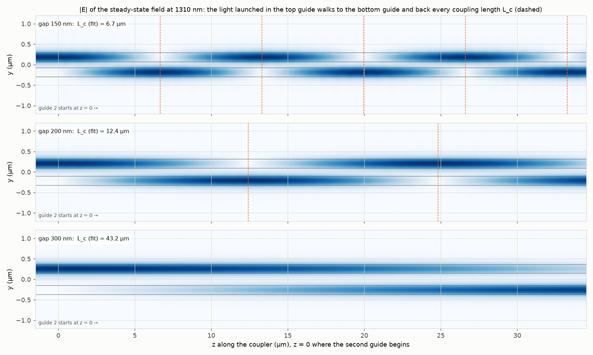

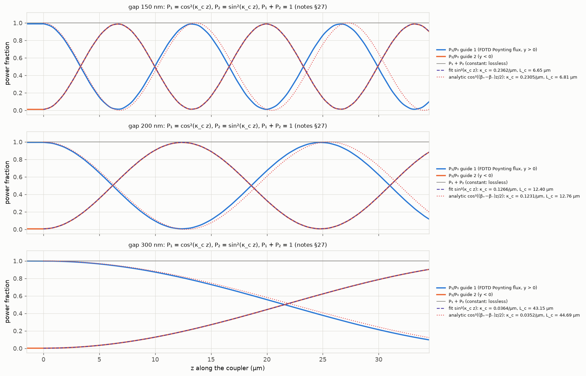

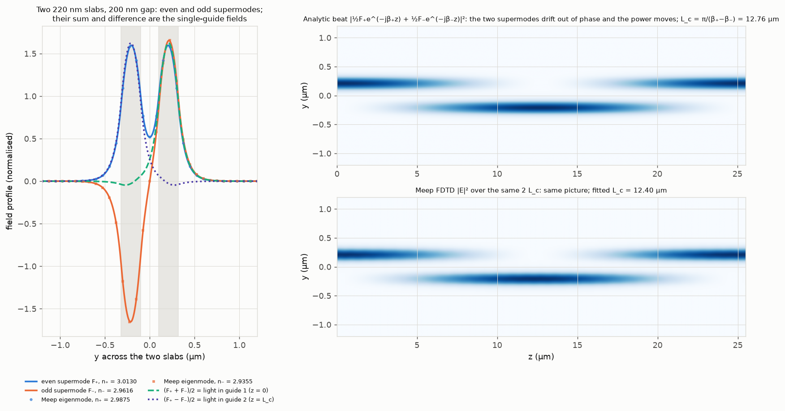

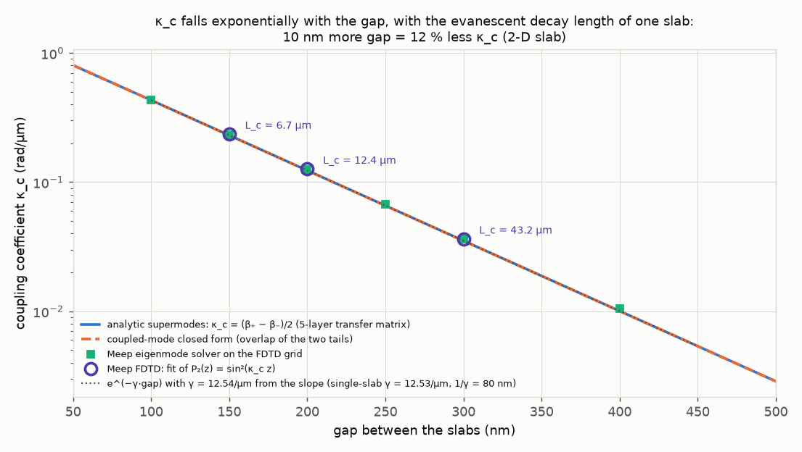

(The coupling length L_c = π/(2κ_c) is written next to each FDTD point; the full L_c table is in `fdtd_cw.*.L_c_fit_um` and `kappa_vs_gap_analytic.per_gap.*.L_c_um` of `out/results.json`.)

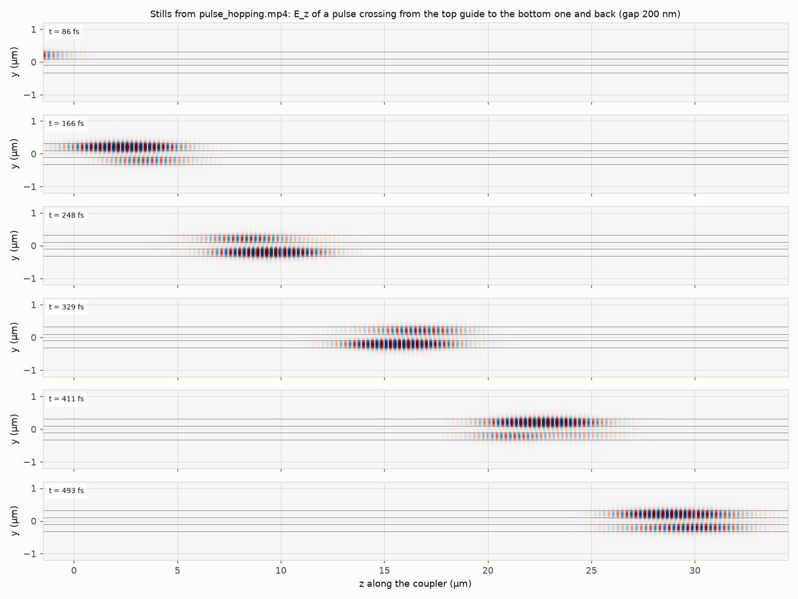

Video: [out/pulse_hopping.mp4](out/pulse_hopping.mp4) (8 s): the pulse enters in the top guide, is shared 50/50 at z ≈ 6 µm, sits entirely in the bottom guide at z ≈ 12 µm = L_c and is back on top at 2 L_c ≈ 25 µm; the lower panel tracks the envelope energy in each guide.

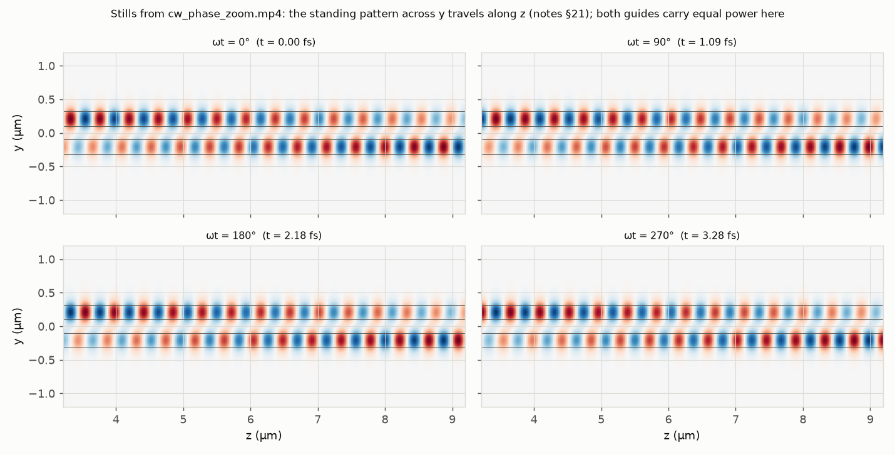

Video: [out/cw_phase_zoom.mp4](out/cw_phase_zoom.mp4) (2.4 s): the phase fronts stream along +z every λ_g ≈ 437 nm while the envelope, and the 50/50 split, do not change (§21: standing across y, travelling along z).

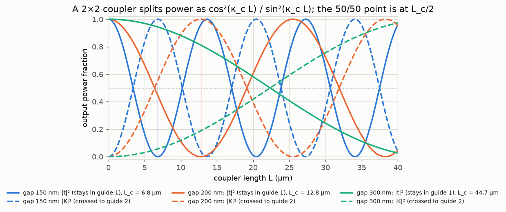

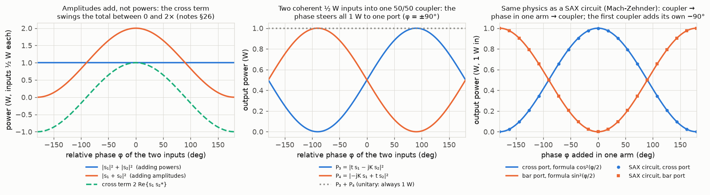

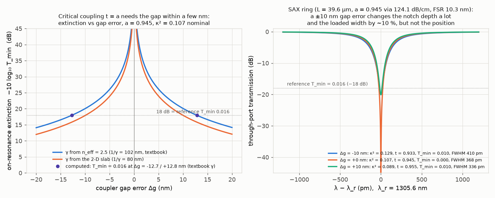

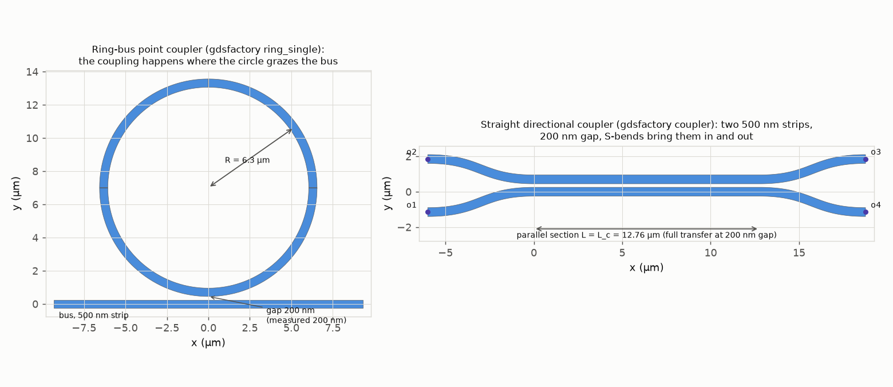

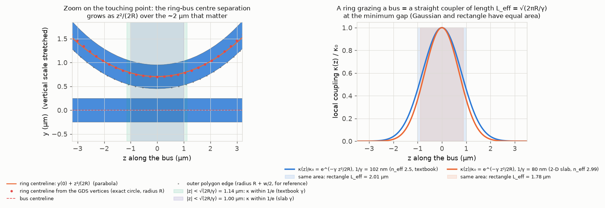

| Quantity | Simulated | Expected (analytic / notes) | Agreement |
|---|---|---|---|
| single slab n_eff, Meep eigenmode (40 px/µm) | 2.9607 | 2.9879 (h tan hd = γ) | 99.1 % |
| single slab 1/γ | 79.8 nm | ≈ 80 nm (§23) | 99.8 % |
| n₊, n₋ at 200 nm gap, analytic | 3.0130, 2.9616 | Meep eigen 2.9875, 2.9355 (grid offset −0.026 on both) | splitting 101.3 % |
| κ_c 150 nm: FDTD fit / Meep eigen / CMT | 0.2362 / 0.2320 / 0.2302 rad/µm | 0.2305 rad/µm (β₊−β₋)/2 | 102.4 / 100.6 / 99.9 % |
| κ_c 200 nm: FDTD fit / Meep eigen / CMT | 0.1266 / 0.1248 / 0.1230 rad/µm | 0.1231 rad/µm | 102.8 / 101.3 / 99.9 % |
| κ_c 300 nm: FDTD fit / Meep eigen / CMT | 0.0364 / 0.0361 / 0.0351 rad/µm | 0.0352 rad/µm | 103.6 / 102.7 / 99.8 % |
| L_c 150 / 200 / 300 nm, FDTD | 6.65 / 12.40 / 43.15 µm | 6.81 / 12.76 / 44.69 µm | 97.6 / 97.2 / 96.6 % |
| max P₂/P₀ (150 / 200 / 300 nm) | 0.989 / 0.994 / 0.902 | 1 / 1 / sin²(κ_c·34.5 µm) = 0.88 | ≈ full transfer |
| P₁ + P₂ variation along z | 0.008 % (200 nm) | 0 (lossless, §27) | pass |
| n̄ from FDTD phase slope | 3.0002 | (n₊ + n₋)/2 = 2.9873 analytic; 2.9615 same-grid eigenmode | 100.4 % / 101.3 % (Yee estimate explains 0.51 %; see Checks) |
| slope of ln κ_c vs gap | −12.536 /µm | −γ = −12.531 /µm | 100.0 % |
| CMT closed form vs exact supermodes | ≤ 0.41 % deviation, 50 to 500 nm | equal to first order | pass |
| max \|S†S − I\| (SAX) | 2.2 × 10⁻¹⁶ | 0 | unitary |
| cross-port phase | −90.0° | −90° (the −j of §27) | exact |
| \|s₁ + s₂\|² range, two ½ W inputs | 0 to 2.000 W | 1 ± 1 W (2Re{s₁s₂*}) | exact |
| all power to one port at | φ = ±90° | ±90° | exact |
| ring FSR (SAX, n_g 4.2, L 39.6 µm) | 10.33 nm | 10.32 nm; REF 10.3 nm | 100.1 % |
| ring FWHM (SAX circuit, a = t = 0.945, 1 pm grid) | 368 pm | 372 pm analytic (λ²/(π n_g L))(1 − at)/√(at); REF 374 pm | 99.0 % / 98.4 % |
| L_eff = √(2πR/γ), textbook γ (1/γ 102 nm) | 2.013 µm; circle integral 2.001 µm | ≈ 2 µm (brief) | 99.4 % |
| L_eff, 2-D slab γ (1/γ 80 nm) | 1.777 µm; circle integral 1.769 µm | | 99.5 % |
| κ² change for ∓10 nm gap, textbook γ | +20.6 % / −17.2 % | ±2γΔg = ±19.5 % ("±20 %") | matches |
| κ² change for ∓10 nm gap, 2-D slab γ | +27.1 % / −21.5 % | ±25.1 % | matches (steeper) |
| T_min for ∓10 nm gap error, closed form ((t − a)/(1 − ta))², a = 0.945 | 0.0099 / 0.0098 (≈ −20 dB) | 0 at t = a; REF T_min 0.016 (−18 dB) | see capstone |
| T_min for ∓10 nm gap error, SAX ring circuit, same a = 0.945 (124.1 dB/cm) | 0.0099 / 0.0098 | closed form above | 100.0 % |
| GDS gap / radius read back | 200.0 nm / 6.306 µm | 200 nm / 6.3 µm | exact / 100.1 % |
| parabola z²/(2R) vs centreline circle, at \|z\| = 2.30 µm / inside \|z\| < 1.14 µm | 14.4 nm / 0.5 nm | z⁴/(8R³) = 13.9 nm / ≤ 0.8 nm | matches |
| gap error that alone gives the reference T_min = 0.016, textbook γ | −12.7 nm (over) / +12.8 nm (under) | 2-D slab γ: −9.9 / +10.0 nm | computed (SAX) |
| 2-D slab gap whose κ_c equals the capstone κ₀ = 0.1655 rad/µm | 176 nm (table) / 176 nm (e^{−γΔg} from 200 nm) | < 200 nm (the strip's tail is longer than the slab's) | consistent |
| Poynting sign flip needed | false (all gaps) | false (S_x = −E_z H_y for Ez polarisation) | pass |
| run time | about 2 to 3 min on this laptop (measured value in `timing_s.total_s`; it varies run to run) | < 10 min | pass |

**Experiments to try**

1. *Shorter gap, faster sloshing.* Set `GAPS_FDTD = [0.10, 0.15, 0.20]` in `run.py`. At 100 nm, L_c = 3.64 µm: the ribbon in `fdtd_fields.png` should alternate nine times over the 34 µm window, and the point on `kappa_vs_gap.png` should still land on the e^{−γ gap} line (κ_c = 0.431 rad/µm).
2. *Break the identical-guides assumption.* Pass a thicker second guide, e.g. `fc.run_cw(g, RES, W2=0.24)` in stage C of `run.py` (`make_sim`, `run_cw` and `run_pulse` all take `W2`, default = `W` = 0.22; the slab outlines in every figure are drawn from the widths the run reports, and the sin² fit's amplitude is allowed down to 0.05). The supermodes are no longer symmetric/antisymmetric and the transfer becomes incomplete: the coupled-mode equations get a Δβ = β₁ − β₂ term, so P₂(z) = P₂,max sin²(κ_g z) with the *generalised* rate κ_g = √(κ² + Δβ²/4) and P₂,max = κ²/(κ² + Δβ²/4). Note that the fit (and (β₊ − β₋)/2) then returns κ_g, not the pure κ. `sc.supermodes(0.2, width2=0.24)` in `slab_coupler.py` gives the mismatched supermodes and returns `dbeta` and `P2_max` (for 220/240 nm at a 200 nm gap: κ_g = 0.171 rad/µm, P₂,max = 0.42, so less than half the power ever crosses); `sc.te_profile(n_eff, layers, ...)` with its `layers` shows the two mode profiles no longer having equal weight in the two guides. This is the mode-mismatch that makes a ring couple less well to a bus of different width.
3. *Wavelength dependence: "evanescent coupling alone is broadband" (§27).* Replace `LAM = REF.lambda_nm * 1e-3` at the top of `run.py` with `LAM = 1.26` and then `1.36`. `K0 = 2π/LAM` is derived from it on the next line, `fdtd_coupler.py` follows it through `fc.set_wavelength(LAM)`, and the analytic, eigenmode and FDTD stages (including the κ_c = k₀(n₊ − n₋)/2 conversion, n̄ from the phase slope and the λ_g label of the phase video) all use the same `LAM`; `sax_part.py` and `gds_part.py` keep the reference 1310 nm for the ring, which is what you want here. Expect: γ changes by a few percent, so κ_c and L_c move by only ≈ 10 % across the whole O-band, while the ring in `critical_coupling_lottery.png` selects 368 pm out of 10 300 pm. The narrow selection comes from the round trip and repeated interference, not from the coupler.
4. *Change the resolution.* `RES = 60` in `run.py` (≈ 3.4× slower for the FDTD stages: 2-D cost scales as RES³, two spatial dimensions plus the time step). The Meep eigenmode single-slab n_eff should move from 2.961 toward 2.988, and the FDTD κ_c should approach the analytic value from above (both the −0.9 % eigenmode offset and the +0.4 % phase-slope excess shrink). This is the cleanest way to see which numbers are physics and which are grid.
5. *Fabrication lottery on the ring.* In `sax_part.py` set `dg = np.array([-0.005, 0, +0.005])` (5 nm), or set `A_RT = 0.9986` at the top of the file for the passive 3 dB/cm ring (that one constant feeds both the closed-form T_min and, through `LOSS_DB_CM`, the SAX waveguide model, so the left panel and the ring spectra of `critical_coupling_lottery.png` change together): with a ≈ 1 the critical coupling point moves to t ≈ 1, i.e. κ² ≈ 0.3 %, the nominal κ² = 0.107 ring is then far over-coupled (shallow notch, wide line) and the same 10 nm error changes the extinction by a different amount. Compare `point_coupler.*.Tmin_at_gap_err_nm` and `ring_spectra_textbook_gamma.*.T_min` in `out/sax_results.json`.

**Capstone connection**

The ring-bus coupler of the Lightmatter modulator is a directional coupler with zero parallel length: a 6.3 µm ring grazing a 500 nm bus at a 200 nm gap. The point-coupler integral shows it behaves like a straight coupler of length L_eff = √(2πR/γ) = 2.0 µm (textbook γ from n_eff 2.5, decay length 102 nm) at the minimum gap. The reference power coupling κ² = 0.107 then needs κ₀ = asin(√0.107)/L_eff = 0.1655 rad/µm (`capstone.kappa0_for_ref_kappa2_per_um`), which in this 2-D slab model is the κ_c of a 176 nm gap (`capstone.gap_for_kappa0_slab2d_nm`, from the analytic κ_c(gap) table; the exponential estimate 200 nm − ln(κ₀/κ_c(200 nm))/γ gives 176 nm). The real 3-D strip has a weaker, more spread-out tail, which is why the physical gap is 200 nm; experiment 08 has the strip mode. Because κ_c ∝ e^{−γ·gap}, a 10 nm gap error changes κ² by −2γΔg ≈ ∓20 % (computed exactly: +20.6 % / −17.2 %; with the 2-D slab's shorter 80 nm tail it would be +27 % / −22 %). The reference ring is at critical coupling, t = √(1 − κ²) = 0.945 = a, where the notch bottom T_min = ((t − a)/(1 − ta))² is zero; the SAX ring circuit shows that a ±10 nm gap error alone lifts T_min to 0.0099 / 0.0098 (≈ −20 dB; the closed form with the same a = 0.945 gives the same numbers) and moves the loaded FWHM from 368 pm to 410 / 336 pm, while the resonance wavelength does not move. Critical coupling is therefore a fabrication lottery: nothing on the chip can trim κ² after the fact (the heater trims λ_r, not t), and the reference T_min = 0.016 (−18 dB) already corresponds to being 12.7 nm (over-coupled) or 12.8 nm (under-coupled) off the ideal gap with the textbook γ, 10 nm with the 2-D slab γ (`capstone.gap_error_nm_for_ref_Tmin_*`, marked on `critical_coupling_lottery.png`), or, equivalently, to a slightly different a. For the control loop this matters in two ways: (i) the photocurrent slope at the bias point δ_opt = 108 pm scales with the notch depth and width, both set by t versus a, so the sensor gain of experiment 13 is a per-ring, per-wafer number; (ii) the 50 pm/K thermal shift, the 10.3 nm FSR and the 374 pm FWHM come from the round trip (n_g, L, a, t), which the coupler feeds only through t. Finally, the coupler's tail is exactly the field a heater must not overlap: anything within a few decay lengths (80 to 100 nm) of the gap changes κ.

**Checks**

- **Analytic self-consistency.** The 5-layer transfer-matrix supermode splitting and the independent coupled-mode closed form agree within 0.41 % from 50 to 500 nm; the ln κ_c slope reproduces the single-slab γ to 0.04 %; the point-coupler formula agrees with the exact-circle integral to 0.6 %.
- **Two Meep solvers against each other and against the analytic slab.** The eigenmode solver on the 40 px/µm grid lowers every n_eff by 0.026 (−0.9 %, thin 8.8-pixel core) but the splitting κ_c is within 1.3 % of analytic at 200 nm; the FDTD fit is within 1.5 % of the same-grid eigenmode value and 2.8 % of analytic; total power along the coupler is conserved to 0.01 %; the fit residual is 3 × 10⁻⁴. The fitted z₀ is < 10 nm, so the abrupt start of guide 2 does not disturb the a(0) = a₀, b(0) = 0 launch.
- **Sign conventions.** The phase along guide 1 grows with x in Meep's raw DFT (e^{−iωt}); the code conjugates and records it (`results.json` → `fdtd_cw.*.phase_slope_sign`), so the animated Re{Ẽ e^{jωt}} moves in +z. The measured n̄ = 3.000 is 0.4 % above the analytic (n₊ + n₋)/2 = 2.987 and 1.3 % above the same-grid eigenmode value 2.9615 (`n_avg_excess_vs_meep_eigen_pct`). The second-order Yee dispersion estimate for a wave along a grid axis, k_num/k − 1 ≈ (kΔx)²/24·(1 − S²/n̄²) with 17.5 pixels per guided wavelength and Courant S = 0.5, is 0.51 % (`yee_dispersion_estimate_pct`, computed in `run.py`), so numerical dispersion explains about half of the excess; the remaining ≈ 0.8 % is not resolved here (candidates: the eigenmode solver's own subpixel-averaged ε versus the FDTD one, and the phase being read on a single y row). It does not affect κ_c, which is a difference of two β's computed on the same grid: the same (kΔx)² scaling applied to the splitting predicts ≈ 1.6 %, which is the size of the FDTD-versus-eigenmode κ_c gap at 200 nm (1.5 %). The Poynting formula ⟨S_x⟩ = −½ Re(Ez Hy*) was used as written: `poynting_sign_flipped` is false for all gaps and `run.py` asserts it.
- **SAX.** Unitarity, reciprocity and the −90° cross phase to machine precision; the MZI circuit equals the closed form; the ring circuit reproduces the FSR (100.1 %) and the FWHM (368 pm: 99.0 % of the analytic 372 pm for a = t = 0.945 and 98.4 % of the reference 374 pm, limited by the 1 pm wavelength grid). The closed-form T_min and the circuit's T_min agree to 4 significant figures because both derive from the single `A_RT`; before this was made explicit the circuit used 125 dB/cm (a = 0.9446) and gave 0.0092 / 0.0105 instead of 0.0099 / 0.0098, a reminder that a 0.0004 change in a matters when t − a is the quantity of interest.
- **gdsfactory.** Gap and radius read back from the polygons (200.0 nm, 6.306 µm); the parabola z²/(2R) matches the ring centreline circle (lower vertices scaled to R) to 0.5 nm inside |z| < 1.14 µm and to 14.4 nm at |z| = 2.30 µm, exactly the z⁴/(8R³) tail expected of a parabola versus a circle (13.9 nm). The centreline, not the outer edge, is used because the L_eff integral is about the separation of the mode centres; the earlier "6.7 nm against the outer edge" was a coincidence of the radii R and R + w/2.
- **Known limitations.** (1) 2-D slabs, not 500 × 220 nm strips: the 2-D n_eff (2.99) and γ (12.5 /µm) are larger than the strip's (n_eff ≈ 2.7 from the 3-D solvers of experiment 08; the textbook uses 2.5 and 1/γ = 102 nm), so the absolute κ_c per gap is larger here; every *relative* statement (exponential in the gap, supermode beating, unitarity, L_eff scaling) carries over. (2) 40 px/µm keeps the run at 2 to 3 minutes; the grid shifts n_eff by ≈ 1 % and κ_c by 1 to 4 % (worst at 400 nm where the splitting is smallest). (3) The 300 nm coupler is longer than the cell (L_c = 44.7 µm versus 34.5 µm available), so its κ_c comes from a partial sin² rise; the fit is still good (residual 5 × 10⁻⁵). (4) The SAX ring uses the textbook n_eff = 2.5 and n_g = 4.2, so its resonance nearest 1310 nm falls at 1305.6 nm; only differences (FSR, FWHM, depth) are meaningful. (5) The point-coupler integral assumes κ(gap) stays exponential and the coupling is weak (κ₀ L_eff = 0.33 rad, so sin² versus the small-angle square differs by 4 %); it ignores the phase mismatch between the curved ring mode and the straight bus mode, which reduces the effective coupling further in a real 3-D device.

**Files**

- `run.py` — entry point (Meep interpreter): analytic + Meep eigenmode + FDTD + videos, then calls the two .venv scripts, writes `out/results.json`, `out/tools.json`, `out/results.txt`
- `fdtd_coupler.py` — Meep geometry, CW (DFT) run, pulse run, eigenmode supermodes
- `slab_coupler.py` — numpy/scipy: single slab, transfer-matrix multilayer TE modes, supermodes, CMT closed form, point-coupler length
- `sax_part.py` — SAX coupler S-matrix, unitarity, interference, MZI, all-pass ring versus gap error (.venv)
- `gds_part.py` — gdsfactory ring-bus coupler and straight coupler, GDS export, polygon read-back, L_eff (.venv)
- `.uses_meep` — marker: run `run.py` with `../../.meep/bin/python`
- `README.md` — this file
- `out/fdtd_fields.png`, `out/power_vs_z.png`, `out/supermode_beat.png`, `out/kappa_vs_gap.png` — FDTD and supermode figures
- `out/pulse_hopping.mp4`, `out/pulse_hopping_frames.png` — pulse video and stills
- `out/cw_phase_zoom.mp4`, `out/cw_phase_zoom_frames.png` — CW phase-front video and stills
- `out/sax_coupler_vs_length.png`, `out/sax_interference.png`, `out/critical_coupling_lottery.png`, `out/sax_results.json`, `out/sax_part.log` — SAX outputs
- `out/gds_layout.png`, `out/point_coupler_geometry.png`, `out/ring_bus_coupler.gds`, `out/directional_coupler.gds`, `out/gds_results.json`, `out/gds_part.log` — gdsfactory outputs
- `out/results.json`, `out/results.txt`, `out/tools.json` — headline numbers and tool documentation
