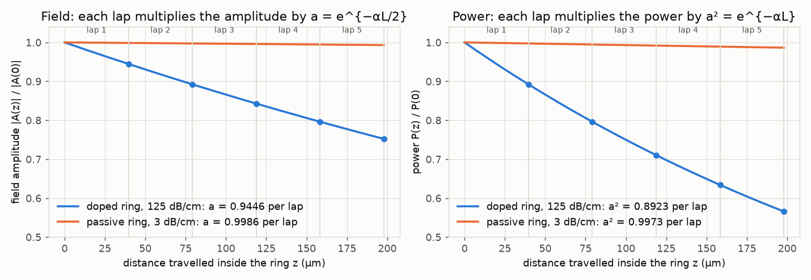
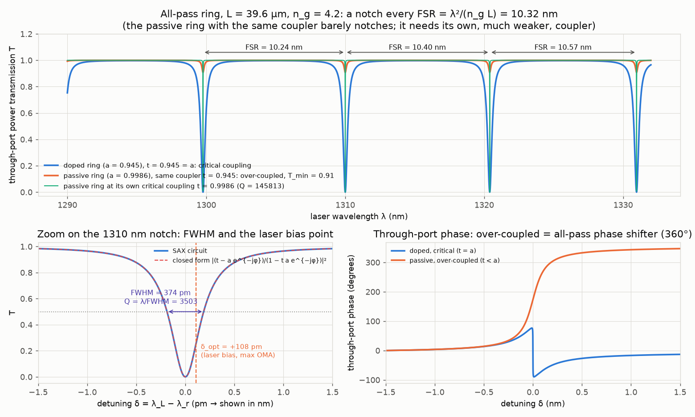
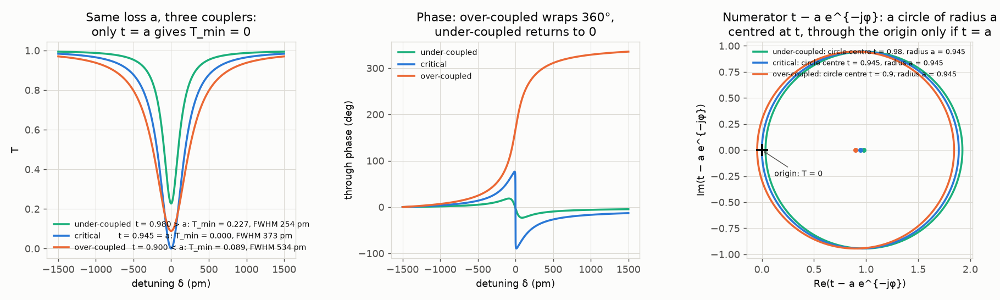
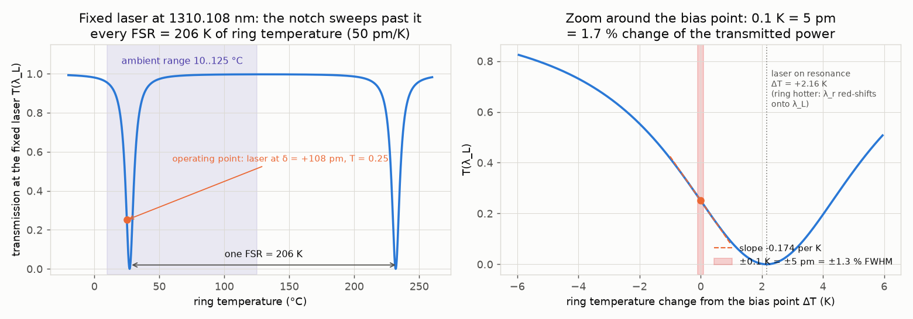
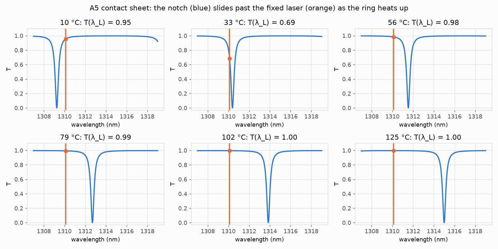
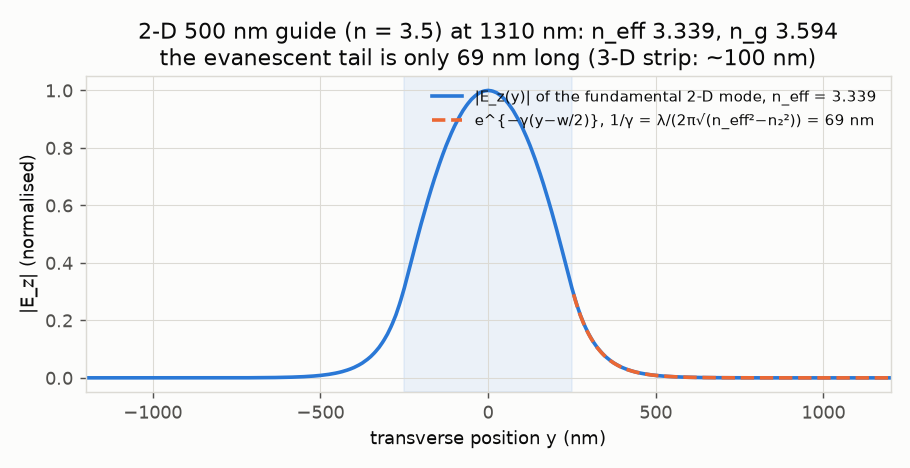
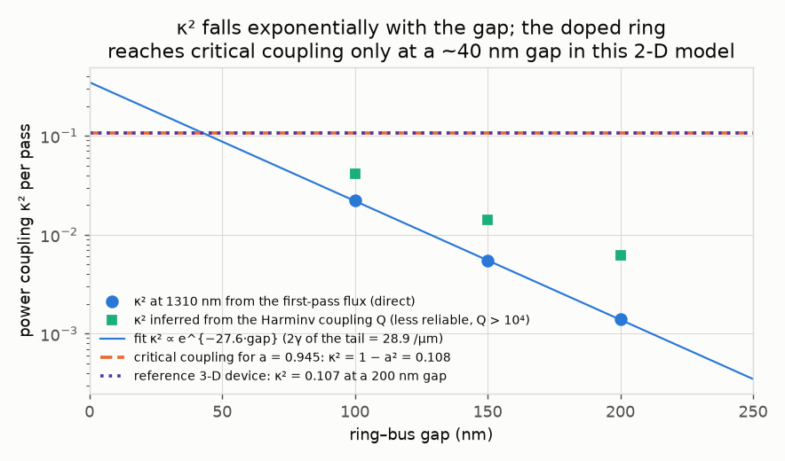
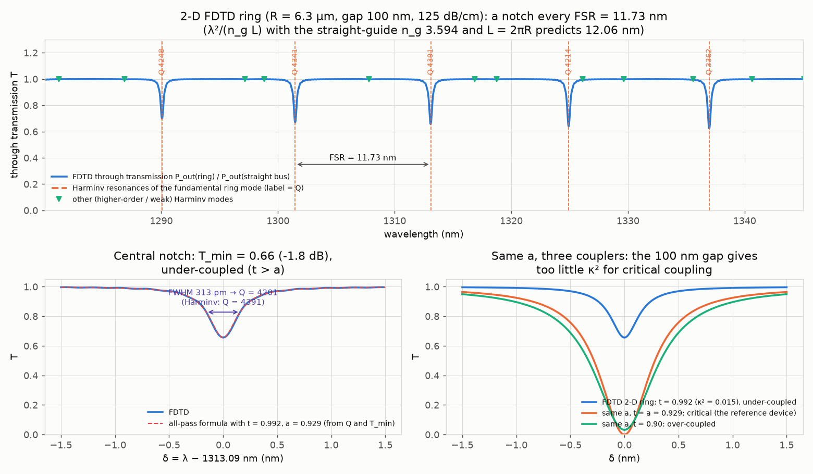
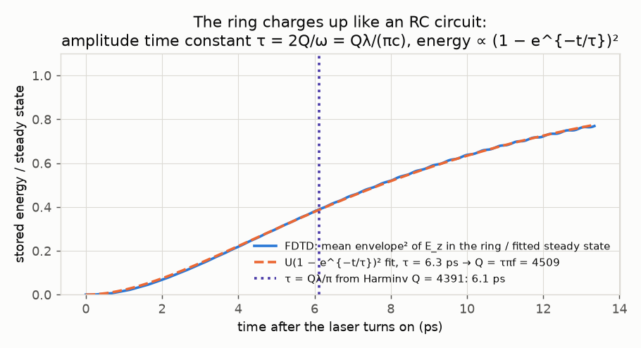
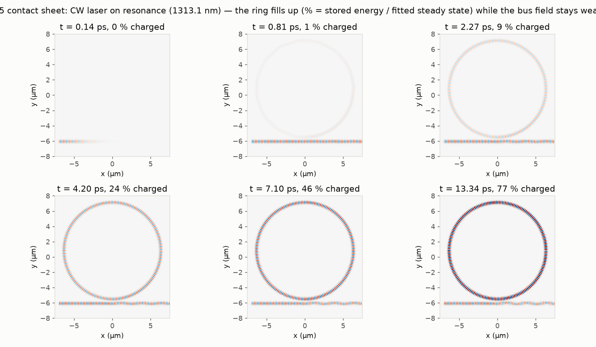

# 12. From one round trip to the ring: a = e^{−αL/2}, the all-pass notch, and the 50 pm/K slide

**Concept** (docs/NOTES.md §28 round-trip retention factor, built on §6 complex index and α = 4πn''/λ₀, §3 the phasor e^{−jβz} and why a lap is e^{−jβL}, §22 n_eff versus n_g, §26 and §27 the coupler S-matrix with its −j cross term; §16 and §24 for why the coupling falls off exponentially with the gap; the capstone paragraph of the brief for the numbers)

§28 only *defines* a: after one closed path of length L_rt the field is multiplied by a·e^{−jβL_rt}, with a = e^{−α L_rt/2}. This experiment shows what that one number does once the path is closed on itself and fed through the coupler of experiment 11. The SAX circuit (Part A) is nothing more than "coupler + one lossy waveguide whose output is its own input", and yet it produces the whole ring spectrum: a notch every FSR = λ²/(n_g L), a notch width set by the product t·a, and a notch *depth* set only by the difference t − a. You can see the phasor picture behind the formula (the numerator t − a·e^{−jφ} is a circle of radius a centred at t, and only when t = a does it pass through the origin), watch the notch slide under a fixed laser at 50 pm/K so that one FSR is 206 K and 0.1 K is 5 pm, and read off the transmission slope at the +108 pm bias that the lock in experiment 13 will use. Part B builds the same ring in Meep, where nothing is assumed: a Gaussian pulse rings the 2-D ring, Harminv extracts the resonances and their Q, a flux monitor gives the transmission notch, and a CW run at one resonance shows the field charging up the ring over the amplitude time constant τ = Qλ/(πc), which is the time-domain meaning of Q. The FDTD ring disagrees with the textbook ring in three places (2-D n_g, coupling per gap, extra loss), and each disagreement is traced to which quantity depends on what.

**Tools used**

### SAX 0.18.2 (with JAX 0.9.2)
*What it is:* SAX is the JAX-based S-parameter circuit simulator of the gdsfactory ecosystem. Each photonic component is a small Python function returning an S-matrix (a dictionary keyed by port pairs), a netlist connects the ports, and `sax.circuit` composes the frequency-domain response of the whole circuit, vectorised over wavelength and differentiable. It is normally used to simulate photonic integrated circuits (rings, Mach-Zehnders, filters) from per-component models.
*What I used it for here:* The all-pass ring as a two-element circuit: a 2×2 evanescent coupler with S = [[t, −jκ], [−jκ, t]] (§27) and one lossy, dispersive waveguide of length L = 39.6 µm whose `out0` is wired back to the coupler's `in1`. The waveguide carries the retention factor a = 10^{−(dB/cm)·L/20} of §28 and the phase e^{−j2πn(λ)L/λ} with n(λ) = n_eff − (λ − λ₀)(n_g − n_eff)/λ₀ so that its group index is n_g = 4.2. Swept 1290 to 1332 nm in 1 pm steps for the doped ring (125 dB/cm) and the passive ring (3 dB/cm) with the reference coupler and with each ring's own critical coupler. The same closed form is then evaluated at a fixed laser wavelength while the resonance moves at 50 pm/K.
*Result:* a = 0.9446 for the doped ring (reference 0.945, 99.96 %) and 0.99863 for the passive one (expected 0.9986). FSR at 1310 nm = 10.318 nm = 1.803 THz (analytic λ²/(n_g L) = 10.318 nm; reference 10.3 nm / 1.8 THz, 99.8 %); FWHM 374.0 pm (analytic 373.2 pm; reference 374 pm, 100.0 %); Q = 3503 (reference 3500, 99.9 %); T_min = 1.4 × 10⁻⁵ at t = a (critical coupling: 0). The SAX circuit and the closed form |(t − a e^{−jφ})/(1 − t a e^{−jφ})|² agree to 3 × 10⁻⁶ over the whole sweep. One FSR of thermal drift = 206.4 K (expected 206 K); 0.1 K = 5.0 pm = 1.34 % of the FWHM, and at the +108 pm bias the transmitted power changes by −1.74 % per 0.1 K (slope −0.174 per K). Heater: 50 pm/K × 8.8 K/mW = 0.440 nm/mW (reference 0.44), so one FSR costs 23.5 mW.
*How to observe it:* `cd experiments/12_round_trip_to_ring && ../../.venv/bin/python ring_sax.py` (about 20 s: 18.6 s this run; `run.py` calls it) writes `out/A1_retention.png` to `out/A4_thermal.png`, `out/A5_notch_sliding.mp4` (+ `_frames.png`), `out/A_log.txt`, `out/A_results.json`. Look at the notch spacing in `A2_spectrum.png` (top), the FWHM arrow and the dashed δ_opt line (bottom left), and the phase panel (over-coupled wraps 360°). Change `REF.loss_db_cm_doped` (in `common/params.py`) or call `ring_T(wl, coupling=..., loss_db_cm=..., ng=...)` with other values; the coupler's κ² and the waveguide's loss, n_g and n_eff are all keyword arguments of the SAX models. The notebook has sliders for the same four knobs.

### Meep 1.34.0 (pymeep, 2-D FDTD)
*What it is:* Meep is MIT's open-source finite-difference time-domain solver. It marches Maxwell's curl equations forward in time on a Yee grid, so any geometry and any source can be simulated with no approximation beyond the grid; it returns fields, time-averaged fluxes through surfaces and, via Fourier transforms of the time signal, spectra. It is the standard open-source tool for "what does the field actually do" questions about photonic devices.
*What I used it for here:* A 2-D ring of centre-line radius 6.3 µm and width 500 nm (n = 3.5 in n = 1.45, out-of-plane Ez, the 2-D stand-in for the TE mode of §13) side-coupled to a straight bus of the same width across a 100 nm gap; 17 × 18 µm cell, 1 µm PML, 30 px/µm for the spectrum and the movie, 20 px/µm for the gap scan. (B2) The doped-ring loss is put in through `D_conductivity` of the ring core, calibrated on a straight guide so that the *modal* loss is 125 dB/cm. (B3) A lossless ring at gaps 100 / 150 / 200 nm: the pulse is much shorter than one round trip (17 versus 142 time units), so a flux monitor across the ring a quarter lap after the coupler, read before the second pass arrives, measures the power coupling κ² of the point coupler directly. (B4) The lossy ring with a Gaussian pulse (fwidth 0.06 in Meep units, ≈ ±50 nm): a flux monitor on the bus output, normalised by the same run without the ring, gives the through spectrum T(λ); the run stops when the field in the ring has decayed by 3 × 10⁻⁴ or at t = 7000 µm/c (≈ 5300 optical periods). (B5) A CW `ContinuousSource` at the central resonance found by Harminv, 300 snapshots of Ez for the movie, each paired with a second snapshot a quarter optical period later so that Ez² + Ez(t + T/4)² is the envelope of the stored energy without the 2ω ripple.
*Result:* Loss calibration: the bulk guess σ_D = α/n gives 130.5 dB/cm on the guided mode; corrected to 125.0 dB/cm, so a = e^{−αL/2} = 0.9446 (99.96 % of 0.945). κ² at 1310 nm = 0.0221 / 0.0054 / 0.0014 for gaps 100 / 150 / 200 nm: ln κ² falls at 27.6 /µm against 2γ = 28.9 /µm of the 2-D tail (95 %), and critical coupling for a = 0.945 (κ² = 1 − a² = 0.108) would need a ≈ 42 nm gap in 2-D, whereas the reference 3-D strip reaches κ² = 0.107 at 200 nm. Through spectrum: notches at 1290.1, 1301.5, 1313.1, 1324.9, 1337.0 nm, FSR 11.73 nm (λ²/(n_g L) with the straight-guide 2-D n_g = 3.594 and L = 2πR predicts 12.06 nm, 97.2 %; with the bent mode's mean radius r = 6.34 µm the prediction is 11.98 nm, 97.9 %). Central notch 1313.09 nm: T_min = 0.656 (−1.8 dB), FWHM 312.5 pm interpolated between the flux-grid points (327.7 pm read on the raw 17.2 pm grid), Q_flux = 4201 (4007 on the raw grid; Harminv 4391, 96 %). Inverting the all-pass formulas on that notch gives t = 0.9923 (κ² = 0.0153; the first-pass flux in the same run gave κ² = 0.0197) and a = 0.929, i.e. the ring is *under*-coupled (t > a) and loses more per lap than the straight-guide calibration. The lossless scan at the same gap shows why: its loaded Q already contains 0.087 dB/lap of radiation, coupler-junction and grid loss, and a_calibrated × a_excess = 0.9353 is within 99.4 % of the inverted 0.929. CW build-up: amplitude time constant τ = 6.29 ps from the fit against Qλ/(πc) = 6.12 ps from the Harminv Q (4509 versus 4391, 97.3 %); ring/bus intensity ratio 2.39 at the last frame versus (1 − t²)/(1 − ta)² × (charge factor 0.79) = 1.98 (80 %; the unscaled steady-state formula gives 2.52, 95 %, but this Ez-only, ±w/4-band comparison is a rough check either way, see Checks).
*How to observe it:* `cd experiments/12_round_trip_to_ring && ../../.meep/bin/python ring_meep.py` (408 s this run, about 7 min; `run.py` calls it). `out/B4_spectrum.png` is the transmission spectrum with the Harminv resonances as dashed lines (label = Q), `out/B3_gap_scan.png` the κ²(gap) line, `out/B5_buildup.mp4` (+ `_frames.png`) the field charging the ring, `out/B5_buildup_energy.png` the stored energy against the (1 − e^{−t/τ})² fit, `out/B_log.txt` every number as it was computed. Change `GAP`, `RES_MAIN` or the `gaps` list of B3 at the top of `ring_meep.py`; keep `RES_CW = RES_MAIN` (the resonance moves by more than one linewidth between grids, which is exactly the bug that broke the first attempt at the movie).

### Meep Harminv (bundled with Meep 1.34.0)
*What it is:* Harminv is the harmonic-inversion (filter-diagonalisation) routine that ships with Meep. From a short time record of one field component at one point it extracts the complex frequencies of the modes that were excited, i.e. the resonance frequency, the decay rate and hence Q = f/(2·Im f), and their amplitudes, far more accurately than a Fourier transform of the same record would.
*What I used it for here:* Ez at a point on the ring centre-line after the Gaussian pulse, in the lossless gap scan (coupling Q) and in the lossy main run (loaded Q and the resonance wavelength that seeds the CW movie). A small filter keeps the fundamental family (strong amplitude, Q > 300, duplicates within 0.5 nm merged); the rest are plotted as "other modes".
*Result:* Fundamental family at 1290.06 / 1301.48 / 1313.11 / 1324.92 / 1336.97 nm with Q = 4248 / 4341 / 4391 / 4214 / 3362; the Harminv FSR (11.73 nm) equals the flux-dip FSR to 0.01 nm and the resonance wavelengths agree with the flux dips to 0.02 nm. The flux-notch Q of the central mode (4201 interpolated, 4007 on the raw 17.2 pm flux grid) is 4 % (9 % on the raw grid) below the Harminv Q (4391): the notch in the spectrum is slightly broadened by the finite record (t = 7000 µm/c is 3.81 amplitude lifetimes) and by the flux grid, so Harminv is the more trustworthy of the two and is what the build-up time constant is compared with. In the lossless scan Harminv gives Q_c = 16 100 / 48 400 / 110 600 for 100 / 150 / 200 nm; converting those to κ² overestimates the direct first-pass value by 2 to 4× because that Q also contains radiation and coupler-junction loss, which is why the direct flux method was used for κ².
*How to observe it:* Dashed orange lines with Q labels in `out/B4_spectrum.png`; green triangles are the other Harminv modes (the 2-D 500 nm guide is multimode for Ez: second mode n_eff = 2.825). The full list is in `out/B_results.json` under `harminv_all` and `gap_scan[*].resonances_nm`. Move `RING_PT` (the probe) or the Harminv bandwidth (`mp.Harminv(mp.Ez, RING_PT, F0, 0.05)`) in `ring_meep.py` to hunt other modes.

### Meep eigenmode solver (MPB inside Meep 1.34.0)
*What it is:* `Simulation.get_eigenmode` calls the MPB plane-wave eigensolver on a line (2-D) or plane (3-D) of the FDTD grid and returns the guided modes at a given frequency: the propagation constant, the group velocity and the field profile. It is what `EigenModeSource` uses to launch a clean mode.
*What I used it for here:* n_eff, n_g (directly from `group_velocity` and by finite differences of n_eff over ±2 % in frequency, §22) and the transverse profile of the fundamental Ez mode of the 2-D 500 nm guide, the evanescent decay length outside the core, and the n_eff of the second mode.
*Result:* n_eff = 3.339, n_g = 3.594 (finite difference 3.594, 100.0 %); 1/γ = λ/(2π√(n_eff² − n₂²)) = 69 nm (fit to the profile 69 nm) versus 102 nm for the textbook 3-D n_eff = 2.5; second mode n_eff = 2.825, so the 2-D guide is multimode. These are not expected to match the 3-D strip (2.5 to 2.7 and 4.2, experiment 08): a 2-D slab of index 3.5 confines much more strongly. The FSR is set by n_g, so the 2-D ring's FSR is 12 nm, not 10.3 nm.
*How to observe it:* `out/B1_mode2d.png` (profile with the e^{−γ(y − w/2)} tail); section B1 of `ring_meep.py`. Change `W` or `N_SI` and re-run: a lower index or narrower guide makes the tail longer and the coupling per gap stronger.

### numpy 2.4.6 (.venv) / 2.5.3 (.meep), scipy 1.18.1 (closed forms and fits)
*What it is:* numpy is the array library everything else is built on; `scipy.optimize.curve_fit` is a nonlinear least-squares fitter.
*What I used it for here:* The closed-form ring numbers (FSR, FWHM = (1 − ta)λ²/(π n_g L √(ta)), Q = λ/FWHM, T_min = ((t − a)/(1 − ta))², finesse, build-up (1 − t²)/(1 − ta)²), the inversion of Q and T_min back to t and a, the exponential fit of κ²(gap), the (1 − e^{−t/τ})² fit of the ring energy, and the finite-difference slope dT/dK at the bias point.
*Result:* Closed form versus SAX: 3 × 10⁻⁶. Closed form versus reference: FSR 10.318 nm, FWHM 373.2 pm, Q 3511 (100.2 / 99.8 / 99.7 %). Build-up time constant fit τ = 6.29 ps (see Meep).
*How to observe it:* `analytic_numbers(t, a)` and `analytic_T(wl, t, a)` in `ring_sax.py`; `t_from_Qc`, `ta_from_Q` in `ring_meep.py`.

### matplotlib 3.11.2 (FuncAnimation + FFMpegWriter, ffmpeg 9.0.1)
*What it is:* matplotlib is the standard Python plotting library; `FuncAnimation` renders a sequence of frames and `FFMpegWriter` pipes them to the Homebrew ffmpeg to encode an H.264 mp4.
*What I used it for here:* All figures (signed Ez with `RdBu_r` centred on zero); two videos: A5, the notch sliding under the fixed laser as the ring temperature ramps 10 → 125 °C (300 frames, 10 s), and B5, the FDTD Ez while the ring charges up on resonance (300 frames, 10 s); a six-frame contact sheet for each.
*Result:* `out/A5_notch_sliding.mp4`, `out/B5_buildup.mp4` and their `_frames.png`.
*How to observe it:* Open the mp4s. Frame counts, the temperature ramp and the capture times are set at the bottom of `ring_sax.py` and in section B5 of `ring_meep.py`.

### Jupyter notebook (nbformat 5.11.1, nbconvert 7.17.1, ipywidgets 8.1.9, kernel `photonics-sims`)
*What it is:* nbformat builds `.ipynb` files programmatically; `nbconvert --execute` runs a notebook headlessly with a kernel and stores the outputs in the file; `ipywidgets.interact` adds sliders in a live JupyterLab session.
*What I used it for here:* `explore.ipynb`, built by `make_notebook.py` and executed by `run.py`: the SAX-versus-closed-form check, sliders for a, t, n_g and temperature (fixed laser at 1310.108 nm), the notch-depth-versus-t "fabrication lottery" curve and T(λ_L) versus temperature for three couplers, and an overlay of the closed form on the FDTD notch with the t and a inverted from Part B.
*Result:* Executed notebook with the saved outputs of the default slider state; the FDTD cell prints the Part B numbers from `out/B_results.json`.
*How to observe it:* `cd experiments/12_round_trip_to_ring && ../../.venv/bin/jupyter lab explore.ipynb` (Restart & Run All, then drag the sliders), or re-execute headlessly with `../../.venv/bin/jupyter nbconvert --to notebook --execute --inplace explore.ipynb`.

**What the simulation does**

Symbols: λ₀ = 1310 nm, k₀ = 2π/λ₀; L = 39.6 µm round trip (2π × 6.3 µm); α the power attenuation (1/µm) from dB/cm via α = (dB/cm)/4.343 × 10⁻⁴; a = e^{−αL/2} the field retention per lap (§28); t and κ the through- and cross-amplitudes of the coupler with t² + κ² = 1 (§27); φ = βL = 2πn(λ)L/λ the round-trip phase (§3: a +z wave is e^{−jβz}); δ = λ_L − λ_r the laser-minus-resonance detuning (positive = laser on the red side).

Part A (`ring_sax.py`, .venv):
1. **Retention (§6, §28).** α_doped = 2.88 × 10⁻³ /µm (n'' = αλ/4π = 3.0 × 10⁻⁴), α_passive = 6.9 × 10⁻⁵ /µm. `A1_retention.png` plots |A(z)|/|A(0)| = e^{−αz/2} and P/P₀ = e^{−αz} over five laps: field ×a per lap, power ×a².
2. **The circuit.** With the coupler S-matrix of §27 and the loop, the through amplitude is s = (t − a e^{−jφ})/(1 − t a e^{−jφ}), a geometric series of laps: the field that has done n laps carries (ta)^{n} e^{−jnφ}. A resonance sits at 1310.000 nm by choosing the mode order m = round(n_eff L/λ₀) = 76 and nudging n_eff from 2.5 to 2.514 (the phase index is only known to ≈ 1 %, and 76 versus 76.02 laps of phase is that 1 %); n_g = 4.2 is left alone because the FSR, the FWHM and every shift formula depend on n_g, not n_eff (§22). FSR = λ²/(n_g L) in wavelength, c/(n_g L) in frequency; FWHM = (1 − ta)λ²/(π n_g L √(ta)); Q = λ/FWHM; T_min = ((t − a)/(1 − ta))²; finesse = FSR/FWHM; on-resonance intra-cavity intensity build-up (1 − t²)/(1 − ta)² = 9.3 for the reference ring.
3. **Coupling regimes (`A3_coupling_regimes.png`).** Same a, t = 0.98 / 0.945 / 0.90: under-coupled (T_min 0.23, narrow), critical (0), over-coupled (0.09, wide, phase wraps 360°). The numerator t − a e^{−jφ} is drawn as a circle of radius a centred at t: T = 0 needs the circle through the origin, t = a. Also solved: which t gives the modulator's T_min = 0.016 (−18 dB) with a = 0.945: t = 0.957 (under) or 0.929 (over).
4. **Thermal slide (`A4_thermal.png`, `A5_notch_sliding.mp4`).** λ_r(T) = 1310 nm + 50 pm/K × (T − 25 °C); laser fixed at λ_L = 1310.108 nm (δ_opt = +108 pm = FWHM/(2√3), the maximum-slope bias). T(λ_L) versus ring temperature over −20 to 260 °C: a notch every 206 K; zoom ±6 K with the slope −0.174 per K, the ±0.1 K band and the point +2.16 K *hotter* (27.16 °C) where the laser sits exactly on resonance: δ = λ_L − λ_r is +108 pm at the bias, and heating red-shifts λ_r onto λ_L (T → 0), so on this side the slope is negative; cooling moves the notch away from the laser (T → 1).

Part B (`ring_meep.py`, .meep; `.uses_meep` marks the folder):
1. **B1** eigenmode of the 2-D guide: n_eff, n_g, 1/γ, second mode.
2. **B2** loss calibration: a straight guide with `D_conductivity = σ` in the core, flux at two planes 8 µm apart, α = −ln(P_b/P_a)/8 µm; σ scaled linearly until α matches 125 dB/cm (the guided mode has only part of its power in the core, so the bulk relation α = nσ overshoots by 4 %).
3. **B3** lossless ring, three gaps: first-pass κ²(λ) = P_ring(first pass)/P_in, then Harminv for 1200 time units; ln κ² fitted linearly in the gap and extrapolated to κ² = 1 − a².
4. **B4** lossy ring: T(λ) = P_out(ring)/P_out(bus alone); dips found as local minima deeper than 0.15 and matched to Harminv within 1.5 nm; FWHM at half depth, interpolated linearly between the 17.2 pm flux-grid points (the raw grid width is recorded next to it); the central notch inverted to (t, a) through Q → ta and T_min → t − a (under-coupled branch); the forward prediction from the directly measured first-pass κ² and the calibrated a is written next to it; `run.py` adds the excess-loss bookkeeping (a_excess from the lossless ring's loaded Q at the same gap).
5. **B5** CW at the Harminv resonance: 300 frames, the envelope energy in the ring band fitted to U(1 − e^{−t/τ})², Q = τπf (τ is the *amplitude* time constant 2Q/ω); the bent-mode radius from the radial profile of the envelope (→ L_eff = 2πr_mean and the bend-corrected FSR); the ring/bus intensity ratio versus (1 − t²)/(1 − ta)² scaled by how charged the ring is at the last frame.

`run.py` (either interpreter) deletes `out/` and `explore.ipynb`, runs the two parts with their interpreters via subprocess, builds and executes the notebook, merges everything into `out/results.json` and writes `out/tools.json`.

**Results**

Video: [out/A5_notch_sliding.mp4](out/A5_notch_sliding.mp4) (10 s): the ring heats from 10 to 125 °C, the notch moves 5.75 nm to the red (0.56 FSR) and the photodiode sees the whole notch go by once (T = 0.95 at 10 °C where the laser is 858 pm to the red of the notch, 0.25 at the 25 °C bias point, 0 at 27.2 °C where λ_r has been heated onto λ_L, and back above 0.9 by 40 °C); by 125 °C the *next* notch is still 100 K away.

Video: [out/B5_buildup.mp4](out/B5_buildup.mp4) (10 s): the first 0.8 s show the CW wave entering the bus; then the clock runs about 30× faster (14.5 µm/c per frame instead of 0.5) and the ring fills up while the through-port field dims, over τ ≈ 6.3 ps.

| Quantity | Simulated | Expected (notes / reference) | Agreement |
|---|---|---|---|
| a, doped ring 125 dB/cm, L = 39.6 µm (A1) | 0.9446 | e^{−αL/2}: 0.945 (REF) | 99.96 % |
| a, passive ring 3 dB/cm | 0.99863 | 0.9986 | 100.0 % |
| FSR at 1310 nm (SAX dips) | 10.318 nm = 1.803 THz | λ²/(n_g L) = 10.318 nm; REF 10.3 nm / 1.8 THz | 99.8 % / 99.9 % |
| FWHM (SAX) | 374.0 pm | (1 − ta)λ²/(π n_g L √ta) = 373.2 pm; REF 374 pm | 100.0 % |
| Q loaded (SAX) | 3503 | REF 3500 | 99.9 % |
| T_min at t = a = 0.945 | 1.4 × 10⁻⁵ | 0 (critical coupling) | pass |
| build-up (1 − t²)/(1 − ta)² | 9.28 | | computed |
| one FSR of thermal shift | 206.4 K | 10.3 nm / 50 pm/K = 206 K | 99.8 % |
| 0.1 K in pm / in FWHM | 5.0 pm / 1.34 % | 5 pm | exact |
| dT/dK at δ_opt = +108 pm | −0.174 per K (−1.74 % per 0.1 K) | | computed |
| heater efficiency | 0.440 nm/mW | REF 0.44 | 100.0 % |
| 2-D n_eff, n_g (Meep eigenmode) | 3.339, 3.594 | 3-D strip 2.5 (2.7 solver), 4.2: not expected to agree | 2-D ≠ 3-D |
| calibrated modal loss | 125.0 dB/cm → a = 0.9446 | 125 dB/cm, 0.945 | 100.0 % / 99.96 % |
| FDTD FSR (flux dips = Harminv) | 11.73 nm | λ²/(n_g L): 12.06 nm (straight n_g, L = 2πR); 11.98 nm (L = 2π r_mean, r_mean = 6.34 µm) | 97.2 % / 97.9 % |
| ln κ² slope vs gap | −27.6 /µm | −2γ = −28.9 /µm | 95.8 % |
| κ² at 100 nm gap (2-D) | 0.0221 (first pass) | REF 0.107 at 200 nm (3-D strip) | 2-D tail is 69 nm, not 102 nm |
| gap for critical coupling (2-D) | 42 nm | | extrapolated |
| central notch FWHM and Q from the flux spectrum | 312.5 pm, Q 4201 (327.7 pm, Q 4007 on the raw 17.2 pm grid) | Harminv Q 4391 | 96 % (91 % on the raw grid) |
| central notch T_min | 0.656 | ((t − a)/(1 − ta))² = 0.494 with first-pass t and calibrated a; 0.550 with a × a_excess | 67 % / 81 % |
| a inverted from the notch (with t = 0.9923) | 0.929 | calibrated 0.9446; calibrated × a_excess = 0.9353 | 98.4 % / 99.4 % |
| Q from the CW build-up τ | 4509 | Harminv 4391 | 97.3 % |
| τ (amplitude) | 6.29 ps | Qλ/(πc) = 6.12 ps | 97.3 % |
| ring/bus intensity ratio at the end of the CW run | 2.39 | (1 − t²)/(1 − ta)² × charge factor 0.79 = 1.98 (steady state 2.52) | 80 % (rough, Ez only) |
| run time | 437.6 s total (A 18.6 s, B 408.3 s, notebook the rest, about 11 s) | < 10 min | pass (7.3 min) |

**Experiments to try**

1. *Make the passive ring notch.* In the notebook set a = 0.9986 and leave t = 0.945: T_min = 0.91, a barely visible dip 190 pm wide (the ring is heavily over-coupled and acts as an all-pass phase shifter, see the phase panel). Now set t = 0.9986: T_min = 0, FWHM 9 pm, Q = 1.5 × 10⁵. The doping loss is what makes the modulator's notch deep *at* κ² ≈ 0.1; a low-loss ring needs a coupler ten times weaker. In `ring_sax.py`: `ring_T(wl, coupling=0.0027, loss_db_cm=3)`.
2. *Miss critical coupling by a fabrication error.* t = 0.957 or 0.929 in the notebook (κ² = 0.085 or 0.137, i.e. ±10 nm of gap at 2γ ≈ 20 %/10 nm) gives exactly the modulator's T_min = 0.016 (−18 dB): the reference device is *not* at t = a. Watch the FWHM change from 374 to 332 (under) or 430 pm (over) at the same time, which changes δ_opt and the lock's sensor gain (experiment 13).
3. *Change n_g, not n_eff.* Slide n_g from 4.2 to 3.6 (the 2-D value): the FSR grows to 12 nm and the FWHM to 436 pm, but T_min does not move. Then edit `NEFF` in `ring_sax.py` (say 2.6): the notches shift but their spacing, width and depth stay. This is the n_eff/n_g split of §22 in one picture.
4. *Bring the FDTD ring to critical coupling.* `GAP = 0.05` at the top of `ring_meep.py` (the scan extrapolates κ² = 0.108 at 42 nm; 50 nm is 1.5 pixels at 30 px/µm, so also set `RES_MAIN = 40`, about 2.4× slower). Expect T_min to drop from 0.66 towards 0 and the FWHM to widen from 313 pm to about 500 pm (with a ≈ 0.93 and t ≈ 0.945, (1 − ta)/√(ta) = 0.13; the loaded Q falls to ≈ 2600 as (1 − ta) grows). If the notch overshoots to the over-coupled side, the inversion in B4 (which assumes t > a) will report t < a as a shallow notch: check the phase or the sign of t − a.
5. *Watch the ring discharge instead of charge.* In section B5 replace `mp.ContinuousSource(frequency=f_res, width=10)` by `mp.ContinuousSource(frequency=f_res, width=10, end_time=1500)`: the energy should fall as e^{−t/τ_E} with τ_E = τ/2 = Q/(2πf) after the source stops (energy decays twice as fast as amplitude). Fit it and compare with the Harminv Q a third way.

**Capstone connection**

The all-pass ring of Part A *is* the plant of the Lightmatter capstone: a = 0.945 (125 dB/cm equivalent loss of the doped modulator ring), t ≈ 0.945 (κ² = 0.107), n_g = 4.2 and L = 39.6 µm give FSR 10.3 nm / 1.8 THz (so 8 channels at 200 GHz fit inside one FSR with margin), FWHM 374 pm and Q = 3500. The laser is parked at δ = λ_L − λ_r = +108 pm on the red slope, where T = 0.25 and the slope of T against δ is steepest (−0.0035 per pm, −0.174 per K); the modulator's 50 pm/V × 1.3 V swing then rides that slope for maximum optical modulation amplitude. Temperature moves λ_r at 50 pm/K, so 1 K = 50 pm = 13 % of the FWHM and the transmitted power changes by 0.17 of the input per K (absolute, i.e. 70 % of its 0.25 bias value): the sensor of experiment 13 is this slope times 0.9 A/W × the tapped power. The 10 to 125 °C ambient range is 5.75 nm = 0.56 FSR of drift (A4), far more than the notch width, which is why the heater (0.44 nm/mW, one FSR = 23.5 mW) must track it continuously and why the lock only ever has to hold the notch to a small fraction of 0.1 K = 5 pm = 1.3 % of the FWHM. Part B adds the two facts a circuit model cannot supply: the coupling κ² depends exponentially on the gap through the *2-D or 3-D* evanescent tail (a 10 nm error is 20 % of κ² with the 3-D tail, 28 % with the 2-D one from the fitted 27.6 /µm slope), so t = a is a fabrication lottery and the real device sits at T_min ≈ 0.016 rather than 0; and Q has a time-domain meaning, τ = Qλ/(πc) ≈ 4.9 ps for Q = 3500 (amplitude; the energy lifetime is τ_E = τ/2 = 2.4 ps), which is the ring's own response time and is *irrelevant* to the thermal control loop (10 µs) but sets the modulator's optical bandwidth: 1/(2πτ) = f/(2Q) = 33 GHz, half of the 65 GHz linewidth f/Q = 1/(2πτ_E), at Q = 3500 (both computed in `A_results.json`: `bandwidth_ghz_f_over_2Q`, `linewidth_ghz_f_over_Q`).

**Checks**

- **SAX versus closed form:** max |ΔT| = 3 × 10⁻⁶ over 42 000 wavelengths in the script and 6.5 × 10⁻⁵ in the notebook (the residual is JAX's default float32 acting on a round-trip phase of 2π × 76 ≈ 477 rad, not physics); SAX dips versus analytic FSR/FWHM/Q to 0.2 %; T_min at critical coupling 1.4 × 10⁻⁵ (limited by a = 0.9446 ≠ 0.945 exactly and the 1 pm grid).
- **Phasor convention:** the waveguide model uses e^{−j2πnL/λ} (§3, e^{jωt}); the coupler's cross term is −j (§27), so the ring is reciprocal and the through phase runs the right way (over-coupled: +360° per FSR).
- **FSR grows with λ²:** the three SAX spacings are 10.24, 10.40, 10.57 nm; the local value at 1310 nm is quoted.
- **Loss calibration:** the bulk formula α = nσ_D overshoots the modal loss by 4 % (part of the mode is in the lossless cladding); calibrated to 125.0 dB/cm on the straight guide.
- **Two independent FSRs in FDTD:** flux dips and Harminv give the same 11.73 nm; both are 2.8 % below λ²/(n_g L) with the straight-guide n_g and L = 2πR because the bent mode sits at a larger radius (r_mean = 6.34 µm) and has a slightly different n_g; the bend-corrected prediction is 11.98 nm (97.9 %).
- **Q three ways:** flux notch 4201 (interpolated; 4007 on the raw grid), Harminv 4391, CW build-up 4509. The notch is the least reliable (finite record, coarse flux grid, 3 px gap); Harminv and the build-up are independent time-domain measurements of the same decay rate.
- **Flux-grid bias of the notch width:** the flux monitor samples the spectrum every 17.2 pm (`flux_grid_step_pm` in `results.json`), 5.5 % of the 313 pm notch, so the half-depth width read straight off the grid (327.7 pm, Q 4007) is biased wide by up to one grid step; the quoted 312.5 pm / Q 4201 interpolates the two half-depth crossings linearly. The record itself is 7000 µm/c = 3.81 amplitude lifetimes of the central mode (`record_in_amplitude_lifetimes` = 3.81), which truncates the ring-down and broadens the notch in the same direction, which is why the flux Q sits 4 % below the Harminv Q.
- **Where the FDTD ring disagrees with the textbook ring, and why:** (i) n_g = 3.59 not 4.2 → FSR 11.7 nm not 10.3 nm: FSR depends on n_g, and a 2-D slab of index 3.5 has a smaller n_g than the 500 × 220 nm strip. (ii) κ² = 0.022 at 100 nm not 0.107 at 200 nm: the 2-D tail is 69 nm long instead of 102 nm, so the same gap couples much less; critical coupling extrapolates to a 42 nm gap. (iii) a = 0.929 from the notch, not 0.945: the ring loses 0.087 dB/lap more than the straight guide (measured independently on the *lossless* ring at the same gap as a loaded Q of 16 100 instead of infinity), from bend radiation, scattering at the abrupt bus-ring junction and the 3-pixel gap; a_calibrated × a_excess = 0.9353 leaves a 0.6 % residual. None of these touches the Part A numbers, which are what the capstone uses.
- **Known limitations.** 2-D (Ez) instead of the 3-D TE strip; 30 px/µm puts only 3 pixels across the 100 nm gap (κ² is sensitive to that, which is one reason the gap-scan slope is 95 % of 2γ rather than 100 %); the 2-D guide is multimode (the green triangles in B4 are those modes, weakly excited by the eigenmode source of band 1); the spectrum run is capped at 7000 µm/c (3.81 amplitude lifetimes of the fundamental) because long-lived higher-order modes would otherwise run for minutes more; the CW run stops at 4000 µm/c, 2.2 amplitude time constants, so the ring is only 77 % charged at the last frame and the fit's steady state U is extrapolated; the ring/bus intensity ratio compares the mean envelope² in a ±w/4 band of the bent mode with the same band of the straight bus mode (Ez only, no H, and the bent mode is more peaked), so its 80 % agreement with the charge-scaled formula (95 % with the unscaled steady-state formula) is a rough check, not a validation. The thermal model of Part A is the linear 50 pm/K of the brief with no self-heating (see experiment 13 for the plant dynamics).

**Files**

- `run.py`: entry point (either interpreter; `run_all.sh` uses `.meep` because of `.uses_meep`): cleans `out/`, runs `ring_sax.py` (.venv) and `ring_meep.py` (.meep) via subprocess, builds and executes the notebook, writes `out/results.json` and `out/tools.json`
- `ring_sax.py`: Part A: retention factor, SAX all-pass ring, coupling regimes, thermal slide, A5 video (.venv)
- `ring_meep.py`: Part B: Meep 2-D ring: eigenmode, loss calibration, gap scan, Harminv + flux spectrum, CW build-up movie (.meep)
- `make_notebook.py`: builds `explore.ipynb` with nbformat (.venv)
- `explore.ipynb`: executed notebook with sliders (a, t, n_g, temperature) and the FDTD overlay
- `.uses_meep`: marker for `run_all.sh`
- `README.md`: this file
- `out/A1_retention.png`, `out/A2_spectrum.png`, `out/A3_coupling_regimes.png`, `out/A4_thermal.png`: Part A figures
- `out/A5_notch_sliding.mp4`, `out/A5_notch_sliding_frames.png`: Part A video and stills
- `out/A_results.json`, `out/A_log.txt`: Part A numbers and log
- `out/B1_mode2d.png`, `out/B3_gap_scan.png`, `out/B4_spectrum.png`, `out/B5_buildup_energy.png`: Part B figures
- `out/B5_buildup.mp4`, `out/B5_buildup_frames.png`: Part B video and stills
- `out/B_results.json`, `out/B_log.txt`: Part B numbers (including every Harminv mode and the κ²(λ) curves) and log
- `out/notebook_build_log.txt`, `out/notebook_log.txt`: notebook build and execution logs
- `out/results.json`: merged headline numbers with expectation and agreement; `out/tools.json`: the tool subsections above
