# 13. Capstone ring lock: heater, photocurrent and a PI loop that keeps the notch 108 pm from the laser

**Concept** (capstone objective from docs/BRIEF.md; notes §22 for why the thermal shift dλ_r/dT = (λ/n_g)·dn_eff/dT is a group-index quantity, §27 for why a ring is frequency-selective at all, §28 for the round-trip retention a that sets the notch depth; the notch shape itself comes from experiment 12)

Everything before this experiment explained *why* a silicon microring has a narrow transmission notch (a Lorentzian, FWHM 374 pm, Q = 3500) and why that notch moves 50 pm per kelvin. This experiment is the control problem that follows: the laser is fixed, the ring drifts with temperature (10 to 125 C is 5.75 nm, more than half a free spectral range), the only actuator is a heater that can push the notch to the red but never to the blue, and the only sensor is the mean photocurrent of a 5 % tap on the through port. The equations of a PI loop are familiar to an EE; what the simulation adds is *seeing* the notch slide under the laser and being caught (the video), seeing how the sensor is a Lorentzian whose slope is largest at δ = FWHM/(2√3) = 108 pm and reverses sign on the other side of the notch (so the loop only works from one side and can be lost forever if the notch overshoots the laser), seeing that the thermal plant's 25 % slow tail (300 µs) and the 10 µs sample-and-hold, not the 10 µs thermal pole, decide how fast the lock can be, and putting numbers on what "locked" means: 0.6 pm of tracking error during an 800 K/s ramp, 128 pm of transient error on a 5 K step in 10 µs, 2.5 pm of error on a neighbour while a ring next to it turns on. Every number is computed by `run.py` and compared with a hand formula (K_v, R_th, Lorentzian algebra) where one exists.

**Tools used**

### python-control 0.10.2
*What it is:* The Python control-systems library (a MATLAB Control Toolbox work-alike): transfer functions and state space, series/feedback interconnection, Bode and Nyquist plots, gain/phase margins, step and forced responses, Pade delay approximations. Normally used to design and analyse feedback loops before they are coded.
*What I used it for here:* Building the linearised ring-lock loop L(s) = C(s)·e^(−sT_d)·G_th(s)·(50 pm/K)·(dI/dδ) with the two-pole thermal plant and a Pade(3) delay (`ringlock.loop_tf`), computing the PI gains by pole cancellation and |L(jω_c)| = 1 at ω_c = 1/(2T_d) (`ringlock.design_pi`), the margins with `control.margin`, the sensitivity S = 1/(1+L) and its peak, the ambient-to-error transfer −50·P_n(s)·S(s), and linear step/forced responses that are overlaid on the nonlinear simulation. An exact e^(−jωT_d) frequency response (`ringlock.exact_margins`) cross-checks the Pade result.
*Result:* Crossover 7958 Hz (target 1/(4πT_d) = 7958 Hz, 100.00 %), phase margin 60.14° (hand estimate 90° + atan(ω_c·227.5 µs) − atan(ω_c·300 µs) − ω_c·T_d = 60.14°, 100.00 %; exact-delay 60.14°), gain margin 9.92 dB at 25 kHz (exact delay 9.92 dB, 99.99 %), M_s = 1.60, closed-loop −3 dB bandwidth 17.9 kHz, K_v = 65 827 1/s. K_v predicts the 800 K/s ramp error 0.608 pm; the nonlinear simulation gives 0.608 pm (100.00 %). The linear model predicts a 5 K step peak of −138.8 pm vs −128.4 pm nonlinear (92.5 %; see Checks for why the sampled loop is slightly faster than its continuous model). The same design rule re-run for "Experiments to try" 1 and 2: at ω_c·T_d = 1 the phase margin is 32.10° (hand formula 32.10°, 100.00 %), the gain margin 3.9 dB and M_s = 3.16; at T_d = 50 µs the crossover is 1591.5 Hz (1/(4πT_d) = 1591.5 Hz, 100.00 %) and K_v = 12 725 1/s (ramp error 3.143 pm predicted, 3.144 pm simulated, 99.98 %).
*How to observe it:* `cd experiments/13_capstone_ring_lock && ../../.venv/bin/python run.py`; look at `out/bode_loop.png` (loop gain with margins, tuning A vs B), `out/sensitivity.png`, `out/linear_step.png`, and the `design` block of `out/results.json`. Change `T_D`, the crossover (`rl.design_pi(..., wc=...)`) or `tau_i` in `run.py` and re-run; the notebook has sliders for the same.

### numpy 2.4.6 + scipy 1.18.1
*What it is:* numpy is the array library underneath all scientific Python; scipy adds numerical algorithms. Used here for the plant integration and all the static numbers.
*What I used it for here:* `ringlock.simulate`: an exact (per-state exponential) discretisation of the two thermal states per ring at 1 µs, the Lorentzian sensor, the discrete PI with clamping anti-windup, an acquisition sweep and optional DAC quantisation, and the 4-ring crosstalk matrix K; `np.linalg.solve` for the K⁻¹ heater equilibrium and for the quasi-static crosstalk prediction; the survival map (77 simulations); the OMA/penalty numbers; shot-noise and resolution arithmetic.
*Result:* δ_opt (numeric argmax of dT/dδ) = 107.97 pm vs FWHM/(2√3) = 107.96 (99.97 %); sensor gain 0.386 µA/pm = 19.3 µA/K (finite difference 100.00 %); 5 K step: peak error −128 pm (34 % of FWHM), back within 5 pm in 87 µs, steady state 0.002 pm, heater −0.568 mW (expected −5/8.8 = −0.568, 99.99 %); ramp error 0.608 pm; 4 rings: ring 2's mean error −2.54 pm while ring 3 sweeps in (quasi-static prediction −2.54 pm, 99.9 %), final heaters equal to K⁻¹·P0·1 to 100.00 %; the lock survives instantaneous steps up to 6 K and 15 K steps (the largest tested) with a 100 µs rise, and the 7 K step that loses it ends with the heater at 20 mW and the notch 5.57 nm to the red of the laser (error −5679.6 pm vs −[(20 − 7.89) mW × 440 pm/mW + 7 K × 50 pm/K] = −5680.0, 99.99 %); with T_d = T_s = 50 µs the largest survivable instantaneous step is 4 K; heater saturated 1.57 mW short gives 690 pm of error (expected 690.0).
*How to observe it:* `out/scenario_a_step.png`, `out/step_survival.png`, `out/scenario_b_ramp.png`, `out/scenario_c_four_rings.png`, `out/scenario_d_antiwindup.png`, `out/quantisation_noise.png` and the `scenario_*` blocks of `out/results.json`. Edit `STEP_K`, `RAMP`, the crosstalk numbers (`rl.crosstalk_matrix`), `sweep_rate`, `dac_bits` or `P_MAX` in `run.py` and re-run.

### matplotlib 3.11.2 (+ ffmpeg 9.0.1)
*What it is:* The standard Python plotting library; `FuncAnimation` + `FFMpegWriter` feed frames to the ffmpeg encoder to produce mp4 videos.
*What I used it for here:* 13 figures plus 2 video contact sheets, 15 PNGs (block diagram, sensor curve, OMA vs bias, thermal step, Bode, sensitivity, linear steps, five scenario figures, quantisation/noise) and two videos: `notch_lock.mp4` (the notch sliding under the fixed laser after a 5 K step, lock on vs off) and `four_ring_lock.mp4` (ring 3 sweeping in while its neighbours hold), each with a contact sheet.
*Result:* `out/notch_lock.mp4` (300 frames, 10 s; 1 s of video = 60 µs of ring time) and `out/four_ring_lock.mp4` (360 frames, 12 s; 1 s = 0.33 ms) plus `out/notch_lock_frames.png` and `out/four_ring_lock_frames.png`.
*How to observe it:* open `out/notch_lock.mp4`: the grey notch drifts 250 pm to the red and stays there (the laser ends up on the *wrong* slope); the blue one dips past the laser for about 30 µs and is pulled back to −108 pm by the heater trace below. Change `V1_T1` / `V1_N` or the frame function `v1_fig` in `run.py` to re-time the video.

### Jupyter notebook + ipywidgets 8.1.9 (nbformat 5.11.1, kernel `photonics-sims`)
*What it is:* Jupyter notebooks mix code, output and prose; ipywidgets adds sliders that re-run a function when moved. Used for interactive exploration where a script would need a re-run per parameter.
*What I used it for here:* `explore.ipynb` (built by `make_notebook.py` with nbformat, executed headless by `run.py` with nbconvert): sliders for the sensor (FWHM, T_min, P_in, tap), the loop design (T_d, crossover fraction ω_c·T_d, PI-zero placement, slow share) with live Bode + margins + step, the ambient-step scenario (size, rise time, lock on/off, T_d), the 4-ring crosstalk scenario (K_nearest, K_next, sweep rate) and the DAC/noise study; it imports the same `ringlock.py` and asserts its K_p against `out/results.json`.
*Result:* Each section first calls its plot function once, so a static figure for the default slider values is saved as an ordinary cell output (visible on GitHub or in any viewer without a kernel), and then builds the live widget; the printed numbers are identical to `run.py`'s (the K_p assertion guarantees it). Raising ω_c·T_d from 0.5 to 1.0 drops the phase margin from 60° to 32° and raises M_s from 1.60 to 3.16, so the step response rings (`run.py` computes the same numbers in its `[3f]` block: `experiments_to_try` in `out/results.json`); moving the PI zero to the slow pole cuts K_v 13× (ramp error 8.2 pm instead of 0.6 pm); a 5 K step with a 200 µs rise peaks at 16 pm instead of 128 pm (`survival_map.peak_error_pm_5K_200us_rise` = −15.6 pm); an 8-bit heater DAC dithers ±10 pm.
*How to observe it:* `cd experiments/13_capstone_ring_lock && ../../.venv/bin/jupyter lab explore.ipynb` and drag the sliders; to rebuild headless: `../../.venv/bin/python make_notebook.py && ../../.venv/bin/jupyter nbconvert --to notebook --execute --inplace explore.ipynb`.

**What the simulation does**

`run.py` (about 3 min, mostly video encoding) deletes `out/`, regenerates everything, then rebuilds and executes the notebook. All models live in `ringlock.py` so that the script and the notebook cannot disagree.

1. **Plant** (`ringlock.Plant`). Heater power P_h (mW) → ring temperature rise ΔT (K) through G_th(s) = R_th·[0.75/(1 + s·10 µs) + 0.25/(1 + s·300 µs)], R_th = 8.8 K/mW (REF). Written as one rational function it has poles at 1/(2π·300 µs) = 530 Hz and 1/(2π·10 µs) = 15.9 kHz and a zero at 1/(2π·227.5 µs) = 700 Hz, so the gain is R_th at DC and 0.75·R_th between 700 Hz and 16 kHz. Resonance shift λ_r = λ_r0 + 50 pm/K·ΔT (REF; notes §22: (λ/n_g)·Γ·dn_Si/dT). Heater efficiency η = R_th·50 pm/K = 440 pm/mW, which reproduces REF's 0.44 nm/mW exactly (the two reference numbers were consistent). The ambient temperature enters at the same summing point as the heater and through the same filter (a ring cannot change temperature faster than its own thermal time constants); thermal crosstalk between rings scales the heater vector by K before the filter, K_ij = 0.10 for nearest neighbours and 0.03 for next-nearest (REF).
2. **Sensor** (`ringlock.Sensor`). Detuning δ = λ_L − λ_r (positive = laser on the red side). Through-port transmission T(δ) = 1 − (1 − T_min)/(1 + (2δ/FWHM)²) with T_min = 0.016, FWHM = 374 pm. Photocurrent I = R·P_in·tap·T(δ) with R = 0.9 A/W, P_in = 4 dBm = 2.512 mW, tap = 5 %: I_fs = 113.0 µA. The slope dT/dδ = (1 − T_min)·(8δ/FWHM²)/(1 + (2δ/FWHM)²)² is maximal at u = 2δ/FWHM = 1/√3, i.e. δ_opt = FWHM/(2√3) = 108.0 pm, where T = 0.25 + 0.75·T_min = 0.262, I_set = 29.6 µA, and dI/dδ = (1 − T_min)·3√3/(4·FWHM)·I_fs = 0.386 µA/pm = 19.3 µA/K. With 53 Gbaud data on (50 pm/V × 1.3 Vpp = 65 pm of λ_r swing), the 10 µs mean photocurrent is 29.66 µA instead of 29.62 µA: δ_opt is the *inflection point* of the notch, so the data average to the CW value to first order, and the controller can ignore the modulation.
3. **Controller** (`ringlock.PIController`). Discrete PI at T_s = 10 µs: measurement = mean of I over the previous 10 µs (an integrating ADC that also averages out the data), error e = I − I_set (positive means too much light, ring too cold, heat more), u = K_p·e + x_i, x_i += K_i·T_s·e, saturation 0 ≤ P_h ≤ 20 mW (a heater cannot cool; the 20 mW ceiling is assumed), clamping anti-windup (the integrator is reset so that u sits exactly on the rail while saturated), optional heater-DAC quantisation, and an acquisition mode (ramp the heater at 4 mW/ms until I < I(δ = 300 pm), then switch to PI with the integrator preloaded to the current heater power, "bumpless"). Sign: heating red-shifts λ_r, lowers δ, lowers I; the linearised loop gain is positive and static heater → photocurrent gain is 0.386 µA/pm × 440 pm/mW = 170 µA/mW.
4. **Linear design** (`ringlock.design_pi`, python-control). The continuous model of "sample, average, hold" is e^(−sT_d) with T_d = T_s = 10 µs (T_s/2 from the averaging plus T_s/2 from the hold). Tuning A (the one used everywhere): PI zero at 1/τ_i with τ_i = 10 µs, cancelling the fast thermal pole, so near crossover L(s) ≈ K_p·(170 µA/mW)·0.758/(s·τ_i)·e^(−sT_d), an integrator with a delay; K_p is set so that |L(jω_c)| = 1 at ω_c = 1/(2T_d) = 50 000 rad/s (7.96 kHz), which spends ω_c·T_d = 0.5 rad = 28.6° of phase on the delay. Result K_p = 0.00387 mW/µA (0.66 pm of heater shift per pm of error), K_i = 387 mW/(µA·s), K_v = lim s·L(s) = K_i × 19.3 µA/K × 8.8 K/mW = 65 827 1/s. Tuning B, for comparison, puts the zero at the 300 µs pole: same crossover, PM 120°, but K_v = 4 896 1/s, 13× less low-frequency gain.
5. **Nonlinear scenarios** (`ringlock.simulate`, 1 µs sub-steps, exact first-order updates): (a) 5 K ambient step at 60 C, lock on vs off, overlaid with the linear prediction, plus the same step landing between ticks and a 0.1 K step scaled ×50 to separate the sensor nonlinearity from the sampling effect; (a2) a survival map of step size (1 to 15 K) × extra rise time (0 to 1 ms); (b) an 800 K/s ambient ramp for 10 ms (8 K, 400 pm), tuning A vs B against the K_v prediction; (c) four rings with K, rings 1, 2, 4 locked at their coupled equilibrium and ring 3 acquiring from cold (its heater going 0 → 6.3 mW heats ring 2 and 4 by 5.6 K = 279 pm and ring 1 by 1.7 K); (d) the heater ceiling: at 10 C the ring needs 13.6 mW, the heater has 12 mW, the ambient then rises 20 K; with vs without anti-windup; (e) steady-state jitter with 8/10/12/14-bit heater DACs over 20 mW and with 50 nA rms photocurrent noise; (f) the two re-designs of "Experiments to try" 1 and 2, so that the README quotes computed numbers: the same `design_pi` rule at ω_c·T_d = 1 (margins, M_s, linear step overshoot and ringing, simulated ramp error) and at T_d = T_s = 50 µs (margins, K_v, simulated ramp error, and a sweep of instantaneous steps 0.5 to 6 K for the largest one that stays locked).
6. **Videos**: (a) rendered as the notch sliding under the laser, lock on (blue) vs off (grey); (c) as four notches, ring 3's arriving from 2.8 nm to the blue (its cold detuning is 108 pm + 440 pm/mW × 7.89 mW = 3.58 nm, minus the 0.74 nm of cross-heating it already receives from its locked neighbours).
7. **Bookkeeping**: `out/results.json` (every number, a `headline` block with value / expected / agreement / source, an `assumptions` block), `out/tools.json`, `out/results.txt` (the printed log); then `make_notebook.py` + `nbconvert`.

**Results**

The loop as implemented (all gains at the operating point):

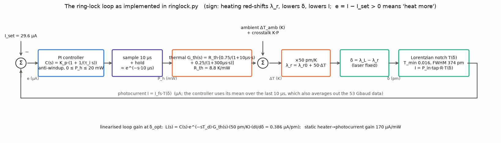

The sensor. The notch, the tapped photocurrent, and its slope: the slope is largest at 108 pm (the max-OMA bias of the textbook, FWHM/(2√3)) and *reverses sign* on the other side of the notch. The grey region is where a heater-only lock cannot operate: there, heating moves the notch away from the laser while the photocurrent tells the controller nothing different.

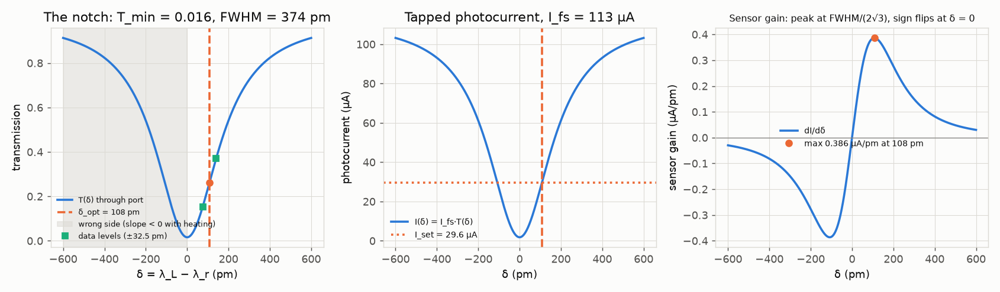

Why the lock error matters: OMA with the 65 pm data swing vs bias, and the OMA penalty vs lock error. ±5 pm (0.1 K) costs 0.02 dB, ±50 pm (1 K) costs 0.45 to 1.1 dB, and −108 pm (the notch bottom on the laser) costs 32 dB. The finite-swing optimum is 111 pm, 3 pm from the small-signal 108 pm.

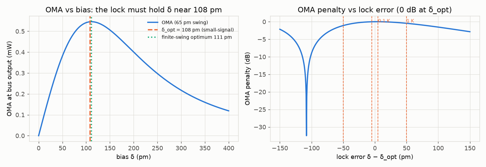

The thermal plant's step response: 75 % of the heat arrives in 30 µs, the remaining 25 % takes a millisecond. That tail is what limits the *settling* of the lock, not its crossover.

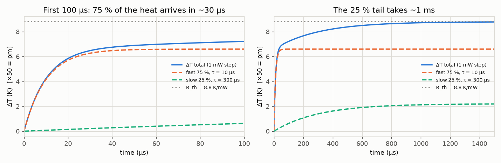

Loop gain with margins. Tuning A (blue) is an integrator all the way down, so ramps are tracked with 0.6 pm of error; tuning B (orange) has 13× less low-frequency gain and a bigger phase margin that buys nothing.

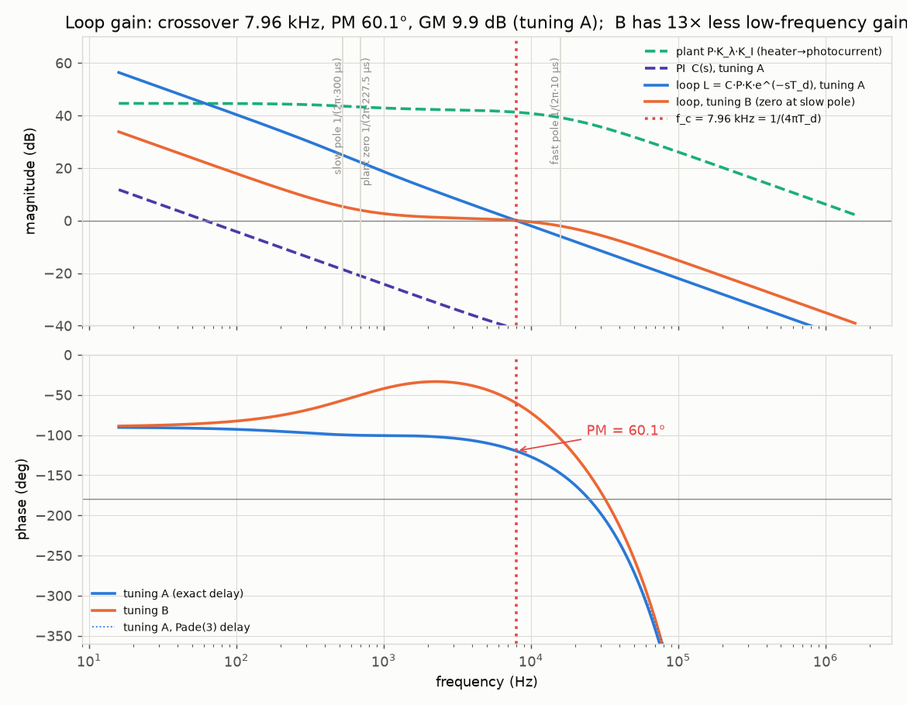

Sensitivity and what gets through: ambient wobble below 1 kHz is attenuated to under 5 pm per K; between 5 and 30 kHz it is *amplified* by up to M_s = 1.6 (4 dB), the price of any feedback loop.

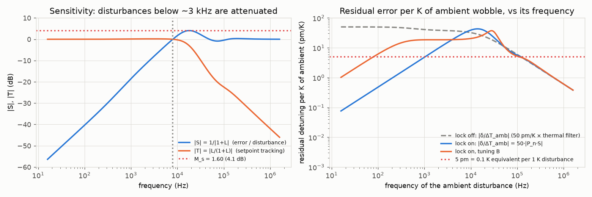

Linear closed-loop responses (python-control): a setpoint step rises in 20 µs and then creeps for the 25 % slow tail; a 1 K ambient step through the ring's thermal filter produces a 28 pm transient that is gone in 54 µs.

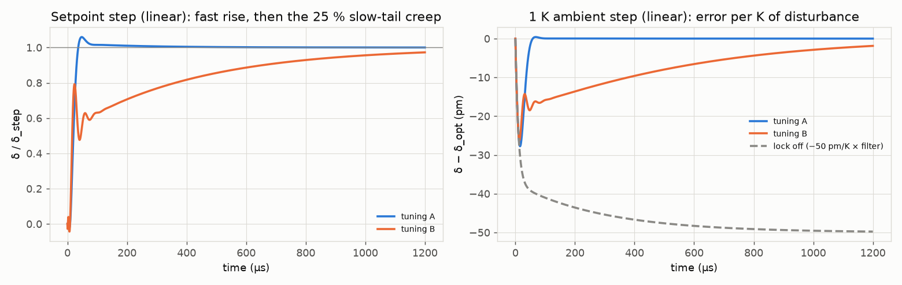

Scenario (a), 5 K step in 10 µs at 60 C ambient. The notch overshoots by 128 pm, briefly passing the laser (δ_min = −20 pm), and is back within 5 pm after 87 µs; the heater backs off by exactly 5 K / 8.8 K/mW. With the lock off the notch parks 142 pm on the *other* side of the laser.

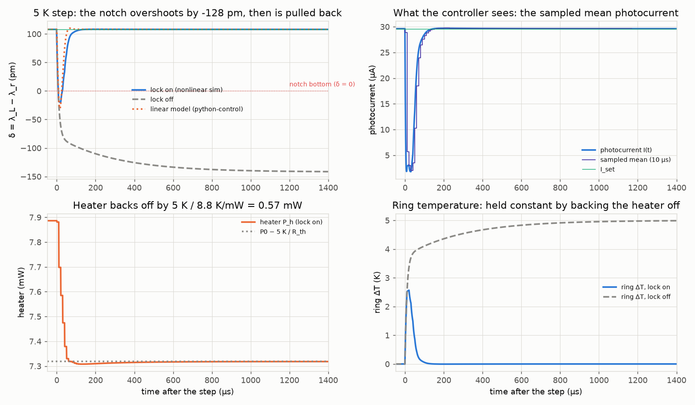

Video: [out/notch_lock.mp4](out/notch_lock.mp4) (10 s). Stills:

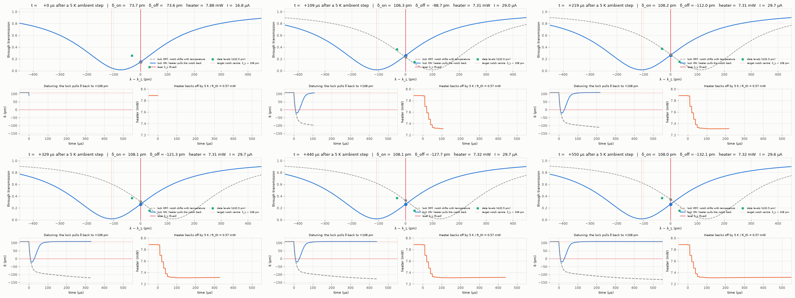

How big and how fast a step the lock can take. An instantaneous step (through the ring's own 10 µs filter) is survivable up to 6 K; 7 K pushes the notch bottom past the laser far enough that the sign-reversed sensor drives the heater the wrong way and the lock is lost. Give the same step a 100 µs rise and 15 K is fine. Real ambient changes are far slower than 100 µs; the danger is a *neighbouring heater* switching, which is scenario (c).

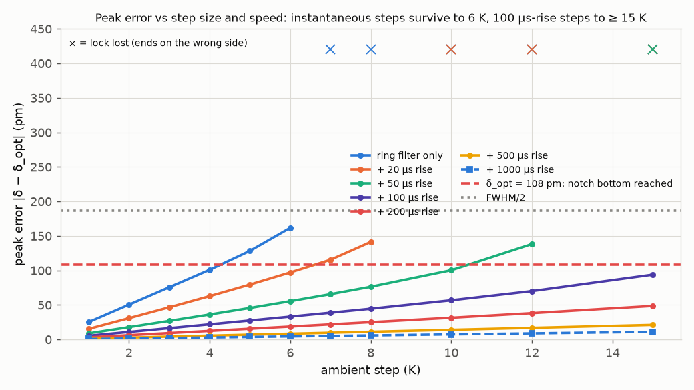

Scenario (b), 800 K/s ramp for 10 ms: tracking error 0.608 pm = ramp rate / K_v, 0.16 % of the FWHM, 0.001 dB of OMA. Tuning B: 8.2 pm.

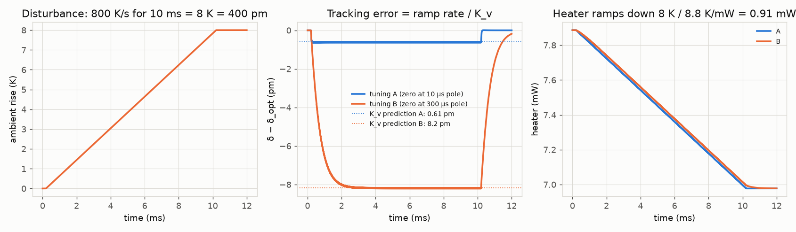

Scenario (c), four rings, ring 3 acquiring. During the sweep the neighbours see a ramp disturbance and sit 2.5 pm (nearest) and 0.5 pm (next) below δ_opt; at capture ring 3's own PI transient kicks them by 10 pm for 30 µs; the final heaters are the K⁻¹ solution.

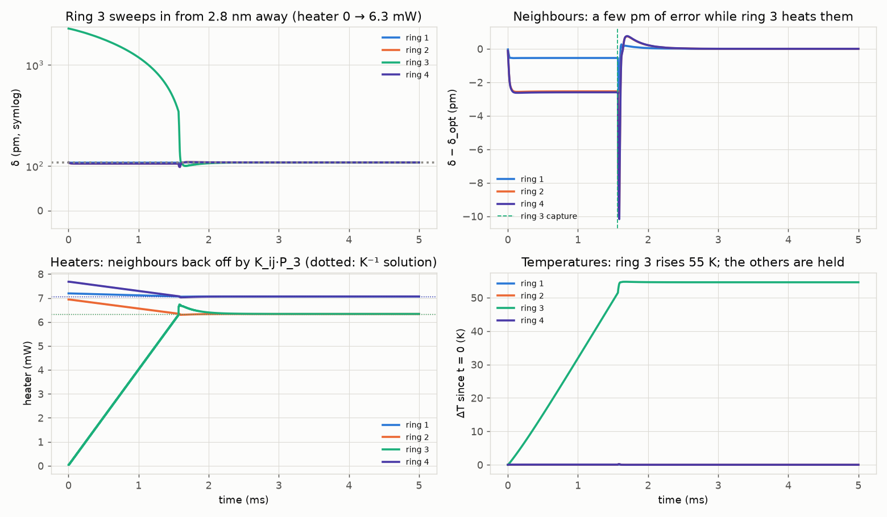

Video: [out/four_ring_lock.mp4](out/four_ring_lock.mp4) (12 s). Stills:

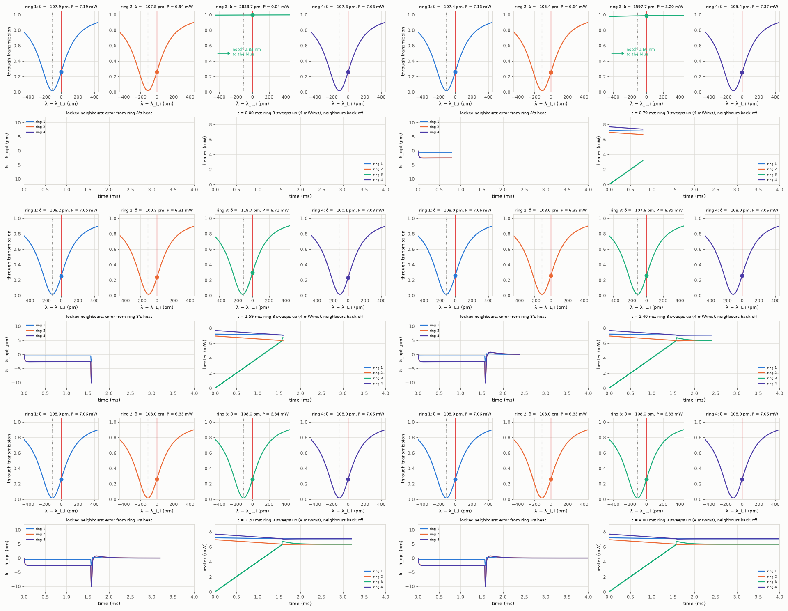

Scenario (d), heater ceiling and anti-windup. Pinned 1.57 mW short, the ring sits 690 pm off (on the correct side). When the ambient rises 20 K, the clamped integrator lets the loop catch the notch as it passes (270 µs to ±5 pm); a plain integrator has wound up to ~70 mW, the heater stays at the rail, the notch flies 200 pm past the laser and the lock is lost permanently, with the controller heating as hard as it can because the photocurrent is above the setpoint on either side of the notch.

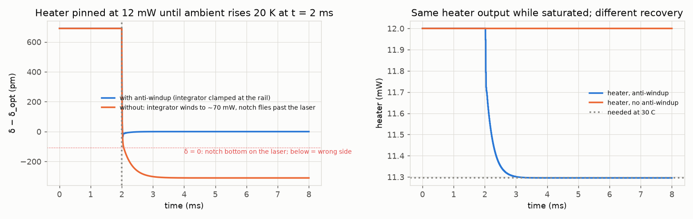

Scenario (e), heater DAC resolution and photocurrent noise. 8 bits over 20 mW is 34.5 pm per step and the loop dithers ±10 pm (5.9 pm rms); 12 bits (2.1 pm/step) gives 0.3 pm rms. 50 nA rms of photocurrent noise per 10 µs sample (70× the shot noise) is 0.07 pm rms of lock error.

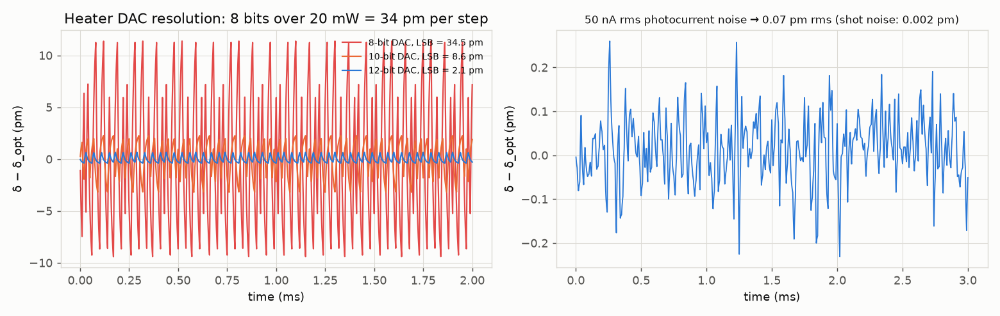

| Quantity | Computed (`out/results.json`) | Expectation (source) | Agreement |
|---|---|---|---|
| Full-scale photocurrent I_fs | 113.03 µA | 0.9 A/W × 2.5 mW × 5 % = 112.5 µA (brief; code uses 4 dBm = 2.512 mW) | 99.52 % |
| δ_opt, numeric argmax of dT/dδ | 107.97 pm | FWHM/(2√3) = 108 pm (REF) | 99.97 % |
| T(δ_opt) | 0.2620 | 0.25 + 0.75·T_min = 0.2620 | 100.00 % |
| Sensor gain dI/dδ at δ_opt | 0.3863 µA/pm | central finite difference 0.3863 | 100.00 % |
| Sensor gain per kelvin | 19.32 µA/K (1.93 µA per 0.1 K) | (1 − T_min)·3√3/(4·FWHM)·I_fs·50 pm/K | 100.00 % |
| Mean I with data on (65 pm swing) | 29.657 µA | CW 29.615 µA (inflection point) | 99.86 % |
| Finite-swing OMA optimum bias | 111.2 pm | 108 pm small-signal | 97.00 % |
| OMA at δ_opt / ER | 0.545 mW / 3.8 dB | — | — |
| OMA penalty at ±5 pm, ±50 pm, ±108 pm | +0.00/−0.02, −0.45/−1.10, −1.7/−32.5 dB | — | — |
| Heater efficiency R_th·dλ/dT | 440 pm/mW | 0.44 nm/mW (REF, measured) | 100.00 % |
| One FSR in temperature | 206 K | 10.3 nm / 50 pm/K = 206 K (brief) | 100.00 % |
| 10 to 125 C | 5.75 nm, 13.1 mW of heater | — | — |
| 0.1 K | 5 pm = 1.34 % of FWHM = 1.93 µA | 50 pm/K (REF) | identical |
| Gain crossover (Pade 3) | 7957.7 Hz | 1/(4πT_d) = 7957.7 Hz (design) | 100.00 % |
| Phase margin (Pade 3 / exact delay) | 60.14° / 60.14° | hand: 90 + atan(ω_c·227.5 µs) − atan(ω_c·300 µs) − 28.6° = 60.14° | 100.00 % |
| Gain margin (exact delay) | 9.92 dB at 25 kHz | Pade 3: 9.92 dB | 99.99 % |
| K_p, K_i, K_v (tuning A) | 0.00387 mW/µA, 387 mW/(µA·s), 65 827 1/s | — | — |
| Ramp error, 800 K/s (A) | 0.608 pm (0.16 % FWHM) | 40 000 pm/s / K_v = 0.608 pm | 100.00 % |
| Ramp error (B, zero at slow pole) | 8.18 pm | 8.17 pm | 99.85 % |
| Push the crossover, ω_c·T_d = 1: phase margin (exact delay) | 32.10° (GM 3.9 dB, M_s 3.16 at 22 kHz) | hand: 90 + atan(ω_c·227.5 µs) − atan(ω_c·300 µs) − 57.3° = 32.10° | 100.00 % |
| Push the crossover: ramp error, 800 K/s | 0.303 pm | 40 000 pm/s / K_v (131 814 1/s) = 0.303 pm | 100.00 % |
| Slow the controller, T_d = 50 µs: crossover | 1591.5 Hz | 1/(4πT_d) = 1591.5 Hz | 100.00 % |
| Slow the controller: ramp error, 800 K/s | 3.144 pm | 40 000 pm/s / K_v (12 725 1/s) = 3.143 pm | 99.98 % |
| 5 K step peak error | −128.4 pm (34 % FWHM); between ticks −134.8 pm | linear model −138.8 pm | 92.5 % (see Checks) |
| 5 K step, sensor nonlinearity alone | −128.4 vs (0.1 K step)×50 = −126.2 pm | — | 2 pm |
| 5 K step settle to ±5 pm / steady-state error | 87 µs / 0.002 pm | type-1 loop: 0 (agreement measured against the 5 pm = 0.1 K scale) | 99.96 % |
| 5 K step heater change | −0.568 mW | −5 K / 8.8 K/mW = −0.568 mW | 99.99 % |
| Largest survivable instantaneous step | 6 K (8 K with 20 µs rise, 12 K with 50 µs, ≥ 15 K with 100 µs); 4 K with a T_d = 50 µs loop | — | — |
| 7 K instantaneous step (lock lost): final error | −5679.6 pm (notch 5.57 nm to the red of the laser) | heater at the 20 mW rail: −[(20 − 7.89) mW × 440 pm/mW + 7 K × 50 pm/K] = −5680.0 pm | 99.99 % |
| 4 rings: final heaters | [7.063, 6.335, 6.335, 7.063] mW | K⁻¹·P0·1 | 100.00 % |
| 4 rings: ring 2 mean error during the sweep | −2.54 pm | −(K_SS⁻¹K_S3·4 mW/ms)·440/K_v = −2.54 pm (first order −2.67) | 99.9 % |
| 4 rings: ring 1 mean error during the sweep | −0.55 pm | −0.55 pm (first order −0.80: ring 2's back-off cools ring 1) | 99.9 % |
| 4 rings: neighbour peak at capture | −10.0 pm for ~30 µs | — | — |
| Saturated error, 12 mW heater at 10 C | 690.0 pm | (13.57 − 12) mW × 440 pm/mW = 690.0 pm | 100.00 % |
| Recovery after 20 K ambient rise | anti-windup: 270 µs; plain integrator: lock lost | — | — |
| Heater DAC 8 / 10 / 12 / 14 bit | 34.5 / 8.6 / 2.15 / 0.54 pm per LSB → 5.9 / 1.55 / 0.31 / 0.07 pm rms | — | — |
| Shot-noise-limited resolution | 0.69 nA rms in 50 kHz → 0.0018 pm | √(2qIB)/(dI/dδ) | 100.00 % |
| 1 % laser-power error | reads as 0.77 pm | I_set·1 % / (dI/dδ) | identical |

**Experiments to try**

1. **Push the crossover** (notebook section 2, or `rl.design_pi(pl, se, t_d=T_D, wc=1.0 / T_D)` in `run.py`). ω_c·T_d = 1.0 doubles K_v (131 814 1/s) and halves the ramp error (0.303 pm simulated, 0.303 pm from K_v), but the phase margin drops from 60.1° to 32.1° (exact delay; the hand formula gives the same), the gain margin from 9.9 to 3.9 dB, the linear setpoint step overshoots 52 % instead of 6 %, the 1 K disturbance response crosses zero 11 times instead of once (it rings), and M_s climbs from 1.60 to 3.16 (10 dB) at 22 kHz: ambient wobble around 20 kHz is amplified 3×. All of these are computed by `run.py` (`experiments_to_try.1_push_crossover_wc_td_1` in `out/results.json`). This is the whole trade in one slider: the 10 µs sample-and-hold, not the thermal pole, sets the speed limit.
2. **Slow the controller** (T_d = T_s = 50 µs, i.e. a 20 kHz firmware loop; `experiments_to_try.2_slow_controller_td_50us` in `out/results.json`). Crossover falls to 1.59 kHz (1/(4π·50 µs)), the phase margin to 56° (the plant zero and the slow pole are now near crossover, so the pole-cancellation picture is less clean), K_v falls 5.2× to 12 725 1/s, the 800 K/s ramp error becomes 3.14 pm (K_v predicts 3.14), an instantaneous 1 K step peaks at 39 pm instead of 25, and the largest survivable instantaneous step falls from 6 K to 4 K (a 6 K step is lost). A firmware loop at 20 kHz would therefore need the ambient (and the neighbouring heaters) to move more slowly than the ring's own thermal filter already guarantees.
3. **Move the PI zero** to the slow pole (tuning B) and run scenario (b): the same 8 K ramp now leaves 8 pm of error, and after the ramp the error decays with the 300 µs time constant. Then set `slow_share` to 0.5 in the notebook: the settling tail of every step doubles.
4. **Turn the crosstalk up** (notebook section 4: K_nearest = 0.3). The K⁻¹ equilibrium moves the neighbours' heaters by 30 % of ring 3's, ring 2's error during the sweep triples, and a faster sweep (20 mW/ms) makes the capture transient large enough to push a neighbour past the notch bottom. Then lower the sweep rate to 1 mW/ms and watch the trade between acquisition time and neighbour disturbance.
5. **Break the lock on purpose**: in `run.py` scenario (a) set `STEP_K = 7`. The notch bottom passes the laser, the photocurrent rises again on the wrong side, the controller reads "too much light, heat more", and the heater runs to 20 mW: the notch ends 5.57 nm to the red of the laser (δ = −5572 pm, an error of −5680 pm = −[(20 − 7.89) mW × 440 pm/mW + 7 K × 50 pm/K]; this row of the survival map is written to `survival_map.smallest_lost_instantaneous_step` and checked in the headline table, 99.99 %). This is why a real system needs either a slew-limited approach, a dither to measure the *sign* of the slope, or a monitor of the heater direction.

**Capstone connection**

- **This is the deliverable's inner loop**, one per ring: measure the tapped photocurrent, compare with I_set = 0.262·I_fs (the value at δ = FWHM/(2√3) = 108 pm, the maximum-OMA bias from the textbook), and drive the heater. The linearised plant is a static gain of 170 µA per mW of heater (0.386 µA/pm × 440 pm/mW), a 10 µs pole, a 300 µs pole at 25 % weight, and the 10 µs sample-and-hold.
- **The numbers that are measured** (REF): R_th = 8.8 K/mW, 0.44 nm/mW, 50 pm/K, τ = 10 µs, FWHM 374 pm, T_min 0.016, 0.9 A/W, 4 dBm. The numbers that are **assumed** here and should be replaced by measurements on the real device: the 25 % / 300 µs slow tail, the 20 mW heater ceiling, the 5 % tap, the 10 µs loop rate, the crosstalk 10 % / 3 % (and that it is as fast as self-heating), that the ambient enters through the ring's own thermal filter, and that self-heating by the absorbed light (experiment 06) is a constant offset the integrator absorbs.
- **Resolution question (0.1 K = 5 pm)**: 5 pm is 1.93 µA out of 113 µA (1.7 % of full scale, 6.5 % of the setpoint), 0.02 dB of OMA. The photodiode is not the limit (shot noise 0.0018 pm); the heater DAC is: 12 bits over 20 mW (2 pm per step) is needed, 8 bits (34 pm per step) dithers ±10 pm. A 1 % drift of laser power is read as 0.77 pm of detuning, so the setpoint should be normalised by a reference tap.
- **Ambient 10 to 125 C**: 115 K = 5.75 nm = 13.1 mW of heater range, inside one FSR (206 K), so no resonance-order hopping is needed if the cold ring is designed to sit 108 pm + 0.5 mW·440 pm/mW to the blue of the laser at 125 C. At 10 C the heater runs at 13.6 mW: the power budget is dominated by the cold end.
- **Dynamics**: with a 10 µs loop the lock tracks 800 K/s with 0.6 pm of error and survives 6 K steps in 10 µs; a neighbouring ring turning on (6.3 mW, 5.6 K of cross-heating) costs the neighbours 2.5 pm during the sweep and a 10 pm blip at capture. The dangerous events are not the environment but the other heaters and the heater rail: saturation without anti-windup ends with the notch on the wrong side of the laser and a controller heating at full power.
- **What the textbook's n_eff vs n_g question does to this loop**: nothing in the controller depends on n_eff; the 50 pm/K, the 440 pm/mW and the 206 K per FSR are all group-index quantities (experiments 04 and 08), and the loop uses them as measured gains.

**Checks**

- The Pade(3) margins from python-control agree with the exact e^(−jωT_d) frequency response to 0.01° and 0.001 dB, and with the hand estimate of the phase margin (integrator −90°, plant zero at 227.5 µs, slow pole at 300 µs, delay 28.6°) to 0.01°.
- K_v predicts the simulated ramp error to 4 digits for both tunings; the 5 K step heater change equals −ΔT/R_th to 4 digits; the 4-ring final heaters equal K⁻¹·P0·1 to 5 digits; the saturated error equals (P_needed − P_max)·η exactly; δ_opt, T(δ_opt) and the sensor gain match the closed-form Lorentzian algebra.
- Linear model vs nonlinear simulation for the 5 K step: −138.8 pm predicted, −128.4 pm simulated (−134.8 pm when the step lands between ticks). A 0.1 K step scaled ×50 gives −126.2 pm, so the sensor nonlinearity is worth only 2 pm; the remaining 8 to 12 pm is the sampled implementation being slightly *faster* than its continuous e^(−s·10 µs) model: a disturbance arriving just after a tick is averaged over the rest of that period and acted on at the next tick, an effective delay of 5 to 10 µs depending on its phase. The continuous model is the conservative one.
- The quasi-static crosstalk prediction: each locked ring's error during the sweep is −(dP_i/dt)·η/K_v with dP_S/dt = −K_SS⁻¹·K_S3·(dP_3/dt); it matches ring 1, 2 and 4 to 0.1 %. The first-order estimate (K_i3 only) overestimates ring 1's error by 46 % because ring 2, backing its own heater off, cools ring 1.
- The notebook re-derives K_p from the same `ringlock.design_pi` and asserts equality with `out/results.json` to 1e-12.
- The numbers quoted in "Experiments to try" 1, 2 and 5 are computed, not estimated: the ω_c·T_d = 1 phase margin matches the hand formula to 0.01°, the T_d = 50 µs crossover matches 1/(4πT_d) to 0.1 Hz, both ramp errors match ramp rate / K_v to 0.03 %, and the lost-lock end state of the 7 K step matches the heater-at-the-rail arithmetic to 0.4 pm out of 5680.
- Known limitations. (i) The OMA penalty in dB hides polarity: with the lock off after the 5 K step the notch sits at δ = −142 pm, the mirror image of +108 pm, so |OMA| is within 0.2 dB of the optimum but the data are *inverted*; only the lock-on case has the right eye. (ii) The controller cannot tell the two sides of the notch apart (a symmetric sensor); every "lock lost" case in the survival map and in scenario (d) is that failure, and a real implementation needs a dither, a slew-limited approach from the blue side (as in the acquisition sweep used here), or a heater-direction sanity check. (iii) The 25 % / 300 µs slow tail and the cross-heating dynamics are assumed, not measured; the real cross-heating through the substrate is slower and more diffusive, which would make scenario (c) easier. (iv) The thermal plant is linear and temperature independent (no R_th(T), no thermal runaway from absorbed light); the 4 dBm input is 10 % absorbed in the ring, an offset the integrator removes, but its dependence on δ (more absorption on resonance) is a small extra loop gain not modelled. (v) The ambient step is passed through the ring's own thermal filter; this is more pessimistic than any real package, whose thermal time constants are milliseconds. (vi) The data modulation is only used to compute OMA and to show that the mean photocurrent is unchanged at the inflection point; the lock simulation uses the CW photocurrent. (vii) `T_d = T_s` assumes a computation delay of zero; a one-sample computation delay would make T_d = 20 µs and halve the achievable crossover (experiment 2 in the list above shows the effect).

**Files**

- `run.py`: headless entry point; regenerates `out/` (about 3 min) and rebuilds + executes the notebook. Run with `cd experiments/13_capstone_ring_lock && ../../.venv/bin/python run.py`.
- `ringlock.py`: the models shared by `run.py` and the notebook: `Plant` (two-pole thermal), `Sensor` (Lorentzian, photocurrent, OMA), `PIController` (discrete PI, saturation, anti-windup, acquisition sweep, DAC), `simulate` (N rings with crosstalk), `design_pi`, `loop_tf`, `exact_margins`, `crosstalk_matrix`, `nominal_heater_mw`.
- `make_notebook.py`: builds `explore.ipynb` with nbformat.
- `explore.ipynb`: interactive notebook (kernel `photonics-sims`), executed with outputs saved (a static figure per section plus the widget state).
- `README.md`: this file.
- `out/results.json`: every computed number; `headline` (value / expected / agreement / source / unit), `design`, `scenario_a_step`, `survival_map` (with `smallest_lost_instantaneous_step` and `peak_error_pm_5K_200us_rise`), `scenario_b_ramp`, `experiments_to_try` (the ω_c·T_d = 1 and T_d = 50 µs re-designs), `scenario_c_four_rings`, `scenario_d_antiwindup`, `quantisation`, `noise_50nA`, `assumptions`, `versions`, `runtime_seconds`.
- `out/results.txt`: the printed log of a run, including the headline table.
- `out/tools.json`: the tool descriptions above in machine-readable form.
- `out/block_diagram.png`: the loop with every gain and unit.
- `out/sensor_curve.png`: T(δ), I(δ), dI/dδ with δ_opt, the data levels and the wrong-side region.
- `out/oma_vs_bias.png`: OMA vs bias and OMA penalty vs lock error.
- `out/thermal_step.png`: heater step response, fast and slow parts.
- `out/bode_loop.png`: plant, PI, loop gain (exact delay and Pade), margins, tuning A vs B.
- `out/sensitivity.png`: |S|, |T|, and residual pm per K of ambient vs frequency, lock on/off.
- `out/linear_step.png`: linear setpoint and 1 K disturbance steps, tuning A vs B.
- `out/scenario_a_step.png`: 5 K step, δ / photocurrent / heater / temperature, lock on vs off vs linear model.
- `out/step_survival.png`: peak error vs step size and rise time; lock-lost markers.
- `out/scenario_b_ramp.png`: 800 K/s ramp, tracking error vs K_v prediction, tuning A vs B.
- `out/scenario_c_four_rings.png`: four rings, ring 3 acquiring; detunings, neighbour errors, heaters, temperatures.
- `out/scenario_d_antiwindup.png`: heater ceiling, with and without anti-windup.
- `out/quantisation_noise.png`: heater DAC bits and photocurrent noise.
- `out/notch_lock.mp4`, `out/notch_lock_frames.png`: the notch under the laser after a 5 K step, lock on vs off (10 s).
- `out/four_ring_lock.mp4`, `out/four_ring_lock_frames.png`: four notches, ring 3 sweeping in (12 s).
